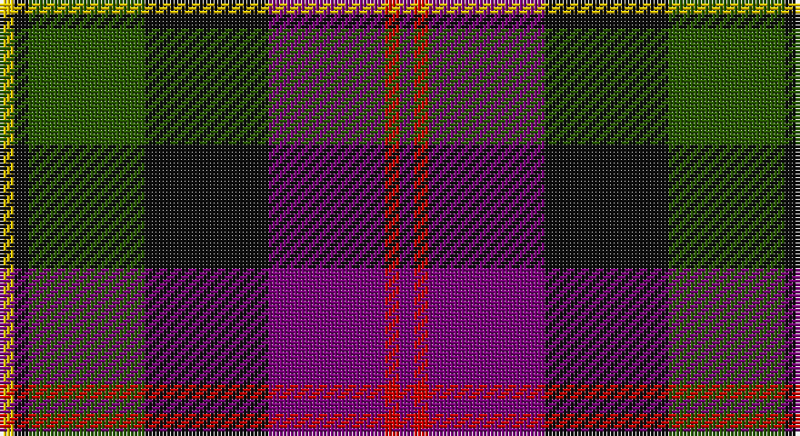

This page is one **sett** — a single exact thread-count. It belongs to the [tartan](/setts/dp2r2dp16k17dg16k2ly2/)
(the same proportion at any scale), whose colour order is pattern [BRBKGKY](/stripes/brbkgky/).

Sourced from register-of-tartans.  It is a [7 stripe tartan](/stripes/stripes7/).

Original link https://www.tartanregister.gov.uk/tartanDetails.aspx?ref=4804

2 attestations — the source records this cloth was collapsed from (oldest owns this page)

<ul>
<li>01/01/2000 — Zangenberg (Personal) (register-of-tartans, <a href="https://www.tartanregister.gov.uk/tartanDetails.aspx?ref=4804">record</a>)</li>
<li>2000 — Zangenberg (Personal) (tartans-authority, <a href="http://www.tartansauthority.com/tartan-ferret/display/4045/">record</a>)</li>
</ul>

## Register references

External register numbers recorded for this tartan.

- Scottish Register of Tartans: [4804](https://www.tartanregister.gov.uk/tartanDetails.aspx?ref=4804)
- Scottish Tartans Authority (ITI): 4045

## Thread count
Y/4 K4 G32 K34 P32 Ra4 P/4

One full sett is **220 threads**.

## Palette

Palette: <strong>Tartan Register</strong>
<table><thead><tr><th>Colour</th><th>Threads</th><th>Shade</th><th>Base</th><th>OKLCh</th></tr></thead><tbody><tr><td>Y/</td><td style="text-align:right;font-variant-numeric:tabular-nums">4</td><td><code style="background-color:#E8C000;">#E8C000</code> <small style="color:#888">#E8C000</small></td><td>Y <code style="background-color:#F2BF00;">#F2BF00</code></td><td><small style="color:#888">oklch(81.9% 0.168 93.7)</small></td></tr><tr><td>K</td><td style="text-align:right;font-variant-numeric:tabular-nums">4</td><td><code style="background-color:#101010;">#101010</code> <small style="color:#888">#101010</small></td><td>K <code style="background-color:#000000;">#000000</code></td><td><small style="color:#888">oklch(17.3% 0.000 89.9)</small></td></tr><tr><td>G</td><td style="text-align:right;font-variant-numeric:tabular-nums">32</td><td><code style="background-color:#285800;">#285800</code> <small style="color:#888">#285800</small></td><td>G <code style="background-color:#006100;">#006100</code></td><td><small style="color:#888">oklch(41.0% 0.122 135.8)</small></td></tr><tr><td>K</td><td style="text-align:right;font-variant-numeric:tabular-nums">34</td><td><code style="background-color:#101010;">#101010</code> <small style="color:#888">#101010</small></td><td>K <code style="background-color:#000000;">#000000</code></td><td><small style="color:#888">oklch(17.3% 0.000 89.9)</small></td></tr><tr><td>P</td><td style="text-align:right;font-variant-numeric:tabular-nums">32</td><td><code style="background-color:#780078;">#780078</code> <small style="color:#888">#780078</small></td><td>B <code style="background-color:#2A418A;">#2A418A</code></td><td><small style="color:#888">oklch(40.2% 0.185 328.4)</small></td></tr><tr><td>Ra</td><td style="text-align:right;font-variant-numeric:tabular-nums">4</td><td><code style="background-color:#C80000;">#C80000</code> <small style="color:#888">#C80000</small></td><td>R <code style="background-color:#CC0000;">#CC0000</code></td><td><small style="color:#888">oklch(52.3% 0.215 29.2)</small></td></tr><tr><td>P/</td><td style="text-align:right;font-variant-numeric:tabular-nums">4</td><td><code style="background-color:#780078;">#780078</code> <small style="color:#888">#780078</small></td><td>B <code style="background-color:#2A418A;">#2A418A</code></td><td><small style="color:#888">oklch(40.2% 0.185 328.4)</small></td></tr></tbody></table>

# Sample pattern

## Nearest tartans

The nearest existing variants by ΔTartan distance, with this tartan at the top so the swatches line up against it.

ΔTartan

Tartan

Sett

—

<a href="/ttd/edit/#slug=dp2r2dp16k17dg16k2ly2~x2">Zangenberg (Personal)</a> <a class="nn-out" href="/variants/s7/dp2r2dp16k17dg16k2ly2~x2/" title="open its dictionary page">↗</a>

0.69

<a href="/ttd/edit/#slug=m21r3m3r3m3db19g22b3~x2&amp;base=dp2r2dp16k17dg16k2ly2~x2">Akins</a> <a class="nn-out" href="/variants/s8/m21r3m3r3m3db19g22b3~x2/" title="open its dictionary page">↗</a>

0.80

<a href="/ttd/edit/#slug=dp6k3dp21k23w3dg24r3~x2&amp;base=dp2r2dp16k17dg16k2ly2~x2">Colquhoun #3</a> <a class="nn-out" href="/variants/s7/dp6k3dp21k23w3dg24r3~x2/" title="open its dictionary page">↗</a>

0.90

<a href="/ttd/edit/#slug=db22r3db2r3db2k17o18dg4~x2&amp;base=dp2r2dp16k17dg16k2ly2~x2">Scotch House 2000, antique</a> <a class="nn-out" href="/variants/s8/db22r3db2r3db2k17o18dg4~x2/" title="open its dictionary page">↗</a>

0.92

<a href="/ttd/edit/#slug=db6g27db3k19dp27w3~x2&amp;base=dp2r2dp16k17dg16k2ly2~x2">Gold Brothers</a> <a class="nn-out" href="/variants/s6/db6g27db3k19dp27w3~x2/" title="open its dictionary page">↗</a>

0.94

<a href="/ttd/edit/#slug=r12dbi3g5db16ly2g2~x2&amp;base=dp2r2dp16k17dg16k2ly2~x2">Dunbog Primary School Corporate Tartan</a> <a class="nn-out" href="/variants/s6/r12dbi3g5db16ly2g2~x2/" title="open its dictionary page">↗</a>

0.96

<a href="/ttd/edit/#slug=k23y2m3db7m3y2dg15m21y5~x2&amp;base=dp2r2dp16k17dg16k2ly2~x2">Land's End (Unnamed Maroon)</a> <a class="nn-out" href="/variants/s9/k23y2m3db7m3y2dg15m21y5~x2/" title="open its dictionary page">↗</a>

0.97

<a href="/ttd/edit/#slug=g3db12w1dg12r12dg2~x2&amp;base=dp2r2dp16k17dg16k2ly2~x2">Patterson, John (Personal)</a> <a class="nn-out" href="/variants/s6/g3db12w1dg12r12dg2~x2/" title="open its dictionary page">↗</a>

0.98

<a href="/ttd/edit/#slug=dg1r11dg3k4dg4r1k2db11w1~x2&amp;base=dp2r2dp16k17dg16k2ly2~x2">Manson (Name)</a> <a class="nn-out" href="/variants/s9/dg1r11dg3k4dg4r1k2db11w1~x2/" title="open its dictionary page">↗</a>

0.98

<a href="/ttd/edit/#slug=dgi3db12w1dg12r12dg2~x2&amp;base=dp2r2dp16k17dg16k2ly2~x2">Patterson, John (Personal)</a> <a class="nn-out" href="/variants/s6/dgi3db12w1dg12r12dg2~x2/" title="open its dictionary page">↗</a>

0.99

<a href="/ttd/edit/#slug=k3dg17k9r2db17r2db2r17dg2w2~x2&amp;base=dp2r2dp16k17dg16k2ly2~x2">MacInroy (Rattray)</a> <a class="nn-out" href="/variants/s10/k3dg17k9r2db17r2db2r17dg2w2~x2/" title="open its dictionary page">↗</a>

## Neighbour map

Every grey dot is one of 14360 variants placed by the first two principal components of the ΔTartan feature space (44% of its variance). Red is this tartan; blue dots are its nearest — click one to open its page.

<svg viewBox="0 0 640 380" role="img" style="max-width:100%;height:auto;border:1px solid #e0e0e0;border-radius:4px;display:block" xmlns="http://www.w3.org/2000/svg"><image href="/nn/cloud.v1.png" width="640" height="380"/><a href="/variants/s8/m21r3m3r3m3db19g22b3~x2/"><circle cx="158.6" cy="191.4" r="4" fill="#3465a4"><title>Akins</title></circle></a><a href="/variants/s7/dp6k3dp21k23w3dg24r3~x2/"><circle cx="158.1" cy="207.9" r="4" fill="#3465a4"><title>Colquhoun #3</title></circle></a><a href="/variants/s8/db22r3db2r3db2k17o18dg4~x2/"><circle cx="167.6" cy="175.1" r="4" fill="#3465a4"><title>Scotch House 2000, antique</title></circle></a><a href="/variants/s6/db6g27db3k19dp27w3~x2/"><circle cx="140.8" cy="208.0" r="4" fill="#3465a4"><title>Gold Brothers</title></circle></a><a href="/variants/s6/r12dbi3g5db16ly2g2~x2/"><circle cx="180.0" cy="200.4" r="4" fill="#3465a4"><title>Dunbog Primary School Corporate Tartan</title></circle></a><a href="/variants/s9/k23y2m3db7m3y2dg15m21y5~x2/"><circle cx="171.2" cy="180.3" r="4" fill="#3465a4"><title>Land's End (Unnamed Maroon)</title></circle></a><a href="/variants/s6/g3db12w1dg12r12dg2~x2/"><circle cx="168.9" cy="200.8" r="4" fill="#3465a4"><title>Patterson, John (Personal)</title></circle></a><a href="/variants/s9/dg1r11dg3k4dg4r1k2db11w1~x2/"><circle cx="153.7" cy="165.7" r="4" fill="#3465a4"><title>Manson (Name)</title></circle></a><a href="/variants/s6/dgi3db12w1dg12r12dg2~x2/"><circle cx="162.9" cy="196.7" r="4" fill="#3465a4"><title>Patterson, John (Personal)</title></circle></a><a href="/variants/s10/k3dg17k9r2db17r2db2r17dg2w2~x2/"><circle cx="133.3" cy="172.9" r="4" fill="#3465a4"><title>MacInroy (Rattray)</title></circle></a><circle cx="172.2" cy="195.8" r="5" fill="#c00000"/></svg>

ID: /variants/s7/dp2r2dp16k17dg16k2ly2~x2/
