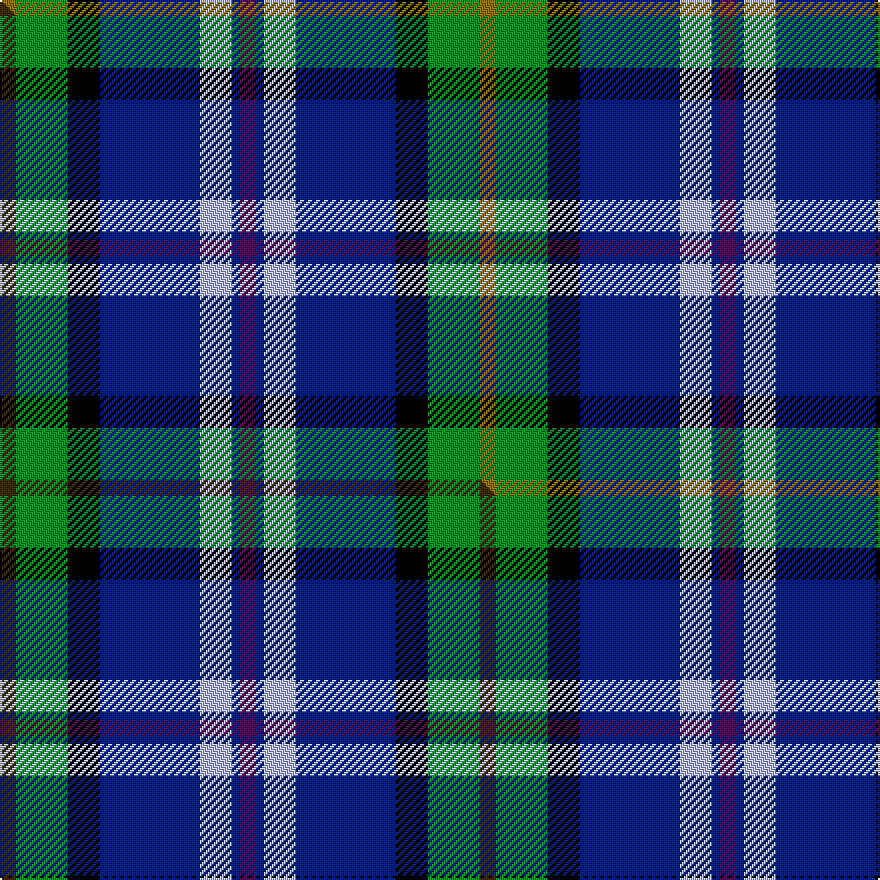

This page is one **sett** — a single exact thread-count. It belongs to the [tartan](/setts/dp4db2lb8db25k8g13y4/)
(the same proportion at any scale), whose colour order is pattern [BBWBKGG](/stripes/bbwbkgg/).

Part of the [Renfrewshire](/tartans/renfrewshire/) tartan — the named design grouping this sett with its other cloths.

Sourced from weddslist.  It is a [7 stripe tartan](/stripes/stripes7/).

Original link http://www.weddslist.com/cgi-bin/tartans/pg.pl?source=sts

## Thread count
Y/8 G26 K16 DB50 LB16 DB4 DP/8

One full sett is **240 threads**.

## Palette
<table><thead><tr><th>Colour</th><th>Shade</th><th>OKLCh</th></tr></thead><tbody><tr><td>DB</td><td><code style="background-color:#082077;">#082077</code> <small style="color:#888">#082077</small></td><td><small style="color:#888">oklch(30.0% 0.149 265.1)</small></td></tr><tr><td>LB</td><td><code style="background-color:#B5BBDE;">#B5BBDE</code> <small style="color:#888">#B5BBDE</small></td><td><small style="color:#888">oklch(79.9% 0.050 277.6)</small></td></tr><tr><td>G</td><td><code style="background-color:#008B2A;">#008B2A</code> <small style="color:#888">#008B2A</small></td><td><small style="color:#888">oklch(55.4% 0.170 145.9)</small></td></tr><tr><td>K</td><td><code style="background-color:#000000;">#000000</code> <small style="color:#888">#000000</small></td><td><small style="color:#888">oklch(0.0% 0.000 0.0)</small></td></tr><tr><td>DP</td><td><code style="background-color:#4B0B4F;">#4B0B4F</code> <small style="color:#888">#4B0B4F</small></td><td><small style="color:#888">oklch(30.1% 0.125 325.4)</small></td></tr><tr><td>Y</td><td><code style="background-color:#8B6E00;">#8B6E00</code> <small style="color:#888">#8B6E00</small></td><td><small style="color:#888">oklch(55.1% 0.113 90.4)</small></td></tr></tbody></table>

# Sample pattern

## Compared to the master

This cloth is one sett of its design; the master sett (the exemplar the design is anchored on) is below for comparison.

Its **ΔTartan distance** from the master is **0.16** — the same measure the nearest-tartans table ranks by (0 is identical; a re-scale of the same cloth is near 0, a recolour or a different proportion further).

<figure class="master-compare" style="margin:0">

this sett
master sett ★

<figcaption style="color:#888;font-size:smaller">One weave of this sett against the <a href="/setts/dy4g13k8db25lb8db2dp4/">master sett ★</a>, split on the diagonal: a shared proportion runs seamlessly across it with only the shades shifting; a different proportion breaks on it.</figcaption>
</figure>

## Nearest tartan variants

The nearest existing variants by ΔTartan distance, with this cloth at the top so the swatches line up against it.

ΔTartan

Threads

Variant

Sett

—

240

<a href="/variants/s7/dp4db2lb8db25k8g13y4~x2/">Renfrewshire Tartan</a>

<a href="/ttd/edit/#slug=dy4g13k8db25lb8db2dp4~x2&amp;base=dp4db2lb8db25k8g13y4~x2" title="compare in the TTD">0.00</a>

240

<a href="/variants/s7/dy4g13k8db25lb8db2dp4~x2/">Renfrewshire</a>

<a href="/ttd/edit/#slug=dr4db2lb7db20k7g10y4~x2&amp;base=dp4db2lb8db25k8g13y4~x2" title="compare in the TTD">0.55</a>

200

<a href="/variants/s7/dr4db2lb7db20k7g10y4~x2/">Renfrewshire District Tartan</a>

<a href="/ttd/edit/#slug=lb6db17dp4db2k11g3lo4~x2&amp;base=dp4db2lb8db25k8g13y4~x2" title="compare in the TTD">1.89</a>

168

<a href="/variants/s7/lb6db17dp4db2k11g3lo4~x2/">East Lothian</a>

<a href="/ttd/edit/#slug=k6g15w2db22b2k4~x2&amp;base=dp4db2lb8db25k8g13y4~x2" title="compare in the TTD">2.25</a>

184

<a href="/variants/s6/k6g15w2db22b2k4~x2/">Leslie, Hebridean</a>

<a href="/ttd/edit/#slug=dbi11db5g4w3r3k16db28lb2~x2~dbi1605267-db1404245&amp;base=dp4db2lb8db25k8g13y4~x2" title="compare in the TTD">2.33</a>

262

<a href="/variants/s8/dbi11db5g4w3r3k16db28lb2~x2~dbi1605267-db1404245/">Scottish Italian</a>

<a href="/ttd/edit/#slug=y4g22r3k17r3db37w3~x2&amp;base=dp4db2lb8db25k8g13y4~x2" title="compare in the TTD">2.40</a>

342

<a href="/variants/s7/y4g22r3k17r3db37w3~x2/">Souza Nery</a>

<a href="/ttd/edit/#slug=ly4g22r3k17r3db37w3~x2&amp;base=dp4db2lb8db25k8g13y4~x2" title="compare in the TTD">2.40</a>

342

<a href="/variants/s7/ly4g22r3k17r3db37w3~x2/">Souza Nery (Personal)</a>

<a href="/ttd/edit/#slug=k6g15w2db22r2k4~x2&amp;base=dp4db2lb8db25k8g13y4~x2" title="compare in the TTD">2.45</a>

184

<a href="/variants/s6/k6g15w2db22r2k4~x2/">Leslie, Hebridean</a>

<a href="/ttd/edit/#slug=db10g42dbi8lb8dbi8k24dbi8db71r10~db1106275-dbi1406275&amp;base=dp4db2lb8db25k8g13y4~x2" title="compare in the TTD">2.45</a>

358

<a href="/variants/s9/db10g42dbi8lb8dbi8k24dbi8db71r10~db1106275-dbi1406275/">Robert Burns Legacy</a>

<a href="/ttd/edit/#slug=r5k12y2dg25y2db12lb5~x2&amp;base=dp4db2lb8db25k8g13y4~x2" title="compare in the TTD">2.47</a>

232

<a href="/variants/s7/r5k12y2dg25y2db12lb5~x2/">James</a>

## Neighbour map

Every grey dot is one of 13620 variants placed by the first two principal components of the ΔTartan feature space (42% of its variance). Red is this tartan; blue dots are its nearest — click one to open its page.

<svg viewBox="0 0 640 380" role="img" style="max-width:100%;height:auto;border:1px solid #e0e0e0;border-radius:4px;display:block" xmlns="http://www.w3.org/2000/svg"><image href="/nn/cloud.v1.png" width="640" height="380"/><a href="/variants/s7/dy4g13k8db25lb8db2dp4~x2/"><circle cx="139.6" cy="161.1" r="4" fill="#3465a4"><title>Renfrewshire</title></circle></a><a href="/variants/s7/dr4db2lb7db20k7g10y4~x2/"><circle cx="114.8" cy="175.3" r="4" fill="#3465a4"><title>Renfrewshire District Tartan</title></circle></a><a href="/variants/s7/lb6db17dp4db2k11g3lo4~x2/"><circle cx="105.1" cy="173.3" r="4" fill="#3465a4"><title>East Lothian</title></circle></a><a href="/variants/s6/k6g15w2db22b2k4~x2/"><circle cx="168.1" cy="172.8" r="4" fill="#3465a4"><title>Leslie, Hebridean</title></circle></a><a href="/variants/s8/dbi11db5g4w3r3k16db28lb2~x2~dbi1605267-db1404245/"><circle cx="159.3" cy="125.0" r="4" fill="#3465a4"><title>Scottish Italian</title></circle></a><a href="/variants/s7/y4g22r3k17r3db37w3~x2/"><circle cx="143.5" cy="142.6" r="4" fill="#3465a4"><title>Souza Nery</title></circle></a><a href="/variants/s7/ly4g22r3k17r3db37w3~x2/"><circle cx="138.5" cy="141.2" r="4" fill="#3465a4"><title>Souza Nery (Personal)</title></circle></a><a href="/variants/s6/k6g15w2db22r2k4~x2/"><circle cx="166.0" cy="170.8" r="4" fill="#3465a4"><title>Leslie, Hebridean</title></circle></a><a href="/variants/s9/db10g42dbi8lb8dbi8k24dbi8db71r10~db1106275-dbi1406275/"><circle cx="152.7" cy="151.1" r="4" fill="#3465a4"><title>Robert Burns Legacy</title></circle></a><a href="/variants/s7/r5k12y2dg25y2db12lb5~x2/"><circle cx="138.3" cy="156.9" r="4" fill="#3465a4"><title>James</title></circle></a><circle cx="137.1" cy="160.4" r="5" fill="#c00000"/><text x="320" y="376" text-anchor="middle" font-size="11" fill="#999">ground</text><text x="11" y="190" text-anchor="middle" font-size="11" fill="#999" transform="rotate(-90 11 190)">complexity</text></svg>

ID: /variants/s7/dp4db2lb8db25k8g13y4~x2/
