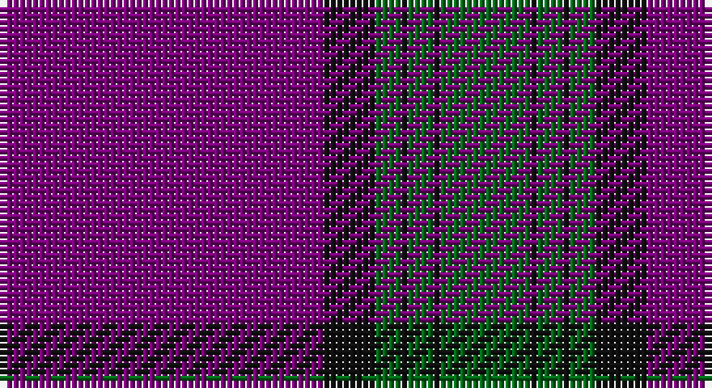

This page is one **sett** — a single exact thread-count. It belongs to the [tartan](/setts/dp50k8g4k1g4k1g14/)
(the same proportion at any scale), whose colour order is pattern [BKGKGKG](/stripes/bkgkgkg/).

Sourced from tartans-authority.  It is a [7 stripe tartan](/stripes/stripes7/).

Original link http://www.tartansauthority.com/tartan-ferret/display/8049/

## Register references

External register numbers recorded for this tartan.

- Scottish Tartans Authority (ITI): 8049

## Thread count
P/50 K8 G4 K1 G4 K1 G/14

One full sett is **100 threads**.

## Palette

Palette: <strong>Tartan Register</strong>
<table><thead><tr><th>Colour</th><th>Threads</th><th>Shade</th><th>Base</th><th>OKLCh</th></tr></thead><tbody><tr><td>P/</td><td style="text-align:right;font-variant-numeric:tabular-nums">50</td><td><code style="background-color:#780078;">#780078</code> <small style="color:#888">#780078</small></td><td>B <code style="background-color:#2A418A;">#2A418A</code></td><td><small style="color:#888">oklch(40.2% 0.185 328.4)</small></td></tr><tr><td>K</td><td style="text-align:right;font-variant-numeric:tabular-nums">8</td><td><code style="background-color:#101010;">#101010</code> <small style="color:#888">#101010</small></td><td>K <code style="background-color:#000000;">#000000</code></td><td><small style="color:#888">oklch(17.3% 0.000 89.9)</small></td></tr><tr><td>G</td><td style="text-align:right;font-variant-numeric:tabular-nums">4</td><td><code style="background-color:#006818;">#006818</code> <small style="color:#888">#006818</small></td><td>G <code style="background-color:#006100;">#006100</code></td><td><small style="color:#888">oklch(45.0% 0.142 145.0)</small></td></tr><tr><td>K</td><td style="text-align:right;font-variant-numeric:tabular-nums">1</td><td><code style="background-color:#101010;">#101010</code> <small style="color:#888">#101010</small></td><td>K <code style="background-color:#000000;">#000000</code></td><td><small style="color:#888">oklch(17.3% 0.000 89.9)</small></td></tr><tr><td>G</td><td style="text-align:right;font-variant-numeric:tabular-nums">4</td><td><code style="background-color:#006818;">#006818</code> <small style="color:#888">#006818</small></td><td>G <code style="background-color:#006100;">#006100</code></td><td><small style="color:#888">oklch(45.0% 0.142 145.0)</small></td></tr><tr><td>K</td><td style="text-align:right;font-variant-numeric:tabular-nums">1</td><td><code style="background-color:#101010;">#101010</code> <small style="color:#888">#101010</small></td><td>K <code style="background-color:#000000;">#000000</code></td><td><small style="color:#888">oklch(17.3% 0.000 89.9)</small></td></tr><tr><td>G/</td><td style="text-align:right;font-variant-numeric:tabular-nums">14</td><td><code style="background-color:#006818;">#006818</code> <small style="color:#888">#006818</small></td><td>G <code style="background-color:#006100;">#006100</code></td><td><small style="color:#888">oklch(45.0% 0.142 145.0)</small></td></tr></tbody></table>

# Sample pattern

## Nearest tartans

The nearest existing variants by ΔTartan distance, with this tartan at the top so the swatches line up against it.

ΔTartan

Tartan

Sett

—

<a href="/ttd/edit/#slug=dp50k8g4k1g4k1g14">Ahmlaigh (Corporate)</a> <a class="nn-out" href="/variants/s7/dp50k8g4k1g4k1g14/" title="open its dictionary page">↗</a>

1.01

<a href="/ttd/edit/#slug=db57k1r12db1g12r14db1r2~x2&amp;base=dp50k8g4k1g4k1g14">McBrayer Blue (Personal)</a> <a class="nn-out" href="/variants/s8/db57k1r12db1g12r14db1r2~x2/" title="open its dictionary page">↗</a>

1.23

<a href="/ttd/edit/#slug=db5r16db4k3db4k3db43r15w1~x2&amp;base=dp50k8g4k1g4k1g14">Falkirk Football Club (Corporate)</a> <a class="nn-out" href="/variants/s9/db5r16db4k3db4k3db43r15w1~x2/" title="open its dictionary page">↗</a>

1.28

<a href="/ttd/edit/#slug=db80r21k2ly4k2r16db10~x2&amp;base=dp50k8g4k1g4k1g14">Salvation Army, dress</a> <a class="nn-out" href="/variants/s7/db80r21k2ly4k2r16db10~x2/" title="open its dictionary page">↗</a>

1.40

<a href="/ttd/edit/#slug=db74k2r15k2ly4k2r16db10~x2&amp;base=dp50k8g4k1g4k1g14">Salvation Army Dress (Corporate)</a> <a class="nn-out" href="/variants/s8/db74k2r15k2ly4k2r16db10~x2/" title="open its dictionary page">↗</a>

1.65

<a href="/ttd/edit/#slug=k8r26k22n110w4k5w4&amp;base=dp50k8g4k1g4k1g14">University of Edinburgh</a> <a class="nn-out" href="/variants/s7/k8r26k22n110w4k5w4/" title="open its dictionary page">↗</a>

1.71

<a href="/ttd/edit/#slug=db25r8db3r4k1w3~x2&amp;base=dp50k8g4k1g4k1g14">Clan Gregor Tartan</a> <a class="nn-out" href="/variants/s6/db25r8db3r4k1w3~x2/" title="open its dictionary page">↗</a>

1.74

<a href="/ttd/edit/#slug=g2r21db60r48db2r3g2~x2&amp;base=dp50k8g4k1g4k1g14">Fraser, Isabella</a> <a class="nn-out" href="/variants/s7/g2r21db60r48db2r3g2~x2/" title="open its dictionary page">↗</a>

1.74

<a href="/ttd/edit/#slug=db1r2w1db30r30k1r2w1~x2&amp;base=dp50k8g4k1g4k1g14">Knights Templar - Grand Priory (Corp</a> <a class="nn-out" href="/variants/s8/db1r2w1db30r30k1r2w1~x2/" title="open its dictionary page">↗</a>

1.75

<a href="/ttd/edit/#slug=lr4dt1r15dt42r6dt4lo1~x2&amp;base=dp50k8g4k1g4k1g14">Lion Brand Sportswear</a> <a class="nn-out" href="/variants/s7/lr4dt1r15dt42r6dt4lo1~x2/" title="open its dictionary page">↗</a>

1.75

<a href="/ttd/edit/#slug=r68db9lb10db13lo1db1lo2~x2&amp;base=dp50k8g4k1g4k1g14">Canadian Legion Branch 50</a> <a class="nn-out" href="/variants/s7/r68db9lb10db13lo1db1lo2~x2/" title="open its dictionary page">↗</a>

## Neighbour map

Every grey dot is one of 14360 variants placed by the first two principal components of the ΔTartan feature space (44% of its variance). Red is this tartan; blue dots are its nearest — click one to open its page.

<svg viewBox="0 0 640 380" role="img" style="max-width:100%;height:auto;border:1px solid #e0e0e0;border-radius:4px;display:block" xmlns="http://www.w3.org/2000/svg"><image href="/nn/cloud.v1.png" width="640" height="380"/><a href="/variants/s8/db57k1r12db1g12r14db1r2~x2/"><circle cx="432.4" cy="115.4" r="4" fill="#3465a4"><title>McBrayer Blue (Personal)</title></circle></a><a href="/variants/s9/db5r16db4k3db4k3db43r15w1~x2/"><circle cx="418.8" cy="121.5" r="4" fill="#3465a4"><title>Falkirk Football Club (Corporate)</title></circle></a><a href="/variants/s7/db80r21k2ly4k2r16db10~x2/"><circle cx="474.7" cy="132.6" r="4" fill="#3465a4"><title>Salvation Army, dress</title></circle></a><a href="/variants/s8/db74k2r15k2ly4k2r16db10~x2/"><circle cx="471.3" cy="122.6" r="4" fill="#3465a4"><title>Salvation Army Dress (Corporate)</title></circle></a><a href="/variants/s7/k8r26k22n110w4k5w4/"><circle cx="432.0" cy="155.3" r="4" fill="#3465a4"><title>University of Edinburgh</title></circle></a><a href="/variants/s6/db25r8db3r4k1w3~x2/"><circle cx="415.5" cy="158.3" r="4" fill="#3465a4"><title>Clan Gregor Tartan</title></circle></a><a href="/variants/s7/g2r21db60r48db2r3g2~x2/"><circle cx="409.5" cy="155.5" r="4" fill="#3465a4"><title>Fraser, Isabella</title></circle></a><a href="/variants/s8/db1r2w1db30r30k1r2w1~x2/"><circle cx="382.3" cy="119.0" r="4" fill="#3465a4"><title>Knights Templar - Grand Priory (Corp</title></circle></a><a href="/variants/s7/lr4dt1r15dt42r6dt4lo1~x2/"><circle cx="495.1" cy="156.2" r="4" fill="#3465a4"><title>Lion Brand Sportswear</title></circle></a><a href="/variants/s7/r68db9lb10db13lo1db1lo2~x2/"><circle cx="483.2" cy="109.3" r="4" fill="#3465a4"><title>Canadian Legion Branch 50</title></circle></a><circle cx="469.9" cy="138.9" r="5" fill="#c00000"/></svg>

ID: /variants/s7/dp50k8g4k1g4k1g14/
