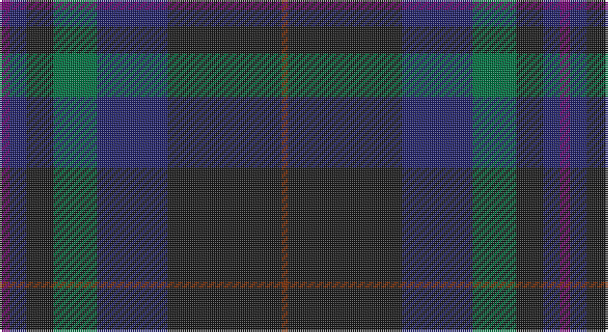

This page is one **sett** — a single exact thread-count. It belongs to the [tartan](/setts/dp5db8dt13g21db34dt55o3/)
(the same proportion at any scale), whose colour order is pattern [BBBGBBR](/stripes/bbbgbbr/).

Part of the [Bouncing Blackie](/tartans/bouncing-blackie/) tartan — the named design grouping this sett with its other cloths.

Sourced from tartans-authority.  It is a [7 stripe tartan](/stripes/stripes7/).

Original link http://www.tartansauthority.com/tartan-ferret/display/7854/

## Register references

External register numbers recorded for this tartan.

- Scottish Tartans Authority (ITI): 7854

## Thread count
P/5 DB8 K13 G21 DB34 K55 T/3

One full sett is **270 threads**.

## Palette

Palette: <strong>Tartan Register</strong> <small style="color:#888">(1 of 5 colours)</small>
<table><thead><tr><th>Colour</th><th>Threads</th><th>Shade</th><th>Base</th><th>OKLCh</th></tr></thead><tbody><tr><td>P/</td><td style="text-align:right;font-variant-numeric:tabular-nums">5</td><td><code style="background-color:#700070;">#700070</code> <small style="color:#888">#700070</small></td><td>B <code style="background-color:#2A418A;">#2A418A</code></td><td><small style="color:#888">oklch(38.3% 0.176 328.4)</small></td></tr><tr><td>DB</td><td style="text-align:right;font-variant-numeric:tabular-nums">8</td><td><code style="background-color:#24246C;">#24246C</code> <small style="color:#888">#24246C</small></td><td>B <code style="background-color:#2A418A;">#2A418A</code></td><td><small style="color:#888">oklch(31.1% 0.122 276.6)</small></td></tr><tr><td>K</td><td style="text-align:right;font-variant-numeric:tabular-nums">13</td><td><code style="background-color:#1C1C1C;">#1C1C1C</code> <small style="color:#888">#1C1C1C</small></td><td>B <code style="background-color:#2A418A;">#2A418A</code></td><td><small style="color:#888">oklch(22.6% 0.000 89.9)</small></td></tr><tr><td>G</td><td style="text-align:right;font-variant-numeric:tabular-nums">21</td><td><code style="background-color:#007040;">#007040</code> <small style="color:#888">#007040</small></td><td>G <code style="background-color:#006100;">#006100</code></td><td><small style="color:#888">oklch(47.9% 0.117 155.8)</small></td></tr><tr><td>DB</td><td style="text-align:right;font-variant-numeric:tabular-nums">34</td><td><code style="background-color:#24246C;">#24246C</code> <small style="color:#888">#24246C</small></td><td>B <code style="background-color:#2A418A;">#2A418A</code></td><td><small style="color:#888">oklch(31.1% 0.122 276.6)</small></td></tr><tr><td>K</td><td style="text-align:right;font-variant-numeric:tabular-nums">55</td><td><code style="background-color:#1C1C1C;">#1C1C1C</code> <small style="color:#888">#1C1C1C</small></td><td>B <code style="background-color:#2A418A;">#2A418A</code></td><td><small style="color:#888">oklch(22.6% 0.000 89.9)</small></td></tr><tr><td>T/</td><td style="text-align:right;font-variant-numeric:tabular-nums">3</td><td><code style="background-color:#742800;">#742800</code> <small style="color:#888">#742800</small></td><td>R <code style="background-color:#CC0000;">#CC0000</code></td><td><small style="color:#888">oklch(38.6% 0.116 42.2)</small></td></tr></tbody></table>

# Sample pattern

## Compared to the master

This cloth is one sett of its design; the master sett (the exemplar the design is anchored on) is below for comparison.

<figure style="margin:0"><figcaption style="color:#888;font-size:smaller">this sett</figcaption></figure>
<figure style="margin:0"><figcaption style="color:#888;font-size:smaller"><a href="/setts/db13dt13dg21db34dt55do3/">master sett →</a></figcaption></figure>

## Nearest tartans

The nearest existing variants by ΔTartan distance, with this tartan at the top so the swatches line up against it.

ΔTartan

Tartan

Sett

—

<a href="/ttd/edit/#slug=dp5db8dt13g21db34dt55o3">Bouncing Blackie (Personal)</a> <a class="nn-out" href="/variants/s7/dp5db8dt13g21db34dt55o3/" title="open its dictionary page">↗</a>

0.93

<a href="/ttd/edit/#slug=dt6o4dt2db25k30g2k2~x2&amp;base=dp5db8dt13g21db34dt55o3">Passion of Scotland (Fashion)</a> <a class="nn-out" href="/variants/s7/dt6o4dt2db25k30g2k2~x2/" title="open its dictionary page">↗</a>

0.94

<a href="/variants/s6/db19ki4dr1ki4dg9k1~x4/">Monarchs Corporate Sport Tartan</a>

1.08

<a href="/ttd/edit/#slug=r1dy2dt12dy8db16lo1~x2&amp;base=dp5db8dt13g21db34dt55o3">Bobby Jones (Personal)</a> <a class="nn-out" href="/variants/s6/r1dy2dt12dy8db16lo1~x2/" title="open its dictionary page">↗</a>

1.13

<a href="/ttd/edit/#slug=r1dy2k12dy8db16lo1~x2&amp;base=dp5db8dt13g21db34dt55o3">Bobby Jones (Personal)</a> <a class="nn-out" href="/variants/s6/r1dy2k12dy8db16lo1~x2/" title="open its dictionary page">↗</a>

1.14

<a href="/ttd/edit/#slug=db50dg26k9dg4w2r2dg10~x2&amp;base=dp5db8dt13g21db34dt55o3">Java St Andrew Society hunting</a> <a class="nn-out" href="/variants/s7/db50dg26k9dg4w2r2dg10~x2/" title="open its dictionary page">↗</a>

1.20

<a href="/ttd/edit/#slug=dg9w2dg24dt37r3dt37dg24w2dg9m4~x2&amp;base=dp5db8dt13g21db34dt55o3">Hardie</a> <a class="nn-out" href="/variants/s10/dg9w2dg24dt37r3dt37dg24w2dg9m4~x2/" title="open its dictionary page">↗</a>

1.24

<a href="/ttd/edit/#slug=dg28r3k28db8t1dg8r2k3~x2&amp;base=dp5db8dt13g21db34dt55o3">Stansbury</a> <a class="nn-out" href="/variants/s8/dg28r3k28db8t1dg8r2k3~x2/" title="open its dictionary page">↗</a>

1.25

<a href="/ttd/edit/#slug=db19k4dr1k4dg9dr1~x4&amp;base=dp5db8dt13g21db34dt55o3">Monarchs</a> <a class="nn-out" href="/variants/s6/db19k4dr1k4dg9dr1~x4/" title="open its dictionary page">↗</a>

1.28

<a href="/ttd/edit/#slug=m4dg9w2dg24dt37r3~x2&amp;base=dp5db8dt13g21db34dt55o3">Hardie (Name)</a> <a class="nn-out" href="/variants/s6/m4dg9w2dg24dt37r3~x2/" title="open its dictionary page">↗</a>

1.34

<a href="/ttd/edit/#slug=dp6r2dp1dg25db16k2db4~x2&amp;base=dp5db8dt13g21db34dt55o3">Laurie</a> <a class="nn-out" href="/variants/s7/dp6r2dp1dg25db16k2db4~x2/" title="open its dictionary page">↗</a>

## Neighbour map

Every grey dot is one of 14360 variants placed by the first two principal components of the ΔTartan feature space (44% of its variance). Red is this tartan; blue dots are its nearest — click one to open its page.

<svg viewBox="0 0 640 380" role="img" style="max-width:100%;height:auto;border:1px solid #e0e0e0;border-radius:4px;display:block" xmlns="http://www.w3.org/2000/svg"><image href="/nn/cloud.v1.png" width="640" height="380"/><a href="/variants/s7/dt6o4dt2db25k30g2k2~x2/"><circle cx="335.1" cy="211.3" r="4" fill="#3465a4"><title>Passion of Scotland (Fashion)</title></circle></a><a href="/variants/s6/db19ki4dr1ki4dg9k1~x4/"><circle cx="351.2" cy="212.4" r="4" fill="#3465a4"><title>Monarchs Corporate Sport Tartan</title></circle></a><a href="/variants/s6/r1dy2dt12dy8db16lo1~x2/"><circle cx="306.2" cy="229.7" r="4" fill="#3465a4"><title>Bobby Jones (Personal)</title></circle></a><a href="/variants/s6/r1dy2k12dy8db16lo1~x2/"><circle cx="286.2" cy="218.8" r="4" fill="#3465a4"><title>Bobby Jones (Personal)</title></circle></a><a href="/variants/s7/db50dg26k9dg4w2r2dg10~x2/"><circle cx="381.7" cy="196.4" r="4" fill="#3465a4"><title>Java St Andrew Society hunting</title></circle></a><a href="/variants/s10/dg9w2dg24dt37r3dt37dg24w2dg9m4~x2/"><circle cx="353.5" cy="200.5" r="4" fill="#3465a4"><title>Hardie</title></circle></a><a href="/variants/s8/dg28r3k28db8t1dg8r2k3~x2/"><circle cx="349.2" cy="184.4" r="4" fill="#3465a4"><title>Stansbury</title></circle></a><a href="/variants/s6/db19k4dr1k4dg9dr1~x4/"><circle cx="381.0" cy="233.2" r="4" fill="#3465a4"><title>Monarchs</title></circle></a><a href="/variants/s6/m4dg9w2dg24dt37r3~x2/"><circle cx="333.8" cy="201.4" r="4" fill="#3465a4"><title>Hardie (Name)</title></circle></a><a href="/variants/s7/dp6r2dp1dg25db16k2db4~x2/"><circle cx="324.3" cy="178.6" r="4" fill="#3465a4"><title>Laurie</title></circle></a><circle cx="344.7" cy="218.9" r="5" fill="#c00000"/></svg>

ID: /variants/s7/dp5db8dt13g21db34dt55o3/
