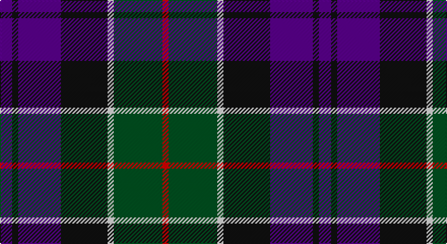

This page is one **sett** — a single exact thread-count. It belongs to the [tartan](/setts/dp6k3dp21k23w3dg24r3/)
(the same proportion at any scale), whose colour order is pattern [BKBKWGR](/stripes/bkbkwgr/).

Part of the [Colquhoun](/tartans/colquhoun/) tartan — the named design grouping this sett with its other cloths.

Sourced from register-of-tartans.  It is a [7 stripe tartan](/stripes/stripes7/).

Original link https://www.tartanregister.gov.uk/tartanDetails.aspx?ref=716

## Also known as

This cloth is also recorded under:

- Colquhoun #2
- Colquhoun #3

## Register references

External register numbers recorded for this tartan.

- Scottish Register of Tartans: [716](https://www.tartanregister.gov.uk/tartanDetails.aspx?ref=716)
- Scottish Tartans World Register: 275

## Thread count
P/12 K6 P42 K46 LN6 G48 R/6

One full sett is **314 threads**.

## Palette

Palette: <strong>Tartan Register</strong>
<table><thead><tr><th>Colour</th><th>Threads</th><th>Shade</th><th>Base</th><th>OKLCh</th></tr></thead><tbody><tr><td>P/</td><td style="text-align:right;font-variant-numeric:tabular-nums">12</td><td><code style="background-color:#5A008C;">#5A008C</code> <small style="color:#888">#5A008C</small></td><td>B <code style="background-color:#2A418A;">#2A418A</code></td><td><small style="color:#888">oklch(37.0% 0.191 306.3)</small></td></tr><tr><td>K</td><td style="text-align:right;font-variant-numeric:tabular-nums">6</td><td><code style="background-color:#101010;">#101010</code> <small style="color:#888">#101010</small></td><td>K <code style="background-color:#000000;">#000000</code></td><td><small style="color:#888">oklch(17.3% 0.000 89.9)</small></td></tr><tr><td>P</td><td style="text-align:right;font-variant-numeric:tabular-nums">42</td><td><code style="background-color:#5A008C;">#5A008C</code> <small style="color:#888">#5A008C</small></td><td>B <code style="background-color:#2A418A;">#2A418A</code></td><td><small style="color:#888">oklch(37.0% 0.191 306.3)</small></td></tr><tr><td>K</td><td style="text-align:right;font-variant-numeric:tabular-nums">46</td><td><code style="background-color:#101010;">#101010</code> <small style="color:#888">#101010</small></td><td>K <code style="background-color:#000000;">#000000</code></td><td><small style="color:#888">oklch(17.3% 0.000 89.9)</small></td></tr><tr><td>LN</td><td style="text-align:right;font-variant-numeric:tabular-nums">6</td><td><code style="background-color:#E0E0E0;">#E0E0E0</code> <small style="color:#888">#E0E0E0</small></td><td>W <code style="background-color:#F7F7F7;">#F7F7F7</code></td><td><small style="color:#888">oklch(90.7% 0.000 89.9)</small></td></tr><tr><td>G</td><td style="text-align:right;font-variant-numeric:tabular-nums">48</td><td><code style="background-color:#005020;">#005020</code> <small style="color:#888">#005020</small></td><td>G <code style="background-color:#006100;">#006100</code></td><td><small style="color:#888">oklch(37.7% 0.105 149.6)</small></td></tr><tr><td>R/</td><td style="text-align:right;font-variant-numeric:tabular-nums">6</td><td><code style="background-color:#DC0000;">#DC0000</code> <small style="color:#888">#DC0000</small></td><td>R <code style="background-color:#CC0000;">#CC0000</code></td><td><small style="color:#888">oklch(56.2% 0.230 29.2)</small></td></tr></tbody></table>

# Sample pattern

## Compared to the master

This cloth is one sett of its design; the master sett (the exemplar the design is anchored on) is below for comparison.

<figure style="margin:0"><figcaption style="color:#888;font-size:smaller">this sett</figcaption></figure>
<figure style="margin:0"><figcaption style="color:#888;font-size:smaller"><a href="/setts/db4k2db16w1k8dg24r4/">master sett →</a></figcaption></figure>

## Nearest tartans

The nearest existing variants by ΔTartan distance, with this tartan at the top so the swatches line up against it.

ΔTartan

Tartan

Sett

—

<a href="/ttd/edit/#slug=dp6k3dp21k23w3dg24r3~x2">Colquhoun #3</a> <a class="nn-out" href="/variants/s7/dp6k3dp21k23w3dg24r3~x2/" title="open its dictionary page">↗</a>

0.68

<a href="/ttd/edit/#slug=db6g27db3k19dp27w3~x2&amp;base=dp6k3dp21k23w3dg24r3~x2">Gold Brothers</a> <a class="nn-out" href="/variants/s6/db6g27db3k19dp27w3~x2/" title="open its dictionary page">↗</a>

0.70

<a href="/ttd/edit/#slug=r5g19w3k19db19k3db2~x2&amp;base=dp6k3dp21k23w3dg24r3~x2">Fruin Colquhoun (Commemorative?)</a> <a class="nn-out" href="/variants/s7/r5g19w3k19db19k3db2~x2/" title="open its dictionary page">↗</a>

0.77

<a href="/ttd/edit/#slug=k4b21dy10y4k20r6b3~x2&amp;base=dp6k3dp21k23w3dg24r3~x2">Swankie (Personal)</a> <a class="nn-out" href="/variants/s7/k4b21dy10y4k20r6b3~x2/" title="open its dictionary page">↗</a>

0.80

<a href="/ttd/edit/#slug=dp2r2dp16k17dg16k2ly2~x2&amp;base=dp6k3dp21k23w3dg24r3~x2">Zangenberg (Personal)</a> <a class="nn-out" href="/variants/s7/dp2r2dp16k17dg16k2ly2~x2/" title="open its dictionary page">↗</a>

0.86

<a href="/ttd/edit/#slug=r1o5k5db1k1db6ly1~x8&amp;base=dp6k3dp21k23w3dg24r3~x2">Lopez-Gasparotto</a> <a class="nn-out" href="/variants/s7/r1o5k5db1k1db6ly1~x8/" title="open its dictionary page">↗</a>

0.86

<a href="/ttd/edit/#slug=r3g16w2k16db16k2db2~x2&amp;base=dp6k3dp21k23w3dg24r3~x2">Colquhoun Clan Tartan</a> <a class="nn-out" href="/variants/s7/r3g16w2k16db16k2db2~x2/" title="open its dictionary page">↗</a>

0.89

<a href="/ttd/edit/#slug=db22r3db2r3db2k17o18dg4~x2&amp;base=dp6k3dp21k23w3dg24r3~x2">Scotch House 2000, antique</a> <a class="nn-out" href="/variants/s8/db22r3db2r3db2k17o18dg4~x2/" title="open its dictionary page">↗</a>

0.89

<a href="/ttd/edit/#slug=r4db24k12g14k4lb3~x2&amp;base=dp6k3dp21k23w3dg24r3~x2">MacPhail Hunting #2</a> <a class="nn-out" href="/variants/s6/r4db24k12g14k4lb3~x2/" title="open its dictionary page">↗</a>

0.95

<a href="/ttd/edit/#slug=k1dg8w1k8w1db8r1~x4&amp;base=dp6k3dp21k23w3dg24r3~x2">Caie (2013)</a> <a class="nn-out" href="/variants/s7/k1dg8w1k8w1db8r1~x4/" title="open its dictionary page">↗</a>

0.96

<a href="/ttd/edit/#slug=r2k1db8k8g8k1t2~x2&amp;base=dp6k3dp21k23w3dg24r3~x2">Argyll</a> <a class="nn-out" href="/variants/s7/r2k1db8k8g8k1t2~x2/" title="open its dictionary page">↗</a>

## Neighbour map

Every grey dot is one of 14360 variants placed by the first two principal components of the ΔTartan feature space (44% of its variance). Red is this tartan; blue dots are its nearest — click one to open its page.

<svg viewBox="0 0 640 380" role="img" style="max-width:100%;height:auto;border:1px solid #e0e0e0;border-radius:4px;display:block" xmlns="http://www.w3.org/2000/svg"><image href="/nn/cloud.v1.png" width="640" height="380"/><a href="/variants/s6/db6g27db3k19dp27w3~x2/"><circle cx="140.8" cy="208.0" r="4" fill="#3465a4"><title>Gold Brothers</title></circle></a><a href="/variants/s7/r5g19w3k19db19k3db2~x2/"><circle cx="148.1" cy="204.2" r="4" fill="#3465a4"><title>Fruin Colquhoun (Commemorative?)</title></circle></a><a href="/variants/s7/k4b21dy10y4k20r6b3~x2/"><circle cx="147.2" cy="214.6" r="4" fill="#3465a4"><title>Swankie (Personal)</title></circle></a><a href="/variants/s7/dp2r2dp16k17dg16k2ly2~x2/"><circle cx="172.2" cy="195.8" r="4" fill="#3465a4"><title>Zangenberg (Personal)</title></circle></a><a href="/variants/s7/r1o5k5db1k1db6ly1~x8/"><circle cx="131.9" cy="210.8" r="4" fill="#3465a4"><title>Lopez-Gasparotto</title></circle></a><a href="/variants/s7/r3g16w2k16db16k2db2~x2/"><circle cx="150.2" cy="206.9" r="4" fill="#3465a4"><title>Colquhoun Clan Tartan</title></circle></a><a href="/variants/s8/db22r3db2r3db2k17o18dg4~x2/"><circle cx="167.6" cy="175.1" r="4" fill="#3465a4"><title>Scotch House 2000, antique</title></circle></a><a href="/variants/s6/r4db24k12g14k4lb3~x2/"><circle cx="172.4" cy="221.9" r="4" fill="#3465a4"><title>MacPhail Hunting #2</title></circle></a><a href="/variants/s7/k1dg8w1k8w1db8r1~x4/"><circle cx="151.7" cy="207.0" r="4" fill="#3465a4"><title>Caie (2013)</title></circle></a><a href="/variants/s7/r2k1db8k8g8k1t2~x2/"><circle cx="151.0" cy="217.9" r="4" fill="#3465a4"><title>Argyll</title></circle></a><circle cx="158.1" cy="207.9" r="5" fill="#c00000"/></svg>

ID: /variants/s7/dp6k3dp21k23w3dg24r3~x2/
