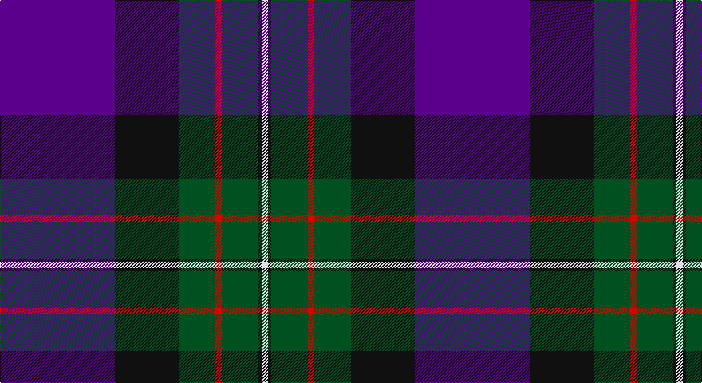

This page is one **sett** — a single exact thread-count. It belongs to the [tartan](/setts/dp72k40dg23r4dg23k2w4/)
(the same proportion at any scale), whose colour order is pattern [BKGRGKW](/stripes/bkgrgkw/).

Sourced from register-of-tartans.  It is a [7 stripe tartan](/stripes/stripes7/).

Original link https://www.tartanregister.gov.uk/tartanDetails.aspx?ref=1170

## Register references

External register numbers recorded for this tartan.

- Scottish Register of Tartans: [1170](https://www.tartanregister.gov.uk/tartanDetails.aspx?ref=1170)
- Scottish Tartans World Register: 338

## Thread count
P/144 K80 G46 R8 G46 K4 LN/8

One full sett is **520 threads**.

## Palette

Palette: <strong>Tartan Register</strong>
<table><thead><tr><th>Colour</th><th>Threads</th><th>Shade</th><th>Base</th><th>OKLCh</th></tr></thead><tbody><tr><td>P/</td><td style="text-align:right;font-variant-numeric:tabular-nums">144</td><td><code style="background-color:#5A008C;">#5A008C</code> <small style="color:#888">#5A008C</small></td><td>B <code style="background-color:#2A418A;">#2A418A</code></td><td><small style="color:#888">oklch(37.0% 0.191 306.3)</small></td></tr><tr><td>K</td><td style="text-align:right;font-variant-numeric:tabular-nums">80</td><td><code style="background-color:#101010;">#101010</code> <small style="color:#888">#101010</small></td><td>K <code style="background-color:#000000;">#000000</code></td><td><small style="color:#888">oklch(17.3% 0.000 89.9)</small></td></tr><tr><td>G</td><td style="text-align:right;font-variant-numeric:tabular-nums">46</td><td><code style="background-color:#005020;">#005020</code> <small style="color:#888">#005020</small></td><td>G <code style="background-color:#006100;">#006100</code></td><td><small style="color:#888">oklch(37.7% 0.105 149.6)</small></td></tr><tr><td>R</td><td style="text-align:right;font-variant-numeric:tabular-nums">8</td><td><code style="background-color:#DC0000;">#DC0000</code> <small style="color:#888">#DC0000</small></td><td>R <code style="background-color:#CC0000;">#CC0000</code></td><td><small style="color:#888">oklch(56.2% 0.230 29.2)</small></td></tr><tr><td>G</td><td style="text-align:right;font-variant-numeric:tabular-nums">46</td><td><code style="background-color:#005020;">#005020</code> <small style="color:#888">#005020</small></td><td>G <code style="background-color:#006100;">#006100</code></td><td><small style="color:#888">oklch(37.7% 0.105 149.6)</small></td></tr><tr><td>K</td><td style="text-align:right;font-variant-numeric:tabular-nums">4</td><td><code style="background-color:#101010;">#101010</code> <small style="color:#888">#101010</small></td><td>K <code style="background-color:#000000;">#000000</code></td><td><small style="color:#888">oklch(17.3% 0.000 89.9)</small></td></tr><tr><td>LN/</td><td style="text-align:right;font-variant-numeric:tabular-nums">8</td><td><code style="background-color:#E0E0E0;">#E0E0E0</code> <small style="color:#888">#E0E0E0</small></td><td>W <code style="background-color:#F7F7F7;">#F7F7F7</code></td><td><small style="color:#888">oklch(90.7% 0.000 89.9)</small></td></tr></tbody></table>

# Sample pattern

## Nearest tartans

The nearest existing variants by ΔTartan distance, with this tartan at the top so the swatches line up against it.

ΔTartan

Tartan

Sett

—

<a href="/ttd/edit/#slug=dp72k40dg23r4dg23k2w4~x2">Ferguson Unidentified</a> <a class="nn-out" href="/variants/s7/dp72k40dg23r4dg23k2w4~x2/" title="open its dictionary page">↗</a>

0.59

<a href="/ttd/edit/#slug=db3dg1r22k12db28lb3~x2&amp;base=dp72k40dg23r4dg23k2w4~x2">Diaspora</a> <a class="nn-out" href="/variants/s6/db3dg1r22k12db28lb3~x2/" title="open its dictionary page">↗</a>

0.99

<a href="/ttd/edit/#slug=lb3db28k12r22dg1~x2&amp;base=dp72k40dg23r4dg23k2w4~x2">Diaspora (Fashion)</a> <a class="nn-out" href="/variants/s5/lb3db28k12r22dg1~x2/" title="open its dictionary page">↗</a>

1.17

<a href="/ttd/edit/#slug=o3ri18k2dg18k24r1~x2&amp;base=dp72k40dg23r4dg23k2w4~x2">205 (Scottish) Field Hospital (Mil.)</a> <a class="nn-out" href="/variants/s6/o3ri18k2dg18k24r1~x2/" title="open its dictionary page">↗</a>

1.23

<a href="/ttd/edit/#slug=dt3dg1r24dt16db28w3~x2&amp;base=dp72k40dg23r4dg23k2w4~x2">Diaspora</a> <a class="nn-out" href="/variants/s6/dt3dg1r24dt16db28w3~x2/" title="open its dictionary page">↗</a>

1.24

<a href="/ttd/edit/#slug=k8r4k36db48r6g3lo2~x2&amp;base=dp72k40dg23r4dg23k2w4~x2">Royal Marines Condor</a> <a class="nn-out" href="/variants/s7/k8r4k36db48r6g3lo2~x2/" title="open its dictionary page">↗</a>

1.26

<a href="/ttd/edit/#slug=m13dg16dgi4dp4dgi4dp34lo1dp1~x2&amp;base=dp72k40dg23r4dg23k2w4~x2">Heather Mead (Personal)</a> <a class="nn-out" href="/variants/s8/m13dg16dgi4dp4dgi4dp34lo1dp1~x2/" title="open its dictionary page">↗</a>

1.36

<a href="/ttd/edit/#slug=db24k8g8dp2g8k1w2~x2&amp;base=dp72k40dg23r4dg23k2w4~x2">Alexander</a> <a class="nn-out" href="/variants/s7/db24k8g8dp2g8k1w2~x2/" title="open its dictionary page">↗</a>

1.37

<a href="/ttd/edit/#slug=lo4b8dp4k53db54w2&amp;base=dp72k40dg23r4dg23k2w4~x2">Pipers' Trail (Corporate)</a> <a class="nn-out" href="/variants/s6/lo4b8dp4k53db54w2/" title="open its dictionary page">↗</a>

1.45

<a href="/ttd/edit/#slug=r6db32k18g28k1lb2~x2&amp;base=dp72k40dg23r4dg23k2w4~x2">Naysmith (Name)</a> <a class="nn-out" href="/variants/s6/r6db32k18g28k1lb2~x2/" title="open its dictionary page">↗</a>

1.46

<a href="/ttd/edit/#slug=db37o18k37r2k2r2~x2&amp;base=dp72k40dg23r4dg23k2w4~x2">Hakkarain Personal Finnish Tartan</a> <a class="nn-out" href="/variants/s6/db37o18k37r2k2r2~x2/" title="open its dictionary page">↗</a>

## Neighbour map

Every grey dot is one of 14360 variants placed by the first two principal components of the ΔTartan feature space (44% of its variance). Red is this tartan; blue dots are its nearest — click one to open its page.

<svg viewBox="0 0 640 380" role="img" style="max-width:100%;height:auto;border:1px solid #e0e0e0;border-radius:4px;display:block" xmlns="http://www.w3.org/2000/svg"><image href="/nn/cloud.v1.png" width="640" height="380"/><a href="/variants/s6/db3dg1r22k12db28lb3~x2/"><circle cx="281.6" cy="166.3" r="4" fill="#3465a4"><title>Diaspora</title></circle></a><a href="/variants/s5/lb3db28k12r22dg1~x2/"><circle cx="264.2" cy="180.7" r="4" fill="#3465a4"><title>Diaspora (Fashion)</title></circle></a><a href="/variants/s6/o3ri18k2dg18k24r1~x2/"><circle cx="247.0" cy="180.4" r="4" fill="#3465a4"><title>205 (Scottish) Field Hospital (Mil.)</title></circle></a><a href="/variants/s6/dt3dg1r24dt16db28w3~x2/"><circle cx="242.9" cy="159.1" r="4" fill="#3465a4"><title>Diaspora</title></circle></a><a href="/variants/s7/k8r4k36db48r6g3lo2~x2/"><circle cx="320.6" cy="164.0" r="4" fill="#3465a4"><title>Royal Marines Condor</title></circle></a><a href="/variants/s8/m13dg16dgi4dp4dgi4dp34lo1dp1~x2/"><circle cx="342.2" cy="143.6" r="4" fill="#3465a4"><title>Heather Mead (Personal)</title></circle></a><a href="/variants/s7/db24k8g8dp2g8k1w2~x2/"><circle cx="254.8" cy="159.8" r="4" fill="#3465a4"><title>Alexander</title></circle></a><a href="/variants/s6/lo4b8dp4k53db54w2/"><circle cx="295.1" cy="149.9" r="4" fill="#3465a4"><title>Pipers' Trail (Corporate)</title></circle></a><a href="/variants/s6/r6db32k18g28k1lb2~x2/"><circle cx="234.1" cy="167.9" r="4" fill="#3465a4"><title>Naysmith (Name)</title></circle></a><a href="/variants/s6/db37o18k37r2k2r2~x2/"><circle cx="272.7" cy="196.6" r="4" fill="#3465a4"><title>Hakkarain Personal Finnish Tartan</title></circle></a><circle cx="281.1" cy="144.9" r="5" fill="#c00000"/></svg>

ID: /variants/s7/dp72k40dg23r4dg23k2w4~x2/
