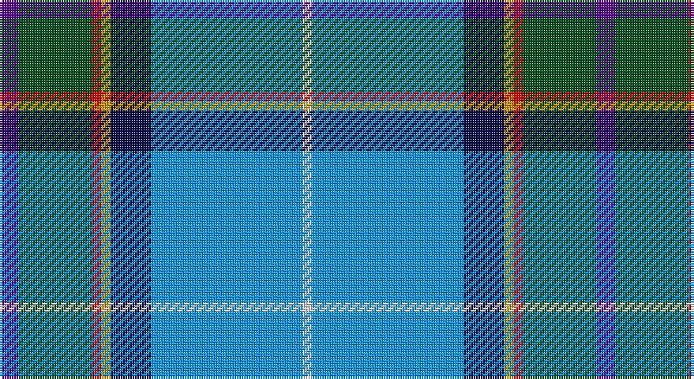

This page is one **sett** — a single exact thread-count. It belongs to the [tartan](/setts/dp8dg31r4lo4db17b64w4/)
(the same proportion at any scale), whose colour order is pattern [BGRYBBW](/stripes/bgrybbw/).

Part of the [Manx National](/tartans/manx-national/) tartan — the named design grouping this sett with its other cloths.

Sourced from register-of-tartans.  It is a [7 stripe tartan](/stripes/stripes7/).

Original link https://www.tartanregister.gov.uk/tartanDetails.aspx?ref=2823

## Also known as

This cloth is also recorded under:

- Manx National #2

## Register references

External register numbers recorded for this tartan.

- Scottish Register of Tartans: [2823](https://www.tartanregister.gov.uk/tartanDetails.aspx?ref=2823)
- Scottish Tartans World Register: 186

## Thread count
P/8 G31 R4 DY4 DB17 B64 LN/4

One full sett is **252 threads**.

## Palette

Palette: <strong>Tartan Register</strong> <small style="color:#888">(5 of 7 colours)</small>
<table><thead><tr><th>Colour</th><th>Threads</th><th>Shade</th><th>Base</th><th>OKLCh</th></tr></thead><tbody><tr><td>P/</td><td style="text-align:right;font-variant-numeric:tabular-nums">8</td><td><code style="background-color:#5A008C;">#5A008C</code> <small style="color:#888">#5A008C</small></td><td>B <code style="background-color:#2A418A;">#2A418A</code></td><td><small style="color:#888">oklch(37.0% 0.191 306.3)</small></td></tr><tr><td>G</td><td style="text-align:right;font-variant-numeric:tabular-nums">31</td><td><code style="background-color:#005020;">#005020</code> <small style="color:#888">#005020</small></td><td>G <code style="background-color:#006100;">#006100</code></td><td><small style="color:#888">oklch(37.7% 0.105 149.6)</small></td></tr><tr><td>R</td><td style="text-align:right;font-variant-numeric:tabular-nums">4</td><td><code style="background-color:#DC0000;">#DC0000</code> <small style="color:#888">#DC0000</small></td><td>R <code style="background-color:#CC0000;">#CC0000</code></td><td><small style="color:#888">oklch(56.2% 0.230 29.2)</small></td></tr><tr><td>DY</td><td style="text-align:right;font-variant-numeric:tabular-nums">4</td><td><code style="background-color:#C89600;">#C89600</code> <small style="color:#888">#C89600</small></td><td>Y <code style="background-color:#F2BF00;">#F2BF00</code></td><td><small style="color:#888">oklch(70.2% 0.144 84.7)</small></td></tr><tr><td>DB</td><td style="text-align:right;font-variant-numeric:tabular-nums">17</td><td><code style="background-color:#080848;">#080848</code> <small style="color:#888">#080848</small></td><td>B <code style="background-color:#2A418A;">#2A418A</code></td><td><small style="color:#888">oklch(20.2% 0.112 270.4)</small></td></tr><tr><td>B</td><td style="text-align:right;font-variant-numeric:tabular-nums">64</td><td><code style="background-color:#0596FA;">#0596FA</code> <small style="color:#888">#0596FA</small></td><td>B <code style="background-color:#2A418A;">#2A418A</code></td><td><small style="color:#888">oklch(66.0% 0.180 248.9)</small></td></tr><tr><td>LN/</td><td style="text-align:right;font-variant-numeric:tabular-nums">4</td><td><code style="background-color:#E0E0E0;">#E0E0E0</code> <small style="color:#888">#E0E0E0</small></td><td>W <code style="background-color:#F7F7F7;">#F7F7F7</code></td><td><small style="color:#888">oklch(90.7% 0.000 89.9)</small></td></tr></tbody></table>

# Sample pattern

## Compared to the master

This cloth is one sett of its design; the master sett (the exemplar the design is anchored on) is below for comparison.

<figure style="margin:0"><figcaption style="color:#888;font-size:smaller">this sett</figcaption></figure>
<figure style="margin:0"><figcaption style="color:#888;font-size:smaller"><a href="/setts/b5dg9o2ly2db6t14w3/">master sett →</a></figcaption></figure>

## Nearest tartans

The nearest existing variants by ΔTartan distance, with this tartan at the top so the swatches line up against it.

ΔTartan

Tartan

Sett

—

<a href="/ttd/edit/#slug=dp8dg31r4lo4db17b64w4">Manx National #2</a> <a class="nn-out" href="/variants/s7/dp8dg31r4lo4db17b64w4/" title="open its dictionary page">↗</a>

1.09

<a href="/ttd/edit/#slug=p8g31r4y4db17b64w4&amp;base=dp8dg31r4lo4db17b64w4">Manx National</a> <a class="nn-out" href="/variants/s7/p8g31r4y4db17b64w4/" title="open its dictionary page">↗</a>

1.29

<a href="/ttd/edit/#slug=ly4db24t5g2db3k5t33r2~x2&amp;base=dp8dg31r4lo4db17b64w4">Los Angeles</a> <a class="nn-out" href="/variants/s8/ly4db24t5g2db3k5t33r2~x2/" title="open its dictionary page">↗</a>

1.38

<a href="/ttd/edit/#slug=r3dt25k6lb20ly2lb2w3~x2&amp;base=dp8dg31r4lo4db17b64w4">Madras College (Corporate)</a> <a class="nn-out" href="/variants/s7/r3dt25k6lb20ly2lb2w3~x2/" title="open its dictionary page">↗</a>

1.40

<a href="/ttd/edit/#slug=o18k3g3r2w3db36k2ly6~x2&amp;base=dp8dg31r4lo4db17b64w4">M'Kleod</a> <a class="nn-out" href="/variants/s8/o18k3g3r2w3db36k2ly6~x2/" title="open its dictionary page">↗</a>

1.41

<a href="/ttd/edit/#slug=dp2g8r1ly1db6t15w1~x4&amp;base=dp8dg31r4lo4db17b64w4">Manx National District Tartan</a> <a class="nn-out" href="/variants/s7/dp2g8r1ly1db6t15w1~x4/" title="open its dictionary page">↗</a>

1.42

<a href="/ttd/edit/#slug=lo4r2b32k10dp4lb21dp2~x2&amp;base=dp8dg31r4lo4db17b64w4">Dignan School of Dancing</a> <a class="nn-out" href="/variants/s7/lo4r2b32k10dp4lb21dp2~x2/" title="open its dictionary page">↗</a>

1.43

<a href="/ttd/edit/#slug=lr5lbi3lb7lr5lb27b8dt43w3lb3&amp;base=dp8dg31r4lo4db17b64w4">Queensferry High (School)</a> <a class="nn-out" href="/variants/s9/lr5lbi3lb7lr5lb27b8dt43w3lb3/" title="open its dictionary page">↗</a>

1.44

<a href="/ttd/edit/#slug=m1g2t10r1db15w1~x4&amp;base=dp8dg31r4lo4db17b64w4">Oren Peterson</a> <a class="nn-out" href="/variants/s6/m1g2t10r1db15w1~x4/" title="open its dictionary page">↗</a>

1.48

<a href="/ttd/edit/#slug=w1p3g6k1db12ly1db2ly1~x4&amp;base=dp8dg31r4lo4db17b64w4">Lambert, Patrice (Personal)</a> <a class="nn-out" href="/variants/s8/w1p3g6k1db12ly1db2ly1~x4/" title="open its dictionary page">↗</a>

1.50

<a href="/ttd/edit/#slug=dp4g13db5ly3t6ly3db5n6db28w2~x2&amp;base=dp8dg31r4lo4db17b64w4">Highland, Blue (Corporate)</a> <a class="nn-out" href="/variants/s10/dp4g13db5ly3t6ly3db5n6db28w2~x2/" title="open its dictionary page">↗</a>

## Neighbour map

Every grey dot is one of 14360 variants placed by the first two principal components of the ΔTartan feature space (44% of its variance). Red is this tartan; blue dots are its nearest — click one to open its page.

<svg viewBox="0 0 640 380" role="img" style="max-width:100%;height:auto;border:1px solid #e0e0e0;border-radius:4px;display:block" xmlns="http://www.w3.org/2000/svg"><image href="/nn/cloud.v1.png" width="640" height="380"/><a href="/variants/s7/p8g31r4y4db17b64w4/"><circle cx="208.9" cy="116.9" r="4" fill="#3465a4"><title>Manx National</title></circle></a><a href="/variants/s8/ly4db24t5g2db3k5t33r2~x2/"><circle cx="250.6" cy="128.9" r="4" fill="#3465a4"><title>Los Angeles</title></circle></a><a href="/variants/s7/r3dt25k6lb20ly2lb2w3~x2/"><circle cx="171.5" cy="140.8" r="4" fill="#3465a4"><title>Madras College (Corporate)</title></circle></a><a href="/variants/s8/o18k3g3r2w3db36k2ly6~x2/"><circle cx="221.0" cy="96.8" r="4" fill="#3465a4"><title>M'Kleod</title></circle></a><a href="/variants/s7/dp2g8r1ly1db6t15w1~x4/"><circle cx="185.6" cy="131.4" r="4" fill="#3465a4"><title>Manx National District Tartan</title></circle></a><a href="/variants/s7/lo4r2b32k10dp4lb21dp2~x2/"><circle cx="177.7" cy="129.2" r="4" fill="#3465a4"><title>Dignan School of Dancing</title></circle></a><a href="/variants/s9/lr5lbi3lb7lr5lb27b8dt43w3lb3/"><circle cx="196.4" cy="122.8" r="4" fill="#3465a4"><title>Queensferry High (School)</title></circle></a><a href="/variants/s6/m1g2t10r1db15w1~x4/"><circle cx="245.7" cy="144.8" r="4" fill="#3465a4"><title>Oren Peterson</title></circle></a><a href="/variants/s8/w1p3g6k1db12ly1db2ly1~x4/"><circle cx="202.8" cy="133.9" r="4" fill="#3465a4"><title>Lambert, Patrice (Personal)</title></circle></a><a href="/variants/s10/dp4g13db5ly3t6ly3db5n6db28w2~x2/"><circle cx="205.2" cy="123.0" r="4" fill="#3465a4"><title>Highland, Blue (Corporate)</title></circle></a><circle cx="196.2" cy="119.1" r="5" fill="#c00000"/></svg>

ID: /variants/s7/dp8dg31r4lo4db17b64w4/
