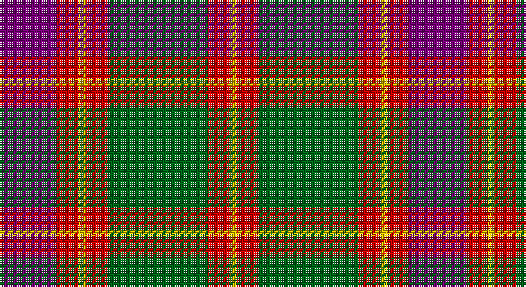

This page is one **sett** — a single exact thread-count. It belongs to the [tartan](/setts/dp8r3ly1r3g14r3ly1/)
(the same proportion at any scale), whose colour order is pattern [BRYRGRY](/stripes/bryrgry/).

Sourced from register-of-tartans.  It is a [7 stripe tartan](/stripes/stripes7/).

Original link https://www.tartanregister.gov.uk/tartanDetails.aspx?ref=2189

## Register references

External register numbers recorded for this tartan.

- Scottish Register of Tartans: [2189](https://www.tartanregister.gov.uk/tartanDetails.aspx?ref=2189)
- Scottish Tartans Authority (ITI): 590
- Scottish Tartans World Register: 590

## Thread count
P/32 R12 Y4 R12 G56 R12 Y/4

One full sett is **228 threads**.

## Palette

Palette: <strong>Tartan Register</strong>
<table><thead><tr><th>Colour</th><th>Threads</th><th>Shade</th><th>Base</th><th>OKLCh</th></tr></thead><tbody><tr><td>P/</td><td style="text-align:right;font-variant-numeric:tabular-nums">32</td><td><code style="background-color:#780078;">#780078</code> <small style="color:#888">#780078</small></td><td>B <code style="background-color:#2A418A;">#2A418A</code></td><td><small style="color:#888">oklch(40.2% 0.185 328.4)</small></td></tr><tr><td>R</td><td style="text-align:right;font-variant-numeric:tabular-nums">12</td><td><code style="background-color:#C80000;">#C80000</code> <small style="color:#888">#C80000</small></td><td>R <code style="background-color:#CC0000;">#CC0000</code></td><td><small style="color:#888">oklch(52.3% 0.215 29.2)</small></td></tr><tr><td>Y</td><td style="text-align:right;font-variant-numeric:tabular-nums">4</td><td><code style="background-color:#E8C000;">#E8C000</code> <small style="color:#888">#E8C000</small></td><td>Y <code style="background-color:#F2BF00;">#F2BF00</code></td><td><small style="color:#888">oklch(81.9% 0.168 93.7)</small></td></tr><tr><td>R</td><td style="text-align:right;font-variant-numeric:tabular-nums">12</td><td><code style="background-color:#C80000;">#C80000</code> <small style="color:#888">#C80000</small></td><td>R <code style="background-color:#CC0000;">#CC0000</code></td><td><small style="color:#888">oklch(52.3% 0.215 29.2)</small></td></tr><tr><td>G</td><td style="text-align:right;font-variant-numeric:tabular-nums">56</td><td><code style="background-color:#006818;">#006818</code> <small style="color:#888">#006818</small></td><td>G <code style="background-color:#006100;">#006100</code></td><td><small style="color:#888">oklch(45.0% 0.142 145.0)</small></td></tr><tr><td>R</td><td style="text-align:right;font-variant-numeric:tabular-nums">12</td><td><code style="background-color:#C80000;">#C80000</code> <small style="color:#888">#C80000</small></td><td>R <code style="background-color:#CC0000;">#CC0000</code></td><td><small style="color:#888">oklch(52.3% 0.215 29.2)</small></td></tr><tr><td>Y/</td><td style="text-align:right;font-variant-numeric:tabular-nums">4</td><td><code style="background-color:#E8C000;">#E8C000</code> <small style="color:#888">#E8C000</small></td><td>Y <code style="background-color:#F2BF00;">#F2BF00</code></td><td><small style="color:#888">oklch(81.9% 0.168 93.7)</small></td></tr></tbody></table>

# Sample pattern

## Nearest tartans

The nearest existing variants by ΔTartan distance, with this tartan at the top so the swatches line up against it.

ΔTartan

Tartan

Sett

—

<a href="/ttd/edit/#slug=dp8r3ly1r3g14r3ly1~x4">Logan with Yellow</a> <a class="nn-out" href="/variants/s7/dp8r3ly1r3g14r3ly1~x4/" title="open its dictionary page">↗</a>

0.42

<a href="/ttd/edit/#slug=p8r3ly1r3g14r3ly1~x4&amp;base=dp8r3ly1r3g14r3ly1~x4">Logan, with Yellow</a> <a class="nn-out" href="/variants/s7/p8r3ly1r3g14r3ly1~x4/" title="open its dictionary page">↗</a>

0.45

<a href="/ttd/edit/#slug=dp8r3ly1r3dg14r3ly1~x4&amp;base=dp8r3ly1r3g14r3ly1~x4">Logan - 1819 (with yellow)</a> <a class="nn-out" href="/variants/s7/dp8r3ly1r3dg14r3ly1~x4/" title="open its dictionary page">↗</a>

0.46

<a href="/ttd/edit/#slug=r30db3r2db3r6db14g26gi6&amp;base=dp8r3ly1r3g14r3ly1~x4">Cranston Dress Family Tartan</a> <a class="nn-out" href="/variants/s8/r30db3r2db3r6db14g26gi6/" title="open its dictionary page">↗</a>

0.49

<a href="/ttd/edit/#slug=r15db2r1db2r3db7g13gi3~x2&amp;base=dp8r3ly1r3g14r3ly1~x4">Cranston Dress</a> <a class="nn-out" href="/variants/s8/r15db2r1db2r3db7g13gi3~x2/" title="open its dictionary page">↗</a>

0.59

<a href="/ttd/edit/#slug=r30db3r2db3r6db14gi26g6&amp;base=dp8r3ly1r3g14r3ly1~x4">Cranston, dress</a> <a class="nn-out" href="/variants/s8/r30db3r2db3r6db14gi26g6/" title="open its dictionary page">↗</a>

0.67

<a href="/ttd/edit/#slug=db1r5dg18r4db9r10w1~x4&amp;base=dp8r3ly1r3g14r3ly1~x4">MacKintosh Geddes</a> <a class="nn-out" href="/variants/s7/db1r5dg18r4db9r10w1~x4/" title="open its dictionary page">↗</a>

0.67

<a href="/ttd/edit/#slug=p9r4p1r4g15ri4p1~x2&amp;base=dp8r3ly1r3g14r3ly1~x4">Logan, Light</a> <a class="nn-out" href="/variants/s7/p9r4p1r4g15ri4p1~x2/" title="open its dictionary page">↗</a>

0.71

<a href="/ttd/edit/#slug=r30k8dg30b4r3b2~x2&amp;base=dp8r3ly1r3g14r3ly1~x4">Plummer Family Personal Tartan</a> <a class="nn-out" href="/variants/s6/r30k8dg30b4r3b2~x2/" title="open its dictionary page">↗</a>

0.72

<a href="/ttd/edit/#slug=g12t6g6r15k1r1k2~x4&amp;base=dp8r3ly1r3g14r3ly1~x4">McCook/Cook (Name)</a> <a class="nn-out" href="/variants/s7/g12t6g6r15k1r1k2~x4/" title="open its dictionary page">↗</a>

0.74

<a href="/ttd/edit/#slug=dg12g6dg6r15k1r1k2~x2&amp;base=dp8r3ly1r3g14r3ly1~x4">Cook (Name)</a> <a class="nn-out" href="/variants/s7/dg12g6dg6r15k1r1k2~x2/" title="open its dictionary page">↗</a>

## Neighbour map

Every grey dot is one of 14360 variants placed by the first two principal components of the ΔTartan feature space (44% of its variance). Red is this tartan; blue dots are its nearest — click one to open its page.

<svg viewBox="0 0 640 380" role="img" style="max-width:100%;height:auto;border:1px solid #e0e0e0;border-radius:4px;display:block" xmlns="http://www.w3.org/2000/svg"><image href="/nn/cloud.v1.png" width="640" height="380"/><a href="/variants/s7/p8r3ly1r3g14r3ly1~x4/"><circle cx="239.1" cy="174.8" r="4" fill="#3465a4"><title>Logan, with Yellow</title></circle></a><a href="/variants/s7/dp8r3ly1r3dg14r3ly1~x4/"><circle cx="248.0" cy="181.0" r="4" fill="#3465a4"><title>Logan - 1819 (with yellow)</title></circle></a><a href="/variants/s8/r30db3r2db3r6db14g26gi6/"><circle cx="236.2" cy="167.0" r="4" fill="#3465a4"><title>Cranston Dress Family Tartan</title></circle></a><a href="/variants/s8/r15db2r1db2r3db7g13gi3~x2/"><circle cx="228.6" cy="170.0" r="4" fill="#3465a4"><title>Cranston Dress</title></circle></a><a href="/variants/s8/r30db3r2db3r6db14gi26g6/"><circle cx="242.0" cy="170.6" r="4" fill="#3465a4"><title>Cranston, dress</title></circle></a><a href="/variants/s7/db1r5dg18r4db9r10w1~x4/"><circle cx="249.2" cy="180.7" r="4" fill="#3465a4"><title>MacKintosh Geddes</title></circle></a><a href="/variants/s7/p9r4p1r4g15ri4p1~x2/"><circle cx="218.0" cy="174.3" r="4" fill="#3465a4"><title>Logan, Light</title></circle></a><a href="/variants/s6/r30k8dg30b4r3b2~x2/"><circle cx="280.0" cy="188.3" r="4" fill="#3465a4"><title>Plummer Family Personal Tartan</title></circle></a><a href="/variants/s7/g12t6g6r15k1r1k2~x4/"><circle cx="248.7" cy="189.5" r="4" fill="#3465a4"><title>McCook/Cook (Name)</title></circle></a><a href="/variants/s7/dg12g6dg6r15k1r1k2~x2/"><circle cx="252.7" cy="191.8" r="4" fill="#3465a4"><title>Cook (Name)</title></circle></a><circle cx="246.7" cy="178.7" r="5" fill="#c00000"/></svg>

ID: /variants/s7/dp8r3ly1r3g14r3ly1~x4/
