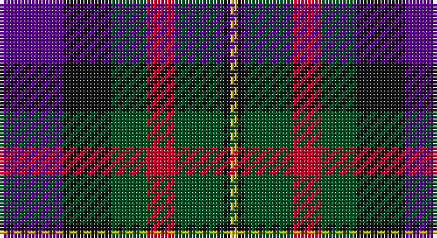

This page is one **sett** — a single exact thread-count. It belongs to the [tartan](/setts/dp9k7dg5r4dg7k1ly1/)
(the same proportion at any scale), whose colour order is pattern [BKGRGKY](/stripes/bkgrgky/).

Part of the [MacLaren](/tartans/maclaren/) tartan — the named design grouping this sett with its other cloths.

Sourced from register-of-tartans.  It is a [7 stripe tartan](/stripes/stripes7/).

Original link https://www.tartanregister.gov.uk/tartanDetails.aspx?ref=2595

## Also known as

This cloth is also recorded under:

- MacLaren #2

## Register references

External register numbers recorded for this tartan.

- Scottish Register of Tartans: [2595](https://www.tartanregister.gov.uk/tartanDetails.aspx?ref=2595)
- Scottish Tartans World Register: 343

## Thread count
P/18 K14 G10 R8 G14 K2 Y/2

One full sett is **116 threads**.

## Palette

Palette: <strong>Tartan Register</strong> <small style="color:#888">(4 of 5 colours)</small>
<table><thead><tr><th>Colour</th><th>Threads</th><th>Shade</th><th>Base</th><th>OKLCh</th></tr></thead><tbody><tr><td>P/</td><td style="text-align:right;font-variant-numeric:tabular-nums">18</td><td><code style="background-color:#5A008C;">#5A008C</code> <small style="color:#888">#5A008C</small></td><td>B <code style="background-color:#2A418A;">#2A418A</code></td><td><small style="color:#888">oklch(37.0% 0.191 306.3)</small></td></tr><tr><td>K</td><td style="text-align:right;font-variant-numeric:tabular-nums">14</td><td><code style="background-color:#101010;">#101010</code> <small style="color:#888">#101010</small></td><td>K <code style="background-color:#000000;">#000000</code></td><td><small style="color:#888">oklch(17.3% 0.000 89.9)</small></td></tr><tr><td>G</td><td style="text-align:right;font-variant-numeric:tabular-nums">10</td><td><code style="background-color:#005020;">#005020</code> <small style="color:#888">#005020</small></td><td>G <code style="background-color:#006100;">#006100</code></td><td><small style="color:#888">oklch(37.7% 0.105 149.6)</small></td></tr><tr><td>R</td><td style="text-align:right;font-variant-numeric:tabular-nums">8</td><td><code style="background-color:#C80028;">#C80028</code> <small style="color:#888">#C80028</small></td><td>R <code style="background-color:#CC0000;">#CC0000</code></td><td><small style="color:#888">oklch(52.5% 0.212 23.0)</small></td></tr><tr><td>G</td><td style="text-align:right;font-variant-numeric:tabular-nums">14</td><td><code style="background-color:#005020;">#005020</code> <small style="color:#888">#005020</small></td><td>G <code style="background-color:#006100;">#006100</code></td><td><small style="color:#888">oklch(37.7% 0.105 149.6)</small></td></tr><tr><td>K</td><td style="text-align:right;font-variant-numeric:tabular-nums">2</td><td><code style="background-color:#101010;">#101010</code> <small style="color:#888">#101010</small></td><td>K <code style="background-color:#000000;">#000000</code></td><td><small style="color:#888">oklch(17.3% 0.000 89.9)</small></td></tr><tr><td>Y/</td><td style="text-align:right;font-variant-numeric:tabular-nums">2</td><td><code style="background-color:#E8C000;">#E8C000</code> <small style="color:#888">#E8C000</small></td><td>Y <code style="background-color:#F2BF00;">#F2BF00</code></td><td><small style="color:#888">oklch(81.9% 0.168 93.7)</small></td></tr></tbody></table>

# Sample pattern

## Compared to the master

This cloth is one sett of its design; the master sett (the exemplar the design is anchored on) is below for comparison.

<figure style="margin:0"><figcaption style="color:#888;font-size:smaller">this sett</figcaption></figure>
<figure style="margin:0"><figcaption style="color:#888;font-size:smaller"><a href="/setts/db12k4g4r1g4k1lo1/">master sett →</a></figcaption></figure>

## Nearest tartans

The nearest existing variants by ΔTartan distance, with this tartan at the top so the swatches line up against it.

ΔTartan

Tartan

Sett

—

<a href="/ttd/edit/#slug=dp9k7dg5r4dg7k1ly1~x2">MacLaren #2</a> <a class="nn-out" href="/variants/s7/dp9k7dg5r4dg7k1ly1~x2/" title="open its dictionary page">↗</a>

0.57

<a href="/ttd/edit/#slug=db9r24dg24k24db24ly2db9&amp;base=dp9k7dg5r4dg7k1ly1~x2">Dundas</a> <a class="nn-out" href="/variants/s7/db9r24dg24k24db24ly2db9/" title="open its dictionary page">↗</a>

0.85

<a href="/variants/s5/dp20k5ki19g19ly2~x2/">Martin Hunting</a>

0.89

<a href="/ttd/edit/#slug=db6g27db3k19dp27w3~x2&amp;base=dp9k7dg5r4dg7k1ly1~x2">Gold Brothers</a> <a class="nn-out" href="/variants/s6/db6g27db3k19dp27w3~x2/" title="open its dictionary page">↗</a>

0.92

<a href="/ttd/edit/#slug=db18k5r26k5g25k5db18ly2~x2&amp;base=dp9k7dg5r4dg7k1ly1~x2">St. Clement of Rome (Corporate)</a> <a class="nn-out" href="/variants/s8/db18k5r26k5g25k5db18ly2~x2/" title="open its dictionary page">↗</a>

0.93

<a href="/ttd/edit/#slug=r2dy8db2t4k4t1~x6&amp;base=dp9k7dg5r4dg7k1ly1~x2">Thompson's Fancy Personal Tartan</a> <a class="nn-out" href="/variants/s6/r2dy8db2t4k4t1~x6/" title="open its dictionary page">↗</a>

0.93

<a href="/ttd/edit/#slug=k4b21dy10y4k20r6b3~x2&amp;base=dp9k7dg5r4dg7k1ly1~x2">Swankie (Personal)</a> <a class="nn-out" href="/variants/s7/k4b21dy10y4k20r6b3~x2/" title="open its dictionary page">↗</a>

0.93

<a href="/ttd/edit/#slug=k18db12k5g4r6g12k2lo4~x2&amp;base=dp9k7dg5r4dg7k1ly1~x2">MacLeish</a> <a class="nn-out" href="/variants/s8/k18db12k5g4r6g12k2lo4~x2/" title="open its dictionary page">↗</a>

0.95

<a href="/ttd/edit/#slug=g3db12w1dg12r12dg2~x2&amp;base=dp9k7dg5r4dg7k1ly1~x2">Patterson, John (Personal)</a> <a class="nn-out" href="/variants/s6/g3db12w1dg12r12dg2~x2/" title="open its dictionary page">↗</a>

0.96

<a href="/ttd/edit/#slug=k6t2db12g8r5k2g3~x4&amp;base=dp9k7dg5r4dg7k1ly1~x2">Cooke (Personal)</a> <a class="nn-out" href="/variants/s7/k6t2db12g8r5k2g3~x4/" title="open its dictionary page">↗</a>

0.96

<a href="/ttd/edit/#slug=r2o8db2t4k4t1~x6&amp;base=dp9k7dg5r4dg7k1ly1~x2">Thom(p)son's, Fancy</a> <a class="nn-out" href="/variants/s6/r2o8db2t4k4t1~x6/" title="open its dictionary page">↗</a>

## Neighbour map

Every grey dot is one of 14360 variants placed by the first two principal components of the ΔTartan feature space (44% of its variance). Red is this tartan; blue dots are its nearest — click one to open its page.

<svg viewBox="0 0 640 380" role="img" style="max-width:100%;height:auto;border:1px solid #e0e0e0;border-radius:4px;display:block" xmlns="http://www.w3.org/2000/svg"><image href="/nn/cloud.v1.png" width="640" height="380"/><a href="/variants/s7/db9r24dg24k24db24ly2db9/"><circle cx="148.0" cy="216.1" r="4" fill="#3465a4"><title>Dundas</title></circle></a><a href="/variants/s5/dp20k5ki19g19ly2~x2/"><circle cx="137.9" cy="229.9" r="4" fill="#3465a4"><title>Martin Hunting</title></circle></a><a href="/variants/s6/db6g27db3k19dp27w3~x2/"><circle cx="140.8" cy="208.0" r="4" fill="#3465a4"><title>Gold Brothers</title></circle></a><a href="/variants/s8/db18k5r26k5g25k5db18ly2~x2/"><circle cx="158.6" cy="186.2" r="4" fill="#3465a4"><title>St. Clement of Rome (Corporate)</title></circle></a><a href="/variants/s6/r2dy8db2t4k4t1~x6/"><circle cx="163.1" cy="226.4" r="4" fill="#3465a4"><title>Thompson's Fancy Personal Tartan</title></circle></a><a href="/variants/s7/k4b21dy10y4k20r6b3~x2/"><circle cx="147.2" cy="214.6" r="4" fill="#3465a4"><title>Swankie (Personal)</title></circle></a><a href="/variants/s8/k18db12k5g4r6g12k2lo4~x2/"><circle cx="156.4" cy="211.0" r="4" fill="#3465a4"><title>MacLeish</title></circle></a><a href="/variants/s6/g3db12w1dg12r12dg2~x2/"><circle cx="168.9" cy="200.8" r="4" fill="#3465a4"><title>Patterson, John (Personal)</title></circle></a><a href="/variants/s7/k6t2db12g8r5k2g3~x4/"><circle cx="114.2" cy="236.5" r="4" fill="#3465a4"><title>Cooke (Personal)</title></circle></a><a href="/variants/s6/r2o8db2t4k4t1~x6/"><circle cx="135.0" cy="212.1" r="4" fill="#3465a4"><title>Thom(p)son's, Fancy</title></circle></a><circle cx="143.5" cy="222.2" r="5" fill="#c00000"/></svg>

ID: /variants/s7/dp9k7dg5r4dg7k1ly1~x2/
