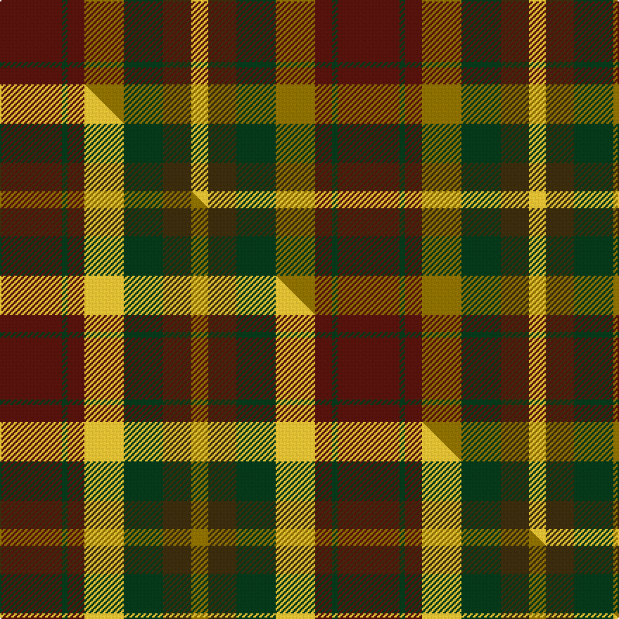

This is one **variant** — a specific cloth: this exact thread count and colourway, with its own
provenance below. It is one weaving of the [sett](/setts/dr11dg1dr3y7dg7dy5ly3/) (the scale-free proportion — the
same cloth at any scale or shade), whose colour order is pattern [BGBGGGY](/stripes/bgbgggy/).

Part of the [Caledonian Maple](/tartans/caledonian-maple/) tartan — the named design grouping this sett with its other cloths.

Sourced from tartans-authority.  It is a [7 stripe tartan](/stripes/stripes7/).

Original link [https://www.tartanregister.gov.uk/tartanDetails.aspx?ref=3782](https://www.tartanregister.gov.uk/tartanDetails.aspx?ref=3782)

Dataset <small>— provenance for this record, inherited from the source manifest</small>

<dl class="dataset-prov">
<dt>source</dt><dd><a href="/sources/tartans-authority/">Scottish Tartans Authority</a></dd>
<dt>data captured from</dt><dd><a href="https://github.com/thetartan/tartan-database/blob/master/data/tartans-authority/data.csv">https://github.com/thetartan/tartan-database/blob/master/data/tartans-authority/data.csv</a></dd>
<dt>data date</dt><dd>pre 2002 <small>(this record)</small></dd>
<dt>licence</dt><dd><a href="https://creativecommons.org/licenses/by-nc-nd/4.0/">CC BY-NC-ND 4.0</a></dd>
</dl>

Capture chain <small>— the hands this data passed through, oldest first; each capture carries its own licence</small>

<ol class="capture-chain">
<li><a href="https://www.tartansauthority.com/">Scottish Tartans Authority</a> <small>the heritage body's archive — its tartan-ferret record browser is retired (links repaired to the SRT, above)</small></li>
<li><a href="https://github.com/thetartan/tartan-database">thetartan/tartan-database</a> <small>2016-2017</small> · <a href="https://creativecommons.org/licenses/by-nc-nd/4.0/">CC BY-NC-ND 4.0</a> <small>Levko Kravets's frozen compilation — the capture we vendored, and where its CC licence text came from</small></li>
<li>this dictionary <small>captured 2026-06-10 · commit 5bf86c7566</small> <small>each re-capture is a git commit to data/sources</small></li>
</ol>

## Register references

External register numbers recorded for this tartan.

- Scottish Tartans Authority (ITI): 3782

## Thread count
DR/44 DG4 DR12 Y28 DG28 DY20 LY/12

One full sett is **240 threads**.

## Palette
<table><thead><tr><th>Colour</th><th>Shade</th><th>OKLCh</th></tr></thead><tbody><tr><td>DR</td><td><code style="background-color:#55120C;">#55120C</code> <small style="color:#888">#55120C</small></td><td><small style="color:#888">oklch(30.0% 0.099 29.3)</small></td></tr><tr><td>LY</td><td><code style="background-color:#DCBC32;">#DCBC32</code> <small style="color:#888">#DCBC32</small></td><td><small style="color:#888">oklch(80.0% 0.150 95.2)</small></td></tr><tr><td>DG</td><td><code style="background-color:#053819;">#053819</code> <small style="color:#888">#053819</small></td><td><small style="color:#888">oklch(30.0% 0.075 151.3)</small></td></tr><tr><td>Y</td><td><code style="background-color:#8B6E00;">#8B6E00</code> <small style="color:#888">#8B6E00</small></td><td><small style="color:#888">oklch(55.1% 0.113 90.4)</small></td></tr><tr><td>DY</td><td><code style="background-color:#3A2B0D;">#3A2B0D</code> <small style="color:#888">#3A2B0D</small></td><td><small style="color:#888">oklch(30.0% 0.049 82.0)</small></td></tr></tbody></table>

# Sample pattern

## Compared to the master

This cloth is one sett of its design; the master sett (the exemplar the design is anchored on) is below for comparison.

Its **ΔTartan distance** from the master is **1.13** — the same measure the nearest-tartans table ranks by (0 is identical; a re-scale of the same cloth is near 0, a recolour or a different proportion further).

<figure class="master-compare" style="margin:0">

this sett
master sett ★

<figcaption style="color:#888;font-size:smaller">One weave of this sett against the <a href="/setts/dr11dg1dr3ly7dg7dy5y3/">master sett ★</a>, split on the diagonal: a shared proportion runs seamlessly across it with only the shades shifting; a different proportion breaks on it.</figcaption>
</figure>

## Nearest tartan variants

The nearest existing variants by ΔTartan distance, with this cloth at the top so the swatches line up against it.

ΔTartan

Threads

Variant

Sett

—

240

<a href="/variants/s7/dr11dg1dr3y7dg7dy5ly3~x4/">Caledonian Maple (Fashion)</a>

<a href="/ttd/edit/#slug=dr11dg1dr3ly7dg7dy5y3~x4&amp;base=dr11dg1dr3y7dg7dy5ly3~x4" title="compare in the TTD">1.13</a>

240

<a href="/variants/s7/dr11dg1dr3ly7dg7dy5y3~x4/">Caledonian Maple</a>

<a href="/ttd/edit/#slug=dr4g46dr10db10dy33db5dy4ly3~x2&amp;base=dr11dg1dr3y7dg7dy5ly3~x4" title="compare in the TTD">2.80</a>

446

<a href="/variants/s8/dr4g46dr10db10dy33db5dy4ly3~x2/">State Seal of Minnesota (Fashion)</a>

<a href="/ttd/edit/#slug=lo3do2dr14dg17do14lo8dr14do2lo3~x2~do1001060-dg1403171&amp;base=dr11dg1dr3y7dg7dy5ly3~x4" title="compare in the TTD">3.42</a>

296

<a href="/variants/s9/lo3dg2dr14dgi17dg14lo8dr14dg2lo3~x2~dg1001060-dgi1403171/">Monaghan Irish County Tartan</a>

<a href="/ttd/edit/#slug=dr5lo1dr5g9do5dy4dr7r2~x4~dr1305012-r1606028&amp;base=dr11dg1dr3y7dg7dy5ly3~x4" title="compare in the TTD">3.46</a>

276

<a href="/variants/s8/dr5lo1dr5g9do5dy4dr7r2~x4~dr1305012-r1606028/">Leighton (Personal)</a>

<a href="/ttd/edit/#slug=dr20lo4dr20g35do20dy16dr28r8~dr1305012-r1606028&amp;base=dr11dg1dr3y7dg7dy5ly3~x4" title="compare in the TTD">3.52</a>

274

<a href="/variants/s8/dr20lo4dr20g35do20dy16dr28r8~dr1305012-r1606028/">Leighton (Personal)</a>

<a href="/ttd/edit/#slug=do3dy1lr1do1dy3do3lr3y6dp1~x6~do1301000-lr3100000&amp;base=dr11dg1dr3y7dg7dy5ly3~x4" title="compare in the TTD">3.55</a>

240

<a href="/variants/s9/do3dy1lr1do1dy3do3lr3y6dp1~x6~do1301000-lr3100000/">Toorak Chapler</a>

<a href="/ttd/edit/#slug=dg2dr12db11ly6dy6dr12dg2~x2&amp;base=dr11dg1dr3y7dg7dy5ly3~x4" title="compare in the TTD">3.60</a>

196

<a href="/variants/s7/dg2dr12db11ly6dy6dr12dg2~x2/">Heather MacRae</a>

<a href="/ttd/edit/#slug=o5lo3o19do6lo5do6dg12n5dg12n3~x2&amp;base=dr11dg1dr3y7dg7dy5ly3~x4" title="compare in the TTD">3.61</a>

288

<a href="/variants/s10/o5lo3o19do6lo5do6dg12n5dg12n3~x2/">Roscommon Irish County Tartan</a>

<a href="/ttd/edit/#slug=dy22y22dr2lb6dr2lo2dr16dg5dy8lb2~x2&amp;base=dr11dg1dr3y7dg7dy5ly3~x4" title="compare in the TTD">3.70</a>

300

<a href="/variants/s10/dy22y22dr2lb6dr2lo2dr16dg5dy8lb2~x2/">Bruce of Kinnaird (Vivienne Westwood Design)</a>

<a href="/ttd/edit/#slug=g3n16dy11n2lo11n2lo11n2dy11n16w3~x2~dy1502083-lo2806085&amp;base=dr11dg1dr3y7dg7dy5ly3~x4" title="compare in the TTD">3.86</a>

340

<a href="/variants/s11/g3n16dy11n2ly11n2ly11n2dy11n16w3~x2~dy1502083-ly2806085/">Harmony 14</a>

## Neighbour map

Every grey dot is one of 13621 variants placed by the first two principal components of the ΔTartan feature space (42% of its variance). Red is this tartan; blue dots are its nearest — click one to open its page.

<svg viewBox="0 0 640 380" role="img" style="max-width:100%;height:auto;border:1px solid #e0e0e0;border-radius:4px;display:block" xmlns="http://www.w3.org/2000/svg"><image href="/nn/cloud.v1.png" width="640" height="380"/><a href="/variants/s7/dr11dg1dr3ly7dg7dy5y3~x4/"><circle cx="195.8" cy="236.5" r="4" fill="#3465a4"><title>Caledonian Maple</title></circle></a><a href="/variants/s8/dr4g46dr10db10dy33db5dy4ly3~x2/"><circle cx="276.5" cy="191.7" r="4" fill="#3465a4"><title>State Seal of Minnesota (Fashion)</title></circle></a><a href="/variants/s9/lo3dg2dr14dgi17dg14lo8dr14dg2lo3~x2~dg1001060-dgi1403171/"><circle cx="218.0" cy="241.2" r="4" fill="#3465a4"><title>Monaghan Irish County Tartan</title></circle></a><a href="/variants/s8/dr5lo1dr5g9do5dy4dr7r2~x4~dr1305012-r1606028/"><circle cx="226.9" cy="236.6" r="4" fill="#3465a4"><title>Leighton (Personal)</title></circle></a><a href="/variants/s8/dr20lo4dr20g35do20dy16dr28r8~dr1305012-r1606028/"><circle cx="227.5" cy="238.9" r="4" fill="#3465a4"><title>Leighton (Personal)</title></circle></a><a href="/variants/s9/do3dy1lr1do1dy3do3lr3y6dp1~x6~do1301000-lr3100000/"><circle cx="178.5" cy="254.6" r="4" fill="#3465a4"><title>Toorak Chapler</title></circle></a><a href="/variants/s7/dg2dr12db11ly6dy6dr12dg2~x2/"><circle cx="236.7" cy="263.1" r="4" fill="#3465a4"><title>Heather MacRae</title></circle></a><a href="/variants/s10/o5lo3o19do6lo5do6dg12n5dg12n3~x2/"><circle cx="170.0" cy="239.1" r="4" fill="#3465a4"><title>Roscommon Irish County Tartan</title></circle></a><a href="/variants/s10/dy22y22dr2lb6dr2lo2dr16dg5dy8lb2~x2/"><circle cx="211.8" cy="189.8" r="4" fill="#3465a4"><title>Bruce of Kinnaird (Vivienne Westwood Design)</title></circle></a><a href="/variants/s11/g3n16dy11n2ly11n2ly11n2dy11n16w3~x2~dy1502083-ly2806085/"><circle cx="272.1" cy="241.3" r="4" fill="#3465a4"><title>Harmony 14</title></circle></a><circle cx="238.9" cy="251.3" r="5" fill="#c00000"/><text x="320" y="376" text-anchor="middle" font-size="11" fill="#999">ground</text><text x="11" y="190" text-anchor="middle" font-size="11" fill="#999" transform="rotate(-90 11 190)">complexity</text></svg>

ID: /variants/s7/dr11dg1dr3y7dg7dy5ly3~x4/
