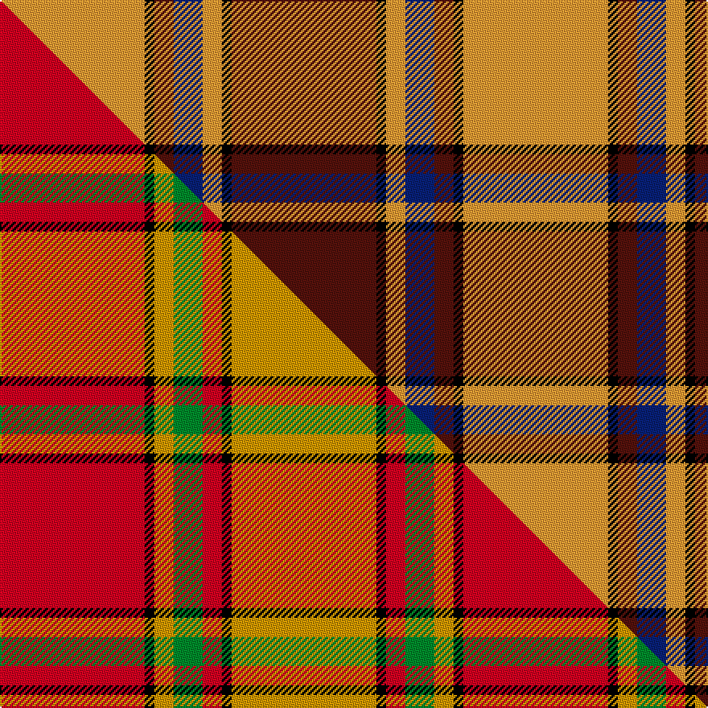

This page is one **sett** — a single exact thread-count. It belongs to the [tartan](/setts/dr15k1lo2db3dr2k1lo15/)
(the same proportion at any scale), whose colour order is pattern [BKYBBKY](/stripes/bkybbky/).

Part of the [Scrymgeour](/tartans/scrymgeour-2/) tartan — the named design grouping this sett with its other cloths.

Sourced from tartans-authority.  It is a [7 stripe tartan](/stripes/stripes7/).

Original link http://www.tartansauthority.com/tartan-ferret/display/1627/

## Register references

External register numbers recorded for this tartan.

- Scottish Tartans Authority (ITI): 1627

## Thread count
LO/90 K6 DR12 DB18 LO12 K6 DR/90

One full sett is **288 threads**.

## Palette
<table><thead><tr><th>Colour</th><th>Shade</th><th>OKLCh</th></tr></thead><tbody><tr><td>LO</td><td><code style="background-color:#FF9C34;">#FF9C34</code> <small style="color:#888">#FF9C34</small></td><td><small style="color:#888">oklch(77.9% 0.161 61.8)</small></td></tr><tr><td>DB</td><td><code style="background-color:#082077;">#082077</code> <small style="color:#888">#082077</small></td><td><small style="color:#888">oklch(30.0% 0.149 265.1)</small></td></tr><tr><td>K</td><td><code style="background-color:#000000;">#000000</code> <small style="color:#888">#000000</small></td><td><small style="color:#888">oklch(0.0% 0.000 0.0)</small></td></tr><tr><td>DR</td><td><code style="background-color:#55120C;">#55120C</code> <small style="color:#888">#55120C</small></td><td><small style="color:#888">oklch(30.0% 0.099 29.3)</small></td></tr></tbody></table>

# Sample pattern

## Compared to the master

This cloth is one sett of its design; the master sett (the exemplar the design is anchored on) is below for comparison.

Its **ΔTartan distance** from the master is **2.99** — the same measure the nearest-tartans table ranks by (0 is identical; a re-scale of the same cloth is near 0, a recolour or a different proportion further).

<figure class="master-compare" style="margin:0">

this sett
master sett ★

<figcaption style="color:#888;font-size:smaller">One weave of this sett against the <a href="/setts/r15k1lo2g3r2k1lo15/">master sett ★</a>, split on the diagonal: a shared proportion runs seamlessly across it with only the shades shifting; a different proportion breaks on it.</figcaption>
</figure>

## Nearest tartan variants

The nearest existing variants by ΔTartan distance, with this cloth at the top so the swatches line up against it.

ΔTartan

Threads

Variant

Sett

—

288

<a href="/variants/s7/dr15k1lo2db3dr2k1lo15~x6/">Scrymgeour (Clan)</a>

<a href="/ttd/edit/#slug=r2w8k14o25w2k2w2~x2&amp;base=dr15k1lo2db3dr2k1lo15~x6" title="compare in the TTD">2.45</a>

212

<a href="/variants/s7/r2w8k14o25w2k2w2~x2/">Merric, Dark Camel..</a>

<a href="/ttd/edit/#slug=k2r4w1r10g12r2w2~x4&amp;base=dr15k1lo2db3dr2k1lo15~x6" title="compare in the TTD">2.47</a>

248

<a href="/variants/s7/k2r4w1r10g12r2w2~x4/">Starr (1978) (Name)</a>

<a href="/ttd/edit/#slug=r1lb5k8o18lb1k1lb1~x4&amp;base=dr15k1lo2db3dr2k1lo15~x6" title="compare in the TTD">2.47</a>

272

<a href="/variants/s7/r1lb5k8o18lb1k1lb1~x4/">Merrick, Camel</a>

<a href="/ttd/edit/#slug=k1g6k1g6r16db1~x2&amp;base=dr15k1lo2db3dr2k1lo15~x6" title="compare in the TTD">2.51</a>

120

<a href="/variants/s6/k1g6k1g6r16db1~x2/">Denny, hunting</a>

<a href="/ttd/edit/#slug=dy15k1r2db3dy2k1r15~x4&amp;base=dr15k1lo2db3dr2k1lo15~x6" title="compare in the TTD">2.52</a>

192

<a href="/variants/s7/dy15k1r2db3dy2k1r15~x4/">Scrymgeour Family Tartan</a>

<a href="/ttd/edit/#slug=g4r2k2r20lb1k7r2g10r3k2~x2&amp;base=dr15k1lo2db3dr2k1lo15~x6" title="compare in the TTD">2.53</a>

200

<a href="/variants/s10/g4r2k2r20lb1k7r2g10r3k2~x2/">MacKillop (Scottish Tartan Society)</a>

<a href="/ttd/edit/#slug=r4k2r24k6db6g16r3~x2&amp;base=dr15k1lo2db3dr2k1lo15~x6" title="compare in the TTD">2.61</a>

230

<a href="/variants/s7/r4k2r24k6db6g16r3~x2/">MacDuff #4</a>

<a href="/ttd/edit/#slug=r10w2k10w10o35k5~x2&amp;base=dr15k1lo2db3dr2k1lo15~x6" title="compare in the TTD">2.63</a>

258

<a href="/variants/s6/r10w2k10w10o35k5~x2/">Loch Ness</a>

<a href="/ttd/edit/#slug=k6r2g17r16k1lb2~x2&amp;base=dr15k1lo2db3dr2k1lo15~x6" title="compare in the TTD">2.63</a>

160

<a href="/variants/s6/k6r2g17r16k1lb2~x2/">Unidentified #15</a>

<a href="/ttd/edit/#slug=lb2k2r27g27k12lb12r27k2lb2~x2&amp;base=dr15k1lo2db3dr2k1lo15~x6" title="compare in the TTD">2.66</a>

444

<a href="/variants/s9/lb2k2r27g27k12lb12r27k2lb2~x2/">MacNaughton</a>

## Neighbour map

Every grey dot is one of 13620 variants placed by the first two principal components of the ΔTartan feature space (42% of its variance). Red is this tartan; blue dots are its nearest — click one to open its page.

<svg viewBox="0 0 640 380" role="img" style="max-width:100%;height:auto;border:1px solid #e0e0e0;border-radius:4px;display:block" xmlns="http://www.w3.org/2000/svg"><image href="/nn/cloud.v1.png" width="640" height="380"/><a href="/variants/s7/r2w8k14o25w2k2w2~x2/"><circle cx="198.3" cy="151.2" r="4" fill="#3465a4"><title>Merric, Dark Camel..</title></circle></a><a href="/variants/s7/k2r4w1r10g12r2w2~x4/"><circle cx="238.8" cy="174.1" r="4" fill="#3465a4"><title>Starr (1978) (Name)</title></circle></a><a href="/variants/s7/r1lb5k8o18lb1k1lb1~x4/"><circle cx="257.3" cy="130.9" r="4" fill="#3465a4"><title>Merrick, Camel</title></circle></a><a href="/variants/s6/k1g6k1g6r16db1~x2/"><circle cx="299.3" cy="160.2" r="4" fill="#3465a4"><title>Denny, hunting</title></circle></a><a href="/variants/s7/dy15k1r2db3dy2k1r15~x4/"><circle cx="284.7" cy="156.9" r="4" fill="#3465a4"><title>Scrymgeour Family Tartan</title></circle></a><a href="/variants/s10/g4r2k2r20lb1k7r2g10r3k2~x2/"><circle cx="250.7" cy="119.5" r="4" fill="#3465a4"><title>MacKillop (Scottish Tartan Society)</title></circle></a><a href="/variants/s7/r4k2r24k6db6g16r3~x2/"><circle cx="233.0" cy="168.0" r="4" fill="#3465a4"><title>MacDuff #4</title></circle></a><a href="/variants/s6/r10w2k10w10o35k5~x2/"><circle cx="218.5" cy="156.0" r="4" fill="#3465a4"><title>Loch Ness</title></circle></a><a href="/variants/s6/k6r2g17r16k1lb2~x2/"><circle cx="210.5" cy="163.1" r="4" fill="#3465a4"><title>Unidentified #15</title></circle></a><a href="/variants/s9/lb2k2r27g27k12lb12r27k2lb2~x2/"><circle cx="206.9" cy="154.2" r="4" fill="#3465a4"><title>MacNaughton</title></circle></a><circle cx="244.4" cy="149.5" r="5" fill="#c00000"/><text x="320" y="376" text-anchor="middle" font-size="11" fill="#999">ground</text><text x="11" y="190" text-anchor="middle" font-size="11" fill="#999" transform="rotate(-90 11 190)">complexity</text></svg>

ID: /variants/s7/dr15k1lo2db3dr2k1lo15~x6/
