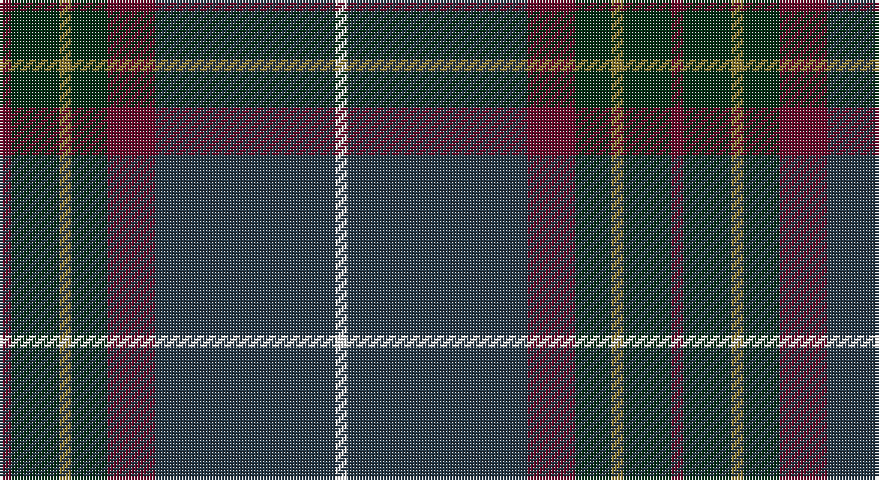

This page is one **sett** — a single exact thread-count. It belongs to the [tartan](/setts/dr1dg4y1dg3dr4dt15w1/)
(the same proportion at any scale), whose colour order is pattern [BGGGBBW](/stripes/bgggbbw/).

Part of the [Bressuire](/tartans/bressuire/) tartan — the named design grouping this sett with its other cloths.

Sourced from register-of-tartans.  It is a [7 stripe tartan](/stripes/stripes7/).

Original link https://www.tartanregister.gov.uk/tartanDetails.aspx?ref=10260

## Register references

External register numbers recorded for this tartan.

- Scottish Register of Tartans: [10260](https://www.tartanregister.gov.uk/tartanDetails.aspx?ref=10260)

## Thread count
DR/4 DG16 LT4 DG12 DR16 DN60 W/4

One full sett is **224 threads**.

## Palette

Palette: <strong>Tartan Register</strong> <small style="color:#888">(1 of 5 colours)</small>
<table><thead><tr><th>Colour</th><th>Threads</th><th>Shade</th><th>Base</th><th>OKLCh</th></tr></thead><tbody><tr><td>DR/</td><td style="text-align:right;font-variant-numeric:tabular-nums">4</td><td><code style="background-color:#680B2A;">#680B2A</code> <small style="color:#888">#680B2A</small></td><td>B <code style="background-color:#2A418A;">#2A418A</code></td><td><small style="color:#888">oklch(33.9% 0.125 8.8)</small></td></tr><tr><td>DG</td><td style="text-align:right;font-variant-numeric:tabular-nums">16</td><td><code style="background-color:#062E14;">#062E14</code> <small style="color:#888">#062E14</small></td><td>G <code style="background-color:#006100;">#006100</code></td><td><small style="color:#888">oklch(26.6% 0.065 150.8)</small></td></tr><tr><td>LT</td><td style="text-align:right;font-variant-numeric:tabular-nums">4</td><td><code style="background-color:#8E7C34;">#8E7C34</code> <small style="color:#888">#8E7C34</small></td><td>G <code style="background-color:#006100;">#006100</code></td><td><small style="color:#888">oklch(58.8% 0.094 95.3)</small></td></tr><tr><td>DG</td><td style="text-align:right;font-variant-numeric:tabular-nums">12</td><td><code style="background-color:#062E14;">#062E14</code> <small style="color:#888">#062E14</small></td><td>G <code style="background-color:#006100;">#006100</code></td><td><small style="color:#888">oklch(26.6% 0.065 150.8)</small></td></tr><tr><td>DR</td><td style="text-align:right;font-variant-numeric:tabular-nums">16</td><td><code style="background-color:#680B2A;">#680B2A</code> <small style="color:#888">#680B2A</small></td><td>B <code style="background-color:#2A418A;">#2A418A</code></td><td><small style="color:#888">oklch(33.9% 0.125 8.8)</small></td></tr><tr><td>DN</td><td style="text-align:right;font-variant-numeric:tabular-nums">60</td><td><code style="background-color:#283A48;">#283A48</code> <small style="color:#888">#283A48</small></td><td>B <code style="background-color:#2A418A;">#2A418A</code></td><td><small style="color:#888">oklch(33.9% 0.034 242.4)</small></td></tr><tr><td>W/</td><td style="text-align:right;font-variant-numeric:tabular-nums">4</td><td><code style="background-color:#FFFFFF;">#FFFFFF</code> <small style="color:#888">#FFFFFF</small></td><td>W <code style="background-color:#F7F7F7;">#F7F7F7</code></td><td><small style="color:#888">oklch(100.0% 0.000 89.9)</small></td></tr></tbody></table>

# Sample pattern

## Nearest tartans

The nearest existing variants by ΔTartan distance, with this tartan at the top so the swatches line up against it.

ΔTartan

Tartan

Sett

—

<a href="/ttd/edit/#slug=dr1dg4y1dg3dr4dt15w1~x4">Bressuire</a> <a class="nn-out" href="/variants/s7/dr1dg4y1dg3dr4dt15w1~x4/" title="open its dictionary page">↗</a>

0.94

<a href="/ttd/edit/#slug=n4o4n4k4n18k3do38w3~x2&amp;base=dr1dg4y1dg3dr4dt15w1~x4">Scotch Mist</a> <a class="nn-out" href="/variants/s8/n4o4n4k4n18k3do38w3~x2/" title="open its dictionary page">↗</a>

1.06

<a href="/ttd/edit/#slug=m4dg9w2dg24dt37r3~x2&amp;base=dr1dg4y1dg3dr4dt15w1~x4">Hardie (Name)</a> <a class="nn-out" href="/variants/s6/m4dg9w2dg24dt37r3~x2/" title="open its dictionary page">↗</a>

1.13

<a href="/ttd/edit/#slug=dr4dg27o2db25lo5dg3o3~x2&amp;base=dr1dg4y1dg3dr4dt15w1~x4">Kilkenny, County (District)</a> <a class="nn-out" href="/variants/s7/dr4dg27o2db25lo5dg3o3~x2/" title="open its dictionary page">↗</a>

1.22

<a href="/ttd/edit/#slug=lp4dy2dp4dy35n27r3~x2&amp;base=dr1dg4y1dg3dr4dt15w1~x4">Deeside, Royal</a> <a class="nn-out" href="/variants/s6/lp4dy2dp4dy35n27r3~x2/" title="open its dictionary page">↗</a>

1.28

<a href="/ttd/edit/#slug=y12db2r2db2dt26dg2y3dg3y24r4~x2&amp;base=dr1dg4y1dg3dr4dt15w1~x4">New South Wales Waratah</a> <a class="nn-out" href="/variants/s10/y12db2r2db2dt26dg2y3dg3y24r4~x2/" title="open its dictionary page">↗</a>

1.36

<a href="/ttd/edit/#slug=dt6o4dt2db25k30g2k2~x2&amp;base=dr1dg4y1dg3dr4dt15w1~x4">Passion of Scotland (Fashion)</a> <a class="nn-out" href="/variants/s7/dt6o4dt2db25k30g2k2~x2/" title="open its dictionary page">↗</a>

1.38

<a href="/ttd/edit/#slug=r4db10dg2db2dg24dp2dg2dp16dg2w1~x2&amp;base=dr1dg4y1dg3dr4dt15w1~x4">Kinfauns Castle</a> <a class="nn-out" href="/variants/s10/r4db10dg2db2dg24dp2dg2dp16dg2w1~x2/" title="open its dictionary page">↗</a>

1.41

<a href="/ttd/edit/#slug=r4dg4k2dg29db21k3db3ly3~x2&amp;base=dr1dg4y1dg3dr4dt15w1~x4">Peter of Lee (Chief) (Personal)</a> <a class="nn-out" href="/variants/s8/r4dg4k2dg29db21k3db3ly3~x2/" title="open its dictionary page">↗</a>

1.41

<a href="/ttd/edit/#slug=db50dg26k9dg4w2r2dg10~x2&amp;base=dr1dg4y1dg3dr4dt15w1~x4">Java St Andrew Society hunting</a> <a class="nn-out" href="/variants/s7/db50dg26k9dg4w2r2dg10~x2/" title="open its dictionary page">↗</a>

1.42

<a href="/ttd/edit/#slug=dp5db8dt13g21db34dt55o3&amp;base=dr1dg4y1dg3dr4dt15w1~x4">Bouncing Blackie (Personal)</a> <a class="nn-out" href="/variants/s7/dp5db8dt13g21db34dt55o3/" title="open its dictionary page">↗</a>

## Neighbour map

Every grey dot is one of 14360 variants placed by the first two principal components of the ΔTartan feature space (44% of its variance). Red is this tartan; blue dots are its nearest — click one to open its page.

<svg viewBox="0 0 640 380" role="img" style="max-width:100%;height:auto;border:1px solid #e0e0e0;border-radius:4px;display:block" xmlns="http://www.w3.org/2000/svg"><image href="/nn/cloud.v1.png" width="640" height="380"/><a href="/variants/s8/n4o4n4k4n18k3do38w3~x2/"><circle cx="329.7" cy="186.4" r="4" fill="#3465a4"><title>Scotch Mist</title></circle></a><a href="/variants/s6/m4dg9w2dg24dt37r3~x2/"><circle cx="333.8" cy="201.4" r="4" fill="#3465a4"><title>Hardie (Name)</title></circle></a><a href="/variants/s7/dr4dg27o2db25lo5dg3o3~x2/"><circle cx="282.7" cy="195.6" r="4" fill="#3465a4"><title>Kilkenny, County (District)</title></circle></a><a href="/variants/s6/lp4dy2dp4dy35n27r3~x2/"><circle cx="337.6" cy="188.7" r="4" fill="#3465a4"><title>Deeside, Royal</title></circle></a><a href="/variants/s10/y12db2r2db2dt26dg2y3dg3y24r4~x2/"><circle cx="323.5" cy="184.7" r="4" fill="#3465a4"><title>New South Wales Waratah</title></circle></a><a href="/variants/s7/dt6o4dt2db25k30g2k2~x2/"><circle cx="335.1" cy="211.3" r="4" fill="#3465a4"><title>Passion of Scotland (Fashion)</title></circle></a><a href="/variants/s10/r4db10dg2db2dg24dp2dg2dp16dg2w1~x2/"><circle cx="319.7" cy="154.0" r="4" fill="#3465a4"><title>Kinfauns Castle</title></circle></a><a href="/variants/s8/r4dg4k2dg29db21k3db3ly3~x2/"><circle cx="297.5" cy="177.0" r="4" fill="#3465a4"><title>Peter of Lee (Chief) (Personal)</title></circle></a><a href="/variants/s7/db50dg26k9dg4w2r2dg10~x2/"><circle cx="381.7" cy="196.4" r="4" fill="#3465a4"><title>Java St Andrew Society hunting</title></circle></a><a href="/variants/s7/dp5db8dt13g21db34dt55o3/"><circle cx="344.7" cy="218.9" r="4" fill="#3465a4"><title>Bouncing Blackie (Personal)</title></circle></a><circle cx="338.6" cy="194.3" r="5" fill="#c00000"/></svg>

ID: /variants/s7/dr1dg4y1dg3dr4dt15w1~x4/
