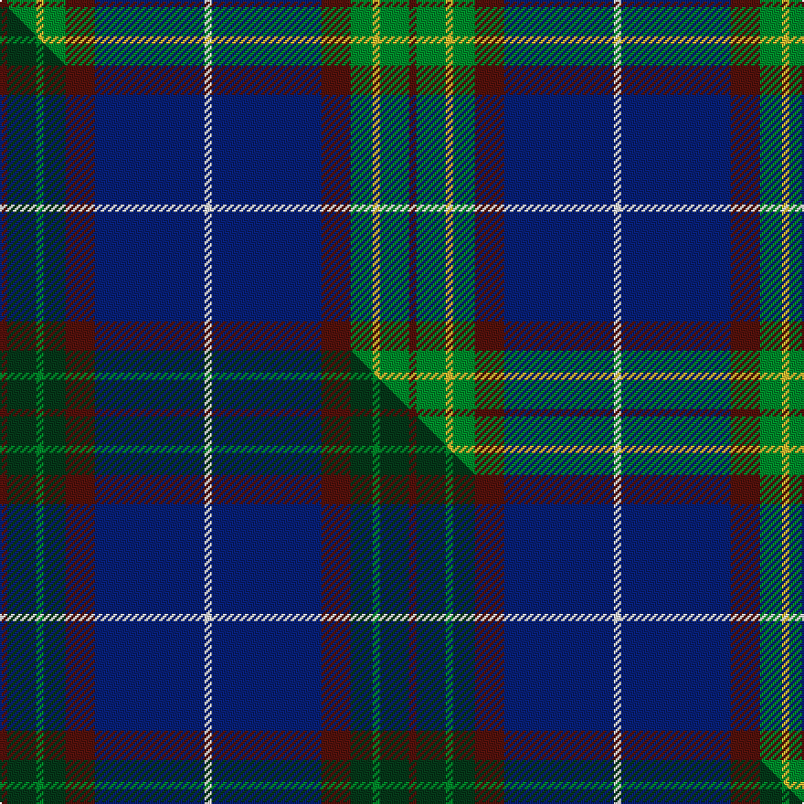

This is one **variant** — a specific cloth: this exact thread count and colourway, with its own
provenance below. It is one weaving of the [sett](/tartans/b/br/bressuire/) (the scale-free proportion — the
same cloth at any scale or shade), whose colour order is pattern [BGYGBBW](/stripes/bgygbbw/).

Part of the [Bressuire](/tartans/b/br/bressuire/) tartan — the named design grouping this sett with its other cloths.

Sourced from tartans-authority.  It is a [7 stripe tartan](/stripes/stripes7/).

Original link <code>http://www.tartansauthority.com/tartan-ferret/display/10260/</code> — retired · [Internet Archive copy](https://web.archive.org/web/*/http://www.tartansauthority.com/tartan-ferret/display/10260/*)

Dataset <small>— provenance for this record, inherited from the source manifest</small>

<dl class="dataset-prov">
<dt>source</dt><dd><a href="/sources/tartans-authority/">Scottish Tartans Authority</a></dd>
<dt>data captured from</dt><dd><a href="https://github.com/thetartan/tartan-database/blob/master/data/tartans-authority/data.csv">https://github.com/thetartan/tartan-database/blob/master/data/tartans-authority/data.csv</a></dd>
<dt>data date</dt><dd>1st March 2010 <small>(this record)</small></dd>
<dt>licence</dt><dd><a href="https://creativecommons.org/licenses/by-nc-nd/4.0/">CC BY-NC-ND 4.0</a></dd>
</dl>

Capture chain <small>— the hands this data passed through, oldest first; each capture carries its own licence</small>

<ol class="capture-chain">
<li><a href="https://www.tartansauthority.com/">Scottish Tartans Authority</a> <small>the heritage body’s archive — its tartan-ferret record browser is retired; dead record links are shown unlinked, with an Internet Archive copy (ITI numbers are not SRT references)</small></li>
<li><a href="https://github.com/thetartan/tartan-database">thetartan/tartan-database</a> <small>2016-2017</small> · <a href="https://creativecommons.org/licenses/by-nc-nd/4.0/">CC BY-NC-ND 4.0</a> <small>Levko Kravets's frozen compilation — the capture we vendored, and where its CC licence text came from</small></li>
<li>this dictionary <small>captured 2026-06-10 · commit 5bf86c7566</small> <small>each re-capture is a git commit to data/sources</small></li>
</ol>

## Register references

External register numbers recorded for this tartan.

- Scottish Register of Tartans: [10260](https://www.tartanregister.gov.uk/tartanDetails?ref=10260)
- Scottish Tartans Authority (ITI): 10260

## Thread count
DR/4 G16 LY4 G12 DR16 DB60 W/4

One full sett is **224 threads**.

## Palette
<table><thead><tr><th>Colour</th><th>Shade</th><th>OKLCh</th></tr></thead><tbody><tr><td>DR</td><td><code style="background-color:#55120C;">#55120C</code> <small style="color:#888">#55120C</small></td><td><small style="color:#888">oklch(30.0% 0.099 29.3)</small></td></tr><tr><td>LY</td><td><code style="background-color:#DCBC32;">#DCBC32</code> <small style="color:#888">#DCBC32</small></td><td><small style="color:#888">oklch(80.0% 0.150 95.2)</small></td></tr><tr><td>G</td><td><code style="background-color:#008B2A;">#008B2A</code> <small style="color:#888">#008B2A</small></td><td><small style="color:#888">oklch(55.4% 0.170 145.9)</small></td></tr><tr><td>W</td><td><code style="background-color:#F7F7F7;">#F7F7F7</code> <small style="color:#888">#F7F7F7</small></td><td><small style="color:#888">oklch(97.6% 0.000 89.9)</small></td></tr><tr><td>DB</td><td><code style="background-color:#082077;">#082077</code> <small style="color:#888">#082077</small></td><td><small style="color:#888">oklch(30.0% 0.149 265.1)</small></td></tr></tbody></table>

# Sample pattern

## Compared to the master

This cloth is one sett of its design; the master sett (the exemplar the design is anchored on) is below for comparison.

Its **ΔTartan distance** from the master is **0.39** — the same measure the nearest-tartans table ranks by (0 is identical; a re-scale of the same cloth is near 0, a recolour or a different proportion further).

<figure class="master-compare" style="margin:0">

this sett
master sett ★

<figcaption style="color:#888;font-size:smaller">One weave of this sett against the <a href="/setts/dr1dg4g1dg3dr4db15w1/">master sett ★</a>, split on the diagonal: a shared proportion runs seamlessly across it with only the shades shifting; a different proportion breaks on it.</figcaption>
</figure>

## Nearest tartan variants

The nearest existing variants by ΔTartan distance, with this cloth at the top so the swatches line up against it.

ΔTartan

Threads

Variant

Sett

—

224

<a href="/variants/s7/dr1g4ly1g3dr4db15w1~x4/">Bressuire (District)</a>

<a href="/ttd/edit/#slug=dr1dg4g1dg3dr4db15w1~x4&amp;base=dr1g4ly1g3dr4db15w1~x4" title="compare in the TTD">0.39</a>

224

<a href="/variants/s7/dr1dg4g1dg3dr4db15w1~x4/">Bressuire</a>

<a href="/ttd/edit/#slug=db20dr1w3dt1w2dt8g3w1~x4~db4510255-dt3306216&amp;base=dr1g4ly1g3dr4db15w1~x4" title="compare in the TTD">2.28</a>

228

<a href="/variants/s8/db20dr1w3dt1w2dt8g3w1~x4~db4510255-dt3306216/">Kruenaegel and Schropp</a>

<a href="/ttd/edit/#slug=db60ly3db5lyi5db9do20ly4g32w4~x2~ly6307084-lyi6614084&amp;base=dr1g4ly1g3dr4db15w1~x4" title="compare in the TTD">2.44</a>

440

<a href="/variants/s9/db60ly3db5lyi5db9do20ly4g32w4~x2~ly6307084-lyi6614084/">State Seal of Ohio (Fashion)</a>

<a href="/ttd/edit/#slug=w1db16y1dr3y1dg6g2dg6w1~x2&amp;base=dr1g4ly1g3dr4db15w1~x4" title="compare in the TTD">2.50</a>

144

<a href="/variants/s9/w1db16y1dr3y1dg6g2dg6w1~x2/">Kleto, Susan (Personal)</a>

<a href="/ttd/edit/#slug=y12dbi2y2dbi30db3dbi2db13w4~x2~dbi3911270-db1913264&amp;base=dr1g4ly1g3dr4db15w1~x4" title="compare in the TTD">2.52</a>

240

<a href="/variants/s8/y12dbi2y2dbi30db3dbi2db13w4~x2~dbi3911270-db1913264/">Highlands School, (North Carolina)</a>

<a href="/ttd/edit/#slug=w1db16ly1r3ly1dg6g2dg6w1~x2~dg4514144-g6019141&amp;base=dr1g4ly1g3dr4db15w1~x4" title="compare in the TTD">2.56</a>

144

<a href="/variants/s9/w1db16ly1r3ly1dg6g2dg6w1~x2~dg4514144-g6019141/">Kleto, Susan (Personal)</a>

<a href="/ttd/edit/#slug=w4db38g6dr2g6dr38ly2dr3~x2&amp;base=dr1g4ly1g3dr4db15w1~x4" title="compare in the TTD">2.60</a>

382

<a href="/variants/s8/w4db38g6dr2g6dr38ly2dr3~x2/">21st Century (Fashion)</a>

<a href="/ttd/edit/#slug=w4db38g6dr2g6dr36y2dr3~x2&amp;base=dr1g4ly1g3dr4db15w1~x4" title="compare in the TTD">2.63</a>

374

<a href="/variants/s8/w4db38g6dr2g6dr36y2dr3~x2/">Scotland 2000</a>

<a href="/ttd/edit/#slug=y21g26db62w2dg2w2&amp;base=dr1g4ly1g3dr4db15w1~x4" title="compare in the TTD">2.63</a>

207

<a href="/variants/s6/y21g26db62w2dg2w2/">Nynashamn Whisky Society (Corporate)</a>

<a href="/ttd/edit/#slug=dr5y2dr35g6dr2g6db38w4~x2&amp;base=dr1g4ly1g3dr4db15w1~x4" title="compare in the TTD">2.64</a>

374

<a href="/variants/s8/dr5y2dr35g6dr2g6db38w4~x2/">Scotland 2000</a>

## Neighbour map

Every grey dot is one of 13662 variants placed by the first two principal components of the ΔTartan feature space (42% of its variance). Red is this tartan; blue dots are its nearest — click one to open its page. The map is a flat projection of a many-dimensional space — [how to read it](/posts/neighbourhood-maps/).

<svg viewBox="0 0 640 380" role="img" style="max-width:100%;height:auto;border:1px solid #e0e0e0;border-radius:4px;display:block" xmlns="http://www.w3.org/2000/svg"><image href="/nn/cloud.v1.png" width="640" height="380"/><a href="/variants/s7/dr1dg4g1dg3dr4db15w1~x4/"><circle cx="353.3" cy="191.1" r="4" fill="#3465a4"><title>Bressuire</title></circle></a><a href="/variants/s8/db20dr1w3dt1w2dt8g3w1~x4~db4510255-dt3306216/"><circle cx="314.5" cy="156.5" r="4" fill="#3465a4"><title>Kruenaegel and Schropp</title></circle></a><a href="/variants/s9/db60ly3db5lyi5db9do20ly4g32w4~x2~ly6307084-lyi6614084/"><circle cx="300.6" cy="146.5" r="4" fill="#3465a4"><title>State Seal of Ohio (Fashion)</title></circle></a><a href="/variants/s9/w1db16y1dr3y1dg6g2dg6w1~x2/"><circle cx="259.7" cy="157.9" r="4" fill="#3465a4"><title>Kleto, Susan (Personal)</title></circle></a><a href="/variants/s8/y12dbi2y2dbi30db3dbi2db13w4~x2~dbi3911270-db1913264/"><circle cx="320.7" cy="189.4" r="4" fill="#3465a4"><title>Highlands School, (North Carolina)</title></circle></a><a href="/variants/s9/w1db16ly1r3ly1dg6g2dg6w1~x2~dg4514144-g6019141/"><circle cx="213.6" cy="138.7" r="4" fill="#3465a4"><title>Kleto, Susan (Personal)</title></circle></a><a href="/variants/s8/w4db38g6dr2g6dr38ly2dr3~x2/"><circle cx="300.1" cy="158.5" r="4" fill="#3465a4"><title>21st Century (Fashion)</title></circle></a><a href="/variants/s8/w4db38g6dr2g6dr36y2dr3~x2/"><circle cx="300.9" cy="161.5" r="4" fill="#3465a4"><title>Scotland 2000</title></circle></a><a href="/variants/s6/y21g26db62w2dg2w2/"><circle cx="344.1" cy="156.0" r="4" fill="#3465a4"><title>Nynashamn Whisky Society (Corporate)</title></circle></a><a href="/variants/s8/dr5y2dr35g6dr2g6db38w4~x2/"><circle cx="301.7" cy="164.0" r="4" fill="#3465a4"><title>Scotland 2000</title></circle></a><circle cx="303.2" cy="176.3" r="5" fill="#c00000"/><text x="320" y="376" text-anchor="middle" font-size="11" fill="#999">ground</text><text x="11" y="190" text-anchor="middle" font-size="11" fill="#999" transform="rotate(-90 11 190)">complexity</text></svg>

ID: /variants/s7/dr1g4ly1g3dr4db15w1~x4/
