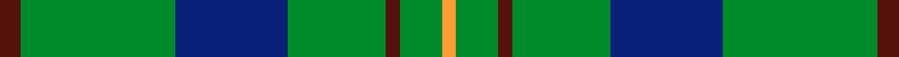

This page is one **sett** — a single exact thread-count. It belongs to the [tartan](/setts/dr3g22db16g14dr2g6lo2/)
(the same proportion at any scale), whose colour order is pattern [BGBGBGY](/stripes/bgbgbgy/).

Part of the [Scottish Scouts](/tartans/scottish-scouts/) tartan — the named design grouping this sett with its other cloths.

Sourced from tartans-authority.  It is a [7 stripe tartan](/stripes/stripes7/).

Original link [https://www.tartanregister.gov.uk/tartanDetails.aspx?ref=1463](https://www.tartanregister.gov.uk/tartanDetails.aspx?ref=1463)

Dataset <small>— provenance for this record, inherited from the source manifest</small>

<dl class="dataset-prov">
<dt>source</dt><dd><a href="/sources/tartans-authority/">Scottish Tartans Authority</a></dd>
<dt>data captured from</dt><dd><a href="https://github.com/thetartan/tartan-database/blob/master/data/tartans-authority/data.csv">https://github.com/thetartan/tartan-database/blob/master/data/tartans-authority/data.csv</a></dd>
<dt>data date</dt><dd>1957 circa <small>(this record)</small></dd>
<dt>licence</dt><dd><a href="https://creativecommons.org/licenses/by-nc-nd/4.0/">CC BY-NC-ND 4.0</a></dd>
</dl>

Capture chain <small>— the hands this data passed through, oldest first; each capture carries its own licence</small>

<ol class="capture-chain">
<li><a href="https://www.tartansauthority.com/">Scottish Tartans Authority</a> <small>the heritage body's archive — its tartan-ferret record browser is retired (links repaired to the SRT, above)</small></li>
<li><a href="https://github.com/thetartan/tartan-database">thetartan/tartan-database</a> <small>2016-2017</small> · <a href="https://creativecommons.org/licenses/by-nc-nd/4.0/">CC BY-NC-ND 4.0</a> <small>Levko Kravets's frozen compilation — the capture we vendored, and where its CC licence text came from</small></li>
<li>this dictionary <small>captured 2026-06-10 · commit 5bf86c7566</small> <small>each re-capture is a git commit to data/sources</small></li>
</ol>

## Register references

External register numbers recorded for this tartan.

- Scottish Tartans Authority (ITI): 1463

## Thread count
DR/6 G44 DB32 G28 DR4 G12 LO/4

One full sett is **250 threads**.

## Palette
<table><thead><tr><th>Colour</th><th>Shade</th><th>OKLCh</th></tr></thead><tbody><tr><td>DB</td><td><code style="background-color:#082077;">#082077</code> <small style="color:#888">#082077</small></td><td><small style="color:#888">oklch(30.0% 0.149 265.1)</small></td></tr><tr><td>DR</td><td><code style="background-color:#55120C;">#55120C</code> <small style="color:#888">#55120C</small></td><td><small style="color:#888">oklch(30.0% 0.099 29.3)</small></td></tr><tr><td>LO</td><td><code style="background-color:#FF9C34;">#FF9C34</code> <small style="color:#888">#FF9C34</small></td><td><small style="color:#888">oklch(77.9% 0.161 61.8)</small></td></tr><tr><td>G</td><td><code style="background-color:#008B2A;">#008B2A</code> <small style="color:#888">#008B2A</small></td><td><small style="color:#888">oklch(55.4% 0.170 145.9)</small></td></tr></tbody></table>

# Sample pattern

## Nearest tartan variants

The nearest existing variants by ΔTartan distance, with this cloth at the top so the swatches line up against it.

ΔTartan

Threads

Variant

Sett

—

250

<a href="/variants/s7/dr3g22db16g14dr2g6lo2~x2/">Scottish Scouts (1957) (Corporate)</a>

<a href="/ttd/edit/#slug=r3g22db16g14r2g6y1~x2&amp;base=dr3g22db16g14dr2g6lo2~x2" title="compare in the TTD">0.80</a>

248

<a href="/variants/s7/r3g22db16g14r2g6y1~x2/">Scottish Scouts</a>

<a href="/ttd/edit/#slug=r3g10r3g14db16g3y2~x2&amp;base=dr3g22db16g14dr2g6lo2~x2" title="compare in the TTD">1.22</a>

194

<a href="/variants/s7/r3g10r3g14db16g3y2~x2/">Cameron of Lochiel (Hunting)</a>

<a href="/ttd/edit/#slug=r3g10r3g14db16g3y2&amp;base=dr3g22db16g14dr2g6lo2~x2" title="compare in the TTD">1.22</a>

97

<a href="/variants/s7/r3g10r3g14db16g3y2/">Cameron Hunting</a>

<a href="/ttd/edit/#slug=r3g10r3g14db16g3dy2~x2&amp;base=dr3g22db16g14dr2g6lo2~x2" title="compare in the TTD">1.22</a>

194

<a href="/variants/s7/r3g10r3g14db16g3dy2~x2/">Cameron Hunting Clan Tartan</a>

<a href="/ttd/edit/#slug=r5g20r5g20db24g6y4&amp;base=dr3g22db16g14dr2g6lo2~x2" title="compare in the TTD">1.24</a>

159

<a href="/variants/s7/r5g20r5g20db24g6y4/">Cameron of Lochiel (Hunting) Clan/Family Tartan</a>

<a href="/ttd/edit/#slug=g4r1g15t5r1w5g4r1~x4&amp;base=dr3g22db16g14dr2g6lo2~x2" title="compare in the TTD">1.41</a>

268

<a href="/variants/s8/g4r1g15t5r1w5g4r1~x4/">McGirr (Letterkenny) David, (Pers.)</a>

<a href="/ttd/edit/#slug=g40dr3g4dr3g12db32lo4dr3~x2&amp;base=dr3g22db16g14dr2g6lo2~x2" title="compare in the TTD">1.57</a>

318

<a href="/variants/s8/g40dr3g4dr3g12db32lo4dr3~x2/">Leatherneck</a>

<a href="/ttd/edit/#slug=g40r3g4r3g12db32lo4r3~x2&amp;base=dr3g22db16g14dr2g6lo2~x2" title="compare in the TTD">1.57</a>

318

<a href="/variants/s8/g40r3g4r3g12db32lo4r3~x2/">US Marine Corps</a>

<a href="/ttd/edit/#slug=dy21g28db24g72w16g20&amp;base=dr3g22db16g14dr2g6lo2~x2" title="compare in the TTD">1.63</a>

321

<a href="/variants/s6/dy21g28db24g72w16g20/">Meath County, Crest Range</a>

<a href="/ttd/edit/#slug=ly21g28db24g72w16g20&amp;base=dr3g22db16g14dr2g6lo2~x2" title="compare in the TTD">1.63</a>

321

<a href="/variants/s6/ly21g28db24g72w16g20/">Meath County Crest (Fashion)</a>

## Neighbour map

Every grey dot is one of 13621 variants placed by the first two principal components of the ΔTartan feature space (42% of its variance). Red is this tartan; blue dots are its nearest — click one to open its page.

<svg viewBox="0 0 640 380" role="img" style="max-width:100%;height:auto;border:1px solid #e0e0e0;border-radius:4px;display:block" xmlns="http://www.w3.org/2000/svg"><image href="/nn/cloud.v1.png" width="640" height="380"/><a href="/variants/s7/r3g22db16g14r2g6y1~x2/"><circle cx="396.7" cy="189.7" r="4" fill="#3465a4"><title>Scottish Scouts</title></circle></a><a href="/variants/s7/r3g10r3g14db16g3y2~x2/"><circle cx="279.2" cy="231.2" r="4" fill="#3465a4"><title>Cameron of Lochiel (Hunting)</title></circle></a><a href="/variants/s7/r3g10r3g14db16g3y2/"><circle cx="279.2" cy="231.2" r="4" fill="#3465a4"><title>Cameron Hunting</title></circle></a><a href="/variants/s7/r3g10r3g14db16g3dy2~x2/"><circle cx="277.5" cy="230.5" r="4" fill="#3465a4"><title>Cameron Hunting Clan Tartan</title></circle></a><a href="/variants/s7/r5g20r5g20db24g6y4/"><circle cx="273.8" cy="249.5" r="4" fill="#3465a4"><title>Cameron of Lochiel (Hunting) Clan/Family Tartan</title></circle></a><a href="/variants/s8/g4r1g15t5r1w5g4r1~x4/"><circle cx="369.6" cy="190.9" r="4" fill="#3465a4"><title>McGirr (Letterkenny) David, (Pers.)</title></circle></a><a href="/variants/s8/g40dr3g4dr3g12db32lo4dr3~x2/"><circle cx="351.2" cy="196.4" r="4" fill="#3465a4"><title>Leatherneck</title></circle></a><a href="/variants/s8/g40r3g4r3g12db32lo4r3~x2/"><circle cx="321.8" cy="177.6" r="4" fill="#3465a4"><title>US Marine Corps</title></circle></a><a href="/variants/s6/dy21g28db24g72w16g20/"><circle cx="333.2" cy="282.6" r="4" fill="#3465a4"><title>Meath County, Crest Range</title></circle></a><a href="/variants/s6/ly21g28db24g72w16g20/"><circle cx="336.5" cy="285.6" r="4" fill="#3465a4"><title>Meath County Crest (Fashion)</title></circle></a><circle cx="387.2" cy="233.6" r="5" fill="#c00000"/><text x="320" y="376" text-anchor="middle" font-size="11" fill="#999">ground</text><text x="11" y="190" text-anchor="middle" font-size="11" fill="#999" transform="rotate(-90 11 190)">complexity</text></svg>

ID: /variants/s7/dr3g22db16g14dr2g6lo2~x2/
