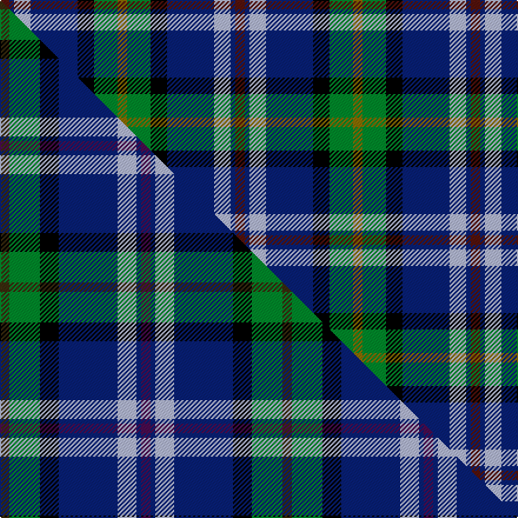

This is one **variant** — a specific cloth: this exact thread count and colourway, with its own
provenance below. It is one weaving of the [sett](/tartans/r/re/renfrewshire/) (the scale-free proportion — the
same cloth at any scale or shade), whose colour order is pattern [BBWBKGG](/stripes/bbwbkgg/).

Part of the [Renfrewshire](/tartans/r/re/renfrewshire/) tartan — the named design grouping this sett with its other cloths.

Sourced from house-of-tartan.  It is a [7 stripe tartan](/stripes/stripes7/).

Original link [http://www.house-of-tartan.scotland.net/house/TartanViewjs.asp?colr=Def&tnam=2560](http://www.house-of-tartan.scotland.net/house/TartanViewjs.asp?colr=Def&tnam=2560)

## Provenance

Earliest known date: 1998 Designed for anyone residing in the County of Renfrewshire

Dataset <small>— provenance for this record, inherited from the source manifest</small>

<dl class="dataset-prov">
<dt>source</dt><dd><a href="/sources/house-of-tartan/">House of Tartan</a></dd>
<dt>data captured from</dt><dd><a href="https://github.com/thetartan/tartan-database/blob/master/data/house-of-tartan/data.csv">https://github.com/thetartan/tartan-database/blob/master/data/house-of-tartan/data.csv</a></dd>
<dt>data date</dt><dd>1998 <small>(this record)</small></dd>
<dt>licence</dt><dd><a href="https://creativecommons.org/licenses/by-nc-nd/4.0/">CC BY-NC-ND 4.0</a></dd>
</dl>

Capture chain <small>— the hands this data passed through, oldest first; each capture carries its own licence</small>

<ol class="capture-chain">
<li><a href="http://www.house-of-tartan.scotland.net/">House of Tartan</a> <small>the weaver/retailer's database — the site is now offline; the URL is kept as the ultimate source's identity</small></li>
<li><a href="https://github.com/thetartan/tartan-database">thetartan/tartan-database</a> <small>2016-2017</small> · <a href="https://creativecommons.org/licenses/by-nc-nd/4.0/">CC BY-NC-ND 4.0</a> <small>Levko Kravets's frozen compilation — the capture we vendored, and where its CC licence text came from</small></li>
<li>this dictionary <small>captured 2026-06-10 · commit 5bf86c7566</small> <small>each re-capture is a git commit to data/sources</small></li>
</ol>

## Thread count
DR/8 DB4 LB14 DB40 K14 G20 Y/8

One full sett is **200 threads**.

## Palette
<table><thead><tr><th>Colour</th><th>Shade</th><th>OKLCh</th></tr></thead><tbody><tr><td>LB</td><td><code style="background-color:#B5BBDE;">#B5BBDE</code> <small style="color:#888">#B5BBDE</small></td><td><small style="color:#888">oklch(79.9% 0.050 277.6)</small></td></tr><tr><td>DB</td><td><code style="background-color:#082077;">#082077</code> <small style="color:#888">#082077</small></td><td><small style="color:#888">oklch(30.0% 0.149 265.1)</small></td></tr><tr><td>G</td><td><code style="background-color:#008B2A;">#008B2A</code> <small style="color:#888">#008B2A</small></td><td><small style="color:#888">oklch(55.4% 0.170 145.9)</small></td></tr><tr><td>K</td><td><code style="background-color:#000000;">#000000</code> <small style="color:#888">#000000</small></td><td><small style="color:#888">oklch(0.0% 0.000 0.0)</small></td></tr><tr><td>DR</td><td><code style="background-color:#55120C;">#55120C</code> <small style="color:#888">#55120C</small></td><td><small style="color:#888">oklch(30.0% 0.099 29.3)</small></td></tr><tr><td>Y</td><td><code style="background-color:#8B6E00;">#8B6E00</code> <small style="color:#888">#8B6E00</small></td><td><small style="color:#888">oklch(55.1% 0.113 90.4)</small></td></tr></tbody></table>

# Sample pattern

## Compared to the master

This cloth is one sett of its design; the master sett (the exemplar the design is anchored on) is below for comparison.

Its **ΔTartan distance** from the master is **0.57** — the same measure the nearest-tartans table ranks by (0 is identical; a re-scale of the same cloth is near 0, a recolour or a different proportion further).

<figure class="master-compare" style="margin:0">

this sett
master sett ★

<figcaption style="color:#888;font-size:smaller">One weave of this sett against the <a href="/setts/dy4g13k8db25lb8db2dp4/">master sett ★</a>, split on the diagonal: a shared proportion runs seamlessly across it with only the shades shifting; a different proportion breaks on it.</figcaption>
</figure>

## Nearest tartan variants

The nearest existing variants by ΔTartan distance, with this cloth at the top so the swatches line up against it.

ΔTartan

Threads

Variant

Sett

—

200

<a href="/variants/s7/dr4db2lb7db20k7g10y4~x2/">Renfrewshire District Tartan</a>

<a href="/ttd/edit/#slug=dp4db2lb8db25k8g13y4~x2&amp;base=dr4db2lb7db20k7g10y4~x2" title="compare in the TTD">0.55</a>

240

<a href="/variants/s7/dp4db2lb8db25k8g13y4~x2/">Renfrewshire Tartan</a>

<a href="/ttd/edit/#slug=dy4g13k8db25lb8db2dp4~x2&amp;base=dr4db2lb7db20k7g10y4~x2" title="compare in the TTD">0.57</a>

240

<a href="/variants/s7/dy4g13k8db25lb8db2dp4~x2/">Renfrewshire</a>

<a href="/ttd/edit/#slug=db31b4db5k19g20y4~x2&amp;base=dr4db2lb7db20k7g10y4~x2" title="compare in the TTD">0.97</a>

262

<a href="/variants/s6/db31b4db5k19g20y4~x2/">Midlothian</a>

<a href="/ttd/edit/#slug=dp11db2lb4db21k16g19y4~x2&amp;base=dr4db2lb7db20k7g10y4~x2" title="compare in the TTD">0.97</a>

278

<a href="/variants/s7/dp11db2lb4db21k16g19y4~x2/">Ayrshire (International Tartans)</a>

<a href="/ttd/edit/#slug=db31t4db5k19g20lo4~x2&amp;base=dr4db2lb7db20k7g10y4~x2" title="compare in the TTD">1.27</a>

262

<a href="/variants/s6/db31t4db5k19g20lo4~x2/">Midlothian</a>

<a href="/ttd/edit/#slug=lb6db17dp4db2k11g3lo4~x2&amp;base=dr4db2lb7db20k7g10y4~x2" title="compare in the TTD">1.84</a>

168

<a href="/variants/s7/lb6db17dp4db2k11g3lo4~x2/">East Lothian</a>

<a href="/ttd/edit/#slug=db22r3db2r3db2k17g18ly4~x2&amp;base=dr4db2lb7db20k7g10y4~x2" title="compare in the TTD">2.04</a>

232

<a href="/variants/s8/db22r3db2r3db2k17g18ly4~x2/">Scotch House 2000 Original</a>

<a href="/ttd/edit/#slug=r10k18lb10db18g40y5&amp;base=dr4db2lb7db20k7g10y4~x2" title="compare in the TTD">2.09</a>

187

<a href="/variants/s6/r10k18lb10db18g40y5/">Gallowater</a>

<a href="/ttd/edit/#slug=db15k10n30dy11w3lb5~x2&amp;base=dr4db2lb7db20k7g10y4~x2" title="compare in the TTD">2.18</a>

256

<a href="/variants/s6/db15k10n30dy11w3lb5~x2/">McHale, Barry</a>

<a href="/ttd/edit/#slug=r3db24k7dbi11g11y2~x2~db1404245-dbi1406275&amp;base=dr4db2lb7db20k7g10y4~x2" title="compare in the TTD">2.22</a>

222

<a href="/variants/s6/r3db24k7dbi11g11y2~x2~db1404245-dbi1406275/">Cowie</a>

## Neighbour map

Every grey dot is one of 13657 variants placed by the first two principal components of the ΔTartan feature space (42% of its variance). Red is this tartan; blue dots are its nearest — click one to open its page. The map is a flat projection of a many-dimensional space — [how to read it](/posts/neighbourhood-maps/).

<svg viewBox="0 0 640 380" role="img" style="max-width:100%;height:auto;border:1px solid #e0e0e0;border-radius:4px;display:block" xmlns="http://www.w3.org/2000/svg"><image href="/nn/cloud.v1.png" width="640" height="380"/><a href="/variants/s7/dp4db2lb8db25k8g13y4~x2/"><circle cx="136.8" cy="160.3" r="4" fill="#3465a4"><title>Renfrewshire Tartan</title></circle></a><a href="/variants/s7/dy4g13k8db25lb8db2dp4~x2/"><circle cx="139.3" cy="161.0" r="4" fill="#3465a4"><title>Renfrewshire</title></circle></a><a href="/variants/s6/db31b4db5k19g20y4~x2/"><circle cx="163.1" cy="204.7" r="4" fill="#3465a4"><title>Midlothian</title></circle></a><a href="/variants/s7/dp11db2lb4db21k16g19y4~x2/"><circle cx="72.9" cy="183.0" r="4" fill="#3465a4"><title>Ayrshire (International Tartans)</title></circle></a><a href="/variants/s6/db31t4db5k19g20lo4~x2/"><circle cx="155.8" cy="202.7" r="4" fill="#3465a4"><title>Midlothian</title></circle></a><a href="/variants/s7/lb6db17dp4db2k11g3lo4~x2/"><circle cx="104.7" cy="173.1" r="4" fill="#3465a4"><title>East Lothian</title></circle></a><a href="/variants/s8/db22r3db2r3db2k17g18ly4~x2/"><circle cx="131.6" cy="162.7" r="4" fill="#3465a4"><title>Scotch House 2000 Original</title></circle></a><a href="/variants/s6/r10k18lb10db18g40y5/"><circle cx="90.2" cy="190.4" r="4" fill="#3465a4"><title>Gallowater</title></circle></a><a href="/variants/s6/db15k10n30dy11w3lb5~x2/"><circle cx="136.3" cy="186.1" r="4" fill="#3465a4"><title>McHale, Barry</title></circle></a><a href="/variants/s6/r3db24k7dbi11g11y2~x2~db1404245-dbi1406275/"><circle cx="178.1" cy="188.0" r="4" fill="#3465a4"><title>Cowie</title></circle></a><circle cx="114.5" cy="175.1" r="5" fill="#c00000"/><text x="320" y="376" text-anchor="middle" font-size="11" fill="#999">ground</text><text x="11" y="190" text-anchor="middle" font-size="11" fill="#999" transform="rotate(-90 11 190)">complexity</text></svg>

ID: /variants/s7/dr4db2lb7db20k7g10y4~x2/
