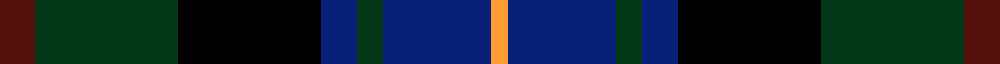

This is one **variant** — a specific cloth: this exact thread count and colourway, with its own
provenance below. It is one weaving of the [sett](/setts/dr4dg16k16db4dg3db12lo2/) (the scale-free proportion — the
same cloth at any scale or shade), whose colour order is pattern [BGKBGBY](/stripes/bgkbgby/).

Part of the [Junior Chamber International](/tartans/junior-chamber-international-2/) tartan — the named design grouping this sett with its other cloths.

Sourced from tartans-authority.  It is a [7 stripe tartan](/stripes/stripes7/).

Original link [https://www.tartanregister.gov.uk/tartanDetails.aspx?ref=2331](https://www.tartanregister.gov.uk/tartanDetails.aspx?ref=2331)

Dataset <small>— provenance for this record, inherited from the source manifest</small>

<dl class="dataset-prov">
<dt>source</dt><dd><a href="/sources/tartans-authority/">Scottish Tartans Authority</a></dd>
<dt>data captured from</dt><dd><a href="https://github.com/thetartan/tartan-database/blob/master/data/tartans-authority/data.csv">https://github.com/thetartan/tartan-database/blob/master/data/tartans-authority/data.csv</a></dd>
<dt>data date</dt><dd>1994 <small>(this record)</small></dd>
<dt>licence</dt><dd><a href="https://creativecommons.org/licenses/by-nc-nd/4.0/">CC BY-NC-ND 4.0</a></dd>
</dl>

Capture chain <small>— the hands this data passed through, oldest first; each capture carries its own licence</small>

<ol class="capture-chain">
<li><a href="https://www.tartansauthority.com/">Scottish Tartans Authority</a> <small>the heritage body's archive — its tartan-ferret record browser is retired (links repaired to the SRT, above)</small></li>
<li><a href="https://github.com/thetartan/tartan-database">thetartan/tartan-database</a> <small>2016-2017</small> · <a href="https://creativecommons.org/licenses/by-nc-nd/4.0/">CC BY-NC-ND 4.0</a> <small>Levko Kravets's frozen compilation — the capture we vendored, and where its CC licence text came from</small></li>
<li>this dictionary <small>captured 2026-06-10 · commit 5bf86c7566</small> <small>each re-capture is a git commit to data/sources</small></li>
</ol>

## Register references

External register numbers recorded for this tartan.

- Scottish Tartans Authority (ITI): 2331

## Thread count
DR/8 DG32 K32 DB8 DG6 DB24 LO/4

One full sett is **216 threads**.

## Palette
<table><thead><tr><th>Colour</th><th>Shade</th><th>OKLCh</th></tr></thead><tbody><tr><td>DB</td><td><code style="background-color:#082077;">#082077</code> <small style="color:#888">#082077</small></td><td><small style="color:#888">oklch(30.0% 0.149 265.1)</small></td></tr><tr><td>DR</td><td><code style="background-color:#55120C;">#55120C</code> <small style="color:#888">#55120C</small></td><td><small style="color:#888">oklch(30.0% 0.099 29.3)</small></td></tr><tr><td>LO</td><td><code style="background-color:#FF9C34;">#FF9C34</code> <small style="color:#888">#FF9C34</small></td><td><small style="color:#888">oklch(77.9% 0.161 61.8)</small></td></tr><tr><td>DG</td><td><code style="background-color:#053819;">#053819</code> <small style="color:#888">#053819</small></td><td><small style="color:#888">oklch(30.0% 0.075 151.3)</small></td></tr><tr><td>K</td><td><code style="background-color:#000000;">#000000</code> <small style="color:#888">#000000</small></td><td><small style="color:#888">oklch(0.0% 0.000 0.0)</small></td></tr></tbody></table>

# Sample pattern

## Nearest tartan variants

The nearest existing variants by ΔTartan distance, with this cloth at the top so the swatches line up against it.

ΔTartan

Threads

Variant

Sett

—

216

<a href="/variants/s7/dr4dg16k16db4dg3db12lo2~x2/">Junior Chamber International (Corp)</a>

<a href="/ttd/edit/#slug=r4dg11k11dg2db11g3~x4~dg1803171-g1904130&amp;base=dr4dg16k16db4dg3db12lo2~x2" title="compare in the TTD">1.60</a>

308

<a href="/variants/s6/r4dg11k11dg2db11g3~x4~dg1803171-g1904130/">Casely</a>

<a href="/ttd/edit/#slug=db27g5y8k20y3g15r3~x2&amp;base=dr4dg16k16db4dg3db12lo2~x2" title="compare in the TTD">2.12</a>

264

<a href="/variants/s7/db27g5y8k20y3g15r3~x2/">Nelson Mandela (Personal)</a>

<a href="/ttd/edit/#slug=db28r4k14r4dg33y4~x2&amp;base=dr4dg16k16db4dg3db12lo2~x2" title="compare in the TTD">2.15</a>

284

<a href="/variants/s6/db28r4k14r4dg33y4~x2/">Royal College of Physicians of Edinburgh</a>

<a href="/ttd/edit/#slug=r5dg19w3k19db19k3db2~x2&amp;base=dr4dg16k16db4dg3db12lo2~x2" title="compare in the TTD">2.18</a>

266

<a href="/variants/s7/r5dg19w3k19db19k3db2~x2/">Fruin Colquhoun (Commemorative?)</a>

<a href="/ttd/edit/#slug=db10r7db31k25dg23k8db7k8y5~x2&amp;base=dr4dg16k16db4dg3db12lo2~x2" title="compare in the TTD">2.20</a>

466

<a href="/variants/s9/db10r7db31k25dg23k8db7k8y5~x2/">MacCallum of Berwick</a>

<a href="/ttd/edit/#slug=dg3db12lb1k12dg13r2dg2~x2&amp;base=dr4dg16k16db4dg3db12lo2~x2" title="compare in the TTD">2.20</a>

170

<a href="/variants/s7/dg3db12lb1k12dg13r2dg2~x2/">MacPhedran/MacFadzean</a>

<a href="/ttd/edit/#slug=r5db8k5db24k24dg24y5~x2&amp;base=dr4dg16k16db4dg3db12lo2~x2" title="compare in the TTD">2.21</a>

360

<a href="/variants/s7/r5db8k5db24k24dg24y5~x2/">Heritage (Corporate)</a>

<a href="/ttd/edit/#slug=dr3dg2dr6dg20k15dg3db18w2~x2&amp;base=dr4dg16k16db4dg3db12lo2~x2" title="compare in the TTD">2.21</a>

266

<a href="/variants/s8/dr3dg2dr6dg20k15dg3db18w2~x2/">Curry (Irish) (Name)</a>

<a href="/ttd/edit/#slug=dp2r2dp16k17dg16k2y2~x2~r2109032&amp;base=dr4dg16k16db4dg3db12lo2~x2" title="compare in the TTD">2.23</a>

220

<a href="/variants/s7/dp2r2dp16k17dg16k2y2~x2~r2109032/">Zangenberg (Personal)</a>

<a href="/ttd/edit/#slug=dp2r2dp16k17dg16k2y2~x2&amp;base=dr4dg16k16db4dg3db12lo2~x2" title="compare in the TTD">2.24</a>

220

<a href="/variants/s7/dp2r2dp16k17dg16k2y2~x2/">Zangenberg (Personal)</a>

## Neighbour map

Every grey dot is one of 13621 variants placed by the first two principal components of the ΔTartan feature space (42% of its variance). Red is this tartan; blue dots are its nearest — click one to open its page.

<svg viewBox="0 0 640 380" role="img" style="max-width:100%;height:auto;border:1px solid #e0e0e0;border-radius:4px;display:block" xmlns="http://www.w3.org/2000/svg"><image href="/nn/cloud.v1.png" width="640" height="380"/><a href="/variants/s6/r4dg11k11dg2db11g3~x4~dg1803171-g1904130/"><circle cx="94.6" cy="238.2" r="4" fill="#3465a4"><title>Casely</title></circle></a><a href="/variants/s7/db27g5y8k20y3g15r3~x2/"><circle cx="111.1" cy="192.5" r="4" fill="#3465a4"><title>Nelson Mandela (Personal)</title></circle></a><a href="/variants/s6/db28r4k14r4dg33y4~x2/"><circle cx="183.4" cy="203.7" r="4" fill="#3465a4"><title>Royal College of Physicians of Edinburgh</title></circle></a><a href="/variants/s7/r5dg19w3k19db19k3db2~x2/"><circle cx="126.6" cy="188.7" r="4" fill="#3465a4"><title>Fruin Colquhoun (Commemorative?)</title></circle></a><a href="/variants/s9/db10r7db31k25dg23k8db7k8y5~x2/"><circle cx="151.8" cy="209.9" r="4" fill="#3465a4"><title>MacCallum of Berwick</title></circle></a><a href="/variants/s7/dg3db12lb1k12dg13r2dg2~x2/"><circle cx="203.3" cy="183.4" r="4" fill="#3465a4"><title>MacPhedran/MacFadzean</title></circle></a><a href="/variants/s7/r5db8k5db24k24dg24y5~x2/"><circle cx="130.2" cy="231.8" r="4" fill="#3465a4"><title>Heritage (Corporate)</title></circle></a><a href="/variants/s8/dr3dg2dr6dg20k15dg3db18w2~x2/"><circle cx="175.5" cy="188.4" r="4" fill="#3465a4"><title>Curry (Irish) (Name)</title></circle></a><a href="/variants/s7/dp2r2dp16k17dg16k2y2~x2~r2109032/"><circle cx="181.7" cy="192.5" r="4" fill="#3465a4"><title>Zangenberg (Personal)</title></circle></a><a href="/variants/s7/dp2r2dp16k17dg16k2y2~x2/"><circle cx="179.9" cy="191.9" r="4" fill="#3465a4"><title>Zangenberg (Personal)</title></circle></a><circle cx="158.2" cy="213.3" r="5" fill="#c00000"/><text x="320" y="376" text-anchor="middle" font-size="11" fill="#999">ground</text><text x="11" y="190" text-anchor="middle" font-size="11" fill="#999" transform="rotate(-90 11 190)">complexity</text></svg>

ID: /variants/s7/dr4dg16k16db4dg3db12lo2~x2/
