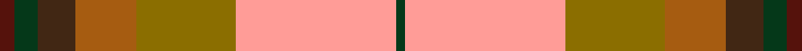

This is one **variant** — a specific cloth: this exact thread count and colourway, with its own
provenance below. It is one weaving of the [sett](/tartans/c/ca/canadian-shield/) (the scale-free proportion — the
same cloth at any scale or shade), whose colour order is pattern [BGBRGYG](/stripes/bgbrgyg/).

Part of the [Canadian Shield](/tartans/c/ca/canadian-shield/) tartan — the named design grouping this sett with its other cloths.

Sourced from tartans-authority.  It is a [7 stripe tartan](/stripes/stripes7/).

Original link <code>http://www.tartansauthority.com/tartan-ferret/display/7886/</code> — retired · [Internet Archive copy](https://web.archive.org/web/*/http://www.tartansauthority.com/tartan-ferret/display/7886/*)

Dataset <small>— provenance for this record, inherited from the source manifest</small>

<dl class="dataset-prov">
<dt>source</dt><dd><a href="/sources/tartans-authority/">Scottish Tartans Authority</a></dd>
<dt>data captured from</dt><dd><a href="https://github.com/thetartan/tartan-database/blob/master/data/tartans-authority/data.csv">https://github.com/thetartan/tartan-database/blob/master/data/tartans-authority/data.csv</a></dd>
<dt>data date</dt><dd>Feb. 2009 <small>(this record)</small></dd>
<dt>licence</dt><dd><a href="https://creativecommons.org/licenses/by-nc-nd/4.0/">CC BY-NC-ND 4.0</a></dd>
</dl>

Capture chain <small>— the hands this data passed through, oldest first; each capture carries its own licence</small>

<ol class="capture-chain">
<li><a href="https://www.tartansauthority.com/">Scottish Tartans Authority</a> <small>the heritage body’s archive — its tartan-ferret record browser is retired; dead record links are shown unlinked, with an Internet Archive copy (ITI numbers are not SRT references)</small></li>
<li><a href="https://github.com/thetartan/tartan-database">thetartan/tartan-database</a> <small>2016-2017</small> · <a href="https://creativecommons.org/licenses/by-nc-nd/4.0/">CC BY-NC-ND 4.0</a> <small>Levko Kravets's frozen compilation — the capture we vendored, and where its CC licence text came from</small></li>
<li>this dictionary <small>captured 2026-06-10 · commit 5bf86c7566</small> <small>each re-capture is a git commit to data/sources</small></li>
</ol>

## Register references

External register numbers recorded for this tartan.

- Scottish Register of Tartans: [7886](https://www.tartanregister.gov.uk/tartanDetails?ref=7886)
- Scottish Tartans Authority (ITI): 7886

## Thread count
DR/5 DG8 DO13 O21 Y34 LR55 DG/3

One full sett is **270 threads**.

## Palette
<table><thead><tr><th>Colour</th><th>Shade</th><th>OKLCh</th></tr></thead><tbody><tr><td>DO</td><td><code style="background-color:#412714;">#412714</code> <small style="color:#888">#412714</small></td><td><small style="color:#888">oklch(30.1% 0.050 55.7)</small></td></tr><tr><td>DR</td><td><code style="background-color:#55120C;">#55120C</code> <small style="color:#888">#55120C</small></td><td><small style="color:#888">oklch(30.0% 0.099 29.3)</small></td></tr><tr><td>DG</td><td><code style="background-color:#053819;">#053819</code> <small style="color:#888">#053819</small></td><td><small style="color:#888">oklch(30.0% 0.075 151.3)</small></td></tr><tr><td>Y</td><td><code style="background-color:#8B6E00;">#8B6E00</code> <small style="color:#888">#8B6E00</small></td><td><small style="color:#888">oklch(55.1% 0.113 90.4)</small></td></tr><tr><td>O</td><td><code style="background-color:#A65C11;">#A65C11</code> <small style="color:#888">#A65C11</small></td><td><small style="color:#888">oklch(55.0% 0.125 58.3)</small></td></tr><tr><td>LR</td><td><code style="background-color:#FF9C97;">#FF9C97</code> <small style="color:#888">#FF9C97</small></td><td><small style="color:#888">oklch(79.3% 0.119 23.2)</small></td></tr></tbody></table>

# Sample pattern

## Nearest tartan variants

The nearest existing variants by ΔTartan distance, with this cloth at the top so the swatches line up against it.

ΔTartan

Threads

Variant

Sett

—

270

<a href="/variants/s7/dr5dg8do13o21y34lr55dg3/">Canadian Shield (Personal)</a>

<a href="/ttd/edit/#slug=ly4g18t4r8t8ri21w1~x2~r4418030-ri5221030&amp;base=dr5dg8do13o21y34lr55dg3" title="compare in the TTD">2.15</a>

246

<a href="/variants/s7/ly4g18t4r8t8ri21w1~x2~r4418030-ri5221030/">Bathija (Name)</a>

<a href="/ttd/edit/#slug=w3o1r29o16g23db3g3y2~x2&amp;base=dr5dg8do13o21y34lr55dg3" title="compare in the TTD">2.55</a>

310

<a href="/variants/s8/w3o1r29o16g23db3g3y2~x2/">Etienne, Paschal Tache Sir...</a>

<a href="/ttd/edit/#slug=r48t16ly5g17w8dy3~x2&amp;base=dr5dg8do13o21y34lr55dg3" title="compare in the TTD">2.59</a>

286

<a href="/variants/s6/r48t16ly5g17w8dy3~x2/">Scottish American Soc. of Michigan</a>

<a href="/ttd/edit/#slug=w3dg24r13g4ly11r8db2~x2~dg4514144-g5610195&amp;base=dr5dg8do13o21y34lr55dg3" title="compare in the TTD">2.90</a>

250

<a href="/variants/s7/w3dg24r13g4ly11r8db2~x2~dg4514144-g5610195/">Elystan Glodrydd (Name)</a>

<a href="/ttd/edit/#slug=w3dy1r29dy16g23db3g3y2~x2&amp;base=dr5dg8do13o21y34lr55dg3" title="compare in the TTD">2.96</a>

310

<a href="/variants/s8/w3dy1r29dy16g23db3g3y2~x2/">Etienne Paschal Tache Sir... Canadian Tartan</a>

<a href="/ttd/edit/#slug=y4g18db4dr8db8r21w1~x2&amp;base=dr5dg8do13o21y34lr55dg3" title="compare in the TTD">2.99</a>

246

<a href="/variants/s7/y4g18db4dr8db8r21w1~x2/">G P Bathija (Shikarpur, Sindh)</a>

<a href="/ttd/edit/#slug=w3dy1r29dy16g23db3g3ly2~x2&amp;base=dr5dg8do13o21y34lr55dg3" title="compare in the TTD">3.04</a>

310

<a href="/variants/s8/w3dy1r29dy16g23db3g3ly2~x2/">Tache, Sir Etienne Paschal #2</a>

<a href="/ttd/edit/#slug=r1do1r9g6lb2t3r2ly1~x4&amp;base=dr5dg8do13o21y34lr55dg3" title="compare in the TTD">3.07</a>

192

<a href="/variants/s8/r1do1r9g6lb2t3r2ly1~x4/">Battle of Bannockburn, The</a>

<a href="/ttd/edit/#slug=ly4r2ly21dt11w2o21lyi4~x2~ly7616093-lyi8517093&amp;base=dr5dg8do13o21y34lr55dg3" title="compare in the TTD">3.17</a>

244

<a href="/variants/s7/ly4r2ly21dt11w2o21lyi4~x2~ly7616093-lyi8517093/">Barbour - Muted</a>

<a href="/ttd/edit/#slug=r1dy1r9g6lg2t3r2y1~x4~lg7108210-t5509213&amp;base=dr5dg8do13o21y34lr55dg3" title="compare in the TTD">3.18</a>

192

<a href="/variants/s8/r1dy1r9g6lg2t3r2y1~x4~lg7108210-t5509213/">Battle of Bannockburn, The</a>

## Neighbour map

Every grey dot is one of 13662 variants placed by the first two principal components of the ΔTartan feature space (42% of its variance). Red is this tartan; blue dots are its nearest — click one to open its page. The map is a flat projection of a many-dimensional space — [how to read it](/posts/neighbourhood-maps/).

<svg viewBox="0 0 640 380" role="img" style="max-width:100%;height:auto;border:1px solid #e0e0e0;border-radius:4px;display:block" xmlns="http://www.w3.org/2000/svg"><image href="/nn/cloud.v1.png" width="640" height="380"/><a href="/variants/s7/ly4g18t4r8t8ri21w1~x2~r4418030-ri5221030/"><circle cx="197.8" cy="176.9" r="4" fill="#3465a4"><title>Bathija (Name)</title></circle></a><a href="/variants/s8/w3o1r29o16g23db3g3y2~x2/"><circle cx="246.7" cy="132.8" r="4" fill="#3465a4"><title>Etienne, Paschal Tache Sir...</title></circle></a><a href="/variants/s6/r48t16ly5g17w8dy3~x2/"><circle cx="253.0" cy="159.7" r="4" fill="#3465a4"><title>Scottish American Soc. of Michigan</title></circle></a><a href="/variants/s7/w3dg24r13g4ly11r8db2~x2~dg4514144-g5610195/"><circle cx="169.9" cy="184.1" r="4" fill="#3465a4"><title>Elystan Glodrydd (Name)</title></circle></a><a href="/variants/s8/w3dy1r29dy16g23db3g3y2~x2/"><circle cx="217.6" cy="124.4" r="4" fill="#3465a4"><title>Etienne Paschal Tache Sir... Canadian Tartan</title></circle></a><a href="/variants/s7/y4g18db4dr8db8r21w1~x2/"><circle cx="171.4" cy="165.9" r="4" fill="#3465a4"><title>G P Bathija (Shikarpur, Sindh)</title></circle></a><a href="/variants/s8/w3dy1r29dy16g23db3g3ly2~x2/"><circle cx="213.3" cy="123.0" r="4" fill="#3465a4"><title>Tache, Sir Etienne Paschal #2</title></circle></a><a href="/variants/s8/r1do1r9g6lb2t3r2ly1~x4/"><circle cx="234.7" cy="181.5" r="4" fill="#3465a4"><title>Battle of Bannockburn, The</title></circle></a><a href="/variants/s7/ly4r2ly21dt11w2o21lyi4~x2~ly7616093-lyi8517093/"><circle cx="197.0" cy="189.4" r="4" fill="#3465a4"><title>Barbour - Muted</title></circle></a><a href="/variants/s8/r1dy1r9g6lg2t3r2y1~x4~lg7108210-t5509213/"><circle cx="247.3" cy="185.8" r="4" fill="#3465a4"><title>Battle of Bannockburn, The</title></circle></a><circle cx="215.6" cy="162.7" r="5" fill="#c00000"/><text x="320" y="376" text-anchor="middle" font-size="11" fill="#999">ground</text><text x="11" y="190" text-anchor="middle" font-size="11" fill="#999" transform="rotate(-90 11 190)">complexity</text></svg>

ID: /variants/s7/dr5dg8do13o21y34lr55dg3/
