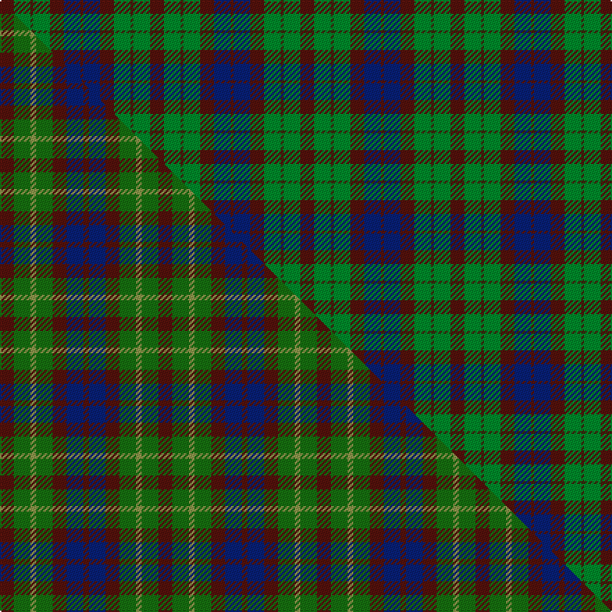

This page is one **sett** — a single exact thread-count. It belongs to the [tartan](/setts/dr5g6dy1g6dr5db6dr1/)
(the same proportion at any scale), whose colour order is pattern [BBBGGGB](/stripes/bbbgggb/).

Part of the [Gleneagles Group](/tartans/gleneagles-group/) tartan — the named design grouping this sett with its other cloths.

Sourced from house-of-tartan.  It is a [7 stripe tartan](/stripes/stripes7/).

Original link http://www.house-of-tartan.scotland.net/house/TartanViewjs.asp?colr=Def&tnam=2107

## Provenance

Earliest known date: 1989 Designed for a range of tartan goods called the Gleneagles Collection.

## Thread count
DR/10 G12 DY2 G12 DR10 DB12 DR/2

One full sett is **108 threads**.

## Palette
<table><thead><tr><th>Colour</th><th>Shade</th><th>OKLCh</th></tr></thead><tbody><tr><td>DB</td><td><code style="background-color:#082077;">#082077</code> <small style="color:#888">#082077</small></td><td><small style="color:#888">oklch(30.0% 0.149 265.1)</small></td></tr><tr><td>DR</td><td><code style="background-color:#55120C;">#55120C</code> <small style="color:#888">#55120C</small></td><td><small style="color:#888">oklch(30.0% 0.099 29.3)</small></td></tr><tr><td>G</td><td><code style="background-color:#008B2A;">#008B2A</code> <small style="color:#888">#008B2A</small></td><td><small style="color:#888">oklch(55.4% 0.170 145.9)</small></td></tr><tr><td>DY</td><td><code style="background-color:#3A2B0D;">#3A2B0D</code> <small style="color:#888">#3A2B0D</small></td><td><small style="color:#888">oklch(30.0% 0.049 82.0)</small></td></tr></tbody></table>

# Sample pattern

## Compared to the master

This cloth is one sett of its design; the master sett (the exemplar the design is anchored on) is below for comparison.

Its **ΔTartan distance** from the master is **1.47** — the same measure the nearest-tartans table ranks by (0 is identical; a re-scale of the same cloth is near 0, a recolour or a different proportion further).

<figure class="master-compare" style="margin:0">

this sett
master sett ★

<figcaption style="color:#888;font-size:smaller">One weave of this sett against the <a href="/setts/dr5g6ly2g6dr5db6dr2/">master sett ★</a>, split on the diagonal: a shared proportion runs seamlessly across it with only the shades shifting; a different proportion breaks on it.</figcaption>
</figure>

## Nearest variants

The nearest existing variants by ΔTartan distance, with this cloth at the top so the swatches line up against it.

ΔTartan

Threads

Variant

Sett

—

108

<a href="/variants/s7/dr5g6dy1g6dr5db6dr1~x2/">Gleneagles Group Corporate Tartan</a>

<a href="/ttd/edit/#slug=dr5g6ly2g6dr5db6dr2~x2~g1906142-ly2604115&amp;base=dr5g6dy1g6dr5db6dr1~x2" title="compare in the TTD">0.52</a>

114

<a href="/variants/s7/dr5g6ly2g6dr5db6dr2~x2~g1906142-ly2604115/">Gleneagles Group</a>

<a href="/ttd/edit/#slug=dg2dr12db11ly6dy6dr12dg2~x2&amp;base=dr5g6dy1g6dr5db6dr1~x2" title="compare in the TTD">2.53</a>

196

<a href="/variants/s7/dg2dr12db11ly6dy6dr12dg2~x2/">Heather MacRae</a>

<a href="/ttd/edit/#slug=db7r3g7r1g7r3db7lb1~x2&amp;base=dr5g6dy1g6dr5db6dr1~x2" title="compare in the TTD">2.91</a>

128

<a href="/variants/s8/db7r3g7r1g7r3db7lb1~x2/">Hebrides #8</a>

## Neighbour map

Every grey dot is one of 13620 variants placed by the first two principal components of the ΔTartan feature space (42% of its variance). Red is this tartan; blue dots are its nearest — click one to open its page.

<svg viewBox="0 0 640 380" role="img" style="max-width:100%;height:auto;border:1px solid #e0e0e0;border-radius:4px;display:block" xmlns="http://www.w3.org/2000/svg"><image href="/nn/cloud.v1.png" width="640" height="380"/><a href="/variants/s7/dr5g6ly2g6dr5db6dr2~x2~g1906142-ly2604115/"><circle cx="211.9" cy="344.4" r="4" fill="#3465a4"><title>Gleneagles Group</title></circle></a><a href="/variants/s7/dg2dr12db11ly6dy6dr12dg2~x2/"><circle cx="236.5" cy="262.7" r="4" fill="#3465a4"><title>Heather MacRae</title></circle></a><a href="/variants/s8/db7r3g7r1g7r3db7lb1~x2/"><circle cx="186.9" cy="244.9" r="4" fill="#3465a4"><title>Hebrides #8</title></circle></a><circle cx="229.2" cy="289.7" r="5" fill="#c00000"/><text x="320" y="376" text-anchor="middle" font-size="11" fill="#999">ground</text><text x="11" y="190" text-anchor="middle" font-size="11" fill="#999" transform="rotate(-90 11 190)">complexity</text></svg>

ID: /variants/s7/dr5g6dy1g6dr5db6dr1~x2/
