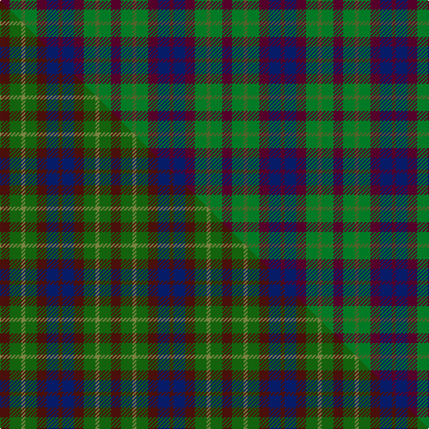

This is one **variant** — a specific cloth: this exact thread count and colourway, with its own
provenance below. It is one weaving of the [sett](/setts/dr5g6gi2g6dr5db6dr2/) (the scale-free proportion — the
same cloth at any scale or shade), whose colour order is pattern [BBBGGGB](/stripes/bbbgggb/).

Part of the [Gleneagles Group](/tartans/g/gl/gleneagles-group/) tartan — the named design grouping this sett with its other cloths.

Sourced from weddslist.  It is a [7 stripe tartan](/stripes/stripes7/).

Original link [http://www.weddslist.com/cgi-bin/tartans/pg.pl?source=sts](http://www.weddslist.com/cgi-bin/tartans/pg.pl?source=sts)

Dataset <small>— provenance for this record, inherited from the source manifest</small>

<dl class="dataset-prov">
<dt>source</dt><dd><a href="/sources/weddslist/">Weddslist</a></dd>
<dt>data captured from</dt><dd><a href="https://github.com/thetartan/tartan-database/blob/master/data/weddslist/data.csv">https://github.com/thetartan/tartan-database/blob/master/data/weddslist/data.csv</a></dd>
<dt>data date</dt><dd>2016-11-17 <small>(dataset default)</small></dd>
<dt>licence</dt><dd><a href="https://creativecommons.org/licenses/by-nc-nd/4.0/">CC BY-NC-ND 4.0</a></dd>
</dl>

Capture chain <small>— the hands this data passed through, oldest first; each capture carries its own licence</small>

<ol class="capture-chain">
<li><a href="https://www.weddslist.com/tartans/">Weddslist</a> <small>the living privately compiled reference</small></li>
<li><a href="https://github.com/thetartan/tartan-database">thetartan/tartan-database</a> <small>2016-2017</small> · <a href="https://creativecommons.org/licenses/by-nc-nd/4.0/">CC BY-NC-ND 4.0</a> <small>Levko Kravets's frozen compilation — the capture we vendored, and where its CC licence text came from</small></li>
<li>this dictionary <small>captured 2026-06-10 · commit 5bf86c7566</small> <small>each re-capture is a git commit to data/sources</small></li>
</ol>

## Thread count
DR/10 G12 Gi4 G12 DR10 DB12 DR/4

One full sett is **114 threads**.

## Palette
<table><thead><tr><th>Colour</th><th>Shade</th><th>OKLCh</th></tr></thead><tbody><tr><td>DB</td><td><code style="background-color:#082077;">#082077</code> <small style="color:#888">#082077</small></td><td><small style="color:#888">oklch(30.0% 0.149 265.1)</small></td></tr><tr><td>DR</td><td><code style="background-color:#600030;">#600030</code> <small style="color:#888">#600030</small></td><td><small style="color:#888">oklch(31.7% 0.129 359.5)</small></td></tr><tr><td>G</td><td><code style="background-color:#607030;">#607030</code> <small style="color:#888">#607030</small></td><td><small style="color:#888">oklch(51.7% 0.091 121.3)</small></td></tr><tr><td>G</td><td><code style="background-color:#008B2A;">#008B2A</code> <small style="color:#888">#008B2A</small></td><td><small style="color:#888">oklch(55.4% 0.170 145.9)</small></td></tr></tbody></table>

# Sample pattern

## Compared to the master

This cloth is one sett of its design; the master sett (the exemplar the design is anchored on) is below for comparison.

Its **ΔTartan distance** from the master is **2.47** — the same measure the nearest-tartans table ranks by (0 is identical; a re-scale of the same cloth is near 0, a recolour or a different proportion further).

<figure class="master-compare" style="margin:0">

this sett
master sett ★

<figcaption style="color:#888;font-size:smaller">One weave of this sett against the <a href="/setts/dr5g6ly2g6dr5db6dr2/">master sett ★</a>, split on the diagonal: a shared proportion runs seamlessly across it with only the shades shifting; a different proportion breaks on it.</figcaption>
</figure>

## Nearest tartan variants

The nearest existing variants by ΔTartan distance, with this cloth at the top so the swatches line up against it.

ΔTartan

Threads

Variant

Sett

—

114

<a href="/variants/s7/dr5g6gi2g6dr5db6dr2~x2~dr1305000-gi2104115/">Gleneagles Group</a>

<a href="/ttd/edit/#slug=dr5g6ly2g6dr5db6dr2~x2~g1906142-ly2604115&amp;base=dr5g6gi2g6dr5db6dr2~x2~dr1305000-gi2104115" title="compare in the TTD">2.52</a>

114

<a href="/variants/s7/dr5g6ly2g6dr5db6dr2~x2~g1906142-ly2604115/">Gleneagles Group</a>

<a href="/ttd/edit/#slug=dr5g6dy1g6dr5db6dr1~x2&amp;base=dr5g6gi2g6dr5db6dr2~x2~dr1305000-gi2104115" title="compare in the TTD">3.02</a>

108

<a href="/variants/s7/dr5g6dy1g6dr5db6dr1~x2/">Gleneagles Group Corporate Tartan</a>

<a href="/ttd/edit/#slug=r4dg4r1db4r4~x12~dg1605139&amp;base=dr5g6gi2g6dr5db6dr2~x2~dr1305000-gi2104115" title="compare in the TTD">3.22</a>

312

<a href="/variants/s5/r4dg4r1db4r4~x12~dg1605139/">Gow</a>

<a href="/ttd/edit/#slug=db9dr12g9db5w2~x4&amp;base=dr5g6gi2g6dr5db6dr2~x2~dr1305000-gi2104115" title="compare in the TTD">3.60</a>

252

<a href="/variants/s5/db9dr12g9db5w2~x4/">Battle of Prestonpans (1745) Heritage Trust, The</a>

<a href="/ttd/edit/#slug=ly28dr24dg55dp19~x2&amp;base=dr5g6gi2g6dr5db6dr2~x2~dr1305000-gi2104115" title="compare in the TTD">3.69</a>

410

<a href="/variants/s4/ly28dr24dg55dp19~x2/">Hirstwood (Name)</a>

<a href="/ttd/edit/#slug=db2g4y1db1r2~x12&amp;base=dr5g6gi2g6dr5db6dr2~x2~dr1305000-gi2104115" title="compare in the TTD">3.76</a>

192

<a href="/variants/s5/db2g4y1db1r2~x12/">Creek Indian Nation</a>

<a href="/ttd/edit/#slug=g12r11dp12o3dp8g8dp8~x2~r2109032-o2307033&amp;base=dr5g6gi2g6dr5db6dr2~x2~dr1305000-gi2104115" title="compare in the TTD">3.82</a>

208

<a href="/variants/s7/g12r11dp12ri3dp8g8dp8~x2~r2109032-ri2307033/">Fiddes (Corrected)</a>

<a href="/ttd/edit/#slug=dp3n1g2~x10&amp;base=dr5g6gi2g6dr5db6dr2~x2~dr1305000-gi2104115" title="compare in the TTD">3.88</a>

70

<a href="/variants/s3/dp3n1g2~x10/">Coleman, Sarah-Louise (Personal)</a>

<a href="/ttd/edit/#slug=g3dp3w1dp3g3r1~x4&amp;base=dr5g6gi2g6dr5db6dr2~x2~dr1305000-gi2104115" title="compare in the TTD">3.93</a>

96

<a href="/variants/s6/g3dp3w1dp3g3r1~x4/">Wilson's No.113</a>

<a href="/ttd/edit/#slug=dy1db3dy1g3dy4r1~x2&amp;base=dr5g6gi2g6dr5db6dr2~x2~dr1305000-gi2104115" title="compare in the TTD">3.98</a>

48

<a href="/variants/s6/dy1db3dy1g3dy4r1~x2/">Fraser Hunting #2</a>

## Neighbour map

Every grey dot is one of 13621 variants placed by the first two principal components of the ΔTartan feature space (42% of its variance). Red is this tartan; blue dots are its nearest — click one to open its page. The map is a flat projection of a many-dimensional space — [how to read it](/posts/neighbourhood-maps/).

<svg viewBox="0 0 640 380" role="img" style="max-width:100%;height:auto;border:1px solid #e0e0e0;border-radius:4px;display:block" xmlns="http://www.w3.org/2000/svg"><image href="/nn/cloud.v1.png" width="640" height="380"/><a href="/variants/s7/dr5g6ly2g6dr5db6dr2~x2~g1906142-ly2604115/"><circle cx="212.2" cy="345.1" r="4" fill="#3465a4"><title>Gleneagles Group</title></circle></a><a href="/variants/s7/dr5g6dy1g6dr5db6dr1~x2/"><circle cx="229.4" cy="290.3" r="4" fill="#3465a4"><title>Gleneagles Group Corporate Tartan</title></circle></a><a href="/variants/s5/r4dg4r1db4r4~x12~dg1605139/"><circle cx="187.1" cy="301.8" r="4" fill="#3465a4"><title>Gow</title></circle></a><a href="/variants/s5/db9dr12g9db5w2~x4/"><circle cx="197.7" cy="299.0" r="4" fill="#3465a4"><title>Battle of Prestonpans (1745) Heritage Trust, The</title></circle></a><a href="/variants/s4/ly28dr24dg55dp19~x2/"><circle cx="188.7" cy="335.4" r="4" fill="#3465a4"><title>Hirstwood (Name)</title></circle></a><a href="/variants/s5/db2g4y1db1r2~x12/"><circle cx="183.2" cy="294.2" r="4" fill="#3465a4"><title>Creek Indian Nation</title></circle></a><a href="/variants/s7/g12r11dp12ri3dp8g8dp8~x2~r2109032-ri2307033/"><circle cx="188.1" cy="303.6" r="4" fill="#3465a4"><title>Fiddes (Corrected)</title></circle></a><a href="/variants/s3/dp3n1g2~x10/"><circle cx="275.3" cy="360.4" r="4" fill="#3465a4"><title>Coleman, Sarah-Louise (Personal)</title></circle></a><a href="/variants/s6/g3dp3w1dp3g3r1~x4/"><circle cx="165.9" cy="305.1" r="4" fill="#3465a4"><title>Wilson's No.113</title></circle></a><a href="/variants/s6/dy1db3dy1g3dy4r1~x2/"><circle cx="234.5" cy="291.0" r="4" fill="#3465a4"><title>Fraser Hunting #2</title></circle></a><circle cx="179.6" cy="332.2" r="5" fill="#c00000"/><text x="320" y="376" text-anchor="middle" font-size="11" fill="#999">ground</text><text x="11" y="190" text-anchor="middle" font-size="11" fill="#999" transform="rotate(-90 11 190)">complexity</text></svg>

ID: /variants/s7/dr5g6gi2g6dr5db6dr2~x2~dr1305000-gi2104115/
