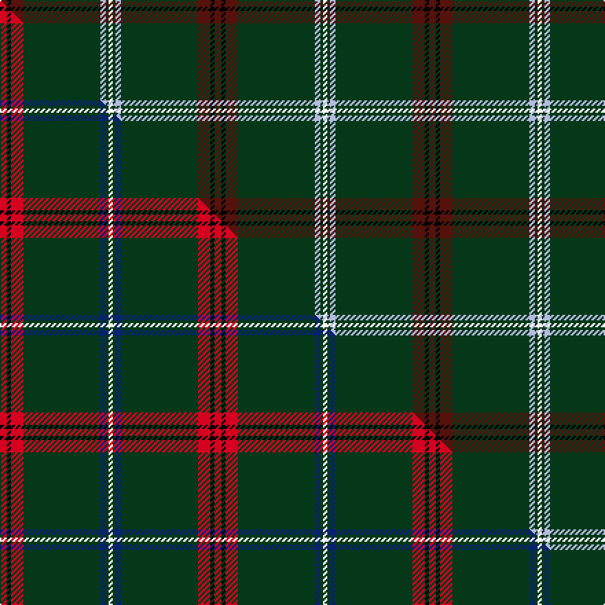

This is one **variant** — a specific cloth: this exact thread count and colourway, with its own
provenance below. It is one weaving of the [sett](/tartans/m/mt/mtv/) (the scale-free proportion — the
same cloth at any scale or shade), whose colour order is pattern [BKBGWGW](/stripes/bkbgwgw/).

Part of the [MTV](/tartans/m/mt/mtv/) tartan — the named design grouping this sett with its other cloths.

Sourced from tartans-authority.  It is a [7 stripe tartan](/stripes/stripes7/).

Original link <code>http://www.tartansauthority.com/tartan-ferret/display/11153/</code> — retired · [Internet Archive copy](https://web.archive.org/web/*/http://www.tartansauthority.com/tartan-ferret/display/11153/*)

Dataset <small>— provenance for this record, inherited from the source manifest</small>

<dl class="dataset-prov">
<dt>source</dt><dd><a href="/sources/tartans-authority/">Scottish Tartans Authority</a></dd>
<dt>data captured from</dt><dd><a href="https://github.com/thetartan/tartan-database/blob/master/data/tartans-authority/data.csv">https://github.com/thetartan/tartan-database/blob/master/data/tartans-authority/data.csv</a></dd>
<dt>data date</dt><dd>2014 <small>(this record)</small></dd>
<dt>licence</dt><dd><a href="https://creativecommons.org/licenses/by-nc-nd/4.0/">CC BY-NC-ND 4.0</a></dd>
</dl>

Capture chain <small>— the hands this data passed through, oldest first; each capture carries its own licence</small>

<ol class="capture-chain">
<li><a href="https://www.tartansauthority.com/">Scottish Tartans Authority</a> <small>the heritage body’s archive — its tartan-ferret record browser is retired; dead record links are shown unlinked, with an Internet Archive copy (ITI numbers are not SRT references)</small></li>
<li><a href="https://github.com/thetartan/tartan-database">thetartan/tartan-database</a> <small>2016-2017</small> · <a href="https://creativecommons.org/licenses/by-nc-nd/4.0/">CC BY-NC-ND 4.0</a> <small>Levko Kravets's frozen compilation — the capture we vendored, and where its CC licence text came from</small></li>
<li>this dictionary <small>captured 2026-06-10 · commit 5bf86c7566</small> <small>each re-capture is a git commit to data/sources</small></li>
</ol>

## Register references

External register numbers recorded for this tartan.

- Scottish Register of Tartans: [11153](https://www.tartanregister.gov.uk/tartanDetails?ref=11153)
- Scottish Tartans Authority (ITI): 11153

## Thread count
DR/5 K3 DR9 DG56 LB4 DG2 W/3

One full sett is **156 threads**.

## Palette
<table><thead><tr><th>Colour</th><th>Shade</th><th>OKLCh</th></tr></thead><tbody><tr><td>LB</td><td><code style="background-color:#B5BBDE;">#B5BBDE</code> <small style="color:#888">#B5BBDE</small></td><td><small style="color:#888">oklch(79.9% 0.050 277.6)</small></td></tr><tr><td>DG</td><td><code style="background-color:#053819;">#053819</code> <small style="color:#888">#053819</small></td><td><small style="color:#888">oklch(30.0% 0.075 151.3)</small></td></tr><tr><td>DR</td><td><code style="background-color:#55120C;">#55120C</code> <small style="color:#888">#55120C</small></td><td><small style="color:#888">oklch(30.0% 0.099 29.3)</small></td></tr><tr><td>K</td><td><code style="background-color:#000000;">#000000</code> <small style="color:#888">#000000</small></td><td><small style="color:#888">oklch(0.0% 0.000 0.0)</small></td></tr><tr><td>W</td><td><code style="background-color:#F7F7F7;">#F7F7F7</code> <small style="color:#888">#F7F7F7</small></td><td><small style="color:#888">oklch(97.6% 0.000 89.9)</small></td></tr></tbody></table>

# Sample pattern

## Compared to the master

This cloth is one sett of its design; the master sett (the exemplar the design is anchored on) is below for comparison.

Its **ΔTartan distance** from the master is **0.13** — the same measure the nearest-tartans table ranks by (0 is identical; a re-scale of the same cloth is near 0, a recolour or a different proportion further).

<figure class="master-compare" style="margin:0">

this sett
master sett ★

<figcaption style="color:#888;font-size:smaller">One weave of this sett against the <a href="/setts/r5k3r9dg56db4dg2w3/">master sett ★</a>, split on the diagonal: a shared proportion runs seamlessly across it with only the shades shifting; a different proportion breaks on it.</figcaption>
</figure>

## Nearest tartan variants

The nearest existing variants by ΔTartan distance, with this cloth at the top so the swatches line up against it.

ΔTartan

Threads

Variant

Sett

—

156

<a href="/variants/s7/dr5k3dr9dg56lb4dg2w3/">MTV</a>

<a href="/ttd/edit/#slug=r5k3r9dg56db4dg2w3&amp;base=dr5k3dr9dg56lb4dg2w3" title="compare in the TTD">0.13</a>

156

<a href="/variants/s7/r5k3r9dg56db4dg2w3/">MTV</a>

<a href="/ttd/edit/#slug=w3dr11db4dr6dg48o2dg3o2~x2&amp;base=dr5k3dr9dg56lb4dg2w3" title="compare in the TTD">1.65</a>

306

<a href="/variants/s8/w3dr11db4dr6dg48o2dg3o2~x2/">Hall, from Springbrook and Newtown (Personal)</a>

<a href="/ttd/edit/#slug=o10k2g5k2dg46ly2k2~x2~o2503076-ly2705081&amp;base=dr5k3dr9dg56lb4dg2w3" title="compare in the TTD">1.95</a>

252

<a href="/variants/s7/ly10k2g5k2dg46lyi2k2~x2~ly2503076-lyi2705081/">Green Rover (Personal)</a>

<a href="/ttd/edit/#slug=dg18k1dy3k1lr1dg1dr2k2dr2lr2~x4&amp;base=dr5k3dr9dg56lb4dg2w3" title="compare in the TTD">2.16</a>

184

<a href="/variants/s10/dg18k1dy3k1lr1dg1dr2k2dr2lr2~x4/">Anthony Plaid Stewart</a>

<a href="/ttd/edit/#slug=ly10k2g5k2dg46y2k2~x2~g1903133&amp;base=dr5k3dr9dg56lb4dg2w3" title="compare in the TTD">2.50</a>

252

<a href="/variants/s7/ly10k2g5k2dg46y2k2~x2~g1903133/">Green Rover, The</a>

<a href="/ttd/edit/#slug=dg40dr5k2w2k2y3k2dg10dr3k3~x2&amp;base=dr5k3dr9dg56lb4dg2w3" title="compare in the TTD">2.66</a>

202

<a href="/variants/s10/dg40dr5k2w2k2y3k2dg10dr3k3~x2/">Palmer, Arnold</a>

<a href="/ttd/edit/#slug=n5y1k5dg46k5r3~x2&amp;base=dr5k3dr9dg56lb4dg2w3" title="compare in the TTD">2.77</a>

244

<a href="/variants/s6/n5y1k5dg46k5r3~x2/">Touch</a>

<a href="/ttd/edit/#slug=dg62r5w1r4g5y4k4w2~x2&amp;base=dr5k3dr9dg56lb4dg2w3" title="compare in the TTD">2.91</a>

220

<a href="/variants/s8/dg62r5w1r4g5y4k4w2~x2/">Greeven, Wolfgang H (Personal)</a>

<a href="/ttd/edit/#slug=k2w2db8k4dg33r2dg16w2~x2&amp;base=dr5k3dr9dg56lb4dg2w3" title="compare in the TTD">2.98</a>

268

<a href="/variants/s8/k2w2db8k4dg33r2dg16w2~x2/">Sarros, Terrence (USA) (Personal)</a>

<a href="/ttd/edit/#slug=dg67k2dg2k2dg2y8r8k8y2lb7~x2&amp;base=dr5k3dr9dg56lb4dg2w3" title="compare in the TTD">2.98</a>

284

<a href="/variants/s10/dg67k2dg2k2dg2y8r8k8y2lb7~x2/">Moran (French) (Name)</a>

## Neighbour map

Every grey dot is one of 13657 variants placed by the first two principal components of the ΔTartan feature space (42% of its variance). Red is this tartan; blue dots are its nearest — click one to open its page. The map is a flat projection of a many-dimensional space — [how to read it](/posts/neighbourhood-maps/).

<svg viewBox="0 0 640 380" role="img" style="max-width:100%;height:auto;border:1px solid #e0e0e0;border-radius:4px;display:block" xmlns="http://www.w3.org/2000/svg"><image href="/nn/cloud.v1.png" width="640" height="380"/><a href="/variants/s7/r5k3r9dg56db4dg2w3/"><circle cx="419.6" cy="93.0" r="4" fill="#3465a4"><title>MTV</title></circle></a><a href="/variants/s8/w3dr11db4dr6dg48o2dg3o2~x2/"><circle cx="447.5" cy="135.2" r="4" fill="#3465a4"><title>Hall, from Springbrook and Newtown (Personal)</title></circle></a><a href="/variants/s7/ly10k2g5k2dg46lyi2k2~x2~ly2503076-lyi2705081/"><circle cx="397.9" cy="113.8" r="4" fill="#3465a4"><title>Green Rover (Personal)</title></circle></a><a href="/variants/s10/dg18k1dy3k1lr1dg1dr2k2dr2lr2~x4/"><circle cx="323.8" cy="110.8" r="4" fill="#3465a4"><title>Anthony Plaid Stewart</title></circle></a><a href="/variants/s7/ly10k2g5k2dg46y2k2~x2~g1903133/"><circle cx="371.1" cy="104.7" r="4" fill="#3465a4"><title>Green Rover, The</title></circle></a><a href="/variants/s10/dg40dr5k2w2k2y3k2dg10dr3k3~x2/"><circle cx="421.1" cy="106.2" r="4" fill="#3465a4"><title>Palmer, Arnold</title></circle></a><a href="/variants/s6/n5y1k5dg46k5r3~x2/"><circle cx="474.1" cy="100.9" r="4" fill="#3465a4"><title>Touch</title></circle></a><a href="/variants/s8/dg62r5w1r4g5y4k4w2~x2/"><circle cx="430.8" cy="49.9" r="4" fill="#3465a4"><title>Greeven, Wolfgang H (Personal)</title></circle></a><a href="/variants/s8/k2w2db8k4dg33r2dg16w2~x2/"><circle cx="384.0" cy="130.5" r="4" fill="#3465a4"><title>Sarros, Terrence (USA) (Personal)</title></circle></a><a href="/variants/s10/dg67k2dg2k2dg2y8r8k8y2lb7~x2/"><circle cx="381.0" cy="66.7" r="4" fill="#3465a4"><title>Moran (French) (Name)</title></circle></a><circle cx="442.8" cy="106.0" r="5" fill="#c00000"/><text x="320" y="376" text-anchor="middle" font-size="11" fill="#999">ground</text><text x="11" y="190" text-anchor="middle" font-size="11" fill="#999" transform="rotate(-90 11 190)">complexity</text></svg>

ID: /variants/s7/dr5k3dr9dg56lb4dg2w3/
