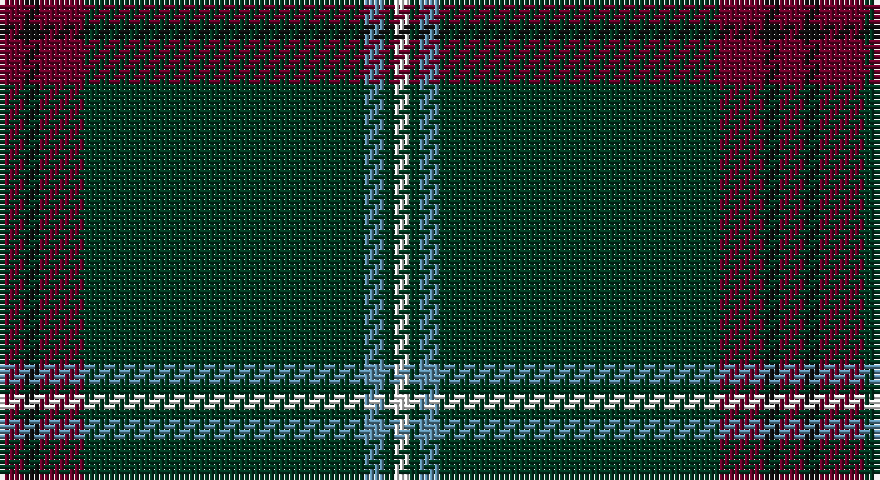

This page is one **sett** — a single exact thread-count. It belongs to the [tartan](/setts/dr5k3dr9dg56t4dg2w3/)
(the same proportion at any scale), whose colour order is pattern [BKBGBGW](/stripes/bkbgbgw/).

Sourced from tartans-authority.  It is a [7 stripe tartan](/stripes/stripes7/).

Original link http://www.tartansauthority.com/tartan-ferret/display/11153/

## Register references

External register numbers recorded for this tartan.

- Scottish Register of Tartans: [11153](https://www.tartanregister.gov.uk/tartanDetails?ref=11153)
- Scottish Tartans Authority (ITI): 11153

## Thread count
DR/5 K3 DR9 DG56 B4 DG2 W/3

One full sett is **156 threads**.

## Palette

Palette: <strong>Tartan Register</strong>
<table><thead><tr><th>Colour</th><th>Threads</th><th>Shade</th><th>Base</th><th>OKLCh</th></tr></thead><tbody><tr><td>DR/</td><td style="text-align:right;font-variant-numeric:tabular-nums">5</td><td><code style="background-color:#680028;">#680028</code> <small style="color:#888">#680028</small></td><td>B <code style="background-color:#2A418A;">#2A418A</code></td><td><small style="color:#888">oklch(33.1% 0.133 8.3)</small></td></tr><tr><td>K</td><td style="text-align:right;font-variant-numeric:tabular-nums">3</td><td><code style="background-color:#101010;">#101010</code> <small style="color:#888">#101010</small></td><td>K <code style="background-color:#000000;">#000000</code></td><td><small style="color:#888">oklch(17.3% 0.000 89.9)</small></td></tr><tr><td>DR</td><td style="text-align:right;font-variant-numeric:tabular-nums">9</td><td><code style="background-color:#680028;">#680028</code> <small style="color:#888">#680028</small></td><td>B <code style="background-color:#2A418A;">#2A418A</code></td><td><small style="color:#888">oklch(33.1% 0.133 8.3)</small></td></tr><tr><td>DG</td><td style="text-align:right;font-variant-numeric:tabular-nums">56</td><td><code style="background-color:#003820;">#003820</code> <small style="color:#888">#003820</small></td><td>G <code style="background-color:#006100;">#006100</code></td><td><small style="color:#888">oklch(30.0% 0.070 158.3)</small></td></tr><tr><td>B</td><td style="text-align:right;font-variant-numeric:tabular-nums">4</td><td><code style="background-color:#5C8CA8;">#5C8CA8</code> <small style="color:#888">#5C8CA8</small></td><td>B <code style="background-color:#2A418A;">#2A418A</code></td><td><small style="color:#888">oklch(61.7% 0.067 235.0)</small></td></tr><tr><td>DG</td><td style="text-align:right;font-variant-numeric:tabular-nums">2</td><td><code style="background-color:#003820;">#003820</code> <small style="color:#888">#003820</small></td><td>G <code style="background-color:#006100;">#006100</code></td><td><small style="color:#888">oklch(30.0% 0.070 158.3)</small></td></tr><tr><td>W/</td><td style="text-align:right;font-variant-numeric:tabular-nums">3</td><td><code style="background-color:#FCFCFC;">#FCFCFC</code> <small style="color:#888">#FCFCFC</small></td><td>W <code style="background-color:#F7F7F7;">#F7F7F7</code></td><td><small style="color:#888">oklch(99.1% 0.000 89.9)</small></td></tr></tbody></table>

# Sample pattern

## Nearest tartans

The nearest existing variants by ΔTartan distance, with this tartan at the top so the swatches line up against it.

ΔTartan

Tartan

Sett

—

<a href="/ttd/edit/#slug=dr5k3dr9dg56t4dg2w3">MTV</a> <a class="nn-out" href="/variants/s7/dr5k3dr9dg56t4dg2w3/" title="open its dictionary page">↗</a>

0.55

<a href="/ttd/edit/#slug=r5k3r9dg56t4dg2w3&amp;base=dr5k3dr9dg56t4dg2w3">MTV</a> <a class="nn-out" href="/variants/s7/r5k3r9dg56t4dg2w3/" title="open its dictionary page">↗</a>

0.97

<a href="/ttd/edit/#slug=w3m11db4m6dg48o2dg3o2~x2&amp;base=dr5k3dr9dg56t4dg2w3">Hall, from Springbrook and Newtown (Personal)</a> <a class="nn-out" href="/variants/s8/w3m11db4m6dg48o2dg3o2~x2/" title="open its dictionary page">↗</a>

1.04

<a href="/ttd/edit/#slug=dt3g6dt2ly3dt42k6w3~x2&amp;base=dr5k3dr9dg56t4dg2w3">Bro-sant-Brieg</a> <a class="nn-out" href="/variants/s7/dt3g6dt2ly3dt42k6w3~x2/" title="open its dictionary page">↗</a>

1.20

<a href="/ttd/edit/#slug=dg68k2dg2k2dg2lo8r8k8lo2db7~x2&amp;base=dr5k3dr9dg56t4dg2w3">Moran Family Ubique</a> <a class="nn-out" href="/variants/s10/dg68k2dg2k2dg2lo8r8k8lo2db7~x2/" title="open its dictionary page">↗</a>

1.24

<a href="/ttd/edit/#slug=k2w2dt8k4dg33r2dg16w2~x2&amp;base=dr5k3dr9dg56t4dg2w3">Sarros, Terrence (USA) (Personal)</a> <a class="nn-out" href="/variants/s8/k2w2dt8k4dg33r2dg16w2~x2/" title="open its dictionary page">↗</a>

1.36

<a href="/ttd/edit/#slug=dt18w2k1w4dg13dt40r2~x2&amp;base=dr5k3dr9dg56t4dg2w3">Puxty-Dunne</a> <a class="nn-out" href="/variants/s7/dt18w2k1w4dg13dt40r2~x2/" title="open its dictionary page">↗</a>

1.36

<a href="/ttd/edit/#slug=y5ly1k5dg46k5r3~x2&amp;base=dr5k3dr9dg56t4dg2w3">Touch</a> <a class="nn-out" href="/variants/s6/y5ly1k5dg46k5r3~x2/" title="open its dictionary page">↗</a>

1.38

<a href="/ttd/edit/#slug=n4ly1k4dg32k4r2~x2&amp;base=dr5k3dr9dg56t4dg2w3">Tough (Personal)</a> <a class="nn-out" href="/variants/s6/n4ly1k4dg32k4r2~x2/" title="open its dictionary page">↗</a>

1.39

<a href="/ttd/edit/#slug=k50dg7k4w2k2ly2k2dg7k2dgi3ly2~x2&amp;base=dr5k3dr9dg56t4dg2w3">Initial City Link #2</a> <a class="nn-out" href="/variants/s11/k50dg7k4w2k2ly2k2dg7k2dgi3ly2~x2/" title="open its dictionary page">↗</a>

1.41

<a href="/ttd/edit/#slug=dt60lr11oi5n5k1o4~x2&amp;base=dr5k3dr9dg56t4dg2w3">Christie (London) Hunting</a> <a class="nn-out" href="/variants/s6/dt60lr11oi5n5k1o4~x2/" title="open its dictionary page">↗</a>

## Neighbour map

Every grey dot is one of 14360 variants placed by the first two principal components of the ΔTartan feature space (44% of its variance). Red is this tartan; blue dots are its nearest — click one to open its page.

<svg viewBox="0 0 640 380" role="img" style="max-width:100%;height:auto;border:1px solid #e0e0e0;border-radius:4px;display:block" xmlns="http://www.w3.org/2000/svg"><image href="/nn/cloud.v1.png" width="640" height="380"/><a href="/variants/s7/r5k3r9dg56t4dg2w3/"><circle cx="470.0" cy="132.0" r="4" fill="#3465a4"><title>MTV</title></circle></a><a href="/variants/s8/w3m11db4m6dg48o2dg3o2~x2/"><circle cx="426.6" cy="138.0" r="4" fill="#3465a4"><title>Hall, from Springbrook and Newtown (Personal)</title></circle></a><a href="/variants/s7/dt3g6dt2ly3dt42k6w3~x2/"><circle cx="455.0" cy="147.0" r="4" fill="#3465a4"><title>Bro-sant-Brieg</title></circle></a><a href="/variants/s10/dg68k2dg2k2dg2lo8r8k8lo2db7~x2/"><circle cx="441.7" cy="104.0" r="4" fill="#3465a4"><title>Moran Family Ubique</title></circle></a><a href="/variants/s8/k2w2dt8k4dg33r2dg16w2~x2/"><circle cx="430.4" cy="171.0" r="4" fill="#3465a4"><title>Sarros, Terrence (USA) (Personal)</title></circle></a><a href="/variants/s7/dt18w2k1w4dg13dt40r2~x2/"><circle cx="503.3" cy="152.9" r="4" fill="#3465a4"><title>Puxty-Dunne</title></circle></a><a href="/variants/s6/y5ly1k5dg46k5r3~x2/"><circle cx="482.0" cy="129.0" r="4" fill="#3465a4"><title>Touch</title></circle></a><a href="/variants/s6/n4ly1k4dg32k4r2~x2/"><circle cx="441.6" cy="143.1" r="4" fill="#3465a4"><title>Tough (Personal)</title></circle></a><a href="/variants/s11/k50dg7k4w2k2ly2k2dg7k2dgi3ly2~x2/"><circle cx="477.6" cy="112.2" r="4" fill="#3465a4"><title>Initial City Link #2</title></circle></a><a href="/variants/s6/dt60lr11oi5n5k1o4~x2/"><circle cx="470.0" cy="109.1" r="4" fill="#3465a4"><title>Christie (London) Hunting</title></circle></a><circle cx="478.3" cy="138.5" r="5" fill="#c00000"/></svg>

ID: /variants/s7/dr5k3dr9dg56t4dg2w3/
