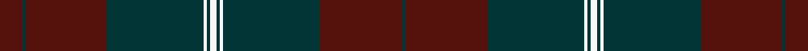

This page is one **sett** — a single exact thread-count. It belongs to the [tartan](/setts/dr7dt1dr26dt31w1dt1w2/)
(the same proportion at any scale), whose colour order is pattern [BBBBWBWBWBBB](/stripes/bbbbwbwbwbbb/).

Sourced from register-of-tartans.  It is a [12 stripe tartan](/stripes/stripes12/).

Original link https://www.tartanregister.gov.uk/tartanDetails.aspx?ref=1522

2 attestations — the source records this cloth was collapsed from (oldest owns this page)

<ul>
<li>01/01/2000 — Greater Victoria Police PB (register-of-tartans, <a href="https://www.tartanregister.gov.uk/tartanDetails.aspx?ref=1522">record</a>)  <em>Instead of adopting an existing tartan, the executive decided to create its own history by designing a tartan of its own. The tartan's blue and red is representative of the police organizations in the Greater Victoria area. The white stripes are significant in that they denote Queen Victoria's colonial police force. The colonial police predated any other police organization on Vancouver Island.' Through Burnett's & Struth of Ontario. Lochcarron swatch.</em></li>
<li>2000 circa — Greater Victoria Police PB (Corp) (tartans-authority, <a href="http://www.tartansauthority.com/tartan-ferret/display/6429/">record</a>)  <em>"Instead of adopting an existing tartan the executive decided to create its own history by designing a tartan of its own. The tartan?s blue and red is representative of the police organizations in the Greater Victoria area. The white stripes are significant in that they denote Queen Victoria?s colonial police force. The colonial police predated any other police organization on Vancouver Island." Through Burnett's & Struth of Ontario. Lochcarron swatch.</em></li>
</ul>

## Register references

External register numbers recorded for this tartan.

- Scottish Register of Tartans: [1522](https://www.tartanregister.gov.uk/tartanDetails.aspx?ref=1522)
- Scottish Tartans Authority (ITI): 6429

## Thread count
DR/14 DT2 DR52 DT62 W2 DT2 W4 DT2 W2 DT62 DR52 DT/2

One full sett is **500 threads**.

## Palette
<table><thead><tr><th>Colour</th><th>Shade</th><th>OKLCh</th></tr></thead><tbody><tr><td>DN</td><td><code style="background-color:#023535;">#023535</code> <small style="color:#888">#023535</small></td><td><small style="color:#888">oklch(29.8% 0.050 194.8)</small></td></tr><tr><td>DR</td><td><code style="background-color:#55120C;">#55120C</code> <small style="color:#888">#55120C</small></td><td><small style="color:#888">oklch(30.0% 0.099 29.3)</small></td></tr><tr><td>K</td><td><code style="background-color:#000000;">#000000</code> <small style="color:#888">#000000</small></td><td><small style="color:#888">oklch(0.0% 0.000 0.0)</small></td></tr><tr><td>LN</td><td><code style="background-color:#F7F7F7;">#F7F7F7</code> <small style="color:#888">#F7F7F7</small></td><td><small style="color:#888">oklch(97.6% 0.000 89.9)</small></td></tr><tr><td>R</td><td><code style="background-color:#D60020;">#D60020</code> <small style="color:#888">#D60020</small></td><td><small style="color:#888">oklch(55.2% 0.224 25.5)</small></td></tr></tbody></table>

# Sample pattern

ID: /variants/s7/dr7dt1dr26dt31w1dt1w2~x2/
