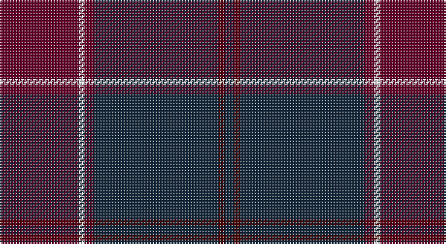

This page is one **sett** — a single exact thread-count. It belongs to the [tartan](/setts/dri26w2dri3dt15dt26dr2dt3/)
(the same proportion at any scale), whose colour order is pattern [BBBBBWB](/stripes/bbbbbwb/).

Part of the [Gavin](/tartans/gavin/) tartan — the named design grouping this sett with its other cloths.

Sourced from register-of-tartans.  It is a [7 stripe tartan](/stripes/stripes7/).

Original link https://www.tartanregister.gov.uk/tartanDetails.aspx?ref=1318

## Register references

External register numbers recorded for this tartan.

- Scottish Register of Tartans: [1318](https://www.tartanregister.gov.uk/tartanDetails.aspx?ref=1318)
- Scottish Tartans Authority (ITI): 4960

## Thread count
DRa/52 W4 DRa6 DN30 DN52 DR4 DN/6

One full sett is **250 threads**.

## Palette

Palette: <strong>Tartan Register</strong>
<table><thead><tr><th>Colour</th><th>Threads</th><th>Shade</th><th>Base</th><th>OKLCh</th></tr></thead><tbody><tr><td>DRa/</td><td style="text-align:right;font-variant-numeric:tabular-nums">52</td><td><code style="background-color:#680028;">#680028</code> <small style="color:#888">#680028</small></td><td>B <code style="background-color:#2A418A;">#2A418A</code></td><td><small style="color:#888">oklch(33.1% 0.133 8.3)</small></td></tr><tr><td>W</td><td style="text-align:right;font-variant-numeric:tabular-nums">4</td><td><code style="background-color:#FCFCFC;">#FCFCFC</code> <small style="color:#888">#FCFCFC</small></td><td>W <code style="background-color:#F7F7F7;">#F7F7F7</code></td><td><small style="color:#888">oklch(99.1% 0.000 89.9)</small></td></tr><tr><td>DRa</td><td style="text-align:right;font-variant-numeric:tabular-nums">6</td><td><code style="background-color:#680028;">#680028</code> <small style="color:#888">#680028</small></td><td>B <code style="background-color:#2A418A;">#2A418A</code></td><td><small style="color:#888">oklch(33.1% 0.133 8.3)</small></td></tr><tr><td>DN</td><td style="text-align:right;font-variant-numeric:tabular-nums">30</td><td><code style="background-color:#14283C;">#14283C</code> <small style="color:#888">#14283C</small></td><td>B <code style="background-color:#2A418A;">#2A418A</code></td><td><small style="color:#888">oklch(27.1% 0.046 249.9)</small></td></tr><tr><td>DN</td><td style="text-align:right;font-variant-numeric:tabular-nums">52</td><td><code style="background-color:#14283C;">#14283C</code> <small style="color:#888">#14283C</small></td><td>B <code style="background-color:#2A418A;">#2A418A</code></td><td><small style="color:#888">oklch(27.1% 0.046 249.9)</small></td></tr><tr><td>DR</td><td style="text-align:right;font-variant-numeric:tabular-nums">4</td><td><code style="background-color:#4C0000;">#4C0000</code> <small style="color:#888">#4C0000</small></td><td>B <code style="background-color:#2A418A;">#2A418A</code></td><td><small style="color:#888">oklch(26.2% 0.107 29.2)</small></td></tr><tr><td>DN/</td><td style="text-align:right;font-variant-numeric:tabular-nums">6</td><td><code style="background-color:#14283C;">#14283C</code> <small style="color:#888">#14283C</small></td><td>B <code style="background-color:#2A418A;">#2A418A</code></td><td><small style="color:#888">oklch(27.1% 0.046 249.9)</small></td></tr></tbody></table>

# Sample pattern

## Nearest tartans

The nearest existing variants by ΔTartan distance, with this tartan at the top so the swatches line up against it.

ΔTartan

Tartan

Sett

—

<a href="/ttd/edit/#slug=dri26w2dri3dt15dt26dr2dt3~x2">Gavin</a> <a class="nn-out" href="/variants/s7/dri26w2dri3dt15dt26dr2dt3~x2/" title="open its dictionary page">↗</a>

1.09

<a href="/ttd/edit/#slug=dy11db1dy3dbi1db9r1~x4&amp;base=dri26w2dri3dt15dt26dr2dt3~x2">Dege of Saville Row</a> <a class="nn-out" href="/variants/s6/dy11db1dy3dbi1db9r1~x4/" title="open its dictionary page">↗</a>

1.18

<a href="/ttd/edit/#slug=do3db3do3db27do40ly3&amp;base=dri26w2dri3dt15dt26dr2dt3~x2">Keeper of the Quaich Corporate Tartan</a> <a class="nn-out" href="/variants/s6/do3db3do3db27do40ly3/" title="open its dictionary page">↗</a>

1.39

<a href="/ttd/edit/#slug=k10db4k34dt2k2dt30w3~x2&amp;base=dri26w2dri3dt15dt26dr2dt3~x2">Patriot, The (Fashion)</a> <a class="nn-out" href="/variants/s7/k10db4k34dt2k2dt30w3~x2/" title="open its dictionary page">↗</a>

1.43

<a href="/ttd/edit/#slug=db50do4db12do23ly4do4~x2&amp;base=dri26w2dri3dt15dt26dr2dt3~x2">Sligo, County</a> <a class="nn-out" href="/variants/s6/db50do4db12do23ly4do4~x2/" title="open its dictionary page">↗</a>

1.44

<a href="/ttd/edit/#slug=k4r2k12db12k1lo2~x2&amp;base=dri26w2dri3dt15dt26dr2dt3~x2">Robert Gordon University</a> <a class="nn-out" href="/variants/s6/k4r2k12db12k1lo2~x2/" title="open its dictionary page">↗</a>

1.47

<a href="/ttd/edit/#slug=lo4do37db17do4db8do6r2do5db2do3lo4&amp;base=dri26w2dri3dt15dt26dr2dt3~x2">Griffiths Welsh Name Tartan</a> <a class="nn-out" href="/variants/s11/lo4do37db17do4db8do6r2do5db2do3lo4/" title="open its dictionary page">↗</a>

1.50

<a href="/ttd/edit/#slug=dy15r5dy30db32dy4ly3~x2&amp;base=dri26w2dri3dt15dt26dr2dt3~x2">Cameron Hunting Brown Clan Tartan</a> <a class="nn-out" href="/variants/s6/dy15r5dy30db32dy4ly3~x2/" title="open its dictionary page">↗</a>

1.50

<a href="/ttd/edit/#slug=k26r6dg16k8dg3r2~x2&amp;base=dri26w2dri3dt15dt26dr2dt3~x2">Perthshire Tourist Board</a> <a class="nn-out" href="/variants/s6/k26r6dg16k8dg3r2~x2/" title="open its dictionary page">↗</a>

1.50

<a href="/ttd/edit/#slug=dy3db3dy3db27dy40y3&amp;base=dri26w2dri3dt15dt26dr2dt3~x2">Keeper of the Quaich</a> <a class="nn-out" href="/variants/s6/dy3db3dy3db27dy40y3/" title="open its dictionary page">↗</a>

1.52

<a href="/ttd/edit/#slug=dp18dg24k3db6dp2db5dp18~x2&amp;base=dri26w2dri3dt15dt26dr2dt3~x2">Saorsa</a> <a class="nn-out" href="/variants/s7/dp18dg24k3db6dp2db5dp18~x2/" title="open its dictionary page">↗</a>

## Neighbour map

Every grey dot is one of 14360 variants placed by the first two principal components of the ΔTartan feature space (44% of its variance). Red is this tartan; blue dots are its nearest — click one to open its page.

<svg viewBox="0 0 640 380" role="img" style="max-width:100%;height:auto;border:1px solid #e0e0e0;border-radius:4px;display:block" xmlns="http://www.w3.org/2000/svg"><image href="/nn/cloud.v1.png" width="640" height="380"/><a href="/variants/s6/dy11db1dy3dbi1db9r1~x4/"><circle cx="399.4" cy="245.6" r="4" fill="#3465a4"><title>Dege of Saville Row</title></circle></a><a href="/variants/s6/do3db3do3db27do40ly3/"><circle cx="457.4" cy="239.2" r="4" fill="#3465a4"><title>Keeper of the Quaich Corporate Tartan</title></circle></a><a href="/variants/s7/k10db4k34dt2k2dt30w3~x2/"><circle cx="388.5" cy="211.4" r="4" fill="#3465a4"><title>Patriot, The (Fashion)</title></circle></a><a href="/variants/s6/db50do4db12do23ly4do4~x2/"><circle cx="472.0" cy="248.4" r="4" fill="#3465a4"><title>Sligo, County</title></circle></a><a href="/variants/s6/k4r2k12db12k1lo2~x2/"><circle cx="338.6" cy="238.5" r="4" fill="#3465a4"><title>Robert Gordon University</title></circle></a><a href="/variants/s11/lo4do37db17do4db8do6r2do5db2do3lo4/"><circle cx="429.1" cy="176.9" r="4" fill="#3465a4"><title>Griffiths Welsh Name Tartan</title></circle></a><a href="/variants/s6/dy15r5dy30db32dy4ly3~x2/"><circle cx="355.4" cy="235.9" r="4" fill="#3465a4"><title>Cameron Hunting Brown Clan Tartan</title></circle></a><a href="/variants/s6/k26r6dg16k8dg3r2~x2/"><circle cx="405.0" cy="262.3" r="4" fill="#3465a4"><title>Perthshire Tourist Board</title></circle></a><a href="/variants/s6/dy3db3dy3db27dy40y3/"><circle cx="471.9" cy="248.1" r="4" fill="#3465a4"><title>Keeper of the Quaich</title></circle></a><a href="/variants/s7/dp18dg24k3db6dp2db5dp18~x2/"><circle cx="335.2" cy="249.2" r="4" fill="#3465a4"><title>Saorsa</title></circle></a><circle cx="411.7" cy="229.5" r="5" fill="#c00000"/></svg>

ID: /variants/s7/dri26w2dri3dt15dt26dr2dt3~x2/
