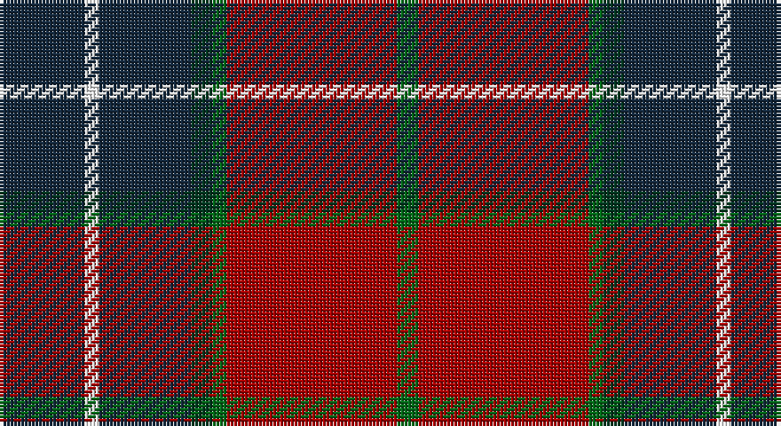

This page is one **sett** — a single exact thread-count. It belongs to the [tartan](/setts/dt12w2dt13dg3g2r24g3/)
(the same proportion at any scale), whose colour order is pattern [BWBGGRG](/stripes/bwbggrg/).

Sourced from tartans-authority.  It is a [7 stripe tartan](/stripes/stripes7/).

Original link http://www.tartansauthority.com/tartan-ferret/display/7879/

## Register references

External register numbers recorded for this tartan.

- Scottish Tartans Authority (ITI): 7879

## Thread count
DN/24 W4 DN26 DG6 G4 DR48 G/6

One full sett is **206 threads**.

## Palette

Palette: <strong>Tartan Register</strong> <small style="color:#888">(4 of 5 colours)</small>
<table><thead><tr><th>Colour</th><th>Threads</th><th>Shade</th><th>Base</th><th>OKLCh</th></tr></thead><tbody><tr><td>DN/</td><td style="text-align:right;font-variant-numeric:tabular-nums">24</td><td><code style="background-color:#14283C;">#14283C</code> <small style="color:#888">#14283C</small></td><td>B <code style="background-color:#2A418A;">#2A418A</code></td><td><small style="color:#888">oklch(27.1% 0.046 249.9)</small></td></tr><tr><td>W</td><td style="text-align:right;font-variant-numeric:tabular-nums">4</td><td><code style="background-color:#FCFCFC;">#FCFCFC</code> <small style="color:#888">#FCFCFC</small></td><td>W <code style="background-color:#F7F7F7;">#F7F7F7</code></td><td><small style="color:#888">oklch(99.1% 0.000 89.9)</small></td></tr><tr><td>DN</td><td style="text-align:right;font-variant-numeric:tabular-nums">26</td><td><code style="background-color:#14283C;">#14283C</code> <small style="color:#888">#14283C</small></td><td>B <code style="background-color:#2A418A;">#2A418A</code></td><td><small style="color:#888">oklch(27.1% 0.046 249.9)</small></td></tr><tr><td>DG</td><td style="text-align:right;font-variant-numeric:tabular-nums">6</td><td><code style="background-color:#003820;">#003820</code> <small style="color:#888">#003820</small></td><td>G <code style="background-color:#006100;">#006100</code></td><td><small style="color:#888">oklch(30.0% 0.070 158.3)</small></td></tr><tr><td>G</td><td style="text-align:right;font-variant-numeric:tabular-nums">4</td><td><code style="background-color:#006818;">#006818</code> <small style="color:#888">#006818</small></td><td>G <code style="background-color:#006100;">#006100</code></td><td><small style="color:#888">oklch(45.0% 0.142 145.0)</small></td></tr><tr><td>DR</td><td style="text-align:right;font-variant-numeric:tabular-nums">48</td><td><code style="background-color:#A40000;">#A40000</code> <small style="color:#888">#A40000</small></td><td>R <code style="background-color:#CC0000;">#CC0000</code></td><td><small style="color:#888">oklch(45.1% 0.185 29.2)</small></td></tr><tr><td>G/</td><td style="text-align:right;font-variant-numeric:tabular-nums">6</td><td><code style="background-color:#006818;">#006818</code> <small style="color:#888">#006818</small></td><td>G <code style="background-color:#006100;">#006100</code></td><td><small style="color:#888">oklch(45.0% 0.142 145.0)</small></td></tr></tbody></table>

# Sample pattern

## Nearest tartans

The nearest existing variants by ΔTartan distance, with this tartan at the top so the swatches line up against it.

ΔTartan

Tartan

Sett

—

<a href="/ttd/edit/#slug=dt12w2dt13dg3g2r24g3~x2">Wellmont Foundation (Corporate)</a> <a class="nn-out" href="/variants/s7/dt12w2dt13dg3g2r24g3~x2/" title="open its dictionary page">↗</a>

0.98

<a href="/ttd/edit/#slug=db4r11db1g8r2g4k1lo2~x4&amp;base=dt12w2dt13dg3g2r24g3~x2">Craik of Assington (Personal)</a> <a class="nn-out" href="/variants/s8/db4r11db1g8r2g4k1lo2~x4/" title="open its dictionary page">↗</a>

1.01

<a href="/ttd/edit/#slug=r2y18k2y3k20dy30w2~x2&amp;base=dt12w2dt13dg3g2r24g3~x2">Bennett, J P. (Personal)</a> <a class="nn-out" href="/variants/s7/r2y18k2y3k20dy30w2~x2/" title="open its dictionary page">↗</a>

1.10

<a href="/ttd/edit/#slug=r3db1r12o3dg12lb1dg2~x4&amp;base=dt12w2dt13dg3g2r24g3~x2">Leckie (Personal)</a> <a class="nn-out" href="/variants/s7/r3db1r12o3dg12lb1dg2~x4/" title="open its dictionary page">↗</a>

1.11

<a href="/ttd/edit/#slug=n47r8k22r7lb3r24n9r10lo3~x2&amp;base=dt12w2dt13dg3g2r24g3~x2">Ulster Ancestry (Fashion)</a> <a class="nn-out" href="/variants/s9/n47r8k22r7lb3r24n9r10lo3~x2/" title="open its dictionary page">↗</a>

1.11

<a href="/ttd/edit/#slug=lo6k5r4k48dy36loi6&amp;base=dt12w2dt13dg3g2r24g3~x2">Drambuie Hunting</a> <a class="nn-out" href="/variants/s6/lo6k5r4k48dy36loi6/" title="open its dictionary page">↗</a>

1.11

<a href="/ttd/edit/#slug=n8w3n25k3n4k8r31ly2r5~x2&amp;base=dt12w2dt13dg3g2r24g3~x2">Caledon (Corporate)</a> <a class="nn-out" href="/variants/s9/n8w3n25k3n4k8r31ly2r5~x2/" title="open its dictionary page">↗</a>

1.12

<a href="/ttd/edit/#slug=dp18k7g5r4g7k1ly2~x2&amp;base=dt12w2dt13dg3g2r24g3~x2">Regent</a> <a class="nn-out" href="/variants/s7/dp18k7g5r4g7k1ly2~x2/" title="open its dictionary page">↗</a>

1.14

<a href="/ttd/edit/#slug=dg12g6dg6r15k1r1k2~x2&amp;base=dt12w2dt13dg3g2r24g3~x2">Cook (Name)</a> <a class="nn-out" href="/variants/s7/dg12g6dg6r15k1r1k2~x2/" title="open its dictionary page">↗</a>

1.14

<a href="/ttd/edit/#slug=lb1k1r10g10k5lb5r10k1lb1~x4&amp;base=dt12w2dt13dg3g2r24g3~x2">Graham of Montrose Red</a> <a class="nn-out" href="/variants/s9/lb1k1r10g10k5lb5r10k1lb1~x4/" title="open its dictionary page">↗</a>

1.16

<a href="/ttd/edit/#slug=dp3r3dp34g18lo2g18lb2r3~x2&amp;base=dt12w2dt13dg3g2r24g3~x2">Singh</a> <a class="nn-out" href="/variants/s8/dp3r3dp34g18lo2g18lb2r3~x2/" title="open its dictionary page">↗</a>

## Neighbour map

Every grey dot is one of 14360 variants placed by the first two principal components of the ΔTartan feature space (44% of its variance). Red is this tartan; blue dots are its nearest — click one to open its page.

<svg viewBox="0 0 640 380" role="img" style="max-width:100%;height:auto;border:1px solid #e0e0e0;border-radius:4px;display:block" xmlns="http://www.w3.org/2000/svg"><image href="/nn/cloud.v1.png" width="640" height="380"/><a href="/variants/s8/db4r11db1g8r2g4k1lo2~x4/"><circle cx="208.9" cy="187.6" r="4" fill="#3465a4"><title>Craik of Assington (Personal)</title></circle></a><a href="/variants/s7/r2y18k2y3k20dy30w2~x2/"><circle cx="231.9" cy="173.1" r="4" fill="#3465a4"><title>Bennett, J P. (Personal)</title></circle></a><a href="/variants/s7/r3db1r12o3dg12lb1dg2~x4/"><circle cx="274.4" cy="181.5" r="4" fill="#3465a4"><title>Leckie (Personal)</title></circle></a><a href="/variants/s9/n47r8k22r7lb3r24n9r10lo3~x2/"><circle cx="253.2" cy="156.3" r="4" fill="#3465a4"><title>Ulster Ancestry (Fashion)</title></circle></a><a href="/variants/s6/lo6k5r4k48dy36loi6/"><circle cx="300.3" cy="190.7" r="4" fill="#3465a4"><title>Drambuie Hunting</title></circle></a><a href="/variants/s9/n8w3n25k3n4k8r31ly2r5~x2/"><circle cx="245.9" cy="142.2" r="4" fill="#3465a4"><title>Caledon (Corporate)</title></circle></a><a href="/variants/s7/dp18k7g5r4g7k1ly2~x2/"><circle cx="215.0" cy="170.7" r="4" fill="#3465a4"><title>Regent</title></circle></a><a href="/variants/s7/dg12g6dg6r15k1r1k2~x2/"><circle cx="252.7" cy="191.8" r="4" fill="#3465a4"><title>Cook (Name)</title></circle></a><a href="/variants/s9/lb1k1r10g10k5lb5r10k1lb1~x4/"><circle cx="198.3" cy="173.1" r="4" fill="#3465a4"><title>Graham of Montrose Red</title></circle></a><a href="/variants/s8/dp3r3dp34g18lo2g18lb2r3~x2/"><circle cx="287.8" cy="155.2" r="4" fill="#3465a4"><title>Singh</title></circle></a><circle cx="248.0" cy="180.5" r="5" fill="#c00000"/></svg>

ID: /variants/s7/dt12w2dt13dg3g2r24g3~x2/
