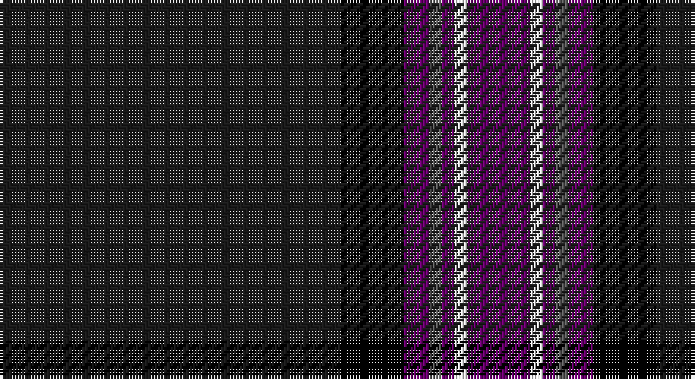

This page is one **sett** — a single exact thread-count. It belongs to the [tartan](/setts/dt27k5dp2n1dp1w1dp5/)
(the same proportion at any scale), whose colour order is pattern [BKBBBWB](/stripes/bkbbbwb/).

Part of the [Caledonian Mist](/tartans/caledonian-mist/) tartan — the named design grouping this sett with its other cloths.

Sourced from register-of-tartans.  It is a [7 stripe tartan](/stripes/stripes7/).

Original link https://www.tartanregister.gov.uk/tartanDetails.aspx?ref=11287

## Register references

External register numbers recorded for this tartan.

- Scottish Register of Tartans: [11287](https://www.tartanregister.gov.uk/tartanDetails.aspx?ref=11287)

## Thread count
Ka/108 K20 P8 N4 P4 W4 P/20

One full sett is **208 threads**.

## Palette

Palette: <strong>Tartan Register</strong> <small style="color:#888">(4 of 5 colours)</small>
<table><thead><tr><th>Colour</th><th>Threads</th><th>Shade</th><th>Base</th><th>OKLCh</th></tr></thead><tbody><tr><td>Ka/</td><td style="text-align:right;font-variant-numeric:tabular-nums">108</td><td><code style="background-color:#1C1C1C;">#1C1C1C</code> <small style="color:#888">#1C1C1C</small></td><td>B <code style="background-color:#2A418A;">#2A418A</code></td><td><small style="color:#888">oklch(22.6% 0.000 89.9)</small></td></tr><tr><td>K</td><td style="text-align:right;font-variant-numeric:tabular-nums">20</td><td><code style="background-color:#000000;">#000000</code> <small style="color:#888">#000000</small></td><td>K <code style="background-color:#000000;">#000000</code></td><td><small style="color:#888">oklch(0.0% 0.000 0.0)</small></td></tr><tr><td>P</td><td style="text-align:right;font-variant-numeric:tabular-nums">8</td><td><code style="background-color:#6C0070;">#6C0070</code> <small style="color:#888">#6C0070</small></td><td>B <code style="background-color:#2A418A;">#2A418A</code></td><td><small style="color:#888">oklch(37.6% 0.174 326.5)</small></td></tr><tr><td>N</td><td style="text-align:right;font-variant-numeric:tabular-nums">4</td><td><code style="background-color:#5C5C5C;">#5C5C5C</code> <small style="color:#888">#5C5C5C</small></td><td>B <code style="background-color:#2A418A;">#2A418A</code></td><td><small style="color:#888">oklch(47.5% 0.000 89.9)</small></td></tr><tr><td>P</td><td style="text-align:right;font-variant-numeric:tabular-nums">4</td><td><code style="background-color:#6C0070;">#6C0070</code> <small style="color:#888">#6C0070</small></td><td>B <code style="background-color:#2A418A;">#2A418A</code></td><td><small style="color:#888">oklch(37.6% 0.174 326.5)</small></td></tr><tr><td>W</td><td style="text-align:right;font-variant-numeric:tabular-nums">4</td><td><code style="background-color:#FCFCFC;">#FCFCFC</code> <small style="color:#888">#FCFCFC</small></td><td>W <code style="background-color:#F7F7F7;">#F7F7F7</code></td><td><small style="color:#888">oklch(99.1% 0.000 89.9)</small></td></tr><tr><td>P/</td><td style="text-align:right;font-variant-numeric:tabular-nums">20</td><td><code style="background-color:#6C0070;">#6C0070</code> <small style="color:#888">#6C0070</small></td><td>B <code style="background-color:#2A418A;">#2A418A</code></td><td><small style="color:#888">oklch(37.6% 0.174 326.5)</small></td></tr></tbody></table>

# Sample pattern

## Nearest tartans

The nearest existing variants by ΔTartan distance, with this tartan at the top so the swatches line up against it.

ΔTartan

Tartan

Sett

—

<a href="/ttd/edit/#slug=dt27k5dp2n1dp1w1dp5~x4">Caledonian Mist</a> <a class="nn-out" href="/variants/s7/dt27k5dp2n1dp1w1dp5~x4/" title="open its dictionary page">↗</a>

0.92

<a href="/ttd/edit/#slug=lo2k3db6r4k48r4db6k3lb2~x2&amp;base=dt27k5dp2n1dp1w1dp5~x4">Highland Park</a> <a class="nn-out" href="/variants/s9/lo2k3db6r4k48r4db6k3lb2~x2/" title="open its dictionary page">↗</a>

1.30

<a href="/ttd/edit/#slug=dp3k40lr3dp6k10dp10k3lr1o3~x2&amp;base=dt27k5dp2n1dp1w1dp5~x4">Midnight Glen (Fashion)</a> <a class="nn-out" href="/variants/s9/dp3k40lr3dp6k10dp10k3lr1o3~x2/" title="open its dictionary page">↗</a>

1.31

<a href="/variants/s9/db5r3db21ki5db5ki40k2ki2w1~x2/">MacNeill</a>

1.36

<a href="/variants/s7/r4ki9dg9k40r2k2w2~x2/">Genet, Edmond Charles 'Citizen' (Personal)</a>

1.37

<a href="/ttd/edit/#slug=g3db16k3dp2k45r1k2lo3~x2&amp;base=dt27k5dp2n1dp1w1dp5~x4">Cumnock (District)</a> <a class="nn-out" href="/variants/s8/g3db16k3dp2k45r1k2lo3~x2/" title="open its dictionary page">↗</a>

1.40

<a href="/ttd/edit/#slug=lb3k6lbi2k6db2k2db32k2n1~x2&amp;base=dt27k5dp2n1dp1w1dp5~x4">Nocken (Personal)</a> <a class="nn-out" href="/variants/s9/lb3k6lbi2k6db2k2db32k2n1~x2/" title="open its dictionary page">↗</a>

1.44

<a href="/ttd/edit/#slug=r12lo6k88db45k6db6ly6&amp;base=dt27k5dp2n1dp1w1dp5~x4">City of Rome Pipe Band (Corporate)</a> <a class="nn-out" href="/variants/s7/r12lo6k88db45k6db6ly6/" title="open its dictionary page">↗</a>

1.46

<a href="/ttd/edit/#slug=k62b4k7db29k3lo4k3lb4k11b16~x2&amp;base=dt27k5dp2n1dp1w1dp5~x4">State Seal of Massachusetts Fash)</a> <a class="nn-out" href="/variants/s10/k62b4k7db29k3lo4k3lb4k11b16~x2/" title="open its dictionary page">↗</a>

1.48

<a href="/ttd/edit/#slug=lr3k6w2k6dt2k2dt32k2n1~x2&amp;base=dt27k5dp2n1dp1w1dp5~x4">Nocken Blue Modern Tartan (Personal)</a> <a class="nn-out" href="/variants/s9/lr3k6w2k6dt2k2dt32k2n1~x2/" title="open its dictionary page">↗</a>

1.50

<a href="/ttd/edit/#slug=k9n2o2n2k18n2k2lp1n19k33dp2~x2&amp;base=dt27k5dp2n1dp1w1dp5~x4">Pride of Scotland Contemporary</a> <a class="nn-out" href="/variants/s11/k9n2o2n2k18n2k2lp1n19k33dp2~x2/" title="open its dictionary page">↗</a>

## Neighbour map

Every grey dot is one of 14360 variants placed by the first two principal components of the ΔTartan feature space (44% of its variance). Red is this tartan; blue dots are its nearest — click one to open its page.

<svg viewBox="0 0 640 380" role="img" style="max-width:100%;height:auto;border:1px solid #e0e0e0;border-radius:4px;display:block" xmlns="http://www.w3.org/2000/svg"><image href="/nn/cloud.v1.png" width="640" height="380"/><a href="/variants/s9/lo2k3db6r4k48r4db6k3lb2~x2/"><circle cx="467.8" cy="132.8" r="4" fill="#3465a4"><title>Highland Park</title></circle></a><a href="/variants/s9/dp3k40lr3dp6k10dp10k3lr1o3~x2/"><circle cx="476.0" cy="139.4" r="4" fill="#3465a4"><title>Midnight Glen (Fashion)</title></circle></a><a href="/variants/s9/db5r3db21ki5db5ki40k2ki2w1~x2/"><circle cx="410.8" cy="131.1" r="4" fill="#3465a4"><title>MacNeill</title></circle></a><a href="/variants/s7/r4ki9dg9k40r2k2w2~x2/"><circle cx="358.1" cy="147.4" r="4" fill="#3465a4"><title>Genet, Edmond Charles 'Citizen' (Personal)</title></circle></a><a href="/variants/s8/g3db16k3dp2k45r1k2lo3~x2/"><circle cx="438.3" cy="96.2" r="4" fill="#3465a4"><title>Cumnock (District)</title></circle></a><a href="/variants/s9/lb3k6lbi2k6db2k2db32k2n1~x2/"><circle cx="406.6" cy="120.6" r="4" fill="#3465a4"><title>Nocken (Personal)</title></circle></a><a href="/variants/s7/r12lo6k88db45k6db6ly6/"><circle cx="336.3" cy="167.9" r="4" fill="#3465a4"><title>City of Rome Pipe Band (Corporate)</title></circle></a><a href="/variants/s10/k62b4k7db29k3lo4k3lb4k11b16~x2/"><circle cx="353.7" cy="138.8" r="4" fill="#3465a4"><title>State Seal of Massachusetts Fash)</title></circle></a><a href="/variants/s9/lr3k6w2k6dt2k2dt32k2n1~x2/"><circle cx="408.1" cy="125.5" r="4" fill="#3465a4"><title>Nocken Blue Modern Tartan (Personal)</title></circle></a><a href="/variants/s11/k9n2o2n2k18n2k2lp1n19k33dp2~x2/"><circle cx="455.0" cy="133.6" r="4" fill="#3465a4"><title>Pride of Scotland Contemporary</title></circle></a><circle cx="430.7" cy="140.1" r="5" fill="#c00000"/></svg>

ID: /variants/s7/dt27k5dp2n1dp1w1dp5~x4/
