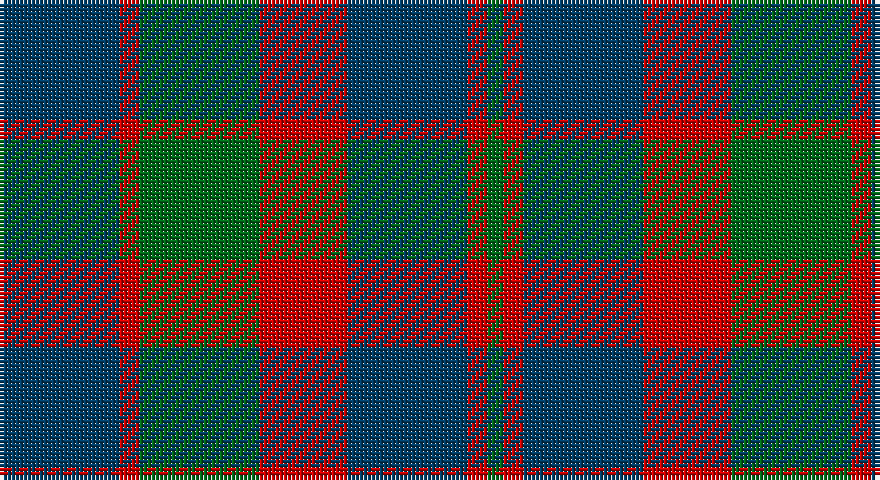

This page is one **sett** — a single exact thread-count. It belongs to the [tartan](/setts/dt30r5g30r22dt30r5g4/)
(the same proportion at any scale), whose colour order is pattern [BRGRBRG](/stripes/brgrbrg/).

Sourced from tartans-authority.  It is a [7 stripe tartan](/stripes/stripes7/).

Original link http://www.tartansauthority.com/tartan-ferret/display/8066/

## Register references

External register numbers recorded for this tartan.

- Scottish Register of Tartans: [8066](https://www.tartanregister.gov.uk/tartanDetails?ref=8066)
- Scottish Tartans Authority (ITI): 8066

## Thread count
DB/30 R5 G30 R22 DB30 R5 G/4

One full sett is **218 threads**.

## Palette

Palette: <strong>Tartan Register</strong>
<table><thead><tr><th>Colour</th><th>Threads</th><th>Shade</th><th>Base</th><th>OKLCh</th></tr></thead><tbody><tr><td>DB/</td><td style="text-align:right;font-variant-numeric:tabular-nums">30</td><td><code style="background-color:#003C64;">#003C64</code> <small style="color:#888">#003C64</small></td><td>B <code style="background-color:#2A418A;">#2A418A</code></td><td><small style="color:#888">oklch(34.5% 0.089 246.0)</small></td></tr><tr><td>R</td><td style="text-align:right;font-variant-numeric:tabular-nums">5</td><td><code style="background-color:#C80000;">#C80000</code> <small style="color:#888">#C80000</small></td><td>R <code style="background-color:#CC0000;">#CC0000</code></td><td><small style="color:#888">oklch(52.3% 0.215 29.2)</small></td></tr><tr><td>G</td><td style="text-align:right;font-variant-numeric:tabular-nums">30</td><td><code style="background-color:#006818;">#006818</code> <small style="color:#888">#006818</small></td><td>G <code style="background-color:#006100;">#006100</code></td><td><small style="color:#888">oklch(45.0% 0.142 145.0)</small></td></tr><tr><td>R</td><td style="text-align:right;font-variant-numeric:tabular-nums">22</td><td><code style="background-color:#C80000;">#C80000</code> <small style="color:#888">#C80000</small></td><td>R <code style="background-color:#CC0000;">#CC0000</code></td><td><small style="color:#888">oklch(52.3% 0.215 29.2)</small></td></tr><tr><td>DB</td><td style="text-align:right;font-variant-numeric:tabular-nums">30</td><td><code style="background-color:#003C64;">#003C64</code> <small style="color:#888">#003C64</small></td><td>B <code style="background-color:#2A418A;">#2A418A</code></td><td><small style="color:#888">oklch(34.5% 0.089 246.0)</small></td></tr><tr><td>R</td><td style="text-align:right;font-variant-numeric:tabular-nums">5</td><td><code style="background-color:#C80000;">#C80000</code> <small style="color:#888">#C80000</small></td><td>R <code style="background-color:#CC0000;">#CC0000</code></td><td><small style="color:#888">oklch(52.3% 0.215 29.2)</small></td></tr><tr><td>G/</td><td style="text-align:right;font-variant-numeric:tabular-nums">4</td><td><code style="background-color:#006818;">#006818</code> <small style="color:#888">#006818</small></td><td>G <code style="background-color:#006100;">#006100</code></td><td><small style="color:#888">oklch(45.0% 0.142 145.0)</small></td></tr></tbody></table>

# Sample pattern

## Nearest tartans

The nearest existing variants by ΔTartan distance, with this tartan at the top so the swatches line up against it.

ΔTartan

Tartan

Sett

—

<a href="/ttd/edit/#slug=dt30r5g30r22dt30r5g4">GS Gaelic School (School)</a> <a class="nn-out" href="/variants/s7/dt30r5g30r22dt30r5g4/" title="open its dictionary page">↗</a>

0.41

<a href="/ttd/edit/#slug=dg25r4db24r21dg25r3db4~x2&amp;base=dt30r5g30r22dt30r5g4">Glasgow #2</a> <a class="nn-out" href="/variants/s7/dg25r4db24r21dg25r3db4~x2/" title="open its dictionary page">↗</a>

0.92

<a href="/ttd/edit/#slug=db3r19db13r5g21r8db3~x2&amp;base=dt30r5g30r22dt30r5g4">MacBean of Tomatin (Clan)</a> <a class="nn-out" href="/variants/s7/db3r19db13r5g21r8db3~x2/" title="open its dictionary page">↗</a>

0.95

<a href="/ttd/edit/#slug=db9r3db1g9r3db1~x2&amp;base=dt30r5g30r22dt30r5g4">Logan #5</a> <a class="nn-out" href="/variants/s6/db9r3db1g9r3db1~x2/" title="open its dictionary page">↗</a>

1.02

<a href="/ttd/edit/#slug=db9r6dg2r6dg18r6dg2~x2&amp;base=dt30r5g30r22dt30r5g4">Skene D</a> <a class="nn-out" href="/variants/s7/db9r6dg2r6dg18r6dg2~x2/" title="open its dictionary page">↗</a>

1.07

<a href="/ttd/edit/#slug=db6r3g2r3g12r3g2~x2&amp;base=dt30r5g30r22dt30r5g4">Skene Clan Tartan</a> <a class="nn-out" href="/variants/s7/db6r3g2r3g12r3g2~x2/" title="open its dictionary page">↗</a>

1.09

<a href="/ttd/edit/#slug=t3dg1t10dg4r10t2~x4&amp;base=dt30r5g30r22dt30r5g4">Rob Roy (Film)</a> <a class="nn-out" href="/variants/s6/t3dg1t10dg4r10t2~x4/" title="open its dictionary page">↗</a>

1.13

<a href="/ttd/edit/#slug=g25m4db24m21g25m4db2~x2&amp;base=dt30r5g30r22dt30r5g4">Glasgow, Rock and Wheel</a> <a class="nn-out" href="/variants/s7/g25m4db24m21g25m4db2~x2/" title="open its dictionary page">↗</a>

1.14

<a href="/ttd/edit/#slug=g25r4db24r21g25r3db4~x2&amp;base=dt30r5g30r22dt30r5g4">Glasgow</a> <a class="nn-out" href="/variants/s7/g25r4db24r21g25r3db4~x2/" title="open its dictionary page">↗</a>

1.17

<a href="/ttd/edit/#slug=db9r3db1r3g9r3db1~x2&amp;base=dt30r5g30r22dt30r5g4">Logan, or Skene</a> <a class="nn-out" href="/variants/s7/db9r3db1r3g9r3db1~x2/" title="open its dictionary page">↗</a>

1.23

<a href="/ttd/edit/#slug=r6db2r2db21dg20r4dg4~x2&amp;base=dt30r5g30r22dt30r5g4">Robertson of Struan</a> <a class="nn-out" href="/variants/s7/r6db2r2db21dg20r4dg4~x2/" title="open its dictionary page">↗</a>

## Neighbour map

Every grey dot is one of 14360 variants placed by the first two principal components of the ΔTartan feature space (44% of its variance). Red is this tartan; blue dots are its nearest — click one to open its page.

<svg viewBox="0 0 640 380" role="img" style="max-width:100%;height:auto;border:1px solid #e0e0e0;border-radius:4px;display:block" xmlns="http://www.w3.org/2000/svg"><image href="/nn/cloud.v1.png" width="640" height="380"/><a href="/variants/s7/dg25r4db24r21dg25r3db4~x2/"><circle cx="281.5" cy="262.5" r="4" fill="#3465a4"><title>Glasgow #2</title></circle></a><a href="/variants/s7/db3r19db13r5g21r8db3~x2/"><circle cx="256.1" cy="258.6" r="4" fill="#3465a4"><title>MacBean of Tomatin (Clan)</title></circle></a><a href="/variants/s6/db9r3db1g9r3db1~x2/"><circle cx="260.4" cy="243.6" r="4" fill="#3465a4"><title>Logan #5</title></circle></a><a href="/variants/s7/db9r6dg2r6dg18r6dg2~x2/"><circle cx="276.9" cy="247.2" r="4" fill="#3465a4"><title>Skene D</title></circle></a><a href="/variants/s7/db6r3g2r3g12r3g2~x2/"><circle cx="283.5" cy="254.3" r="4" fill="#3465a4"><title>Skene Clan Tartan</title></circle></a><a href="/variants/s6/t3dg1t10dg4r10t2~x4/"><circle cx="313.9" cy="247.8" r="4" fill="#3465a4"><title>Rob Roy (Film)</title></circle></a><a href="/variants/s7/g25m4db24m21g25m4db2~x2/"><circle cx="291.1" cy="245.9" r="4" fill="#3465a4"><title>Glasgow, Rock and Wheel</title></circle></a><a href="/variants/s7/g25r4db24r21g25r3db4~x2/"><circle cx="256.5" cy="248.8" r="4" fill="#3465a4"><title>Glasgow</title></circle></a><a href="/variants/s7/db9r3db1r3g9r3db1~x2/"><circle cx="235.4" cy="233.9" r="4" fill="#3465a4"><title>Logan, or Skene</title></circle></a><a href="/variants/s7/r6db2r2db21dg20r4dg4~x2/"><circle cx="284.4" cy="229.6" r="4" fill="#3465a4"><title>Robertson of Struan</title></circle></a><circle cx="270.0" cy="262.9" r="5" fill="#c00000"/></svg>

ID: /variants/s7/dt30r5g30r22dt30r5g4/
