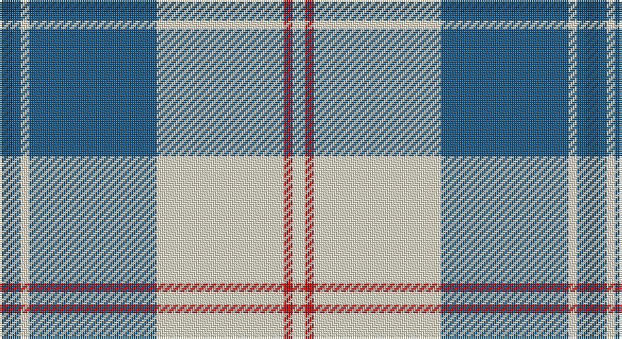

This page is one **sett** — a single exact thread-count. It belongs to the [tartan](/setts/dt3n2w2n30w30r2w3/)
(the same proportion at any scale), whose colour order is pattern [BBWBWRW](/stripes/bbwbwrw/).

Sourced from tartans-authority.  It is a [7 stripe tartan](/stripes/stripes7/).

Original link http://www.tartansauthority.com/tartan-ferret/display/7596/

## Also known as

This cloth is also recorded under:

- Torridon Royal Blue
- Torridon, Royal Blue

2 attestations — the source records this cloth was collapsed from (oldest owns this page)

<ul>
<li>March 2008 — Torridon, Royal Blue (Dance) (tartans-authority, <a href="http://www.tartansauthority.com/tartan-ferret/display/7596/">record</a>)</li>
<li>undated — Torridon Royal Blue (register-of-tartans, <a href="https://www.tartanregister.gov.uk/tartanDetails.aspx?ref=5620">record</a>)</li>
</ul>

## Register references

External register numbers recorded for this tartan.

- Scottish Register of Tartans: [5620](https://www.tartanregister.gov.uk/tartanDetails.aspx?ref=5620)
- Scottish Tartans Authority (ITI): 7596

## Thread count
DB/6 B4 W4 B60 W60 R4 W/6

One full sett is **276 threads**.

## Palette

Palette: <strong>Tartan Register</strong> <small style="color:#888">(3 of 4 colours)</small>
<table><thead><tr><th>Colour</th><th>Threads</th><th>Shade</th><th>Base</th><th>OKLCh</th></tr></thead><tbody><tr><td>DB/</td><td style="text-align:right;font-variant-numeric:tabular-nums">6</td><td><code style="background-color:#003C64;">#003C64</code> <small style="color:#888">#003C64</small></td><td>B <code style="background-color:#2A418A;">#2A418A</code></td><td><small style="color:#888">oklch(34.5% 0.089 246.0)</small></td></tr><tr><td>B</td><td style="text-align:right;font-variant-numeric:tabular-nums">4</td><td><code style="background-color:#0C5488;">#0C5488</code> <small style="color:#888">#0C5488</small></td><td>B <code style="background-color:#2A418A;">#2A418A</code></td><td><small style="color:#888">oklch(43.3% 0.108 247.0)</small></td></tr><tr><td>W</td><td style="text-align:right;font-variant-numeric:tabular-nums">4</td><td><code style="background-color:#F0E0C8;">#F0E0C8</code> <small style="color:#888">#F0E0C8</small></td><td>W <code style="background-color:#F7F7F7;">#F7F7F7</code></td><td><small style="color:#888">oklch(91.3% 0.036 78.1)</small></td></tr><tr><td>B</td><td style="text-align:right;font-variant-numeric:tabular-nums">60</td><td><code style="background-color:#0C5488;">#0C5488</code> <small style="color:#888">#0C5488</small></td><td>B <code style="background-color:#2A418A;">#2A418A</code></td><td><small style="color:#888">oklch(43.3% 0.108 247.0)</small></td></tr><tr><td>W</td><td style="text-align:right;font-variant-numeric:tabular-nums">60</td><td><code style="background-color:#F0E0C8;">#F0E0C8</code> <small style="color:#888">#F0E0C8</small></td><td>W <code style="background-color:#F7F7F7;">#F7F7F7</code></td><td><small style="color:#888">oklch(91.3% 0.036 78.1)</small></td></tr><tr><td>R</td><td style="text-align:right;font-variant-numeric:tabular-nums">4</td><td><code style="background-color:#C80000;">#C80000</code> <small style="color:#888">#C80000</small></td><td>R <code style="background-color:#CC0000;">#CC0000</code></td><td><small style="color:#888">oklch(52.3% 0.215 29.2)</small></td></tr><tr><td>W/</td><td style="text-align:right;font-variant-numeric:tabular-nums">6</td><td><code style="background-color:#F0E0C8;">#F0E0C8</code> <small style="color:#888">#F0E0C8</small></td><td>W <code style="background-color:#F7F7F7;">#F7F7F7</code></td><td><small style="color:#888">oklch(91.3% 0.036 78.1)</small></td></tr></tbody></table>

# Sample pattern

## Nearest tartans

The nearest existing variants by ΔTartan distance, with this tartan at the top so the swatches line up against it.

ΔTartan

Tartan

Sett

—

<a href="/ttd/edit/#slug=dt3n2w2n30w30r2w3~x2">Torridon, Royal Blue (Dance)</a> <a class="nn-out" href="/variants/s7/dt3n2w2n30w30r2w3~x2/" title="open its dictionary page">↗</a>

0.87

<a href="/ttd/edit/#slug=r3b2w35b35r2g3~x2&amp;base=dt3n2w2n30w30r2w3~x2">Galloway (Dance)</a> <a class="nn-out" href="/variants/s6/r3b2w35b35r2g3~x2/" title="open its dictionary page">↗</a>

1.14

<a href="/ttd/edit/#slug=t2db1k1db20w20db1w2~x4&amp;base=dt3n2w2n30w30r2w3~x2">Cunningham, Dress Blue (Dance) Fashion Tartan</a> <a class="nn-out" href="/variants/s7/t2db1k1db20w20db1w2~x4/" title="open its dictionary page">↗</a>

1.16

<a href="/ttd/edit/#slug=t42k2w2k2t5n12w32t4~x2&amp;base=dt3n2w2n30w30r2w3~x2">Longniddry, dress (Turquoise)</a> <a class="nn-out" href="/variants/s8/t42k2w2k2t5n12w32t4~x2/" title="open its dictionary page">↗</a>

1.21

<a href="/variants/s10/r3b2w35b35r2g3~x2/">Galloway (Dance)</a>

1.25

<a href="/ttd/edit/#slug=w2db1w15t12w1ly3db1~x6&amp;base=dt3n2w2n30w30r2w3~x2">St. John's (Corporate)</a> <a class="nn-out" href="/variants/s7/w2db1w15t12w1ly3db1~x6/" title="open its dictionary page">↗</a>

1.27

<a href="/ttd/edit/#slug=db8t3db28w32dt3w4~x2&amp;base=dt3n2w2n30w30r2w3~x2">Ailsa, Royal Blue (Dance)</a> <a class="nn-out" href="/variants/s6/db8t3db28w32dt3w4~x2/" title="open its dictionary page">↗</a>

1.27

<a href="/ttd/edit/#slug=w5r3w26db21w3db8ly3~x2&amp;base=dt3n2w2n30w30r2w3~x2">MacPherson, Blue &amp; White</a> <a class="nn-out" href="/variants/s7/w5r3w26db21w3db8ly3~x2/" title="open its dictionary page">↗</a>

1.30

<a href="/ttd/edit/#slug=k9w4k2w4k2w29k9w4b14lo2~x2&amp;base=dt3n2w2n30w30r2w3~x2">Hannay</a> <a class="nn-out" href="/variants/s10/k9w4k2w4k2w29k9w4b14lo2~x2/" title="open its dictionary page">↗</a>

1.31

<a href="/ttd/edit/#slug=w4k2w26t23w3t8p3~x2&amp;base=dt3n2w2n30w30r2w3~x2">MacPherson Turquoise Dress Tartan</a> <a class="nn-out" href="/variants/s7/w4k2w26t23w3t8p3~x2/" title="open its dictionary page">↗</a>

1.32

<a href="/ttd/edit/#slug=w1m2w17k11w2k4ly1~x4&amp;base=dt3n2w2n30w30r2w3~x2">MacPherson - 1842 (VS) Dress</a> <a class="nn-out" href="/variants/s7/w1m2w17k11w2k4ly1~x4/" title="open its dictionary page">↗</a>

## Neighbour map

Every grey dot is one of 14360 variants placed by the first two principal components of the ΔTartan feature space (44% of its variance). Red is this tartan; blue dots are its nearest — click one to open its page.

<svg viewBox="0 0 640 380" role="img" style="max-width:100%;height:auto;border:1px solid #e0e0e0;border-radius:4px;display:block" xmlns="http://www.w3.org/2000/svg"><image href="/nn/cloud.v1.png" width="640" height="380"/><a href="/variants/s6/r3b2w35b35r2g3~x2/"><circle cx="270.5" cy="144.6" r="4" fill="#3465a4"><title>Galloway (Dance)</title></circle></a><a href="/variants/s7/t2db1k1db20w20db1w2~x4/"><circle cx="288.4" cy="129.3" r="4" fill="#3465a4"><title>Cunningham, Dress Blue (Dance) Fashion Tartan</title></circle></a><a href="/variants/s8/t42k2w2k2t5n12w32t4~x2/"><circle cx="296.5" cy="138.3" r="4" fill="#3465a4"><title>Longniddry, dress (Turquoise)</title></circle></a><a href="/variants/s10/r3b2w35b35r2g3~x2/"><circle cx="270.2" cy="131.7" r="4" fill="#3465a4"><title>Galloway (Dance)</title></circle></a><a href="/variants/s7/w2db1w15t12w1ly3db1~x6/"><circle cx="286.3" cy="154.5" r="4" fill="#3465a4"><title>St. John's (Corporate)</title></circle></a><a href="/variants/s6/db8t3db28w32dt3w4~x2/"><circle cx="242.4" cy="176.5" r="4" fill="#3465a4"><title>Ailsa, Royal Blue (Dance)</title></circle></a><a href="/variants/s7/w5r3w26db21w3db8ly3~x2/"><circle cx="240.9" cy="178.8" r="4" fill="#3465a4"><title>MacPherson, Blue &amp; White</title></circle></a><a href="/variants/s10/k9w4k2w4k2w29k9w4b14lo2~x2/"><circle cx="233.2" cy="128.7" r="4" fill="#3465a4"><title>Hannay</title></circle></a><a href="/variants/s7/w4k2w26t23w3t8p3~x2/"><circle cx="277.7" cy="173.1" r="4" fill="#3465a4"><title>MacPherson Turquoise Dress Tartan</title></circle></a><a href="/variants/s7/w1m2w17k11w2k4ly1~x4/"><circle cx="280.8" cy="140.6" r="4" fill="#3465a4"><title>MacPherson - 1842 (VS) Dress</title></circle></a><circle cx="284.2" cy="142.4" r="5" fill="#c00000"/></svg>

ID: /variants/s7/dt3n2w2n30w30r2w3~x2/
