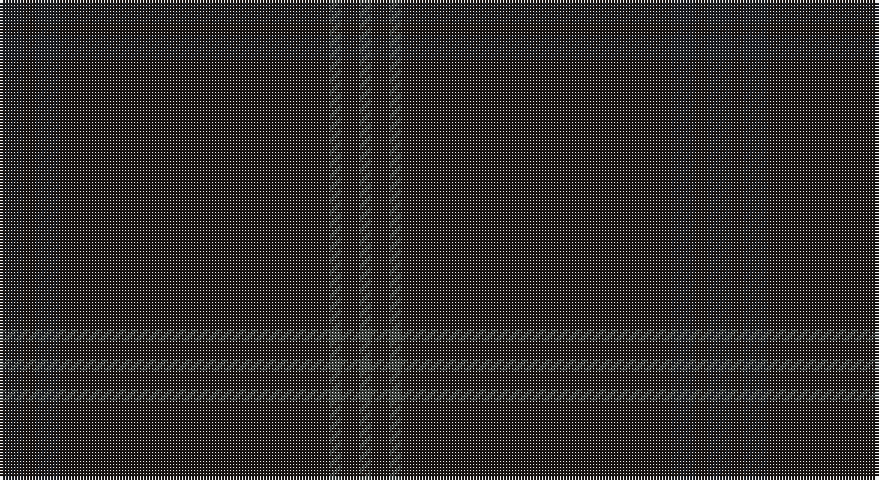

This page is one **sett** — a single exact thread-count. It belongs to the [tartan](/setts/dt4k2dt4k45dti2k3dti2/)
(the same proportion at any scale), whose colour order is pattern [BKBKBKB](/stripes/bkbkbkb/).

Sourced from register-of-tartans.  It is a [7 stripe tartan](/stripes/stripes7/).

Original link https://www.tartanregister.gov.uk/tartanDetails.aspx?ref=10752

## Register references

External register numbers recorded for this tartan.

- Scottish Register of Tartans: [10752](https://www.tartanregister.gov.uk/tartanDetails.aspx?ref=10752)

## Thread count
Ka/8 K4 Ka8 K90 N4 K6 N/4

One full sett is **236 threads**.

## Palette

Palette: <strong>Tartan Register</strong> <small style="color:#888">(1 of 3 colours)</small>
<table><thead><tr><th>Colour</th><th>Threads</th><th>Shade</th><th>Base</th><th>OKLCh</th></tr></thead><tbody><tr><td>Ka/</td><td style="text-align:right;font-variant-numeric:tabular-nums">8</td><td><code style="background-color:#1E2025;">#1E2025</code> <small style="color:#888">#1E2025</small></td><td>B <code style="background-color:#2A418A;">#2A418A</code></td><td><small style="color:#888">oklch(24.4% 0.010 268.3)</small></td></tr><tr><td>K</td><td style="text-align:right;font-variant-numeric:tabular-nums">4</td><td><code style="background-color:#1C1714;">#1C1714</code> <small style="color:#888">#1C1714</small></td><td>K <code style="background-color:#000000;">#000000</code></td><td><small style="color:#888">oklch(20.9% 0.010 52.9)</small></td></tr><tr><td>Ka</td><td style="text-align:right;font-variant-numeric:tabular-nums">8</td><td><code style="background-color:#1E2025;">#1E2025</code> <small style="color:#888">#1E2025</small></td><td>B <code style="background-color:#2A418A;">#2A418A</code></td><td><small style="color:#888">oklch(24.4% 0.010 268.3)</small></td></tr><tr><td>K</td><td style="text-align:right;font-variant-numeric:tabular-nums">90</td><td><code style="background-color:#1C1714;">#1C1714</code> <small style="color:#888">#1C1714</small></td><td>K <code style="background-color:#000000;">#000000</code></td><td><small style="color:#888">oklch(20.9% 0.010 52.9)</small></td></tr><tr><td>N</td><td style="text-align:right;font-variant-numeric:tabular-nums">4</td><td><code style="background-color:#3F4441;">#3F4441</code> <small style="color:#888">#3F4441</small></td><td>B <code style="background-color:#2A418A;">#2A418A</code></td><td><small style="color:#888">oklch(38.1% 0.008 159.7)</small></td></tr><tr><td>K</td><td style="text-align:right;font-variant-numeric:tabular-nums">6</td><td><code style="background-color:#1C1714;">#1C1714</code> <small style="color:#888">#1C1714</small></td><td>K <code style="background-color:#000000;">#000000</code></td><td><small style="color:#888">oklch(20.9% 0.010 52.9)</small></td></tr><tr><td>N/</td><td style="text-align:right;font-variant-numeric:tabular-nums">4</td><td><code style="background-color:#3F4441;">#3F4441</code> <small style="color:#888">#3F4441</small></td><td>B <code style="background-color:#2A418A;">#2A418A</code></td><td><small style="color:#888">oklch(38.1% 0.008 159.7)</small></td></tr></tbody></table>

# Sample pattern

## Nearest tartans

The nearest existing variants by ΔTartan distance, with this tartan at the top so the swatches line up against it.

ΔTartan

Tartan

Sett

—

<a href="/ttd/edit/#slug=dt4k2dt4k45dti2k3dti2~x2">STLTH</a> <a class="nn-out" href="/variants/s7/dt4k2dt4k45dti2k3dti2~x2/" title="open its dictionary page">↗</a>

2.84

<a href="/ttd/edit/#slug=dt4k2dt16k2dt16k1~x4&amp;base=dt4k2dt4k45dti2k3dti2~x2">Ben Dubh (The Black Mount)</a> <a class="nn-out" href="/variants/s6/dt4k2dt16k2dt16k1~x4/" title="open its dictionary page">↗</a>

2.99

<a href="/ttd/edit/#slug=k4dt2k43dt20k4dt2k2dt4k2dt2k4dt20k43dt2k4dt2~x2&amp;base=dt4k2dt4k45dti2k3dti2~x2">Dark Island</a> <a class="nn-out" href="/variants/s16/k4dt2k43dt20k4dt2k2dt4k2dt2k4dt20k43dt2k4dt2~x2/" title="open its dictionary page">↗</a>

3.37

<a href="/ttd/edit/#slug=db4dbi2db43dbi20db4dbi2db2dbi4db2dbi2db4dbi20db43dbi2db4dbi2~x2&amp;base=dt4k2dt4k45dti2k3dti2~x2">Dark Island Navy Fashion Tartan</a> <a class="nn-out" href="/variants/s16/db4dbi2db43dbi20db4dbi2db2dbi4db2dbi2db4dbi20db43dbi2db4dbi2~x2/" title="open its dictionary page">↗</a>

3.67

<a href="/variants/s7/k17ki4k13ki4k3ki45k3~x2/">Black Spirit Fashion Tartan</a>

3.86

<a href="/ttd/edit/#slug=k44dg12dt1o6~x2&amp;base=dt4k2dt4k45dti2k3dti2~x2">Heslop, William D Name Tartan</a> <a class="nn-out" href="/variants/s4/k44dg12dt1o6~x2/" title="open its dictionary page">↗</a>

3.93

<a href="/ttd/edit/#slug=k120db4k12dt36dg3k6&amp;base=dt4k2dt4k45dti2k3dti2~x2">Scottish Football Association (Corp)</a> <a class="nn-out" href="/variants/s6/k120db4k12dt36dg3k6/" title="open its dictionary page">↗</a>

3.98

<a href="/ttd/edit/#slug=do5k2do28k10do26k4do4~x2&amp;base=dt4k2dt4k45dti2k3dti2~x2">Dunbar, John Telfer (Personal)</a> <a class="nn-out" href="/variants/s7/do5k2do28k10do26k4do4~x2/" title="open its dictionary page">↗</a>

4.10

<a href="/ttd/edit/#slug=dy16y3dy2~x10&amp;base=dt4k2dt4k45dti2k3dti2~x2">Hallstatt (Artefact)</a> <a class="nn-out" href="/variants/s3/dy16y3dy2~x10/" title="open its dictionary page">↗</a>

4.15

<a href="/ttd/edit/#slug=dy6dg2dy29dg29dy2dg6~x2&amp;base=dt4k2dt4k45dti2k3dti2~x2">Harmony 11 #2</a> <a class="nn-out" href="/variants/s6/dy6dg2dy29dg29dy2dg6~x2/" title="open its dictionary page">↗</a>

4.16

<a href="/ttd/edit/#slug=o60lo15o4lo2o2lo2o2lo2~x2&amp;base=dt4k2dt4k45dti2k3dti2~x2">Masai Shuka 09 (Artefact)</a> <a class="nn-out" href="/variants/s8/o60lo15o4lo2o2lo2o2lo2~x2/" title="open its dictionary page">↗</a>

## Neighbour map

Every grey dot is one of 14360 variants placed by the first two principal components of the ΔTartan feature space (44% of its variance). Red is this tartan; blue dots are its nearest — click one to open its page.

<svg viewBox="0 0 640 380" role="img" style="max-width:100%;height:auto;border:1px solid #e0e0e0;border-radius:4px;display:block" xmlns="http://www.w3.org/2000/svg"><image href="/nn/cloud.v1.png" width="640" height="380"/><a href="/variants/s6/dt4k2dt16k2dt16k1~x4/"><circle cx="626.0" cy="366.0" r="4" fill="#3465a4"><title>Ben Dubh (The Black Mount)</title></circle></a><a href="/variants/s16/k4dt2k43dt20k4dt2k2dt4k2dt2k4dt20k43dt2k4dt2~x2/"><circle cx="626.0" cy="299.7" r="4" fill="#3465a4"><title>Dark Island</title></circle></a><a href="/variants/s16/db4dbi2db43dbi20db4dbi2db2dbi4db2dbi2db4dbi20db43dbi2db4dbi2~x2/"><circle cx="626.0" cy="331.6" r="4" fill="#3465a4"><title>Dark Island Navy Fashion Tartan</title></circle></a><a href="/variants/s7/k17ki4k13ki4k3ki45k3~x2/"><circle cx="626.0" cy="352.5" r="4" fill="#3465a4"><title>Black Spirit Fashion Tartan</title></circle></a><a href="/variants/s4/k44dg12dt1o6~x2/"><circle cx="626.0" cy="296.9" r="4" fill="#3465a4"><title>Heslop, William D Name Tartan</title></circle></a><a href="/variants/s6/k120db4k12dt36dg3k6/"><circle cx="626.0" cy="264.3" r="4" fill="#3465a4"><title>Scottish Football Association (Corp)</title></circle></a><a href="/variants/s7/do5k2do28k10do26k4do4~x2/"><circle cx="626.0" cy="356.0" r="4" fill="#3465a4"><title>Dunbar, John Telfer (Personal)</title></circle></a><a href="/variants/s3/dy16y3dy2~x10/"><circle cx="626.0" cy="366.0" r="4" fill="#3465a4"><title>Hallstatt (Artefact)</title></circle></a><a href="/variants/s6/dy6dg2dy29dg29dy2dg6~x2/"><circle cx="622.7" cy="366.0" r="4" fill="#3465a4"><title>Harmony 11 #2</title></circle></a><a href="/variants/s8/o60lo15o4lo2o2lo2o2lo2~x2/"><circle cx="626.0" cy="269.9" r="4" fill="#3465a4"><title>Masai Shuka 09 (Artefact)</title></circle></a><circle cx="626.0" cy="327.6" r="5" fill="#c00000"/></svg>

ID: /variants/s7/dt4k2dt4k45dti2k3dti2~x2/
