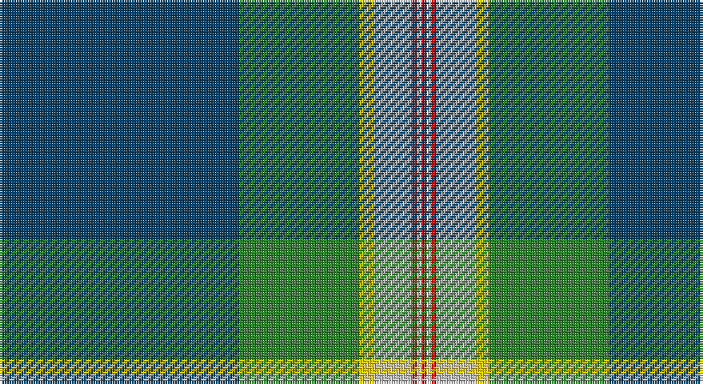

This page is one **sett** — a single exact thread-count. It belongs to the [tartan](/setts/dt50g25ly3lb8r1w1r1/)
(the same proportion at any scale), whose colour order is pattern [BGYWRWR](/stripes/bgywrwr/).

Part of the [Wells](/tartans/wells/) tartan — the named design grouping this sett with its other cloths.

Sourced from tartans-authority.  It is a [7 stripe tartan](/stripes/stripes7/).

Original link http://www.tartansauthority.com/tartan-ferret/display/11106/

## Also known as

This cloth is also recorded under:

- Wells, Edward G.

## Register references

External register numbers recorded for this tartan.

- Scottish Register of Tartans: [11106](https://www.tartanregister.gov.uk/tartanDetails?ref=11106)
- Scottish Tartans Authority (ITI): 11106

## Thread count
DB/100 G50 Y6 N16 R2 W2 R/2

One full sett is **254 threads**.

## Palette

Palette: <strong>Tartan Register</strong> <small style="color:#888">(5 of 6 colours)</small>
<table><thead><tr><th>Colour</th><th>Threads</th><th>Shade</th><th>Base</th><th>OKLCh</th></tr></thead><tbody><tr><td>DB/</td><td style="text-align:right;font-variant-numeric:tabular-nums">100</td><td><code style="background-color:#003C64;">#003C64</code> <small style="color:#888">#003C64</small></td><td>B <code style="background-color:#2A418A;">#2A418A</code></td><td><small style="color:#888">oklch(34.5% 0.089 246.0)</small></td></tr><tr><td>G</td><td style="text-align:right;font-variant-numeric:tabular-nums">50</td><td><code style="background-color:#288028;">#288028</code> <small style="color:#888">#288028</small></td><td>G <code style="background-color:#006100;">#006100</code></td><td><small style="color:#888">oklch(52.9% 0.149 143.1)</small></td></tr><tr><td>Y</td><td style="text-align:right;font-variant-numeric:tabular-nums">6</td><td><code style="background-color:#FCCC00;">#FCCC00</code> <small style="color:#888">#FCCC00</small></td><td>Y <code style="background-color:#F2BF00;">#F2BF00</code></td><td><small style="color:#888">oklch(86.2% 0.176 91.5)</small></td></tr><tr><td>N</td><td style="text-align:right;font-variant-numeric:tabular-nums">16</td><td><code style="background-color:#C0C0C0;">#C0C0C0</code> <small style="color:#888">#C0C0C0</small></td><td>W <code style="background-color:#F7F7F7;">#F7F7F7</code></td><td><small style="color:#888">oklch(80.8% 0.000 89.9)</small></td></tr><tr><td>R</td><td style="text-align:right;font-variant-numeric:tabular-nums">2</td><td><code style="background-color:#C80000;">#C80000</code> <small style="color:#888">#C80000</small></td><td>R <code style="background-color:#CC0000;">#CC0000</code></td><td><small style="color:#888">oklch(52.3% 0.215 29.2)</small></td></tr><tr><td>W</td><td style="text-align:right;font-variant-numeric:tabular-nums">2</td><td><code style="background-color:#FCFCFC;">#FCFCFC</code> <small style="color:#888">#FCFCFC</small></td><td>W <code style="background-color:#F7F7F7;">#F7F7F7</code></td><td><small style="color:#888">oklch(99.1% 0.000 89.9)</small></td></tr><tr><td>R/</td><td style="text-align:right;font-variant-numeric:tabular-nums">2</td><td><code style="background-color:#C80000;">#C80000</code> <small style="color:#888">#C80000</small></td><td>R <code style="background-color:#CC0000;">#CC0000</code></td><td><small style="color:#888">oklch(52.3% 0.215 29.2)</small></td></tr></tbody></table>

# Sample pattern

## Compared to the master

This cloth is one sett of its design; the master sett (the exemplar the design is anchored on) is below for comparison.

<figure style="margin:0"><figcaption style="color:#888;font-size:smaller">this sett</figcaption></figure>
<figure style="margin:0"><figcaption style="color:#888;font-size:smaller"><a href="/setts/db8k4ly3k4db14k4dg4g6dg3g10k10g9k3r3k4/">master sett →</a></figcaption></figure>

## Nearest tartans

The nearest existing variants by ΔTartan distance, with this tartan at the top so the swatches line up against it.

ΔTartan

Tartan

Sett

—

<a href="/ttd/edit/#slug=dt50g25ly3lb8r1w1r1~x2">Wells (2014)</a> <a class="nn-out" href="/variants/s7/dt50g25ly3lb8r1w1r1~x2/" title="open its dictionary page">↗</a>

1.22

<a href="/ttd/edit/#slug=db31ly4g68w4db31r2k6r2~x2&amp;base=dt50g25ly3lb8r1w1r1~x2">Inkster (Name)</a> <a class="nn-out" href="/variants/s8/db31ly4g68w4db31r2k6r2~x2/" title="open its dictionary page">↗</a>

1.24

<a href="/ttd/edit/#slug=w2lo4db1lo1db40o6g18r2g2w1~x2&amp;base=dt50g25ly3lb8r1w1r1~x2">O'Mahony, The (Commemorative)</a> <a class="nn-out" href="/variants/s10/w2lo4db1lo1db40o6g18r2g2w1~x2/" title="open its dictionary page">↗</a>

1.25

<a href="/ttd/edit/#slug=r8t45w1o4k11g6r4~x2&amp;base=dt50g25ly3lb8r1w1r1~x2">Ascension Island Heritage Trust</a> <a class="nn-out" href="/variants/s7/r8t45w1o4k11g6r4~x2/" title="open its dictionary page">↗</a>

1.28

<a href="/ttd/edit/#slug=dg90r1k10w6k4dg6r10db62ly8&amp;base=dt50g25ly3lb8r1w1r1~x2">Stirling, University of</a> <a class="nn-out" href="/variants/s9/dg90r1k10w6k4dg6r10db62ly8/" title="open its dictionary page">↗</a>

1.29

<a href="/ttd/edit/#slug=p4g24dg6lg4dg4lg4dg44lo1w4&amp;base=dt50g25ly3lb8r1w1r1~x2">Macmillan Cancer Support</a> <a class="nn-out" href="/variants/s9/p4g24dg6lg4dg4lg4dg44lo1w4/" title="open its dictionary page">↗</a>

1.29

<a href="/ttd/edit/#slug=ly3db1k2g26db28w1db1r2~x2&amp;base=dt50g25ly3lb8r1w1r1~x2">Johnston, Diana Hunting (Personal)</a> <a class="nn-out" href="/variants/s8/ly3db1k2g26db28w1db1r2~x2/" title="open its dictionary page">↗</a>

1.30

<a href="/ttd/edit/#slug=db50dg25lo3o8r1w1r1~x2&amp;base=dt50g25ly3lb8r1w1r1~x2">Wells (2014)</a> <a class="nn-out" href="/variants/s7/db50dg25lo3o8r1w1r1~x2/" title="open its dictionary page">↗</a>

1.36

<a href="/ttd/edit/#slug=g90r1k10w6k4g6r10db62ly8&amp;base=dt50g25ly3lb8r1w1r1~x2">Stirling, University of</a> <a class="nn-out" href="/variants/s9/g90r1k10w6k4g6r10db62ly8/" title="open its dictionary page">↗</a>

1.36

<a href="/ttd/edit/#slug=b52ly23g6gi5w1r1~x2&amp;base=dt50g25ly3lb8r1w1r1~x2">College of New Caledonia (Corporate)</a> <a class="nn-out" href="/variants/s6/b52ly23g6gi5w1r1~x2/" title="open its dictionary page">↗</a>

1.41

<a href="/ttd/edit/#slug=ly2r2k2b27k6g13k1lb2~x2&amp;base=dt50g25ly3lb8r1w1r1~x2">German MacLeod</a> <a class="nn-out" href="/variants/s8/ly2r2k2b27k6g13k1lb2~x2/" title="open its dictionary page">↗</a>

## Neighbour map

Every grey dot is one of 14360 variants placed by the first two principal components of the ΔTartan feature space (44% of its variance). Red is this tartan; blue dots are its nearest — click one to open its page.

<svg viewBox="0 0 640 380" role="img" style="max-width:100%;height:auto;border:1px solid #e0e0e0;border-radius:4px;display:block" xmlns="http://www.w3.org/2000/svg"><image href="/nn/cloud.v1.png" width="640" height="380"/><a href="/variants/s8/db31ly4g68w4db31r2k6r2~x2/"><circle cx="294.7" cy="115.1" r="4" fill="#3465a4"><title>Inkster (Name)</title></circle></a><a href="/variants/s10/w2lo4db1lo1db40o6g18r2g2w1~x2/"><circle cx="301.1" cy="64.6" r="4" fill="#3465a4"><title>O'Mahony, The (Commemorative)</title></circle></a><a href="/variants/s7/r8t45w1o4k11g6r4~x2/"><circle cx="334.8" cy="92.0" r="4" fill="#3465a4"><title>Ascension Island Heritage Trust</title></circle></a><a href="/variants/s9/dg90r1k10w6k4dg6r10db62ly8/"><circle cx="314.0" cy="87.9" r="4" fill="#3465a4"><title>Stirling, University of</title></circle></a><a href="/variants/s9/p4g24dg6lg4dg4lg4dg44lo1w4/"><circle cx="331.2" cy="91.2" r="4" fill="#3465a4"><title>Macmillan Cancer Support</title></circle></a><a href="/variants/s8/ly3db1k2g26db28w1db1r2~x2/"><circle cx="293.0" cy="107.2" r="4" fill="#3465a4"><title>Johnston, Diana Hunting (Personal)</title></circle></a><a href="/variants/s7/db50dg25lo3o8r1w1r1~x2/"><circle cx="371.3" cy="104.0" r="4" fill="#3465a4"><title>Wells (2014)</title></circle></a><a href="/variants/s9/g90r1k10w6k4g6r10db62ly8/"><circle cx="283.4" cy="72.3" r="4" fill="#3465a4"><title>Stirling, University of</title></circle></a><a href="/variants/s6/b52ly23g6gi5w1r1~x2/"><circle cx="356.6" cy="96.0" r="4" fill="#3465a4"><title>College of New Caledonia (Corporate)</title></circle></a><a href="/variants/s8/ly2r2k2b27k6g13k1lb2~x2/"><circle cx="263.1" cy="112.8" r="4" fill="#3465a4"><title>German MacLeod</title></circle></a><circle cx="345.0" cy="91.6" r="5" fill="#c00000"/></svg>

ID: /variants/s7/dt50g25ly3lb8r1w1r1~x2/
