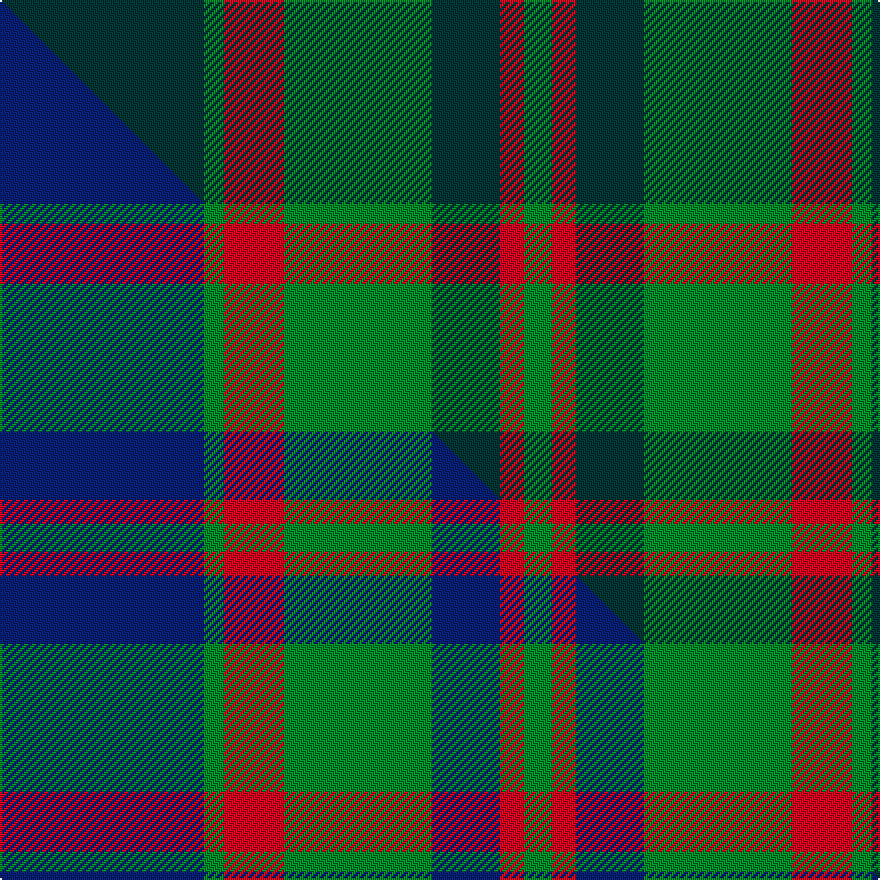

This is one **variant** — a specific cloth: this exact thread count and colourway, with its own
provenance below. It is one weaving of the [sett](/setts/dt51g5r15g37dt17r6g7/) (the scale-free proportion — the
same cloth at any scale or shade), whose colour order is pattern [BGRGBRG](/stripes/bgrgbrg/).

Part of the [Cadence Design Systems](/tartans/c/ca/cadence-design-systems/) tartan — the named design grouping this sett with its other cloths.

Sourced from tartans-authority.  It is a [7 stripe tartan](/stripes/stripes7/).

Original link [https://www.tartanregister.gov.uk/tartanDetails.aspx?ref=2480](https://www.tartanregister.gov.uk/tartanDetails.aspx?ref=2480)

Dataset <small>— provenance for this record, inherited from the source manifest</small>

<dl class="dataset-prov">
<dt>source</dt><dd><a href="/sources/tartans-authority/">Scottish Tartans Authority</a></dd>
<dt>data captured from</dt><dd><a href="https://github.com/thetartan/tartan-database/blob/master/data/tartans-authority/data.csv">https://github.com/thetartan/tartan-database/blob/master/data/tartans-authority/data.csv</a></dd>
<dt>data date</dt><dd>1998 <small>(this record)</small></dd>
<dt>licence</dt><dd><a href="https://creativecommons.org/licenses/by-nc-nd/4.0/">CC BY-NC-ND 4.0</a></dd>
</dl>

Capture chain <small>— the hands this data passed through, oldest first; each capture carries its own licence</small>

<ol class="capture-chain">
<li><a href="https://www.tartansauthority.com/">Scottish Tartans Authority</a> <small>the heritage body's archive — its tartan-ferret record browser is retired (links repaired to the SRT, above)</small></li>
<li><a href="https://github.com/thetartan/tartan-database">thetartan/tartan-database</a> <small>2016-2017</small> · <a href="https://creativecommons.org/licenses/by-nc-nd/4.0/">CC BY-NC-ND 4.0</a> <small>Levko Kravets's frozen compilation — the capture we vendored, and where its CC licence text came from</small></li>
<li>this dictionary <small>captured 2026-06-10 · commit 5bf86c7566</small> <small>each re-capture is a git commit to data/sources</small></li>
</ol>

## Register references

External register numbers recorded for this tartan.

- Scottish Tartans Authority (ITI): 2480

## Thread count
DT/102 G10 R30 G74 DT34 R12 G/14

One full sett is **436 threads**.

## Palette
<table><thead><tr><th>Colour</th><th>Shade</th><th>OKLCh</th></tr></thead><tbody><tr><td>DT</td><td><code style="background-color:#023535;">#023535</code> <small style="color:#888">#023535</small></td><td><small style="color:#888">oklch(29.8% 0.050 194.8)</small></td></tr><tr><td>G</td><td><code style="background-color:#008B2A;">#008B2A</code> <small style="color:#888">#008B2A</small></td><td><small style="color:#888">oklch(55.4% 0.170 145.9)</small></td></tr><tr><td>R</td><td><code style="background-color:#D60020;">#D60020</code> <small style="color:#888">#D60020</small></td><td><small style="color:#888">oklch(55.2% 0.224 25.5)</small></td></tr></tbody></table>

# Sample pattern

## Compared to the master

This cloth is one sett of its design; the master sett (the exemplar the design is anchored on) is below for comparison.

Its **ΔTartan distance** from the master is **3.43** — the same measure the nearest-tartans table ranks by (0 is identical; a re-scale of the same cloth is near 0, a recolour or a different proportion further).

<figure class="master-compare" style="margin:0">

this sett
master sett ★

<figcaption style="color:#888;font-size:smaller">One weave of this sett against the <a href="/setts/db51g5r15g37db17r6g7/">master sett ★</a>, split on the diagonal: a shared proportion runs seamlessly across it with only the shades shifting; a different proportion breaks on it.</figcaption>
</figure>

## Nearest tartan variants

The nearest existing variants by ΔTartan distance, with this cloth at the top so the swatches line up against it.

ΔTartan

Threads

Variant

Sett

—

436

<a href="/variants/s7/dt51g5r15g37dt17r6g7~x2/">Cadence Design Systems (Corporate)</a>

<a href="/ttd/edit/#slug=db6r3g1r3g12r3g1~x4&amp;base=dt51g5r15g37dt17r6g7~x2" title="compare in the TTD">2.52</a>

204

<a href="/variants/s7/db6r3g1r3g12r3g1~x4/">Skene - 1831 (Clan)</a>

<a href="/ttd/edit/#slug=db6r3g1r3g12r3g1~x2&amp;base=dt51g5r15g37dt17r6g7~x2" title="compare in the TTD">2.52</a>

102

<a href="/variants/s7/db6r3g1r3g12r3g1~x2/">Skene</a>

<a href="/ttd/edit/#slug=g24dp3g3dp3g3dp7dg20r3~x2&amp;base=dt51g5r15g37dt17r6g7~x2" title="compare in the TTD">2.70</a>

210

<a href="/variants/s8/g24dp3g3dp3g3dp7dg20r3~x2/">Crantock Trade Tartan</a>

<a href="/ttd/edit/#slug=db2o28g13o2db13o2~x4&amp;base=dt51g5r15g37dt17r6g7~x2" title="compare in the TTD">2.70</a>

464

<a href="/variants/s6/db2o28g13o2db13o2~x4/">Edinchat</a>

<a href="/ttd/edit/#slug=db10r2g2r6g16r1g2r1g3r6~x4~r1807033&amp;base=dt51g5r15g37dt17r6g7~x2" title="compare in the TTD">2.73</a>

328

<a href="/variants/s10/db10r2g2r6g16r1g2r1g3r6~x4~r1807033/">Nithsdale</a>

<a href="/ttd/edit/#slug=r3g10r3g14db16g3y2~x2&amp;base=dt51g5r15g37dt17r6g7~x2" title="compare in the TTD">2.74</a>

194

<a href="/variants/s7/r3g10r3g14db16g3y2~x2/">Cameron of Lochiel (Hunting)</a>

<a href="/ttd/edit/#slug=r3g10r3g14db16g3y2&amp;base=dt51g5r15g37dt17r6g7~x2" title="compare in the TTD">2.74</a>

97

<a href="/variants/s7/r3g10r3g14db16g3y2/">Cameron Hunting</a>

<a href="/ttd/edit/#slug=g25r4db24r21g25r3db4~x2&amp;base=dt51g5r15g37dt17r6g7~x2" title="compare in the TTD">2.78</a>

366

<a href="/variants/s7/g25r4db24r21g25r3db4~x2/">Glasgow #2</a>

<a href="/ttd/edit/#slug=r3g10r3g14db16g3dy2~x2&amp;base=dt51g5r15g37dt17r6g7~x2" title="compare in the TTD">2.78</a>

194

<a href="/variants/s7/r3g10r3g14db16g3dy2~x2/">Cameron Hunting Clan Tartan</a>

<a href="/ttd/edit/#slug=g22dt5r4dt5r3~x2&amp;base=dt51g5r15g37dt17r6g7~x2" title="compare in the TTD">2.84</a>

106

<a href="/variants/s5/g22dt5r4dt5r3~x2/">Romsdal</a>

## Neighbour map

Every grey dot is one of 13621 variants placed by the first two principal components of the ΔTartan feature space (42% of its variance). Red is this tartan; blue dots are its nearest — click one to open its page.

<svg viewBox="0 0 640 380" role="img" style="max-width:100%;height:auto;border:1px solid #e0e0e0;border-radius:4px;display:block" xmlns="http://www.w3.org/2000/svg"><image href="/nn/cloud.v1.png" width="640" height="380"/><a href="/variants/s7/db6r3g1r3g12r3g1~x4/"><circle cx="291.5" cy="215.0" r="4" fill="#3465a4"><title>Skene - 1831 (Clan)</title></circle></a><a href="/variants/s7/db6r3g1r3g12r3g1~x2/"><circle cx="291.5" cy="215.0" r="4" fill="#3465a4"><title>Skene</title></circle></a><a href="/variants/s8/g24dp3g3dp3g3dp7dg20r3~x2/"><circle cx="274.3" cy="216.9" r="4" fill="#3465a4"><title>Crantock Trade Tartan</title></circle></a><a href="/variants/s6/db2o28g13o2db13o2~x4/"><circle cx="359.1" cy="217.0" r="4" fill="#3465a4"><title>Edinchat</title></circle></a><a href="/variants/s10/db10r2g2r6g16r1g2r1g3r6~x4~r1807033/"><circle cx="304.4" cy="189.8" r="4" fill="#3465a4"><title>Nithsdale</title></circle></a><a href="/variants/s7/r3g10r3g14db16g3y2~x2/"><circle cx="279.2" cy="231.2" r="4" fill="#3465a4"><title>Cameron of Lochiel (Hunting)</title></circle></a><a href="/variants/s7/r3g10r3g14db16g3y2/"><circle cx="279.2" cy="231.2" r="4" fill="#3465a4"><title>Cameron Hunting</title></circle></a><a href="/variants/s7/g25r4db24r21g25r3db4~x2/"><circle cx="256.1" cy="247.5" r="4" fill="#3465a4"><title>Glasgow #2</title></circle></a><a href="/variants/s7/r3g10r3g14db16g3dy2~x2/"><circle cx="277.6" cy="230.4" r="4" fill="#3465a4"><title>Cameron Hunting Clan Tartan</title></circle></a><a href="/variants/s5/g22dt5r4dt5r3~x2/"><circle cx="350.3" cy="253.1" r="4" fill="#3465a4"><title>Romsdal</title></circle></a><circle cx="317.0" cy="234.8" r="5" fill="#c00000"/><text x="320" y="376" text-anchor="middle" font-size="11" fill="#999">ground</text><text x="11" y="190" text-anchor="middle" font-size="11" fill="#999" transform="rotate(-90 11 190)">complexity</text></svg>

ID: /variants/s7/dt51g5r15g37dt17r6g7~x2/
