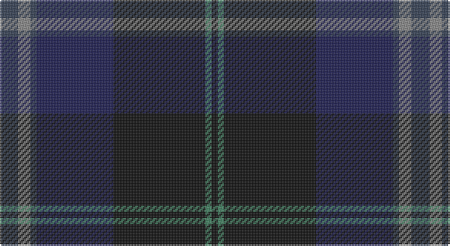

This page is one **sett** — a single exact thread-count. It belongs to the [tartan](/setts/dt6o4dt2db25k30g2k2/)
(the same proportion at any scale), whose colour order is pattern [BRBBKGK](/stripes/brbbkgk/).

Part of the [Passion of Scotland](/tartans/passion-of-scotland/) tartan — the named design grouping this sett with its other cloths.

Sourced from tartans-authority.  It is a [7 stripe tartan](/stripes/stripes7/).

Original link http://www.tartansauthority.com/tartan-ferret/display/7729/

## Also known as

This cloth is also recorded under:

- Passion of Scotland Purple
- Passion of Scotland, Purple (Fashion

2 attestations — the source records this cloth was collapsed from (oldest owns this page)

<ul>
<li>December 2007 — Passion of Scotland (Fashion) (tartans-authority, <a href="http://www.tartansauthority.com/tartan-ferret/display/7729/">record</a>)</li>
<li>undated — Passion of Scotland (register-of-tartans, <a href="https://www.tartanregister.gov.uk/tartanDetails.aspx?ref=5713">record</a>)</li>
</ul>

## Register references

External register numbers recorded for this tartan.

- Scottish Register of Tartans: [5713](https://www.tartanregister.gov.uk/tartanDetails.aspx?ref=5713)
- Scottish Tartans Authority (ITI): 7729

## Thread count
N/12 Na8 N4 DB50 K60 G4 K/4

One full sett is **268 threads**.

## Palette

Palette: <strong>Tartan Register</strong> <small style="color:#888">(4 of 5 colours)</small>
<table><thead><tr><th>Colour</th><th>Threads</th><th>Shade</th><th>Base</th><th>OKLCh</th></tr></thead><tbody><tr><td>N/</td><td style="text-align:right;font-variant-numeric:tabular-nums">12</td><td><code style="background-color:#344054;">#344054</code> <small style="color:#888">#344054</small></td><td>B <code style="background-color:#2A418A;">#2A418A</code></td><td><small style="color:#888">oklch(36.9% 0.038 260.5)</small></td></tr><tr><td>Na</td><td style="text-align:right;font-variant-numeric:tabular-nums">8</td><td><code style="background-color:#888888;">#888888</code> <small style="color:#888">#888888</small></td><td>R <code style="background-color:#CC0000;">#CC0000</code></td><td><small style="color:#888">oklch(62.7% 0.000 89.9)</small></td></tr><tr><td>N</td><td style="text-align:right;font-variant-numeric:tabular-nums">4</td><td><code style="background-color:#344054;">#344054</code> <small style="color:#888">#344054</small></td><td>B <code style="background-color:#2A418A;">#2A418A</code></td><td><small style="color:#888">oklch(36.9% 0.038 260.5)</small></td></tr><tr><td>DB</td><td style="text-align:right;font-variant-numeric:tabular-nums">50</td><td><code style="background-color:#1C1C50;">#1C1C50</code> <small style="color:#888">#1C1C50</small></td><td>B <code style="background-color:#2A418A;">#2A418A</code></td><td><small style="color:#888">oklch(26.2% 0.093 277.9)</small></td></tr><tr><td>K</td><td style="text-align:right;font-variant-numeric:tabular-nums">60</td><td><code style="background-color:#101010;">#101010</code> <small style="color:#888">#101010</small></td><td>K <code style="background-color:#000000;">#000000</code></td><td><small style="color:#888">oklch(17.3% 0.000 89.9)</small></td></tr><tr><td>G</td><td style="text-align:right;font-variant-numeric:tabular-nums">4</td><td><code style="background-color:#408060;">#408060</code> <small style="color:#888">#408060</small></td><td>G <code style="background-color:#006100;">#006100</code></td><td><small style="color:#888">oklch(54.8% 0.084 160.1)</small></td></tr><tr><td>K/</td><td style="text-align:right;font-variant-numeric:tabular-nums">4</td><td><code style="background-color:#101010;">#101010</code> <small style="color:#888">#101010</small></td><td>K <code style="background-color:#000000;">#000000</code></td><td><small style="color:#888">oklch(17.3% 0.000 89.9)</small></td></tr></tbody></table>

# Sample pattern

## Compared to the master

This cloth is one sett of its design; the master sett (the exemplar the design is anchored on) is below for comparison.

<figure style="margin:0"><figcaption style="color:#888;font-size:smaller">this sett</figcaption></figure>
<figure style="margin:0"><figcaption style="color:#888;font-size:smaller"><a href="/setts/dbi7w1k3dp3k3dbi3k13dp2k2dp2k2dp23db3dp2m2/">master sett →</a></figcaption></figure>

## Nearest tartans

The nearest existing variants by ΔTartan distance, with this tartan at the top so the swatches line up against it.

ΔTartan

Tartan

Sett

—

<a href="/ttd/edit/#slug=dt6o4dt2db25k30g2k2~x2">Passion of Scotland (Fashion)</a> <a class="nn-out" href="/variants/s7/dt6o4dt2db25k30g2k2~x2/" title="open its dictionary page">↗</a>

0.93

<a href="/ttd/edit/#slug=dp5db8dt13g21db34dt55o3&amp;base=dt6o4dt2db25k30g2k2~x2">Bouncing Blackie (Personal)</a> <a class="nn-out" href="/variants/s7/dp5db8dt13g21db34dt55o3/" title="open its dictionary page">↗</a>

1.11

<a href="/ttd/edit/#slug=r1dy2dt12dy8db16lo1~x2&amp;base=dt6o4dt2db25k30g2k2~x2">Bobby Jones (Personal)</a> <a class="nn-out" href="/variants/s6/r1dy2dt12dy8db16lo1~x2/" title="open its dictionary page">↗</a>

1.17

<a href="/variants/s6/db19ki4dr1ki4dg9k1~x4/">Monarchs Corporate Sport Tartan</a>

1.18

<a href="/ttd/edit/#slug=r1dy2k12dy8db16lo1~x2&amp;base=dt6o4dt2db25k30g2k2~x2">Bobby Jones (Personal)</a> <a class="nn-out" href="/variants/s6/r1dy2k12dy8db16lo1~x2/" title="open its dictionary page">↗</a>

1.20

<a href="/ttd/edit/#slug=db50dg26k9dg4w2r2dg10~x2&amp;base=dt6o4dt2db25k30g2k2~x2">Java St Andrew Society hunting</a> <a class="nn-out" href="/variants/s7/db50dg26k9dg4w2r2dg10~x2/" title="open its dictionary page">↗</a>

1.26

<a href="/ttd/edit/#slug=k8r3dt4g4dt48k48g4k4lo3dt8&amp;base=dt6o4dt2db25k30g2k2~x2">Kingsbarns Golf Links</a> <a class="nn-out" href="/variants/s10/k8r3dt4g4dt48k48g4k4lo3dt8/" title="open its dictionary page">↗</a>

1.36

<a href="/ttd/edit/#slug=dr1dg4y1dg3dr4dt15w1~x4&amp;base=dt6o4dt2db25k30g2k2~x2">Bressuire</a> <a class="nn-out" href="/variants/s7/dr1dg4y1dg3dr4dt15w1~x4/" title="open its dictionary page">↗</a>

1.37

<a href="/variants/s5/k37dg37n8ki3dp5~x2/">Dallard (Personal)</a>

1.37

<a href="/ttd/edit/#slug=db2k3dg5k7db20k2db5k2dg20lb1~x2&amp;base=dt6o4dt2db25k30g2k2~x2">Pitceathly Chamberlain Tartan</a> <a class="nn-out" href="/variants/s10/db2k3dg5k7db20k2db5k2dg20lb1~x2/" title="open its dictionary page">↗</a>

1.39

<a href="/ttd/edit/#slug=dg28r3k28db8t1dg8r2k3~x2&amp;base=dt6o4dt2db25k30g2k2~x2">Stansbury</a> <a class="nn-out" href="/variants/s8/dg28r3k28db8t1dg8r2k3~x2/" title="open its dictionary page">↗</a>

## Neighbour map

Every grey dot is one of 14360 variants placed by the first two principal components of the ΔTartan feature space (44% of its variance). Red is this tartan; blue dots are its nearest — click one to open its page.

<svg viewBox="0 0 640 380" role="img" style="max-width:100%;height:auto;border:1px solid #e0e0e0;border-radius:4px;display:block" xmlns="http://www.w3.org/2000/svg"><image href="/nn/cloud.v1.png" width="640" height="380"/><a href="/variants/s7/dp5db8dt13g21db34dt55o3/"><circle cx="344.7" cy="218.9" r="4" fill="#3465a4"><title>Bouncing Blackie (Personal)</title></circle></a><a href="/variants/s6/r1dy2dt12dy8db16lo1~x2/"><circle cx="306.2" cy="229.7" r="4" fill="#3465a4"><title>Bobby Jones (Personal)</title></circle></a><a href="/variants/s6/db19ki4dr1ki4dg9k1~x4/"><circle cx="351.2" cy="212.4" r="4" fill="#3465a4"><title>Monarchs Corporate Sport Tartan</title></circle></a><a href="/variants/s6/r1dy2k12dy8db16lo1~x2/"><circle cx="286.2" cy="218.8" r="4" fill="#3465a4"><title>Bobby Jones (Personal)</title></circle></a><a href="/variants/s7/db50dg26k9dg4w2r2dg10~x2/"><circle cx="381.7" cy="196.4" r="4" fill="#3465a4"><title>Java St Andrew Society hunting</title></circle></a><a href="/variants/s10/k8r3dt4g4dt48k48g4k4lo3dt8/"><circle cx="362.6" cy="185.0" r="4" fill="#3465a4"><title>Kingsbarns Golf Links</title></circle></a><a href="/variants/s7/dr1dg4y1dg3dr4dt15w1~x4/"><circle cx="338.6" cy="194.3" r="4" fill="#3465a4"><title>Bressuire</title></circle></a><a href="/variants/s5/k37dg37n8ki3dp5~x2/"><circle cx="296.4" cy="246.4" r="4" fill="#3465a4"><title>Dallard (Personal)</title></circle></a><a href="/variants/s10/db2k3dg5k7db20k2db5k2dg20lb1~x2/"><circle cx="331.1" cy="205.8" r="4" fill="#3465a4"><title>Pitceathly Chamberlain Tartan</title></circle></a><a href="/variants/s8/dg28r3k28db8t1dg8r2k3~x2/"><circle cx="349.2" cy="184.4" r="4" fill="#3465a4"><title>Stansbury</title></circle></a><circle cx="335.1" cy="211.3" r="5" fill="#c00000"/></svg>

ID: /variants/s7/dt6o4dt2db25k30g2k2~x2/
