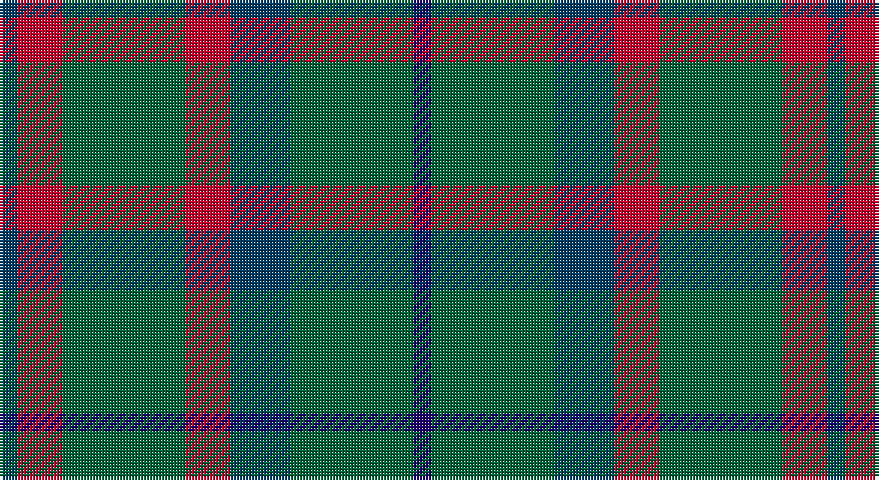

This page is one **sett** — a single exact thread-count. It belongs to the [tartan](/setts/dt6r15g41r15dt20g41db6/)
(the same proportion at any scale), whose colour order is pattern [BGBRGRB](/stripes/bgbrgrb/).

Sourced from tartans-authority.  It is a [7 stripe tartan](/stripes/stripes7/).

Original link http://www.tartansauthority.com/tartan-ferret/display/106/

## Register references

External register numbers recorded for this tartan.

- Scottish Tartans Authority (ITI): 106

## Thread count
DB/6 R15 G41 R15 DB20 G41 DBa/6

One full sett is **276 threads**.

## Palette

Palette: <strong>Tartan Register</strong> <small style="color:#888">(3 of 4 colours)</small>
<table><thead><tr><th>Colour</th><th>Threads</th><th>Shade</th><th>Base</th><th>OKLCh</th></tr></thead><tbody><tr><td>DB/</td><td style="text-align:right;font-variant-numeric:tabular-nums">6</td><td><code style="background-color:#003C64;">#003C64</code> <small style="color:#888">#003C64</small></td><td>B <code style="background-color:#2A418A;">#2A418A</code></td><td><small style="color:#888">oklch(34.5% 0.089 246.0)</small></td></tr><tr><td>R</td><td style="text-align:right;font-variant-numeric:tabular-nums">15</td><td><code style="background-color:#C8002C;">#C8002C</code> <small style="color:#888">#C8002C</small></td><td>R <code style="background-color:#CC0000;">#CC0000</code></td><td><small style="color:#888">oklch(52.6% 0.212 22.0)</small></td></tr><tr><td>G</td><td style="text-align:right;font-variant-numeric:tabular-nums">41</td><td><code style="background-color:#006438;">#006438</code> <small style="color:#888">#006438</small></td><td>G <code style="background-color:#006100;">#006100</code></td><td><small style="color:#888">oklch(44.2% 0.108 155.6)</small></td></tr><tr><td>R</td><td style="text-align:right;font-variant-numeric:tabular-nums">15</td><td><code style="background-color:#C8002C;">#C8002C</code> <small style="color:#888">#C8002C</small></td><td>R <code style="background-color:#CC0000;">#CC0000</code></td><td><small style="color:#888">oklch(52.6% 0.212 22.0)</small></td></tr><tr><td>DB</td><td style="text-align:right;font-variant-numeric:tabular-nums">20</td><td><code style="background-color:#003C64;">#003C64</code> <small style="color:#888">#003C64</small></td><td>B <code style="background-color:#2A418A;">#2A418A</code></td><td><small style="color:#888">oklch(34.5% 0.089 246.0)</small></td></tr><tr><td>G</td><td style="text-align:right;font-variant-numeric:tabular-nums">41</td><td><code style="background-color:#006438;">#006438</code> <small style="color:#888">#006438</small></td><td>G <code style="background-color:#006100;">#006100</code></td><td><small style="color:#888">oklch(44.2% 0.108 155.6)</small></td></tr><tr><td>DBa/</td><td style="text-align:right;font-variant-numeric:tabular-nums">6</td><td><code style="background-color:#1C0070;">#1C0070</code> <small style="color:#888">#1C0070</small></td><td>B <code style="background-color:#2A418A;">#2A418A</code></td><td><small style="color:#888">oklch(26.3% 0.162 277.1)</small></td></tr></tbody></table>

# Sample pattern

## Nearest tartans

The nearest existing variants by ΔTartan distance, with this tartan at the top so the swatches line up against it.

ΔTartan

Tartan

Sett

—

<a href="/ttd/edit/#slug=dt6r15g41r15dt20g41db6">Bean of Freeport Htg (Corporate)</a> <a class="nn-out" href="/variants/s7/dt6r15g41r15dt20g41db6/" title="open its dictionary page">↗</a>

0.84

<a href="/ttd/edit/#slug=dt6r15dg41r15dt20dg41db6&amp;base=dt6r15g41r15dt20g41db6">Bean of Freeport (Personal)</a> <a class="nn-out" href="/variants/s7/dt6r15dg41r15dt20dg41db6/" title="open its dictionary page">↗</a>

0.94

<a href="/ttd/edit/#slug=g14r2g2r3g7db12g2dr2~x2&amp;base=dt6r15g41r15dt20g41db6">Glen Nevis #3</a> <a class="nn-out" href="/variants/s8/g14r2g2r3g7db12g2dr2~x2/" title="open its dictionary page">↗</a>

0.95

<a href="/ttd/edit/#slug=db5dg8k1ly2k1dg8db4~x4&amp;base=dt6r15g41r15dt20g41db6">Salvation Army Htg (Corporate)</a> <a class="nn-out" href="/variants/s7/db5dg8k1ly2k1dg8db4~x4/" title="open its dictionary page">↗</a>

1.05

<a href="/ttd/edit/#slug=db6r15dg41r15db20dg41dbi6&amp;base=dt6r15g41r15dt20g41db6">Bean Hunting Clan Tartan</a> <a class="nn-out" href="/variants/s7/db6r15dg41r15db20dg41dbi6/" title="open its dictionary page">↗</a>

1.06

<a href="/ttd/edit/#slug=r5g20r5g20db24g6ly4&amp;base=dt6r15g41r15dt20g41db6">Cameron of Lochiel (Hunting) Clan/Family Tartan</a> <a class="nn-out" href="/variants/s7/r5g20r5g20db24g6ly4/" title="open its dictionary page">↗</a>

1.11

<a href="/ttd/edit/#slug=n16k13n7dy3r2dy3n7k13n16~x2&amp;base=dt6r15g41r15dt20g41db6">Klappert (Name)</a> <a class="nn-out" href="/variants/s9/n16k13n7dy3r2dy3n7k13n16~x2/" title="open its dictionary page">↗</a>

1.17

<a href="/ttd/edit/#slug=g3db8g3k4g15r2~x2&amp;base=dt6r15g41r15dt20g41db6">Lauder (Family)</a> <a class="nn-out" href="/variants/s6/g3db8g3k4g15r2~x2/" title="open its dictionary page">↗</a>

1.22

<a href="/ttd/edit/#slug=dg2n8dg2k3dg12r2~x2&amp;base=dt6r15g41r15dt20g41db6">Wcwm 1045</a> <a class="nn-out" href="/variants/s6/dg2n8dg2k3dg12r2~x2/" title="open its dictionary page">↗</a>

1.23

<a href="/ttd/edit/#slug=db6r15g41r15db20g41t6&amp;base=dt6r15g41r15dt20g41db6">Bean Hunting</a> <a class="nn-out" href="/variants/s7/db6r15g41r15db20g41t6/" title="open its dictionary page">↗</a>

1.31

<a href="/ttd/edit/#slug=r5dt12g3db4g20dt3g3r5~x4&amp;base=dt6r15g41r15dt20g41db6">Daks (0600150)</a> <a class="nn-out" href="/variants/s8/r5dt12g3db4g20dt3g3r5~x4/" title="open its dictionary page">↗</a>

## Neighbour map

Every grey dot is one of 14360 variants placed by the first two principal components of the ΔTartan feature space (44% of its variance). Red is this tartan; blue dots are its nearest — click one to open its page.

<svg viewBox="0 0 640 380" role="img" style="max-width:100%;height:auto;border:1px solid #e0e0e0;border-radius:4px;display:block" xmlns="http://www.w3.org/2000/svg"><image href="/nn/cloud.v1.png" width="640" height="380"/><a href="/variants/s7/dt6r15dg41r15dt20dg41db6/"><circle cx="311.0" cy="263.3" r="4" fill="#3465a4"><title>Bean of Freeport (Personal)</title></circle></a><a href="/variants/s8/g14r2g2r3g7db12g2dr2~x2/"><circle cx="322.2" cy="242.1" r="4" fill="#3465a4"><title>Glen Nevis #3</title></circle></a><a href="/variants/s7/db5dg8k1ly2k1dg8db4~x4/"><circle cx="295.3" cy="252.9" r="4" fill="#3465a4"><title>Salvation Army Htg (Corporate)</title></circle></a><a href="/variants/s7/db6r15dg41r15db20dg41dbi6/"><circle cx="306.2" cy="259.4" r="4" fill="#3465a4"><title>Bean Hunting Clan Tartan</title></circle></a><a href="/variants/s7/r5g20r5g20db24g6ly4/"><circle cx="263.7" cy="248.8" r="4" fill="#3465a4"><title>Cameron of Lochiel (Hunting) Clan/Family Tartan</title></circle></a><a href="/variants/s9/n16k13n7dy3r2dy3n7k13n16~x2/"><circle cx="323.7" cy="253.3" r="4" fill="#3465a4"><title>Klappert (Name)</title></circle></a><a href="/variants/s6/g3db8g3k4g15r2~x2/"><circle cx="328.7" cy="254.2" r="4" fill="#3465a4"><title>Lauder (Family)</title></circle></a><a href="/variants/s6/dg2n8dg2k3dg12r2~x2/"><circle cx="294.2" cy="260.3" r="4" fill="#3465a4"><title>Wcwm 1045</title></circle></a><a href="/variants/s7/db6r15g41r15db20g41t6/"><circle cx="283.8" cy="247.3" r="4" fill="#3465a4"><title>Bean Hunting</title></circle></a><a href="/variants/s8/r5dt12g3db4g20dt3g3r5~x4/"><circle cx="248.2" cy="232.3" r="4" fill="#3465a4"><title>Daks (0600150)</title></circle></a><circle cx="304.7" cy="259.1" r="5" fill="#c00000"/></svg>

ID: /variants/s7/dt6r15g41r15dt20g41db6/
