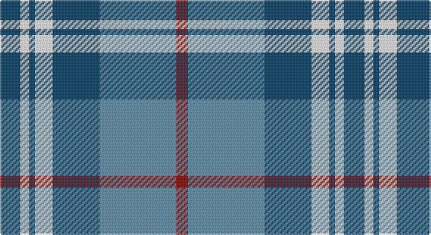

This page is one **sett** — a single exact thread-count. It belongs to the [tartan](/setts/dt7w3dt2w6dt16t26r4/)
(the same proportion at any scale), whose colour order is pattern [BWBWBBR](/stripes/bwbwbbr/).

Sourced from tartans-authority.  It is a [7 stripe tartan](/stripes/stripes7/).

Original link http://www.tartansauthority.com/tartan-ferret/display/6157/

## Register references

External register numbers recorded for this tartan.

- Scottish Tartans Authority (ITI): 6157

## Thread count
DB/14 W6 DB4 W12 DB32 B52 DR/8

One full sett is **234 threads**.

## Palette

Palette: <strong>Tartan Register</strong>
<table><thead><tr><th>Colour</th><th>Threads</th><th>Shade</th><th>Base</th><th>OKLCh</th></tr></thead><tbody><tr><td>DB/</td><td style="text-align:right;font-variant-numeric:tabular-nums">14</td><td><code style="background-color:#003C64;">#003C64</code> <small style="color:#888">#003C64</small></td><td>B <code style="background-color:#2A418A;">#2A418A</code></td><td><small style="color:#888">oklch(34.5% 0.089 246.0)</small></td></tr><tr><td>W</td><td style="text-align:right;font-variant-numeric:tabular-nums">6</td><td><code style="background-color:#FCFCFC;">#FCFCFC</code> <small style="color:#888">#FCFCFC</small></td><td>W <code style="background-color:#F7F7F7;">#F7F7F7</code></td><td><small style="color:#888">oklch(99.1% 0.000 89.9)</small></td></tr><tr><td>DB</td><td style="text-align:right;font-variant-numeric:tabular-nums">4</td><td><code style="background-color:#003C64;">#003C64</code> <small style="color:#888">#003C64</small></td><td>B <code style="background-color:#2A418A;">#2A418A</code></td><td><small style="color:#888">oklch(34.5% 0.089 246.0)</small></td></tr><tr><td>W</td><td style="text-align:right;font-variant-numeric:tabular-nums">12</td><td><code style="background-color:#FCFCFC;">#FCFCFC</code> <small style="color:#888">#FCFCFC</small></td><td>W <code style="background-color:#F7F7F7;">#F7F7F7</code></td><td><small style="color:#888">oklch(99.1% 0.000 89.9)</small></td></tr><tr><td>DB</td><td style="text-align:right;font-variant-numeric:tabular-nums">32</td><td><code style="background-color:#003C64;">#003C64</code> <small style="color:#888">#003C64</small></td><td>B <code style="background-color:#2A418A;">#2A418A</code></td><td><small style="color:#888">oklch(34.5% 0.089 246.0)</small></td></tr><tr><td>B</td><td style="text-align:right;font-variant-numeric:tabular-nums">52</td><td><code style="background-color:#5C8CA8;">#5C8CA8</code> <small style="color:#888">#5C8CA8</small></td><td>B <code style="background-color:#2A418A;">#2A418A</code></td><td><small style="color:#888">oklch(61.7% 0.067 235.0)</small></td></tr><tr><td>DR/</td><td style="text-align:right;font-variant-numeric:tabular-nums">8</td><td><code style="background-color:#880000;">#880000</code> <small style="color:#888">#880000</small></td><td>R <code style="background-color:#CC0000;">#CC0000</code></td><td><small style="color:#888">oklch(39.4% 0.162 29.2)</small></td></tr></tbody></table>

# Sample pattern

## Nearest tartans

The nearest existing variants by ΔTartan distance, with this tartan at the top so the swatches line up against it.

ΔTartan

Tartan

Sett

—

<a href="/ttd/edit/#slug=dt7w3dt2w6dt16t26r4~x2">Keela (Corporate)</a> <a class="nn-out" href="/variants/s7/dt7w3dt2w6dt16t26r4~x2/" title="open its dictionary page">↗</a>

0.91

<a href="/ttd/edit/#slug=w9b3ly3b24db24ly2db2ly2~x2&amp;base=dt7w3dt2w6dt16t26r4~x2">Halesowen (District)</a> <a class="nn-out" href="/variants/s8/w9b3ly3b24db24ly2db2ly2~x2/" title="open its dictionary page">↗</a>

1.08

<a href="/ttd/edit/#slug=b27w2b14k14lg4k4lg4k4lg27&amp;base=dt7w3dt2w6dt16t26r4~x2">(1) Abercrombie</a> <a class="nn-out" href="/variants/s9/b27w2b14k14lg4k4lg4k4lg27/" title="open its dictionary page">↗</a>

1.09

<a href="/ttd/edit/#slug=t30dp15w4dg12w9t8w3~x2&amp;base=dt7w3dt2w6dt16t26r4~x2">Newall (Dumbarton) (Personal)</a> <a class="nn-out" href="/variants/s7/t30dp15w4dg12w9t8w3~x2/" title="open its dictionary page">↗</a>

1.12

<a href="/ttd/edit/#slug=db3dr2db18dr1w10o18dr2o3~x2&amp;base=dt7w3dt2w6dt16t26r4~x2">Bannockbane Silver</a> <a class="nn-out" href="/variants/s8/db3dr2db18dr1w10o18dr2o3~x2/" title="open its dictionary page">↗</a>

1.12

<a href="/ttd/edit/#slug=r15t98db72ly25db8w15&amp;base=dt7w3dt2w6dt16t26r4~x2">Afternoon Tea / Earl Grey</a> <a class="nn-out" href="/variants/s6/r15t98db72ly25db8w15/" title="open its dictionary page">↗</a>

1.15

<a href="/ttd/edit/#slug=g19w1db12b2db2b2db2b16~x2&amp;base=dt7w3dt2w6dt16t26r4~x2">Unnamed, No 52</a> <a class="nn-out" href="/variants/s8/g19w1db12b2db2b2db2b16~x2/" title="open its dictionary page">↗</a>

1.15

<a href="/ttd/edit/#slug=k3lb10db2g6db18g2~x2&amp;base=dt7w3dt2w6dt16t26r4~x2">Crombie House Check</a> <a class="nn-out" href="/variants/s6/k3lb10db2g6db18g2~x2/" title="open its dictionary page">↗</a>

1.16

<a href="/ttd/edit/#slug=b30dt15lb4dg12lb9b8lb3~x2&amp;base=dt7w3dt2w6dt16t26r4~x2">Newall (Personal)</a> <a class="nn-out" href="/variants/s7/b30dt15lb4dg12lb9b8lb3~x2/" title="open its dictionary page">↗</a>

1.16

<a href="/ttd/edit/#slug=db3o2db18o1w10y18o2y3~x2&amp;base=dt7w3dt2w6dt16t26r4~x2">Bannockbane, Modern Silver</a> <a class="nn-out" href="/variants/s8/db3o2db18o1w10y18o2y3~x2/" title="open its dictionary page">↗</a>

1.16

<a href="/variants/s12/dt7w3dt2w6dt16t26r4~x2/">Keela</a>

## Neighbour map

Every grey dot is one of 14360 variants placed by the first two principal components of the ΔTartan feature space (44% of its variance). Red is this tartan; blue dots are its nearest — click one to open its page.

<svg viewBox="0 0 640 380" role="img" style="max-width:100%;height:auto;border:1px solid #e0e0e0;border-radius:4px;display:block" xmlns="http://www.w3.org/2000/svg"><image href="/nn/cloud.v1.png" width="640" height="380"/><a href="/variants/s8/w9b3ly3b24db24ly2db2ly2~x2/"><circle cx="210.7" cy="169.5" r="4" fill="#3465a4"><title>Halesowen (District)</title></circle></a><a href="/variants/s9/b27w2b14k14lg4k4lg4k4lg27/"><circle cx="184.0" cy="160.4" r="4" fill="#3465a4"><title>(1) Abercrombie</title></circle></a><a href="/variants/s7/t30dp15w4dg12w9t8w3~x2/"><circle cx="213.7" cy="207.4" r="4" fill="#3465a4"><title>Newall (Dumbarton) (Personal)</title></circle></a><a href="/variants/s8/db3dr2db18dr1w10o18dr2o3~x2/"><circle cx="201.4" cy="153.2" r="4" fill="#3465a4"><title>Bannockbane Silver</title></circle></a><a href="/variants/s6/r15t98db72ly25db8w15/"><circle cx="185.4" cy="169.2" r="4" fill="#3465a4"><title>Afternoon Tea / Earl Grey</title></circle></a><a href="/variants/s8/g19w1db12b2db2b2db2b16~x2/"><circle cx="207.8" cy="161.0" r="4" fill="#3465a4"><title>Unnamed, No 52</title></circle></a><a href="/variants/s6/k3lb10db2g6db18g2~x2/"><circle cx="226.8" cy="209.5" r="4" fill="#3465a4"><title>Crombie House Check</title></circle></a><a href="/variants/s7/b30dt15lb4dg12lb9b8lb3~x2/"><circle cx="215.4" cy="216.3" r="4" fill="#3465a4"><title>Newall (Personal)</title></circle></a><a href="/variants/s8/db3o2db18o1w10y18o2y3~x2/"><circle cx="223.5" cy="163.9" r="4" fill="#3465a4"><title>Bannockbane, Modern Silver</title></circle></a><a href="/variants/s12/dt7w3dt2w6dt16t26r4~x2/"><circle cx="218.4" cy="160.8" r="4" fill="#3465a4"><title>Keela</title></circle></a><circle cx="213.0" cy="182.8" r="5" fill="#c00000"/></svg>

ID: /variants/s7/dt7w3dt2w6dt16t26r4~x2/
