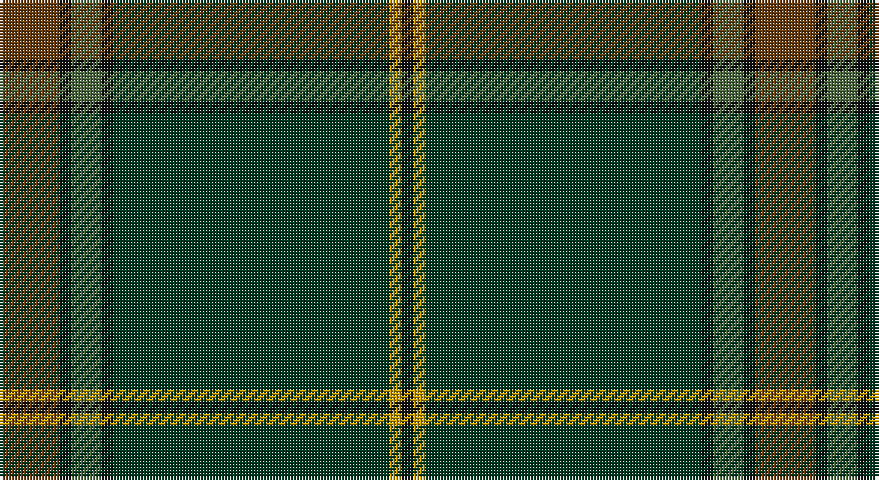

This page is one **sett** — a single exact thread-count. It belongs to the [tartan](/setts/dy10k2y5k2dg46ly2k2/)
(the same proportion at any scale), whose colour order is pattern [GKGKGYK](/stripes/gkgkgyk/).

Sourced from register-of-tartans.  It is a [7 stripe tartan](/stripes/stripes7/).

Original link https://www.tartanregister.gov.uk/tartanDetails.aspx?ref=10829

## Also known as

This cloth is also recorded under:

- Green Rover, The

## Register references

External register numbers recorded for this tartan.

- Scottish Register of Tartans: [10829](https://www.tartanregister.gov.uk/tartanDetails.aspx?ref=10829)

## Thread count
T/20 K4 G10 K4 DG92 DY4 K/4

One full sett is **252 threads**.

## Palette

Palette: <strong>Tartan Register</strong> <small style="color:#888">(2 of 5 colours)</small>
<table><thead><tr><th>Colour</th><th>Threads</th><th>Shade</th><th>Base</th><th>OKLCh</th></tr></thead><tbody><tr><td>T/</td><td style="text-align:right;font-variant-numeric:tabular-nums">20</td><td><code style="background-color:#683C10;">#683C10</code> <small style="color:#888">#683C10</small></td><td>G <code style="background-color:#006100;">#006100</code></td><td><small style="color:#888">oklch(40.2% 0.083 60.6)</small></td></tr><tr><td>K</td><td style="text-align:right;font-variant-numeric:tabular-nums">4</td><td><code style="background-color:#101010;">#101010</code> <small style="color:#888">#101010</small></td><td>K <code style="background-color:#000000;">#000000</code></td><td><small style="color:#888">oklch(17.3% 0.000 89.9)</small></td></tr><tr><td>G</td><td style="text-align:right;font-variant-numeric:tabular-nums">10</td><td><code style="background-color:#4C6840;">#4C6840</code> <small style="color:#888">#4C6840</small></td><td>G <code style="background-color:#006100;">#006100</code></td><td><small style="color:#888">oklch(48.4% 0.070 136.7)</small></td></tr><tr><td>K</td><td style="text-align:right;font-variant-numeric:tabular-nums">4</td><td><code style="background-color:#101010;">#101010</code> <small style="color:#888">#101010</small></td><td>K <code style="background-color:#000000;">#000000</code></td><td><small style="color:#888">oklch(17.3% 0.000 89.9)</small></td></tr><tr><td>DG</td><td style="text-align:right;font-variant-numeric:tabular-nums">92</td><td><code style="background-color:#003820;">#003820</code> <small style="color:#888">#003820</small></td><td>G <code style="background-color:#006100;">#006100</code></td><td><small style="color:#888">oklch(30.0% 0.070 158.3)</small></td></tr><tr><td>DY</td><td style="text-align:right;font-variant-numeric:tabular-nums">4</td><td><code style="background-color:#C49C00;">#C49C00</code> <small style="color:#888">#C49C00</small></td><td>Y <code style="background-color:#F2BF00;">#F2BF00</code></td><td><small style="color:#888">oklch(70.9% 0.145 90.3)</small></td></tr><tr><td>K/</td><td style="text-align:right;font-variant-numeric:tabular-nums">4</td><td><code style="background-color:#101010;">#101010</code> <small style="color:#888">#101010</small></td><td>K <code style="background-color:#000000;">#000000</code></td><td><small style="color:#888">oklch(17.3% 0.000 89.9)</small></td></tr></tbody></table>

# Sample pattern

## Nearest tartans

The nearest existing variants by ΔTartan distance, with this tartan at the top so the swatches line up against it.

ΔTartan

Tartan

Sett

—

<a href="/ttd/edit/#slug=dy10k2y5k2dg46ly2k2~x2">Green Rover, The</a> <a class="nn-out" href="/variants/s7/dy10k2y5k2dg46ly2k2~x2/" title="open its dictionary page">↗</a>

1.48

<a href="/variants/s8/y3dyi3y4k4dy14k3y41g2~x2/">Huntsman</a>

1.54

<a href="/ttd/edit/#slug=k8r2k13ly2dg48db6~x2&amp;base=dy10k2y5k2dg46ly2k2~x2">Green Swamp Youth Campers</a> <a class="nn-out" href="/variants/s6/k8r2k13ly2dg48db6~x2/" title="open its dictionary page">↗</a>

1.64

<a href="/ttd/edit/#slug=dt36k3dg3g1dg3k3dt4dg6k1g2~x4&amp;base=dy10k2y5k2dg46ly2k2~x2">Verdon</a> <a class="nn-out" href="/variants/s10/dt36k3dg3g1dg3k3dt4dg6k1g2~x4/" title="open its dictionary page">↗</a>

1.71

<a href="/variants/s5/dt62o4dy10dyi3dg21~x2/">McGovern (2016)</a>

1.87

<a href="/ttd/edit/#slug=g38n8b3db4n12lo1g4n1~x2&amp;base=dy10k2y5k2dg46ly2k2~x2">Del Forno Wolf (Personal)</a> <a class="nn-out" href="/variants/s8/g38n8b3db4n12lo1g4n1~x2/" title="open its dictionary page">↗</a>

1.95

<a href="/variants/s15/dp2ki1dg6k4ki1k5ki2dg30ki2db4ki1k4dg6ki1dp2~x2/">Letham Hunting</a>

1.95

<a href="/variants/s8/k9dg5w1dg15ki2dg1ki44r1~x2/">Ata?, H.M. &amp; I.C. (Personal)</a>

1.97

<a href="/ttd/edit/#slug=dr8g19dg42lo3r1~x2&amp;base=dy10k2y5k2dg46ly2k2~x2">Nolan (Personal)</a> <a class="nn-out" href="/variants/s5/dr8g19dg42lo3r1~x2/" title="open its dictionary page">↗</a>

2.01

<a href="/ttd/edit/#slug=r2b4y18n2y2n41w2~x2&amp;base=dy10k2y5k2dg46ly2k2~x2">Haddrell (2013)</a> <a class="nn-out" href="/variants/s7/r2b4y18n2y2n41w2~x2/" title="open its dictionary page">↗</a>

2.02

<a href="/ttd/edit/#slug=dg47ly2dg5ly2dg4k15db19r2~x2&amp;base=dy10k2y5k2dg46ly2k2~x2">Unidentified, Toy Bear</a> <a class="nn-out" href="/variants/s8/dg47ly2dg5ly2dg4k15db19r2~x2/" title="open its dictionary page">↗</a>

## Neighbour map

Every grey dot is one of 14360 variants placed by the first two principal components of the ΔTartan feature space (44% of its variance). Red is this tartan; blue dots are its nearest — click one to open its page.

<svg viewBox="0 0 640 380" role="img" style="max-width:100%;height:auto;border:1px solid #e0e0e0;border-radius:4px;display:block" xmlns="http://www.w3.org/2000/svg"><image href="/nn/cloud.v1.png" width="640" height="380"/><a href="/variants/s8/y3dyi3y4k4dy14k3y41g2~x2/"><circle cx="499.5" cy="192.3" r="4" fill="#3465a4"><title>Huntsman</title></circle></a><a href="/variants/s6/k8r2k13ly2dg48db6~x2/"><circle cx="438.1" cy="192.8" r="4" fill="#3465a4"><title>Green Swamp Youth Campers</title></circle></a><a href="/variants/s10/dt36k3dg3g1dg3k3dt4dg6k1g2~x4/"><circle cx="512.0" cy="158.8" r="4" fill="#3465a4"><title>Verdon</title></circle></a><a href="/variants/s5/dt62o4dy10dyi3dg21~x2/"><circle cx="472.0" cy="233.4" r="4" fill="#3465a4"><title>McGovern (2016)</title></circle></a><a href="/variants/s8/g38n8b3db4n12lo1g4n1~x2/"><circle cx="488.7" cy="180.4" r="4" fill="#3465a4"><title>Del Forno Wolf (Personal)</title></circle></a><a href="/variants/s15/dp2ki1dg6k4ki1k5ki2dg30ki2db4ki1k4dg6ki1dp2~x2/"><circle cx="461.3" cy="156.4" r="4" fill="#3465a4"><title>Letham Hunting</title></circle></a><a href="/variants/s8/k9dg5w1dg15ki2dg1ki44r1~x2/"><circle cx="488.7" cy="169.7" r="4" fill="#3465a4"><title>Ata?, H.M. &amp; I.C. (Personal)</title></circle></a><a href="/variants/s5/dr8g19dg42lo3r1~x2/"><circle cx="439.5" cy="196.7" r="4" fill="#3465a4"><title>Nolan (Personal)</title></circle></a><a href="/variants/s7/r2b4y18n2y2n41w2~x2/"><circle cx="459.5" cy="181.1" r="4" fill="#3465a4"><title>Haddrell (2013)</title></circle></a><a href="/variants/s8/dg47ly2dg5ly2dg4k15db19r2~x2/"><circle cx="391.7" cy="172.3" r="4" fill="#3465a4"><title>Unidentified, Toy Bear</title></circle></a><circle cx="509.2" cy="187.3" r="5" fill="#c00000"/></svg>

ID: /variants/s7/dy10k2y5k2dg46ly2k2~x2/
