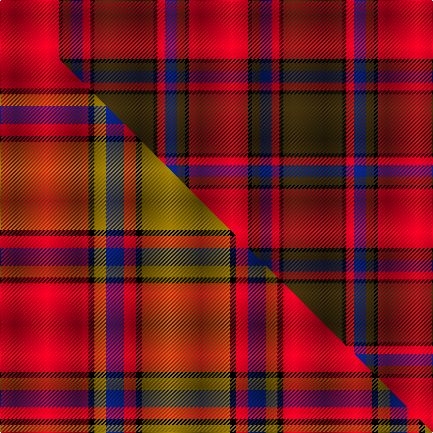

This page is one **sett** — a single exact thread-count. It belongs to the [tartan](/setts/dy15k1r2db3dy2k1r15/)
(the same proportion at any scale), whose colour order is pattern [GKRBGKR](/stripes/gkrbgkr/).

Part of the [Scrymgeour](/tartans/scrymgeour/) tartan — the named design grouping this sett with its other cloths.

Sourced from house-of-tartan.  It is a [7 stripe tartan](/stripes/stripes7/).

Original link http://www.house-of-tartan.scotland.net/house/TartanViewjs.asp?colr=Def&tnam=1627

## Provenance

Earliest known date: 1971 Yellow ochre. A note in STS files says "Not Adopted" with no explanation. The STS research report reads, "The tartan detailed above was displayed at a gathering of Scrymgeours held at Dudhope Castle, Dundee, in 1971 and was later adopted as the official tartan. The sett was designed by Donald C Stewart, author of 'The Setts of the Scottish Tartans' in 1970."

## Thread count
R/60 K4 DY8 DB12 R8 K4 DY/60

One full sett is **192 threads**.

## Palette
<table><thead><tr><th>Colour</th><th>Shade</th><th>OKLCh</th></tr></thead><tbody><tr><td>DB</td><td><code style="background-color:#082077;">#082077</code> <small style="color:#888">#082077</small></td><td><small style="color:#888">oklch(30.0% 0.149 265.1)</small></td></tr><tr><td>K</td><td><code style="background-color:#000000;">#000000</code> <small style="color:#888">#000000</small></td><td><small style="color:#888">oklch(0.0% 0.000 0.0)</small></td></tr><tr><td>R</td><td><code style="background-color:#D60020;">#D60020</code> <small style="color:#888">#D60020</small></td><td><small style="color:#888">oklch(55.2% 0.224 25.5)</small></td></tr><tr><td>DY</td><td><code style="background-color:#3A2B0D;">#3A2B0D</code> <small style="color:#888">#3A2B0D</small></td><td><small style="color:#888">oklch(30.0% 0.049 82.0)</small></td></tr></tbody></table>

# Sample pattern

## Compared to the master

This cloth is one sett of its design; the master sett (the exemplar the design is anchored on) is below for comparison.

Its **ΔTartan distance** from the master is **1.09** — the same measure the nearest-tartans table ranks by (0 is identical; a re-scale of the same cloth is near 0, a recolour or a different proportion further).

<figure class="master-compare" style="margin:0">

this sett
master sett ★

<figcaption style="color:#888;font-size:smaller">One weave of this sett against the <a href="/setts/r15k1y2db3r2k1y15/">master sett ★</a>, split on the diagonal: a shared proportion runs seamlessly across it with only the shades shifting; a different proportion breaks on it.</figcaption>
</figure>

## Nearest tartan variants

The nearest existing variants by ΔTartan distance, with this cloth at the top so the swatches line up against it.

ΔTartan

Threads

Variant

Sett

—

192

<a href="/variants/s7/dy15k1r2db3dy2k1r15~x4/">Scrymgeour Family Tartan</a>

<a href="/ttd/edit/#slug=r15k1y2db3r2k1y15~x6&amp;base=dy15k1r2db3dy2k1r15~x4" title="compare in the TTD">0.00</a>

288

<a href="/variants/s7/r15k1y2db3r2k1y15~x6/">Scrymgeour</a>

<a href="/ttd/edit/#slug=r15k1y2db3r2k1y15~x3&amp;base=dy15k1r2db3dy2k1r15~x4" title="compare in the TTD">0.00</a>

144

<a href="/variants/s7/r15k1y2db3r2k1y15~x3/">Scrymgeour</a>

<a href="/ttd/edit/#slug=r46k3y6db8r6k3y46&amp;base=dy15k1r2db3dy2k1r15~x4" title="compare in the TTD">0.04</a>

144

<a href="/variants/s7/r46k3y6db8r6k3y46/">Scrymgeour</a>

<a href="/ttd/edit/#slug=dr15k1lo2db3dr2k1lo15~x6&amp;base=dy15k1r2db3dy2k1r15~x4" title="compare in the TTD">2.40</a>

288

<a href="/variants/s7/dr15k1lo2db3dr2k1lo15~x6/">Scrymgeour (Clan)</a>

<a href="/ttd/edit/#slug=r2k3y1k3r2db8r16k1~x4&amp;base=dy15k1r2db3dy2k1r15~x4" title="compare in the TTD">3.00</a>

276

<a href="/variants/s8/r2k3y1k3r2db8r16k1~x4/">Leslie Red (VS) (Clan)</a>

## Neighbour map

Every grey dot is one of 13620 variants placed by the first two principal components of the ΔTartan feature space (42% of its variance). Red is this tartan; blue dots are its nearest — click one to open its page.

<svg viewBox="0 0 640 380" role="img" style="max-width:100%;height:auto;border:1px solid #e0e0e0;border-radius:4px;display:block" xmlns="http://www.w3.org/2000/svg"><image href="/nn/cloud.v1.png" width="640" height="380"/><a href="/variants/s7/r15k1y2db3r2k1y15~x6/"><circle cx="298.0" cy="163.4" r="4" fill="#3465a4"><title>Scrymgeour</title></circle></a><a href="/variants/s7/r15k1y2db3r2k1y15~x3/"><circle cx="298.0" cy="163.4" r="4" fill="#3465a4"><title>Scrymgeour</title></circle></a><a href="/variants/s7/r46k3y6db8r6k3y46/"><circle cx="306.4" cy="161.9" r="4" fill="#3465a4"><title>Scrymgeour</title></circle></a><a href="/variants/s7/dr15k1lo2db3dr2k1lo15~x6/"><circle cx="244.4" cy="149.5" r="4" fill="#3465a4"><title>Scrymgeour (Clan)</title></circle></a><a href="/variants/s8/r2k3y1k3r2db8r16k1~x4/"><circle cx="281.1" cy="130.6" r="4" fill="#3465a4"><title>Leslie Red (VS) (Clan)</title></circle></a><circle cx="284.7" cy="156.9" r="5" fill="#c00000"/><text x="320" y="376" text-anchor="middle" font-size="11" fill="#999">ground</text><text x="11" y="190" text-anchor="middle" font-size="11" fill="#999" transform="rotate(-90 11 190)">complexity</text></svg>

ID: /variants/s7/dy15k1r2db3dy2k1r15~x4/
