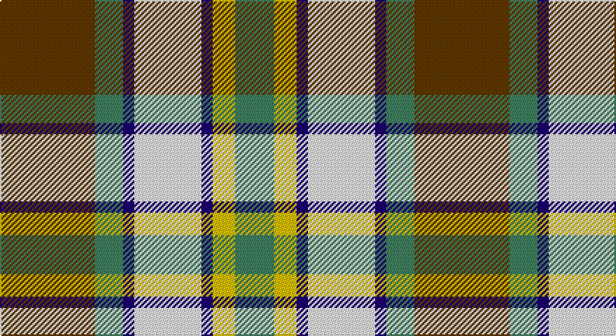

This page is one **sett** — a single exact thread-count. It belongs to the [tartan](/setts/dy17g5db2w12db2ly4g7/)
(the same proportion at any scale), whose colour order is pattern [GGBWBYG](/stripes/ggbwbyg/).

Part of the [Northern Ontario](/tartans/northern-ontario/) tartan — the named design grouping this sett with its other cloths.

Sourced from register-of-tartans.  It is a [7 stripe tartan](/stripes/stripes7/).

Original link https://www.tartanregister.gov.uk/tartanDetails.aspx?ref=3161

## Also known as

This cloth is also recorded under:

- Ontario, Northern

## Register references

External register numbers recorded for this tartan.

- Scottish Register of Tartans: [3161](https://www.tartanregister.gov.uk/tartanDetails.aspx?ref=3161)
- Scottish Tartans Authority (ITI): 5524

## Thread count
T/68 Ga20 DB8 Wa48 DB8 Y16 Ga/28

One full sett is **296 threads**.

## Palette

Palette: <strong>Tartan Register</strong> <small style="color:#888">(9 of 10 colours)</small>
<table><thead><tr><th>Colour</th><th>Threads</th><th>Shade</th><th>Base</th><th>OKLCh</th></tr></thead><tbody><tr><td>T/</td><td style="text-align:right;font-variant-numeric:tabular-nums">68</td><td><code style="background-color:#603800;">#603800</code> <small style="color:#888">#603800</small></td><td>G <code style="background-color:#006100;">#006100</code></td><td><small style="color:#888">oklch(38.1% 0.084 66.7)</small></td></tr><tr><td>Ga</td><td style="text-align:right;font-variant-numeric:tabular-nums">20</td><td><code style="background-color:#408060;">#408060</code> <small style="color:#888">#408060</small></td><td>G <code style="background-color:#006100;">#006100</code></td><td><small style="color:#888">oklch(54.8% 0.084 160.1)</small></td></tr><tr><td>DB</td><td style="text-align:right;font-variant-numeric:tabular-nums">8</td><td><code style="background-color:#1C0070;">#1C0070</code> <small style="color:#888">#1C0070</small></td><td>B <code style="background-color:#2A418A;">#2A418A</code></td><td><small style="color:#888">oklch(26.3% 0.162 277.1)</small></td></tr><tr><td>Wa</td><td style="text-align:right;font-variant-numeric:tabular-nums">48</td><td><code style="background-color:#F8F8F8;">#F8F8F8</code> <small style="color:#888">#F8F8F8</small></td><td>W <code style="background-color:#F7F7F7;">#F7F7F7</code></td><td><small style="color:#888">oklch(97.9% 0.000 89.9)</small></td></tr><tr><td>DB</td><td style="text-align:right;font-variant-numeric:tabular-nums">8</td><td><code style="background-color:#1C0070;">#1C0070</code> <small style="color:#888">#1C0070</small></td><td>B <code style="background-color:#2A418A;">#2A418A</code></td><td><small style="color:#888">oklch(26.3% 0.162 277.1)</small></td></tr><tr><td>Y</td><td style="text-align:right;font-variant-numeric:tabular-nums">16</td><td><code style="background-color:#E8C000;">#E8C000</code> <small style="color:#888">#E8C000</small></td><td>Y <code style="background-color:#F2BF00;">#F2BF00</code></td><td><small style="color:#888">oklch(81.9% 0.168 93.7)</small></td></tr><tr><td>Ga/</td><td style="text-align:right;font-variant-numeric:tabular-nums">28</td><td><code style="background-color:#408060;">#408060</code> <small style="color:#888">#408060</small></td><td>G <code style="background-color:#006100;">#006100</code></td><td><small style="color:#888">oklch(54.8% 0.084 160.1)</small></td></tr></tbody></table>

# Sample pattern

## Nearest tartans

The nearest existing variants by ΔTartan distance, with this tartan at the top so the swatches line up against it.

ΔTartan

Tartan

Sett

—

<a href="/ttd/edit/#slug=dy17g5db2w12db2ly4g7~x4">Northern Ontario</a> <a class="nn-out" href="/variants/s7/dy17g5db2w12db2ly4g7~x4/" title="open its dictionary page">↗</a>

0.71

<a href="/ttd/edit/#slug=r4db18ri4g19w25r10w4~x2&amp;base=dy17g5db2w12db2ly4g7~x4">Fraser, Red dress</a> <a class="nn-out" href="/variants/s7/r4db18ri4g19w25r10w4~x2/" title="open its dictionary page">↗</a>

0.82

<a href="/ttd/edit/#slug=db6w10g10r2ly3r1db3~x2&amp;base=dy17g5db2w12db2ly4g7~x4">Ainslie, Lake</a> <a class="nn-out" href="/variants/s7/db6w10g10r2ly3r1db3~x2/" title="open its dictionary page">↗</a>

0.85

<a href="/ttd/edit/#slug=w4k2w18k11db2y18ly2~x2&amp;base=dy17g5db2w12db2ly4g7~x4">Barbour - Ancient</a> <a class="nn-out" href="/variants/s7/w4k2w18k11db2y18ly2~x2/" title="open its dictionary page">↗</a>

0.91

<a href="/ttd/edit/#slug=w4dt6r3dt10n14lo6w18lo6n4lo2~x2&amp;base=dy17g5db2w12db2ly4g7~x4">Gray, Sir John Hamilton (Commem)</a> <a class="nn-out" href="/variants/s10/w4dt6r3dt10n14lo6w18lo6n4lo2~x2/" title="open its dictionary page">↗</a>

0.92

<a href="/ttd/edit/#slug=db8w33k15dg17t3dg17t3~x2&amp;base=dy17g5db2w12db2ly4g7~x4">MacRobart Dress (Personal)</a> <a class="nn-out" href="/variants/s7/db8w33k15dg17t3dg17t3~x2/" title="open its dictionary page">↗</a>

0.94

<a href="/ttd/edit/#slug=r4o25k6w12k11ly3~x2&amp;base=dy17g5db2w12db2ly4g7~x4">Thomson Dress (Grey) (Fashion)</a> <a class="nn-out" href="/variants/s6/r4o25k6w12k11ly3~x2/" title="open its dictionary page">↗</a>

0.94

<a href="/ttd/edit/#slug=r4db18ri4dg19w25r10w4~x2&amp;base=dy17g5db2w12db2ly4g7~x4">Fraser Red Dress</a> <a class="nn-out" href="/variants/s7/r4db18ri4dg19w25r10w4~x2/" title="open its dictionary page">↗</a>

0.96

<a href="/ttd/edit/#slug=k20w4r4w20dg20w5dg2g2~x2&amp;base=dy17g5db2w12db2ly4g7~x4">Hackett, William (Coatbridge) (Personal)</a> <a class="nn-out" href="/variants/s8/k20w4r4w20dg20w5dg2g2~x2/" title="open its dictionary page">↗</a>

0.96

<a href="/ttd/edit/#slug=dg4g3dg24w15lo21gi3lo4~x2&amp;base=dy17g5db2w12db2ly4g7~x4">Bannockbane Dark Green</a> <a class="nn-out" href="/variants/s7/dg4g3dg24w15lo21gi3lo4~x2/" title="open its dictionary page">↗</a>

0.96

<a href="/ttd/edit/#slug=g4ly7o9ly9db20w2db2~x2&amp;base=dy17g5db2w12db2ly4g7~x4">Tombow 140th Anniversary, The</a> <a class="nn-out" href="/variants/s7/g4ly7o9ly9db20w2db2~x2/" title="open its dictionary page">↗</a>

## Neighbour map

Every grey dot is one of 14360 variants placed by the first two principal components of the ΔTartan feature space (44% of its variance). Red is this tartan; blue dots are its nearest — click one to open its page.

<svg viewBox="0 0 640 380" role="img" style="max-width:100%;height:auto;border:1px solid #e0e0e0;border-radius:4px;display:block" xmlns="http://www.w3.org/2000/svg"><image href="/nn/cloud.v1.png" width="640" height="380"/><a href="/variants/s7/r4db18ri4g19w25r10w4~x2/"><circle cx="86.0" cy="193.7" r="4" fill="#3465a4"><title>Fraser, Red dress</title></circle></a><a href="/variants/s7/db6w10g10r2ly3r1db3~x2/"><circle cx="72.2" cy="172.1" r="4" fill="#3465a4"><title>Ainslie, Lake</title></circle></a><a href="/variants/s7/w4k2w18k11db2y18ly2~x2/"><circle cx="129.6" cy="159.4" r="4" fill="#3465a4"><title>Barbour - Ancient</title></circle></a><a href="/variants/s10/w4dt6r3dt10n14lo6w18lo6n4lo2~x2/"><circle cx="65.2" cy="163.1" r="4" fill="#3465a4"><title>Gray, Sir John Hamilton (Commem)</title></circle></a><a href="/variants/s7/db8w33k15dg17t3dg17t3~x2/"><circle cx="114.3" cy="175.9" r="4" fill="#3465a4"><title>MacRobart Dress (Personal)</title></circle></a><a href="/variants/s6/r4o25k6w12k11ly3~x2/"><circle cx="140.5" cy="186.0" r="4" fill="#3465a4"><title>Thomson Dress (Grey) (Fashion)</title></circle></a><a href="/variants/s7/r4db18ri4dg19w25r10w4~x2/"><circle cx="85.3" cy="192.2" r="4" fill="#3465a4"><title>Fraser Red Dress</title></circle></a><a href="/variants/s8/k20w4r4w20dg20w5dg2g2~x2/"><circle cx="121.9" cy="153.2" r="4" fill="#3465a4"><title>Hackett, William (Coatbridge) (Personal)</title></circle></a><a href="/variants/s7/dg4g3dg24w15lo21gi3lo4~x2/"><circle cx="144.3" cy="185.4" r="4" fill="#3465a4"><title>Bannockbane Dark Green</title></circle></a><a href="/variants/s7/g4ly7o9ly9db20w2db2~x2/"><circle cx="155.4" cy="171.6" r="4" fill="#3465a4"><title>Tombow 140th Anniversary, The</title></circle></a><circle cx="102.8" cy="176.6" r="5" fill="#c00000"/></svg>

ID: /variants/s7/dy17g5db2w12db2ly4g7~x4/
