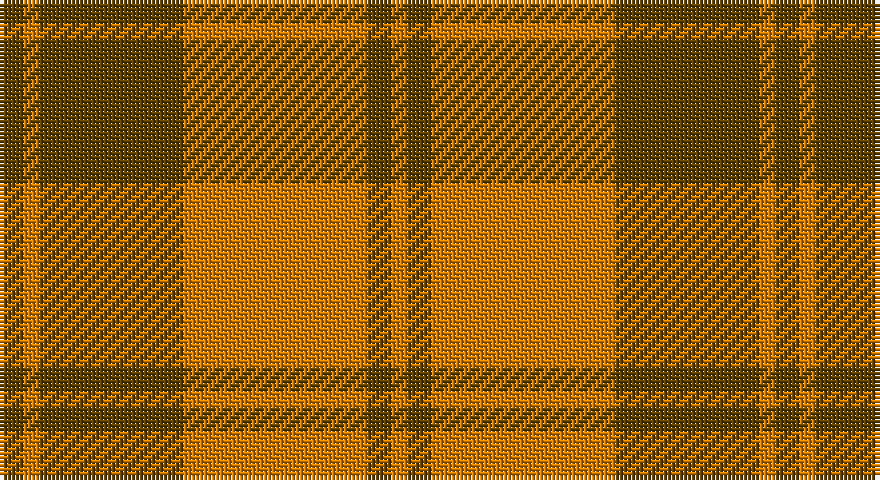

This page is one **sett** — a single exact thread-count. It belongs to the [tartan](/setts/dy3lo2dy18lo21lo2dy3lo2/)
(the same proportion at any scale), whose colour order is pattern [GYGYYGY](/stripes/gygyygy/).

Part of the [Prince David](/tartans/prince-david/) tartan — the named design grouping this sett with its other cloths.

Sourced from tartans-authority.  It is a [7 stripe tartan](/stripes/stripes7/).

Original link http://www.tartansauthority.com/tartan-ferret/display/826/

## Also known as

This cloth is also recorded under:

- Prince David #1

## Register references

External register numbers recorded for this tartan.

- Scottish Tartans Authority (ITI): 826

## Thread count
T/6 Oa4 T36 Oa42 O4 T6 O/4

One full sett is **194 threads**.

## Palette

Palette: <strong>Tartan Register</strong>
<table><thead><tr><th>Colour</th><th>Threads</th><th>Shade</th><th>Base</th><th>OKLCh</th></tr></thead><tbody><tr><td>T/</td><td style="text-align:right;font-variant-numeric:tabular-nums">6</td><td><code style="background-color:#604000;">#604000</code> <small style="color:#888">#604000</small></td><td>G <code style="background-color:#006100;">#006100</code></td><td><small style="color:#888">oklch(39.8% 0.083 76.8)</small></td></tr><tr><td>Oa</td><td style="text-align:right;font-variant-numeric:tabular-nums">4</td><td><code style="background-color:#D87C00;">#D87C00</code> <small style="color:#888">#D87C00</small></td><td>Y <code style="background-color:#F2BF00;">#F2BF00</code></td><td><small style="color:#888">oklch(67.3% 0.155 61.8)</small></td></tr><tr><td>T</td><td style="text-align:right;font-variant-numeric:tabular-nums">36</td><td><code style="background-color:#604000;">#604000</code> <small style="color:#888">#604000</small></td><td>G <code style="background-color:#006100;">#006100</code></td><td><small style="color:#888">oklch(39.8% 0.083 76.8)</small></td></tr><tr><td>Oa</td><td style="text-align:right;font-variant-numeric:tabular-nums">42</td><td><code style="background-color:#D87C00;">#D87C00</code> <small style="color:#888">#D87C00</small></td><td>Y <code style="background-color:#F2BF00;">#F2BF00</code></td><td><small style="color:#888">oklch(67.3% 0.155 61.8)</small></td></tr><tr><td>O</td><td style="text-align:right;font-variant-numeric:tabular-nums">4</td><td><code style="background-color:#D87C00;">#D87C00</code> <small style="color:#888">#D87C00</small></td><td>Y <code style="background-color:#F2BF00;">#F2BF00</code></td><td><small style="color:#888">oklch(67.3% 0.155 61.8)</small></td></tr><tr><td>T</td><td style="text-align:right;font-variant-numeric:tabular-nums">6</td><td><code style="background-color:#604000;">#604000</code> <small style="color:#888">#604000</small></td><td>G <code style="background-color:#006100;">#006100</code></td><td><small style="color:#888">oklch(39.8% 0.083 76.8)</small></td></tr><tr><td>O/</td><td style="text-align:right;font-variant-numeric:tabular-nums">4</td><td><code style="background-color:#D87C00;">#D87C00</code> <small style="color:#888">#D87C00</small></td><td>Y <code style="background-color:#F2BF00;">#F2BF00</code></td><td><small style="color:#888">oklch(67.3% 0.155 61.8)</small></td></tr></tbody></table>

# Sample pattern

## Nearest tartans

The nearest existing variants by ΔTartan distance, with this tartan at the top so the swatches line up against it.

ΔTartan

Tartan

Sett

—

<a href="/ttd/edit/#slug=dy3lo2dy18lo21lo2dy3lo2~x2">Prince David #1 (Royal)</a> <a class="nn-out" href="/variants/s7/dy3lo2dy18lo21lo2dy3lo2~x2/" title="open its dictionary page">↗</a>

1.38

<a href="/ttd/edit/#slug=g18r3g2r2n6r2g2r24g2r2g6~x2&amp;base=dy3lo2dy18lo21lo2dy3lo2~x2">MacDonald of Vallay (Uist) (?)</a> <a class="nn-out" href="/variants/s11/g18r3g2r2n6r2g2r24g2r2g6~x2/" title="open its dictionary page">↗</a>

1.44

<a href="/ttd/edit/#slug=dg4r2dg13lb2r13dg2r4~x2&amp;base=dy3lo2dy18lo21lo2dy3lo2~x2">Crossnor School</a> <a class="nn-out" href="/variants/s7/dg4r2dg13lb2r13dg2r4~x2/" title="open its dictionary page">↗</a>

1.47

<a href="/ttd/edit/#slug=r30y3db5y21r3y21db2~x2&amp;base=dy3lo2dy18lo21lo2dy3lo2~x2">Scottish Piping Soc. of London (Corp</a> <a class="nn-out" href="/variants/s7/r30y3db5y21r3y21db2~x2/" title="open its dictionary page">↗</a>

1.48

<a href="/ttd/edit/#slug=r2ri1r10ri2g10lr1g2~x4&amp;base=dy3lo2dy18lo21lo2dy3lo2~x2">Lennox</a> <a class="nn-out" href="/variants/s7/r2ri1r10ri2g10lr1g2~x4/" title="open its dictionary page">↗</a>

1.48

<a href="/ttd/edit/#slug=r4g14ly3g14r4g3r29y4~x2&amp;base=dy3lo2dy18lo21lo2dy3lo2~x2">Burnett</a> <a class="nn-out" href="/variants/s8/r4g14ly3g14r4g3r29y4~x2/" title="open its dictionary page">↗</a>

1.51

<a href="/ttd/edit/#slug=r3lo8r3lo20dy20lo3dy8lo3~x2&amp;base=dy3lo2dy18lo21lo2dy3lo2~x2">Miyuki #4</a> <a class="nn-out" href="/variants/s8/r3lo8r3lo20dy20lo3dy8lo3~x2/" title="open its dictionary page">↗</a>

1.54

<a href="/ttd/edit/#slug=r3y19ly3y19r3y3r21t3~x2&amp;base=dy3lo2dy18lo21lo2dy3lo2~x2">Burnett of Powis (Personal)</a> <a class="nn-out" href="/variants/s8/r3y19ly3y19r3y3r21t3~x2/" title="open its dictionary page">↗</a>

1.54

<a href="/ttd/edit/#slug=r5ri2r1g16ri2r11ri1r1ri2~x4&amp;base=dy3lo2dy18lo21lo2dy3lo2~x2">Valdres, Kvam &amp; Vang (Artefact)</a> <a class="nn-out" href="/variants/s9/r5ri2r1g16ri2r11ri1r1ri2~x4/" title="open its dictionary page">↗</a>

1.57

<a href="/ttd/edit/#slug=dy24g2dy5o14g2o5lo17dy2~x2&amp;base=dy3lo2dy18lo21lo2dy3lo2~x2">Loch Rannoch #2</a> <a class="nn-out" href="/variants/s8/dy24g2dy5o14g2o5lo17dy2~x2/" title="open its dictionary page">↗</a>

1.57

<a href="/ttd/edit/#slug=r4g4lo4g12r22lo1g4~x4&amp;base=dy3lo2dy18lo21lo2dy3lo2~x2">Spice Apple</a> <a class="nn-out" href="/variants/s7/r4g4lo4g12r22lo1g4~x4/" title="open its dictionary page">↗</a>

## Neighbour map

Every grey dot is one of 14360 variants placed by the first two principal components of the ΔTartan feature space (44% of its variance). Red is this tartan; blue dots are its nearest — click one to open its page.

<svg viewBox="0 0 640 380" role="img" style="max-width:100%;height:auto;border:1px solid #e0e0e0;border-radius:4px;display:block" xmlns="http://www.w3.org/2000/svg"><image href="/nn/cloud.v1.png" width="640" height="380"/><a href="/variants/s11/g18r3g2r2n6r2g2r24g2r2g6~x2/"><circle cx="348.7" cy="180.7" r="4" fill="#3465a4"><title>MacDonald of Vallay (Uist) (?)</title></circle></a><a href="/variants/s7/dg4r2dg13lb2r13dg2r4~x2/"><circle cx="326.5" cy="251.0" r="4" fill="#3465a4"><title>Crossnor School</title></circle></a><a href="/variants/s7/r30y3db5y21r3y21db2~x2/"><circle cx="389.5" cy="219.5" r="4" fill="#3465a4"><title>Scottish Piping Soc. of London (Corp</title></circle></a><a href="/variants/s7/r2ri1r10ri2g10lr1g2~x4/"><circle cx="284.3" cy="198.7" r="4" fill="#3465a4"><title>Lennox</title></circle></a><a href="/variants/s8/r4g14ly3g14r4g3r29y4~x2/"><circle cx="307.7" cy="194.5" r="4" fill="#3465a4"><title>Burnett</title></circle></a><a href="/variants/s8/r3lo8r3lo20dy20lo3dy8lo3~x2/"><circle cx="350.3" cy="256.4" r="4" fill="#3465a4"><title>Miyuki #4</title></circle></a><a href="/variants/s8/r3y19ly3y19r3y3r21t3~x2/"><circle cx="351.4" cy="226.0" r="4" fill="#3465a4"><title>Burnett of Powis (Personal)</title></circle></a><a href="/variants/s9/r5ri2r1g16ri2r11ri1r1ri2~x4/"><circle cx="337.2" cy="176.5" r="4" fill="#3465a4"><title>Valdres, Kvam &amp; Vang (Artefact)</title></circle></a><a href="/variants/s8/dy24g2dy5o14g2o5lo17dy2~x2/"><circle cx="268.0" cy="188.7" r="4" fill="#3465a4"><title>Loch Rannoch #2</title></circle></a><a href="/variants/s7/r4g4lo4g12r22lo1g4~x4/"><circle cx="367.6" cy="184.7" r="4" fill="#3465a4"><title>Spice Apple</title></circle></a><circle cx="363.0" cy="212.9" r="5" fill="#c00000"/></svg>

ID: /variants/s7/dy3lo2dy18lo21lo2dy3lo2~x2/
