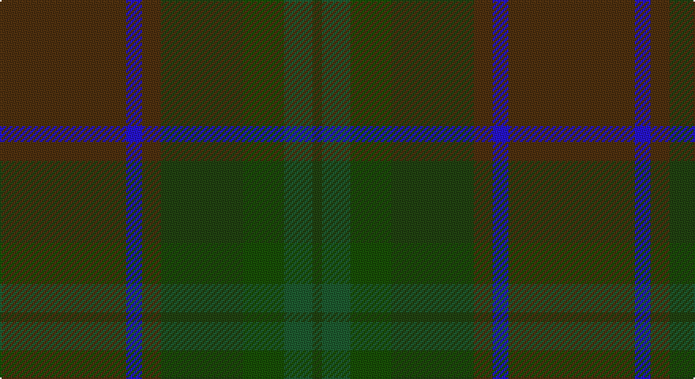

This page is one **sett** — a single exact thread-count. It belongs to the [tartan](/setts/dy40db5dy6dg26dgi13dgii9dg3/)
(the same proportion at any scale), whose colour order is pattern [GBGGGGG](/stripes/gbggggg/).

Sourced from register-of-tartans.  It is a [7 stripe tartan](/stripes/stripes7/).

Original link https://www.tartanregister.gov.uk/tartanDetails.aspx?ref=10576

## Register references

External register numbers recorded for this tartan.

- Scottish Register of Tartans: [10576](https://www.tartanregister.gov.uk/tartanDetails.aspx?ref=10576)

## Thread count
T/80 B10 T12 G52 Gb26 Ga18 G/6

One full sett is **322 threads**.

## Palette

Palette: <strong>custom</strong>
<table><thead><tr><th>Colour</th><th>Threads</th><th>Shade</th><th>Base</th><th>OKLCh</th></tr></thead><tbody><tr><td>T/</td><td style="text-align:right;font-variant-numeric:tabular-nums">80</td><td><code style="background-color:#4F310F;">#4F310F</code> <small style="color:#888">#4F310F</small></td><td>G <code style="background-color:#006100;">#006100</code></td><td><small style="color:#888">oklch(34.3% 0.064 65.6)</small></td></tr><tr><td>B</td><td style="text-align:right;font-variant-numeric:tabular-nums">10</td><td><code style="background-color:#2613CD;">#2613CD</code> <small style="color:#888">#2613CD</small></td><td>B <code style="background-color:#2A418A;">#2A418A</code></td><td><small style="color:#888">oklch(40.4% 0.252 270.2)</small></td></tr><tr><td>T</td><td style="text-align:right;font-variant-numeric:tabular-nums">12</td><td><code style="background-color:#4F310F;">#4F310F</code> <small style="color:#888">#4F310F</small></td><td>G <code style="background-color:#006100;">#006100</code></td><td><small style="color:#888">oklch(34.3% 0.064 65.6)</small></td></tr><tr><td>G</td><td style="text-align:right;font-variant-numeric:tabular-nums">52</td><td><code style="background-color:#214211;">#214211</code> <small style="color:#888">#214211</small></td><td>G <code style="background-color:#006100;">#006100</code></td><td><small style="color:#888">oklch(34.2% 0.085 137.1)</small></td></tr><tr><td>Gb</td><td style="text-align:right;font-variant-numeric:tabular-nums">26</td><td><code style="background-color:#184F06;">#184F06</code> <small style="color:#888">#184F06</small></td><td>G <code style="background-color:#006100;">#006100</code></td><td><small style="color:#888">oklch(37.7% 0.115 139.8)</small></td></tr><tr><td>Ga</td><td style="text-align:right;font-variant-numeric:tabular-nums">18</td><td><code style="background-color:#1E5B30;">#1E5B30</code> <small style="color:#888">#1E5B30</small></td><td>G <code style="background-color:#006100;">#006100</code></td><td><small style="color:#888">oklch(42.0% 0.094 150.0)</small></td></tr><tr><td>G/</td><td style="text-align:right;font-variant-numeric:tabular-nums">6</td><td><code style="background-color:#214211;">#214211</code> <small style="color:#888">#214211</small></td><td>G <code style="background-color:#006100;">#006100</code></td><td><small style="color:#888">oklch(34.2% 0.085 137.1)</small></td></tr></tbody></table>

# Sample pattern

## Nearest tartans

The nearest existing variants by ΔTartan distance, with this tartan at the top so the swatches line up against it.

ΔTartan

Tartan

Sett

—

<a href="/ttd/edit/#slug=dy40db5dy6dg26dgi13dgii9dg3~x2">de Meuron (Neuchâtel) Day, The</a> <a class="nn-out" href="/variants/s7/dy40db5dy6dg26dgi13dgii9dg3~x2/" title="open its dictionary page">↗</a>

1.65

<a href="/ttd/edit/#slug=y30n3y3n3y3n10g10yi20m2g5~x2&amp;base=dy40db5dy6dg26dgi13dgii9dg3~x2">Roddy's Highland Spirit (Fashion)</a> <a class="nn-out" href="/variants/s10/y30n3y3n3y3n10g10yi20m2g5~x2/" title="open its dictionary page">↗</a>

2.01

<a href="/ttd/edit/#slug=dg1r1dgi22dy21dg12r11dgi22r1dg1~x2&amp;base=dy40db5dy6dg26dgi13dgii9dg3~x2">MacNaughton Htg</a> <a class="nn-out" href="/variants/s9/dg1r1dgi22dy21dg12r11dgi22r1dg1~x2/" title="open its dictionary page">↗</a>

2.08

<a href="/ttd/edit/#slug=dy31do3dy3do3dy3do22y26r4~x2&amp;base=dy40db5dy6dg26dgi13dgii9dg3~x2">Devarr (Fashion)</a> <a class="nn-out" href="/variants/s8/dy31do3dy3do3dy3do22y26r4~x2/" title="open its dictionary page">↗</a>

2.11

<a href="/ttd/edit/#slug=dg18dgi4b1dgi5dg6dgi3k1dy6k1dgi25b1~x2&amp;base=dy40db5dy6dg26dgi13dgii9dg3~x2">Mack of Stoneywood Hunting (Personal)</a> <a class="nn-out" href="/variants/s11/dg18dgi4b1dgi5dg6dgi3k1dy6k1dgi25b1~x2/" title="open its dictionary page">↗</a>

2.13

<a href="/variants/s9/dgi4dgii52dt4g8dt6dg12dgi17dgii7lo4/">The McAlbourne</a>

2.19

<a href="/ttd/edit/#slug=dg11n4dg6dy11n1k1dy4~x4&amp;base=dy40db5dy6dg26dgi13dgii9dg3~x2">Calais (Fashion)</a> <a class="nn-out" href="/variants/s7/dg11n4dg6dy11n1k1dy4~x4/" title="open its dictionary page">↗</a>

2.21

<a href="/ttd/edit/#slug=db1k8db2dg16dr6dg16db2k8w1~x2&amp;base=dy40db5dy6dg26dgi13dgii9dg3~x2">Basel Tattoo (Official)</a> <a class="nn-out" href="/variants/s9/db1k8db2dg16dr6dg16db2k8w1~x2/" title="open its dictionary page">↗</a>

2.21

<a href="/ttd/edit/#slug=dg5k2dg28k10dy26db4dg4~x2&amp;base=dy40db5dy6dg26dgi13dgii9dg3~x2">John Telfar Dunbar Hunting</a> <a class="nn-out" href="/variants/s7/dg5k2dg28k10dy26db4dg4~x2/" title="open its dictionary page">↗</a>

2.22

<a href="/ttd/edit/#slug=r5do8dp13dt21dg34dgi55r3&amp;base=dy40db5dy6dg26dgi13dgii9dg3~x2">Uitwaaien Papi (Personal)</a> <a class="nn-out" href="/variants/s7/r5do8dp13dt21dg34dgi55r3/" title="open its dictionary page">↗</a>

2.29

<a href="/ttd/edit/#slug=n9o9y9r1yi1o9yi1r1~x4&amp;base=dy40db5dy6dg26dgi13dgii9dg3~x2">Jardine</a> <a class="nn-out" href="/variants/s8/n9o9y9r1yi1o9yi1r1~x4/" title="open its dictionary page">↗</a>

## Neighbour map

Every grey dot is one of 14360 variants placed by the first two principal components of the ΔTartan feature space (44% of its variance). Red is this tartan; blue dots are its nearest — click one to open its page.

<svg viewBox="0 0 640 380" role="img" style="max-width:100%;height:auto;border:1px solid #e0e0e0;border-radius:4px;display:block" xmlns="http://www.w3.org/2000/svg"><image href="/nn/cloud.v1.png" width="640" height="380"/><a href="/variants/s10/y30n3y3n3y3n10g10yi20m2g5~x2/"><circle cx="361.1" cy="239.2" r="4" fill="#3465a4"><title>Roddy's Highland Spirit (Fashion)</title></circle></a><a href="/variants/s9/dg1r1dgi22dy21dg12r11dgi22r1dg1~x2/"><circle cx="402.1" cy="242.5" r="4" fill="#3465a4"><title>MacNaughton Htg</title></circle></a><a href="/variants/s8/dy31do3dy3do3dy3do22y26r4~x2/"><circle cx="364.6" cy="266.2" r="4" fill="#3465a4"><title>Devarr (Fashion)</title></circle></a><a href="/variants/s11/dg18dgi4b1dgi5dg6dgi3k1dy6k1dgi25b1~x2/"><circle cx="462.0" cy="217.7" r="4" fill="#3465a4"><title>Mack of Stoneywood Hunting (Personal)</title></circle></a><a href="/variants/s9/dgi4dgii52dt4g8dt6dg12dgi17dgii7lo4/"><circle cx="375.9" cy="217.6" r="4" fill="#3465a4"><title>The McAlbourne</title></circle></a><a href="/variants/s7/dg11n4dg6dy11n1k1dy4~x4/"><circle cx="370.0" cy="292.8" r="4" fill="#3465a4"><title>Calais (Fashion)</title></circle></a><a href="/variants/s9/db1k8db2dg16dr6dg16db2k8w1~x2/"><circle cx="401.3" cy="251.3" r="4" fill="#3465a4"><title>Basel Tattoo (Official)</title></circle></a><a href="/variants/s7/dg5k2dg28k10dy26db4dg4~x2/"><circle cx="392.5" cy="269.3" r="4" fill="#3465a4"><title>John Telfar Dunbar Hunting</title></circle></a><a href="/variants/s7/r5do8dp13dt21dg34dgi55r3/"><circle cx="309.9" cy="231.1" r="4" fill="#3465a4"><title>Uitwaaien Papi (Personal)</title></circle></a><a href="/variants/s8/n9o9y9r1yi1o9yi1r1~x4/"><circle cx="357.2" cy="266.1" r="4" fill="#3465a4"><title>Jardine</title></circle></a><circle cx="387.5" cy="278.5" r="5" fill="#c00000"/></svg>

ID: /variants/s7/dy40db5dy6dg26dgi13dgii9dg3~x2/
