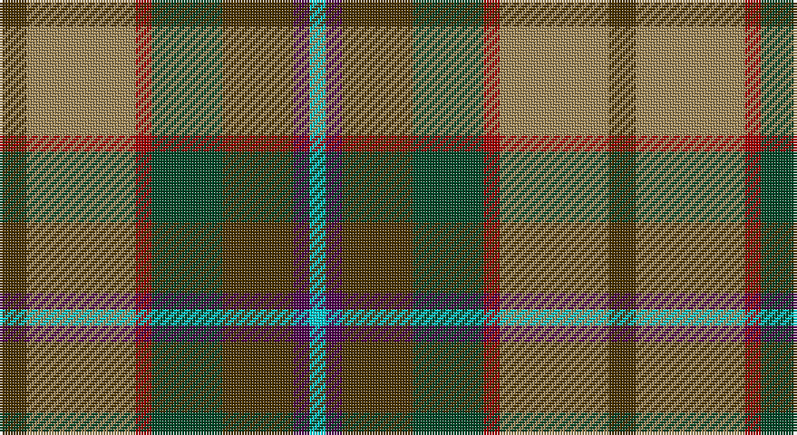

This page is one **sett** — a single exact thread-count. It belongs to the [tartan](/setts/dy5lo20r3dg13dy13dp3lt3/)
(the same proportion at any scale), whose colour order is pattern [GYRGGBW](/stripes/gyrggbw/).

Part of the [Christmas Hill Game Farm](/tartans/christmas-hill-game-farm/) tartan — the named design grouping this sett with its other cloths.

Sourced from register-of-tartans.  It is a [7 stripe tartan](/stripes/stripes7/).

Original link https://www.tartanregister.gov.uk/tartanDetails.aspx?ref=5777

## Register references

External register numbers recorded for this tartan.

- Scottish Register of Tartans: [5777](https://www.tartanregister.gov.uk/tartanDetails.aspx?ref=5777)
- Scottish Tartans Authority (ITI): 7821

## Thread count
T/10 LT40 DR6 DG26 T26 DP6 LB/6

One full sett is **224 threads**.

## Palette

Palette: <strong>Tartan Register</strong> <small style="color:#888">(2 of 6 colours)</small>
<table><thead><tr><th>Colour</th><th>Threads</th><th>Shade</th><th>Base</th><th>OKLCh</th></tr></thead><tbody><tr><td>T/</td><td style="text-align:right;font-variant-numeric:tabular-nums">10</td><td><code style="background-color:#4C3400;">#4C3400</code> <small style="color:#888">#4C3400</small></td><td>G <code style="background-color:#006100;">#006100</code></td><td><small style="color:#888">oklch(34.4% 0.071 80.2)</small></td></tr><tr><td>LT</td><td style="text-align:right;font-variant-numeric:tabular-nums">40</td><td><code style="background-color:#A08858;">#A08858</code> <small style="color:#888">#A08858</small></td><td>Y <code style="background-color:#F2BF00;">#F2BF00</code></td><td><small style="color:#888">oklch(63.7% 0.071 84.0)</small></td></tr><tr><td>DR</td><td style="text-align:right;font-variant-numeric:tabular-nums">6</td><td><code style="background-color:#A00000;">#A00000</code> <small style="color:#888">#A00000</small></td><td>R <code style="background-color:#CC0000;">#CC0000</code></td><td><small style="color:#888">oklch(44.3% 0.182 29.2)</small></td></tr><tr><td>DG</td><td style="text-align:right;font-variant-numeric:tabular-nums">26</td><td><code style="background-color:#004828;">#004828</code> <small style="color:#888">#004828</small></td><td>G <code style="background-color:#006100;">#006100</code></td><td><small style="color:#888">oklch(35.3% 0.085 156.4)</small></td></tr><tr><td>T</td><td style="text-align:right;font-variant-numeric:tabular-nums">26</td><td><code style="background-color:#4C3400;">#4C3400</code> <small style="color:#888">#4C3400</small></td><td>G <code style="background-color:#006100;">#006100</code></td><td><small style="color:#888">oklch(34.4% 0.071 80.2)</small></td></tr><tr><td>DP</td><td style="text-align:right;font-variant-numeric:tabular-nums">6</td><td><code style="background-color:#500050;">#500050</code> <small style="color:#888">#500050</small></td><td>B <code style="background-color:#2A418A;">#2A418A</code></td><td><small style="color:#888">oklch(30.3% 0.139 328.4)</small></td></tr><tr><td>LB/</td><td style="text-align:right;font-variant-numeric:tabular-nums">6</td><td><code style="background-color:#00CCD0;">#00CCD0</code> <small style="color:#888">#00CCD0</small></td><td>W <code style="background-color:#F7F7F7;">#F7F7F7</code></td><td><small style="color:#888">oklch(76.7% 0.130 197.3)</small></td></tr></tbody></table>

# Sample pattern

## Nearest tartans

The nearest existing variants by ΔTartan distance, with this tartan at the top so the swatches line up against it.

ΔTartan

Tartan

Sett

—

<a href="/ttd/edit/#slug=dy5lo20r3dg13dy13dp3lt3~x2">Christmas Hill Game Farm</a> <a class="nn-out" href="/variants/s7/dy5lo20r3dg13dy13dp3lt3~x2/" title="open its dictionary page">↗</a>

0.54

<a href="/ttd/edit/#slug=dy5lo20r3dg13dy13db3g3~x2&amp;base=dy5lo20r3dg13dy13dp3lt3~x2">Christmas Hill Game Farm (Corporate)</a> <a class="nn-out" href="/variants/s7/dy5lo20r3dg13dy13db3g3~x2/" title="open its dictionary page">↗</a>

0.76

<a href="/ttd/edit/#slug=k2m15dy15g15r2g3ly2~x2&amp;base=dy5lo20r3dg13dy13dp3lt3~x2">Crossbill</a> <a class="nn-out" href="/variants/s7/k2m15dy15g15r2g3ly2~x2/" title="open its dictionary page">↗</a>

0.83

<a href="/ttd/edit/#slug=g21t21ly3r21n3dp5n3~x2&amp;base=dy5lo20r3dg13dy13dp3lt3~x2">Falardeau-Murphy (Canada) (Personal)</a> <a class="nn-out" href="/variants/s7/g21t21ly3r21n3dp5n3~x2/" title="open its dictionary page">↗</a>

0.85

<a href="/ttd/edit/#slug=k1lr1g5dp1g2dy5lr1y3lr1~x4&amp;base=dy5lo20r3dg13dy13dp3lt3~x2">Corcoran of Sherbrooke (Personal)</a> <a class="nn-out" href="/variants/s9/k1lr1g5dp1g2dy5lr1y3lr1~x4/" title="open its dictionary page">↗</a>

0.94

<a href="/ttd/edit/#slug=r1dy7db3g1o3g1db3g7w1~x4&amp;base=dy5lo20r3dg13dy13dp3lt3~x2">Adamson (Personal)</a> <a class="nn-out" href="/variants/s9/r1dy7db3g1o3g1db3g7w1~x4/" title="open its dictionary page">↗</a>

1.05

<a href="/ttd/edit/#slug=t4dy27lo8k4lo8k4lo8r11ly3~x2&amp;base=dy5lo20r3dg13dy13dp3lt3~x2">Brittany National Walking</a> <a class="nn-out" href="/variants/s9/t4dy27lo8k4lo8k4lo8r11ly3~x2/" title="open its dictionary page">↗</a>

1.09

<a href="/ttd/edit/#slug=g4n12lo2k10y10lo3y2~x2&amp;base=dy5lo20r3dg13dy13dp3lt3~x2">Rothesay</a> <a class="nn-out" href="/variants/s7/g4n12lo2k10y10lo3y2~x2/" title="open its dictionary page">↗</a>

1.11

<a href="/ttd/edit/#slug=dy3o2dg19o6dg2o6lo14r4w2~x2&amp;base=dy5lo20r3dg13dy13dp3lt3~x2">Royal Pharmaceutical Society</a> <a class="nn-out" href="/variants/s9/dy3o2dg19o6dg2o6lo14r4w2~x2/" title="open its dictionary page">↗</a>

1.19

<a href="/ttd/edit/#slug=dg4o2dg8do8y2o8y16k2do5o2y5lo2~x2&amp;base=dy5lo20r3dg13dy13dp3lt3~x2">Blaylock Hunting (Name)</a> <a class="nn-out" href="/variants/s12/dg4o2dg8do8y2o8y16k2do5o2y5lo2~x2/" title="open its dictionary page">↗</a>

1.19

<a href="/ttd/edit/#slug=dy2o2dg19o6dg2o6lo14r4w2~x2&amp;base=dy5lo20r3dg13dy13dp3lt3~x2">Royal Pharmaceutical Society (Corp)</a> <a class="nn-out" href="/variants/s9/dy2o2dg19o6dg2o6lo14r4w2~x2/" title="open its dictionary page">↗</a>

## Neighbour map

Every grey dot is one of 14360 variants placed by the first two principal components of the ΔTartan feature space (44% of its variance). Red is this tartan; blue dots are its nearest — click one to open its page.

<svg viewBox="0 0 640 380" role="img" style="max-width:100%;height:auto;border:1px solid #e0e0e0;border-radius:4px;display:block" xmlns="http://www.w3.org/2000/svg"><image href="/nn/cloud.v1.png" width="640" height="380"/><a href="/variants/s7/dy5lo20r3dg13dy13db3g3~x2/"><circle cx="149.0" cy="216.3" r="4" fill="#3465a4"><title>Christmas Hill Game Farm (Corporate)</title></circle></a><a href="/variants/s7/k2m15dy15g15r2g3ly2~x2/"><circle cx="163.4" cy="201.3" r="4" fill="#3465a4"><title>Crossbill</title></circle></a><a href="/variants/s7/g21t21ly3r21n3dp5n3~x2/"><circle cx="112.0" cy="194.5" r="4" fill="#3465a4"><title>Falardeau-Murphy (Canada) (Personal)</title></circle></a><a href="/variants/s9/k1lr1g5dp1g2dy5lr1y3lr1~x4/"><circle cx="109.0" cy="205.8" r="4" fill="#3465a4"><title>Corcoran of Sherbrooke (Personal)</title></circle></a><a href="/variants/s9/r1dy7db3g1o3g1db3g7w1~x4/"><circle cx="130.0" cy="197.2" r="4" fill="#3465a4"><title>Adamson (Personal)</title></circle></a><a href="/variants/s9/t4dy27lo8k4lo8k4lo8r11ly3~x2/"><circle cx="152.1" cy="170.5" r="4" fill="#3465a4"><title>Brittany National Walking</title></circle></a><a href="/variants/s7/g4n12lo2k10y10lo3y2~x2/"><circle cx="104.7" cy="229.8" r="4" fill="#3465a4"><title>Rothesay</title></circle></a><a href="/variants/s9/dy3o2dg19o6dg2o6lo14r4w2~x2/"><circle cx="151.5" cy="165.3" r="4" fill="#3465a4"><title>Royal Pharmaceutical Society</title></circle></a><a href="/variants/s12/dg4o2dg8do8y2o8y16k2do5o2y5lo2~x2/"><circle cx="141.7" cy="179.0" r="4" fill="#3465a4"><title>Blaylock Hunting (Name)</title></circle></a><a href="/variants/s9/dy2o2dg19o6dg2o6lo14r4w2~x2/"><circle cx="157.2" cy="162.8" r="4" fill="#3465a4"><title>Royal Pharmaceutical Society (Corp)</title></circle></a><circle cx="134.5" cy="207.1" r="5" fill="#c00000"/></svg>

ID: /variants/s7/dy5lo20r3dg13dy13dp3lt3~x2/
