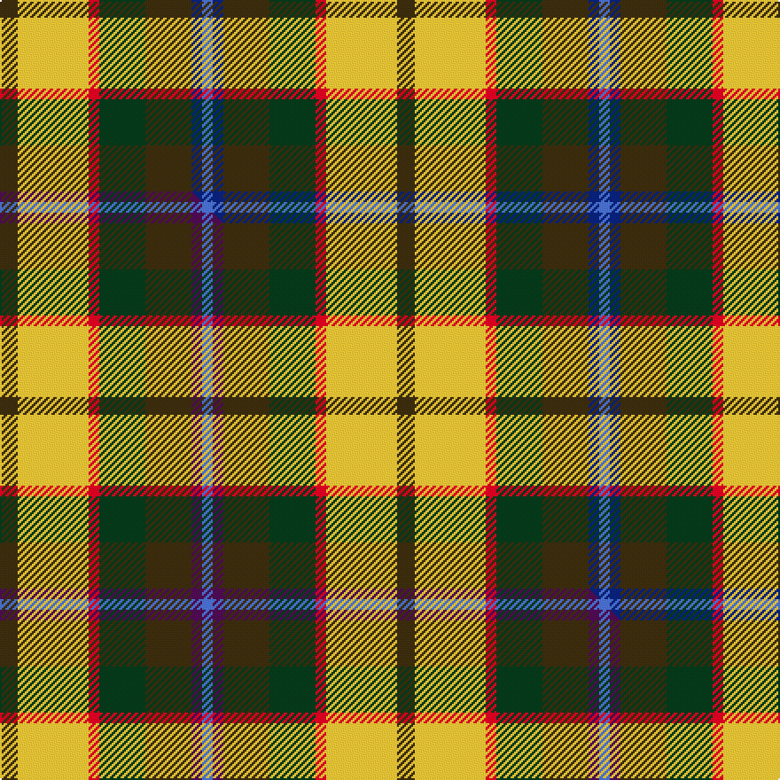

This page is one **sett** — a single exact thread-count. It belongs to the [tartan](/setts/dy5ly20r3dg13dy13db3b3/)
(the same proportion at any scale), whose colour order is pattern [BBGGRYG](/stripes/bbggryg/).

Part of the [Christmas Hill Game Farm](/tartans/christmas-hill-game-farm/) tartan — the named design grouping this sett with its other cloths.

Sourced from tartans-authority.  It is a [7 stripe tartan](/stripes/stripes7/).

Original link [https://www.tartanregister.gov.uk/tartanDetails.aspx?ref=7821](https://www.tartanregister.gov.uk/tartanDetails.aspx?ref=7821)

Dataset <small>— provenance for this record, inherited from the source manifest</small>

<dl class="dataset-prov">
<dt>source</dt><dd><a href="/sources/tartans-authority/">Scottish Tartans Authority</a></dd>
<dt>data captured from</dt><dd><a href="https://github.com/thetartan/tartan-database/blob/master/data/tartans-authority/data.csv">https://github.com/thetartan/tartan-database/blob/master/data/tartans-authority/data.csv</a></dd>
<dt>data date</dt><dd>pre 2008 <small>(this record)</small></dd>
<dt>licence</dt><dd><a href="https://creativecommons.org/licenses/by-nc-nd/4.0/">CC BY-NC-ND 4.0</a></dd>
</dl>

Capture chain <small>— the hands this data passed through, oldest first; each capture carries its own licence</small>

<ol class="capture-chain">
<li><a href="https://www.tartansauthority.com/">Scottish Tartans Authority</a> <small>the heritage body's archive — its tartan-ferret record browser is retired (links repaired to the SRT, above)</small></li>
<li><a href="https://github.com/thetartan/tartan-database">thetartan/tartan-database</a> <small>2016-2017</small> · <a href="https://creativecommons.org/licenses/by-nc-nd/4.0/">CC BY-NC-ND 4.0</a> <small>Levko Kravets's frozen compilation — the capture we vendored, and where its CC licence text came from</small></li>
<li>this dictionary <small>captured 2026-06-10 · commit 5bf86c7566</small> <small>each re-capture is a git commit to data/sources</small></li>
</ol>

## Register references

External register numbers recorded for this tartan.

- Scottish Tartans Authority (ITI): 7821

## Thread count
DY/10 LY40 R6 DG26 DY26 DB6 B/6

One full sett is **224 threads**.

## Palette
<table><thead><tr><th>Colour</th><th>Shade</th><th>OKLCh</th></tr></thead><tbody><tr><td>DB</td><td><code style="background-color:#082077;">#082077</code> <small style="color:#888">#082077</small></td><td><small style="color:#888">oklch(30.0% 0.149 265.1)</small></td></tr><tr><td>DG</td><td><code style="background-color:#053819;">#053819</code> <small style="color:#888">#053819</small></td><td><small style="color:#888">oklch(30.0% 0.075 151.3)</small></td></tr><tr><td>R</td><td><code style="background-color:#D60020;">#D60020</code> <small style="color:#888">#D60020</small></td><td><small style="color:#888">oklch(55.2% 0.224 25.5)</small></td></tr><tr><td>B</td><td><code style="background-color:#466CC8;">#466CC8</code> <small style="color:#888">#466CC8</small></td><td><small style="color:#888">oklch(55.1% 0.149 265.0)</small></td></tr><tr><td>LY</td><td><code style="background-color:#DCBC32;">#DCBC32</code> <small style="color:#888">#DCBC32</small></td><td><small style="color:#888">oklch(80.0% 0.150 95.2)</small></td></tr><tr><td>DY</td><td><code style="background-color:#3A2B0D;">#3A2B0D</code> <small style="color:#888">#3A2B0D</small></td><td><small style="color:#888">oklch(30.0% 0.049 82.0)</small></td></tr></tbody></table>

# Sample pattern

## Compared to the master

This cloth is one sett of its design; the master sett (the exemplar the design is anchored on) is below for comparison.

Its **ΔTartan distance** from the master is **0.60** — the same measure the nearest-tartans table ranks by (0 is identical; a re-scale of the same cloth is near 0, a recolour or a different proportion further).

<figure class="master-compare" style="margin:0">

this sett
master sett ★

<figcaption style="color:#888;font-size:smaller">One weave of this sett against the <a href="/setts/dy5ly20r3dg13dy13dp3b3/">master sett ★</a>, split on the diagonal: a shared proportion runs seamlessly across it with only the shades shifting; a different proportion breaks on it.</figcaption>
</figure>

## Nearest tartan variants

The nearest existing variants by ΔTartan distance, with this cloth at the top so the swatches line up against it.

ΔTartan

Threads

Variant

Sett

—

224

<a href="/variants/s7/dy5ly20r3dg13dy13db3b3~x2/">Christmas Hill Game Farm (Corporate)</a>

<a href="/ttd/edit/#slug=dy5ly20r3dg13dy13dp3b3~x2&amp;base=dy5ly20r3dg13dy13db3b3~x2" title="compare in the TTD">0.60</a>

224

<a href="/variants/s7/dy5ly20r3dg13dy13dp3b3~x2/">Christmas Hill Game Farm</a>

<a href="/ttd/edit/#slug=r1g4w1g4y1dr8lb1~x6&amp;base=dy5ly20r3dg13dy13db3b3~x2" title="compare in the TTD">2.42</a>

228

<a href="/variants/s7/r1g4w1g4y1dr8lb1~x6/">George Watson's College</a>

<a href="/ttd/edit/#slug=r22lb6db10y4r4w4g22db8y3&amp;base=dy5ly20r3dg13dy13db3b3~x2" title="compare in the TTD">2.55</a>

141

<a href="/variants/s9/r22lb6db10y4r4w4g22db8y3/">Unidentified No 14</a>

<a href="/ttd/edit/#slug=dg8b6dg48w31o42g6o8&amp;base=dy5ly20r3dg13dy13db3b3~x2" title="compare in the TTD">2.56</a>

282

<a href="/variants/s7/dg8b6dg48w31o42g6o8/">Bannockbane, Green</a>

<a href="/ttd/edit/#slug=g25r9lb3y7w3dp11&amp;base=dy5ly20r3dg13dy13db3b3~x2" title="compare in the TTD">2.61</a>

80

<a href="/variants/s6/g25r9lb3y7w3dp11/">Montessori School of Denver</a>

<a href="/ttd/edit/#slug=g25r9lb3y7w3dp11~x3&amp;base=dy5ly20r3dg13dy13db3b3~x2" title="compare in the TTD">2.61</a>

240

<a href="/variants/s6/g25r9lb3y7w3dp11~x3/">Montessori School of Denver (School)</a>

<a href="/ttd/edit/#slug=k1lr1g5dp1g2dy5lr1y3lr1~x4&amp;base=dy5ly20r3dg13dy13db3b3~x2" title="compare in the TTD">2.64</a>

152

<a href="/variants/s9/k1lr1g5dp1g2dy5lr1y3lr1~x4/">Corcoran of Sherbrooke (Personal)</a>

<a href="/ttd/edit/#slug=o17n5db2w12db2y4g7~x2&amp;base=dy5ly20r3dg13dy13db3b3~x2" title="compare in the TTD">2.65</a>

148

<a href="/variants/s7/o17n5db2w12db2y4g7~x2/">Ontario, Northern</a>

<a href="/ttd/edit/#slug=dy19g23ly3db15r11w5~x2&amp;base=dy5ly20r3dg13dy13db3b3~x2" title="compare in the TTD">2.65</a>

256

<a href="/variants/s6/dy19g23ly3db15r11w5~x2/">Mekos, The</a>

<a href="/ttd/edit/#slug=w6ri8g24ri8db6r8db8w3~x2~ri2008029-r2008022&amp;base=dy5ly20r3dg13dy13db3b3~x2" title="compare in the TTD">2.67</a>

266

<a href="/variants/s8/w6ri8g24ri8db6r8db8w3~x2~ri2008029-r2008022/">Utah Centennial</a>

## Neighbour map

Every grey dot is one of 13621 variants placed by the first two principal components of the ΔTartan feature space (42% of its variance). Red is this tartan; blue dots are its nearest — click one to open its page.

<svg viewBox="0 0 640 380" role="img" style="max-width:100%;height:auto;border:1px solid #e0e0e0;border-radius:4px;display:block" xmlns="http://www.w3.org/2000/svg"><image href="/nn/cloud.v1.png" width="640" height="380"/><a href="/variants/s7/dy5ly20r3dg13dy13dp3b3~x2/"><circle cx="112.0" cy="205.3" r="4" fill="#3465a4"><title>Christmas Hill Game Farm</title></circle></a><a href="/variants/s7/r1g4w1g4y1dr8lb1~x6/"><circle cx="188.4" cy="191.5" r="4" fill="#3465a4"><title>George Watson's College</title></circle></a><a href="/variants/s9/r22lb6db10y4r4w4g22db8y3/"><circle cx="107.2" cy="189.3" r="4" fill="#3465a4"><title>Unidentified No 14</title></circle></a><a href="/variants/s7/dg8b6dg48w31o42g6o8/"><circle cx="158.7" cy="202.4" r="4" fill="#3465a4"><title>Bannockbane, Green</title></circle></a><a href="/variants/s6/g25r9lb3y7w3dp11/"><circle cx="177.0" cy="204.9" r="4" fill="#3465a4"><title>Montessori School of Denver</title></circle></a><a href="/variants/s6/g25r9lb3y7w3dp11~x3/"><circle cx="177.0" cy="204.9" r="4" fill="#3465a4"><title>Montessori School of Denver (School)</title></circle></a><a href="/variants/s9/k1lr1g5dp1g2dy5lr1y3lr1~x4/"><circle cx="96.0" cy="205.0" r="4" fill="#3465a4"><title>Corcoran of Sherbrooke (Personal)</title></circle></a><a href="/variants/s7/o17n5db2w12db2y4g7~x2/"><circle cx="125.5" cy="200.7" r="4" fill="#3465a4"><title>Ontario, Northern</title></circle></a><a href="/variants/s6/dy19g23ly3db15r11w5~x2/"><circle cx="91.8" cy="230.2" r="4" fill="#3465a4"><title>Mekos, The</title></circle></a><a href="/variants/s8/w6ri8g24ri8db6r8db8w3~x2~ri2008029-r2008022/"><circle cx="118.2" cy="211.2" r="4" fill="#3465a4"><title>Utah Centennial</title></circle></a><circle cx="110.6" cy="205.5" r="5" fill="#c00000"/><text x="320" y="376" text-anchor="middle" font-size="11" fill="#999">ground</text><text x="11" y="190" text-anchor="middle" font-size="11" fill="#999" transform="rotate(-90 11 190)">complexity</text></svg>

ID: /variants/s7/dy5ly20r3dg13dy13db3b3~x2/
