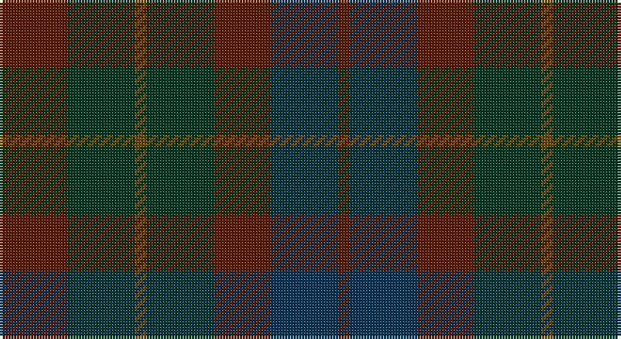

This page is one **sett** — a single exact thread-count. It belongs to the [tartan](/setts/dy6dg6y1dg6dy5dt6dy1/)
(the same proportion at any scale), whose colour order is pattern [GBGGGGG](/stripes/gbggggg/).

Part of the [Gleneagles](/tartans/gleneagles/) tartan — the named design grouping this sett with its other cloths.

Sourced from tartans-authority.  It is a [7 stripe tartan](/stripes/stripes7/).

Original link http://www.tartansauthority.com/tartan-ferret/display/2107/

## Register references

External register numbers recorded for this tartan.

- Scottish Tartans Authority (ITI): 2107

## Thread count
T/24 DG24 Ta4 DG24 T20 DB24 T/4

One full sett is **220 threads**.

## Palette

Palette: <strong>Tartan Register</strong> <small style="color:#888">(1 of 4 colours)</small>
<table><thead><tr><th>Colour</th><th>Threads</th><th>Shade</th><th>Base</th><th>OKLCh</th></tr></thead><tbody><tr><td>T/</td><td style="text-align:right;font-variant-numeric:tabular-nums">24</td><td><code style="background-color:#581C00;">#581C00</code> <small style="color:#888">#581C00</small></td><td>G <code style="background-color:#006100;">#006100</code></td><td><small style="color:#888">oklch(31.7% 0.096 41.9)</small></td></tr><tr><td>DG</td><td style="text-align:right;font-variant-numeric:tabular-nums">24</td><td><code style="background-color:#003820;">#003820</code> <small style="color:#888">#003820</small></td><td>G <code style="background-color:#006100;">#006100</code></td><td><small style="color:#888">oklch(30.0% 0.070 158.3)</small></td></tr><tr><td>Ta</td><td style="text-align:right;font-variant-numeric:tabular-nums">4</td><td><code style="background-color:#684800;">#684800</code> <small style="color:#888">#684800</small></td><td>G <code style="background-color:#006100;">#006100</code></td><td><small style="color:#888">oklch(42.6% 0.088 79.5)</small></td></tr><tr><td>DG</td><td style="text-align:right;font-variant-numeric:tabular-nums">24</td><td><code style="background-color:#003820;">#003820</code> <small style="color:#888">#003820</small></td><td>G <code style="background-color:#006100;">#006100</code></td><td><small style="color:#888">oklch(30.0% 0.070 158.3)</small></td></tr><tr><td>T</td><td style="text-align:right;font-variant-numeric:tabular-nums">20</td><td><code style="background-color:#581C00;">#581C00</code> <small style="color:#888">#581C00</small></td><td>G <code style="background-color:#006100;">#006100</code></td><td><small style="color:#888">oklch(31.7% 0.096 41.9)</small></td></tr><tr><td>DB</td><td style="text-align:right;font-variant-numeric:tabular-nums">24</td><td><code style="background-color:#083454;">#083454</code> <small style="color:#888">#083454</small></td><td>B <code style="background-color:#2A418A;">#2A418A</code></td><td><small style="color:#888">oklch(31.5% 0.073 245.8)</small></td></tr><tr><td>T/</td><td style="text-align:right;font-variant-numeric:tabular-nums">4</td><td><code style="background-color:#581C00;">#581C00</code> <small style="color:#888">#581C00</small></td><td>G <code style="background-color:#006100;">#006100</code></td><td><small style="color:#888">oklch(31.7% 0.096 41.9)</small></td></tr></tbody></table>

# Sample pattern

## Compared to the master

This cloth is one sett of its design; the master sett (the exemplar the design is anchored on) is below for comparison.

<figure style="margin:0"><figcaption style="color:#888;font-size:smaller">this sett</figcaption></figure>
<figure style="margin:0"><figcaption style="color:#888;font-size:smaller"><a href="/setts/k4o4w35o1k36o4k2/">master sett →</a></figcaption></figure>

## Nearest tartans

The nearest existing variants by ΔTartan distance, with this tartan at the top so the swatches line up against it.

ΔTartan

Tartan

Sett

—

<a href="/ttd/edit/#slug=dy6dg6y1dg6dy5dt6dy1~x4">Gleneagles (Corporate)</a> <a class="nn-out" href="/variants/s7/dy6dg6y1dg6dy5dt6dy1~x4/" title="open its dictionary page">↗</a>

1.14

<a href="/ttd/edit/#slug=do7k2do12k10dg12k3~x2&amp;base=dy6dg6y1dg6dy5dt6dy1~x4">Brown Watch (single) (Fashion)</a> <a class="nn-out" href="/variants/s6/do7k2do12k10dg12k3~x2/" title="open its dictionary page">↗</a>

1.62

<a href="/ttd/edit/#slug=dr9do4dr4do4dr24dy19do19dy4~x2&amp;base=dy6dg6y1dg6dy5dt6dy1~x4">Chindecella Ruadh (Kemete Heil)</a> <a class="nn-out" href="/variants/s8/dr9do4dr4do4dr24dy19do19dy4~x2/" title="open its dictionary page">↗</a>

1.63

<a href="/ttd/edit/#slug=do1dy6do6dy1n6dy1~x8&amp;base=dy6dg6y1dg6dy5dt6dy1~x4">Brown Heather (Fashion)</a> <a class="nn-out" href="/variants/s6/do1dy6do6dy1n6dy1~x8/" title="open its dictionary page">↗</a>

1.65

<a href="/ttd/edit/#slug=db4k4db16k14dg14m3dg3~x2&amp;base=dy6dg6y1dg6dy5dt6dy1~x4">Inneryne (Personal)</a> <a class="nn-out" href="/variants/s7/db4k4db16k14dg14m3dg3~x2/" title="open its dictionary page">↗</a>

2.04

<a href="/ttd/edit/#slug=dg7db1dg1k4dp4k1~x4&amp;base=dy6dg6y1dg6dy5dt6dy1~x4">MacArthur of Milton Hunting</a> <a class="nn-out" href="/variants/s6/dg7db1dg1k4dp4k1~x4/" title="open its dictionary page">↗</a>

2.04

<a href="/ttd/edit/#slug=dg11n4dg6dy11n1k1dy4~x4&amp;base=dy6dg6y1dg6dy5dt6dy1~x4">Calais (Fashion)</a> <a class="nn-out" href="/variants/s7/dg11n4dg6dy11n1k1dy4~x4/" title="open its dictionary page">↗</a>

2.06

<a href="/ttd/edit/#slug=doi10k4do16k4do10k16do8k24do28r3doi4r3&amp;base=dy6dg6y1dg6dy5dt6dy1~x4">St. Mirren (Corporate)</a> <a class="nn-out" href="/variants/s12/doi10k4do16k4do10k16do8k24do28r3doi4r3/" title="open its dictionary page">↗</a>

2.14

<a href="/variants/s5/n7oi1ni6oi8o1~x8/">Callum (Buchan)</a>

2.19

<a href="/ttd/edit/#slug=do15dy2do5dy5k18db5do5db2do15~x2&amp;base=dy6dg6y1dg6dy5dt6dy1~x4">Laois, County</a> <a class="nn-out" href="/variants/s9/do15dy2do5dy5k18db5do5db2do15~x2/" title="open its dictionary page">↗</a>

2.22

<a href="/ttd/edit/#slug=r2do15dg12do2dt12do2dg12do15o2~x4&amp;base=dy6dg6y1dg6dy5dt6dy1~x4">Amazing Union (Personal)</a> <a class="nn-out" href="/variants/s9/r2do15dg12do2dt12do2dg12do15o2~x4/" title="open its dictionary page">↗</a>

## Neighbour map

Every grey dot is one of 14360 variants placed by the first two principal components of the ΔTartan feature space (44% of its variance). Red is this tartan; blue dots are its nearest — click one to open its page.

<svg viewBox="0 0 640 380" role="img" style="max-width:100%;height:auto;border:1px solid #e0e0e0;border-radius:4px;display:block" xmlns="http://www.w3.org/2000/svg"><image href="/nn/cloud.v1.png" width="640" height="380"/><a href="/variants/s6/do7k2do12k10dg12k3~x2/"><circle cx="377.9" cy="366.0" r="4" fill="#3465a4"><title>Brown Watch (single) (Fashion)</title></circle></a><a href="/variants/s8/dr9do4dr4do4dr24dy19do19dy4~x2/"><circle cx="389.2" cy="335.3" r="4" fill="#3465a4"><title>Chindecella Ruadh (Kemete Heil)</title></circle></a><a href="/variants/s6/do1dy6do6dy1n6dy1~x8/"><circle cx="365.8" cy="341.2" r="4" fill="#3465a4"><title>Brown Heather (Fashion)</title></circle></a><a href="/variants/s7/db4k4db16k14dg14m3dg3~x2/"><circle cx="293.2" cy="331.8" r="4" fill="#3465a4"><title>Inneryne (Personal)</title></circle></a><a href="/variants/s6/dg7db1dg1k4dp4k1~x4/"><circle cx="345.8" cy="314.7" r="4" fill="#3465a4"><title>MacArthur of Milton Hunting</title></circle></a><a href="/variants/s7/dg11n4dg6dy11n1k1dy4~x4/"><circle cx="370.0" cy="292.8" r="4" fill="#3465a4"><title>Calais (Fashion)</title></circle></a><a href="/variants/s12/doi10k4do16k4do10k16do8k24do28r3doi4r3/"><circle cx="390.8" cy="284.4" r="4" fill="#3465a4"><title>St. Mirren (Corporate)</title></circle></a><a href="/variants/s5/n7oi1ni6oi8o1~x8/"><circle cx="375.7" cy="338.5" r="4" fill="#3465a4"><title>Callum (Buchan)</title></circle></a><a href="/variants/s9/do15dy2do5dy5k18db5do5db2do15~x2/"><circle cx="432.0" cy="298.7" r="4" fill="#3465a4"><title>Laois, County</title></circle></a><a href="/variants/s9/r2do15dg12do2dt12do2dg12do15o2~x4/"><circle cx="322.1" cy="277.3" r="4" fill="#3465a4"><title>Amazing Union (Personal)</title></circle></a><circle cx="329.9" cy="356.0" r="5" fill="#c00000"/></svg>

ID: /variants/s7/dy6dg6y1dg6dy5dt6dy1~x4/
