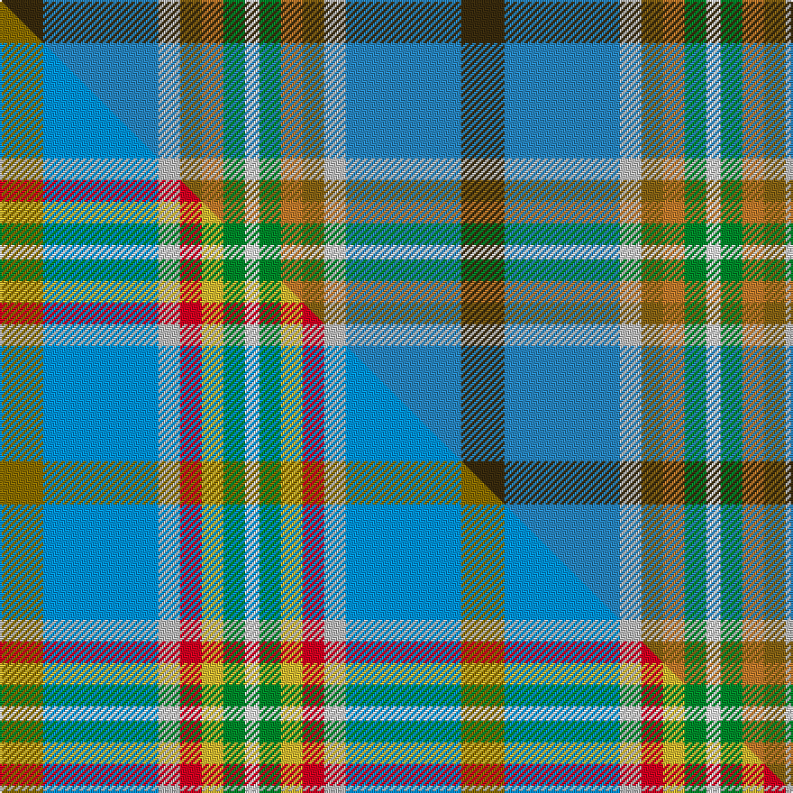

This page is one **sett** — a single exact thread-count. It belongs to the [tartan](/setts/dy6t16lb3y3o3g3w2/)
(the same proportion at any scale), whose colour order is pattern [GBWGRGW](/stripes/gbwgrgw/).

Part of the [Atikokan](/tartans/atikokan/) tartan — the named design grouping this sett with its other cloths.

Sourced from tartans-authority.  It is a [7 stripe tartan](/stripes/stripes7/).

Original link http://www.tartansauthority.com/tartan-ferret/display/2596/

## Register references

External register numbers recorded for this tartan.

- Scottish Tartans Authority (ITI): 2596

## Thread count
DY/24 T64 LB12 Y12 O12 G12 W/8

One full sett is **256 threads**.

## Palette
<table><thead><tr><th>Colour</th><th>Shade</th><th>OKLCh</th></tr></thead><tbody><tr><td>T</td><td><code style="background-color:#2888C4;">#2888C4</code> <small style="color:#888">#2888C4</small></td><td><small style="color:#888">oklch(60.1% 0.125 241.5)</small></td></tr><tr><td>O</td><td><code style="background-color:#C47C2C;">#C47C2C</code> <small style="color:#888">#C47C2C</small></td><td><small style="color:#888">oklch(64.9% 0.128 64.2)</small></td></tr><tr><td>DY</td><td><code style="background-color:#3A2B0D;">#3A2B0D</code> <small style="color:#888">#3A2B0D</small></td><td><small style="color:#888">oklch(30.0% 0.049 82.0)</small></td></tr><tr><td>G</td><td><code style="background-color:#008B2A;">#008B2A</code> <small style="color:#888">#008B2A</small></td><td><small style="color:#888">oklch(55.4% 0.170 145.9)</small></td></tr><tr><td>LB</td><td><code style="background-color:#C0C0C0;">#C0C0C0</code> <small style="color:#888">#C0C0C0</small></td><td><small style="color:#888">oklch(80.8% 0.000 89.9)</small></td></tr><tr><td>Y</td><td><code style="background-color:#886414;">#886414</code> <small style="color:#888">#886414</small></td><td><small style="color:#888">oklch(52.7% 0.101 81.8)</small></td></tr><tr><td>W</td><td><code style="background-color:#F7F7F7;">#F7F7F7</code> <small style="color:#888">#F7F7F7</small></td><td><small style="color:#888">oklch(97.6% 0.000 89.9)</small></td></tr></tbody></table>

# Sample pattern

## Compared to the master

This cloth is one sett of its design; the master sett (the exemplar the design is anchored on) is below for comparison.

Its **ΔTartan distance** from the master is **0.70** — the same measure the nearest-tartans table ranks by (0 is identical; a re-scale of the same cloth is near 0, a recolour or a different proportion further).

<figure class="master-compare" style="margin:0">

this sett
master sett ★

<figcaption style="color:#888;font-size:smaller">One weave of this sett against the <a href="/setts/y6t16lb3r3ly3g3w2/">master sett ★</a>, split on the diagonal: a shared proportion runs seamlessly across it with only the shades shifting; a different proportion breaks on it.</figcaption>
</figure>

## Nearest tartan variants

The nearest existing variants by ΔTartan distance, with this cloth at the top so the swatches line up against it.

ΔTartan

Threads

Variant

Sett

—

256

<a href="/variants/s7/dy6t16lb3y3o3g3w2~x4~t2405244-lb3200000-y2104086-o2605070/">Atikokan (District)</a>

0.60

—

<a href="/variants/s7/y6t16lb3r3ly3g3w2~x4~t2607245-lb3200000/">Atikokan</a>

2.00

—

<a href="/variants/s7/y6bi16lb3r3o3b3w2~x4~bi2505279-lb3200000-r2008029-o2104058/">Atikokan</a>

<a href="/ttd/edit/#slug=ly5db30w3g15y8r4~x2&amp;base=dy6t16lb3y3o3g3w2~x4~t2405244-lb3200000-y2104086-o2605070" title="compare in the TTD">2.00</a>

242

<a href="/variants/s6/ly5db30w3g15y8r4~x2/">Carleton College Rugby</a>

<a href="/ttd/edit/#slug=lp5g9r2dy2db6lb14w3~x4&amp;base=dy6t16lb3y3o3g3w2~x4~t2405244-lb3200000-y2104086-o2605070" title="compare in the TTD">2.51</a>

296

<a href="/variants/s7/lp5g9r2dy2db6lb14w3~x4/">Manx National (District)</a>

<a href="/ttd/edit/#slug=p5g9r2dy2db6lb14w3~x4&amp;base=dy6t16lb3y3o3g3w2~x4~t2405244-lb3200000-y2104086-o2605070" title="compare in the TTD">2.51</a>

296

<a href="/variants/s7/p5g9r2dy2db6lb14w3~x4/">Manx National</a>

<a href="/ttd/edit/#slug=dp2g6r1y1db3b10w1~x2&amp;base=dy6t16lb3y3o3g3w2~x4~t2405244-lb3200000-y2104086-o2605070" title="compare in the TTD">2.52</a>

90

<a href="/variants/s7/dp2g6r1y1db3b10w1~x2/">Manx National</a>

<a href="/ttd/edit/#slug=dp2g6r1dy1db3lb10w1~x2&amp;base=dy6t16lb3y3o3g3w2~x4~t2405244-lb3200000-y2104086-o2605070" title="compare in the TTD">2.52</a>

90

<a href="/variants/s7/dp2g6r1dy1db3lb10w1~x2/">Manx National District Tartan</a>

<a href="/ttd/edit/#slug=y1db4o1g5dr2g1w1~x2~o1905046-dr1205000&amp;base=dy6t16lb3y3o3g3w2~x4~t2405244-lb3200000-y2104086-o2605070" title="compare in the TTD">2.61</a>

56

<a href="/variants/s7/y1db4o1g5dr2g1w1~x2~o1905046-dr1205000/">Deeside District</a>

<a href="/ttd/edit/#slug=dp8g31r4dy4db17lb64w4&amp;base=dy6t16lb3y3o3g3w2~x4~t2405244-lb3200000-y2104086-o2605070" title="compare in the TTD">2.66</a>

252

<a href="/variants/s7/dp8g31r4dy4db17lb64w4/">Manx National #2</a>

<a href="/ttd/edit/#slug=dp8g31r4y4db17b64w4&amp;base=dy6t16lb3y3o3g3w2~x4~t2405244-lb3200000-y2104086-o2605070" title="compare in the TTD">2.66</a>

252

<a href="/variants/s7/dp8g31r4y4db17b64w4/">Manx National</a>

## Neighbour map

Every grey dot is one of 13620 variants placed by the first two principal components of the ΔTartan feature space (42% of its variance). Red is this tartan; blue dots are its nearest — click one to open its page.

<svg viewBox="0 0 640 380" role="img" style="max-width:100%;height:auto;border:1px solid #e0e0e0;border-radius:4px;display:block" xmlns="http://www.w3.org/2000/svg"><image href="/nn/cloud.v1.png" width="640" height="380"/><a href="/variants/s7/y6t16lb3r3ly3g3w2~x4~t2607245-lb3200000/"><circle cx="188.3" cy="189.7" r="4" fill="#3465a4"><title>Atikokan</title></circle></a><a href="/variants/s7/y6bi16lb3r3o3b3w2~x4~bi2505279-lb3200000-r2008029-o2104058/"><circle cx="225.0" cy="193.2" r="4" fill="#3465a4"><title>Atikokan</title></circle></a><a href="/variants/s6/ly5db30w3g15y8r4~x2/"><circle cx="188.3" cy="183.1" r="4" fill="#3465a4"><title>Carleton College Rugby</title></circle></a><a href="/variants/s7/lp5g9r2dy2db6lb14w3~x4/"><circle cx="85.7" cy="198.3" r="4" fill="#3465a4"><title>Manx National (District)</title></circle></a><a href="/variants/s7/p5g9r2dy2db6lb14w3~x4/"><circle cx="82.7" cy="195.4" r="4" fill="#3465a4"><title>Manx National</title></circle></a><a href="/variants/s7/dp2g6r1y1db3b10w1~x2/"><circle cx="180.6" cy="172.7" r="4" fill="#3465a4"><title>Manx National</title></circle></a><a href="/variants/s7/dp2g6r1dy1db3lb10w1~x2/"><circle cx="148.6" cy="161.5" r="4" fill="#3465a4"><title>Manx National District Tartan</title></circle></a><a href="/variants/s7/y1db4o1g5dr2g1w1~x2~o1905046-dr1205000/"><circle cx="133.6" cy="221.9" r="4" fill="#3465a4"><title>Deeside District</title></circle></a><a href="/variants/s7/dp8g31r4dy4db17lb64w4/"><circle cx="213.0" cy="131.7" r="4" fill="#3465a4"><title>Manx National #2</title></circle></a><a href="/variants/s7/dp8g31r4y4db17b64w4/"><circle cx="251.7" cy="145.1" r="4" fill="#3465a4"><title>Manx National</title></circle></a><circle cx="181.2" cy="185.5" r="5" fill="#c00000"/><text x="320" y="376" text-anchor="middle" font-size="11" fill="#999">ground</text><text x="11" y="190" text-anchor="middle" font-size="11" fill="#999" transform="rotate(-90 11 190)">complexity</text></svg>

ID: /variants/s7/dy6t16lb3y3o3g3w2~x4~t2405244-lb3200000-y2104086-o2605070/
