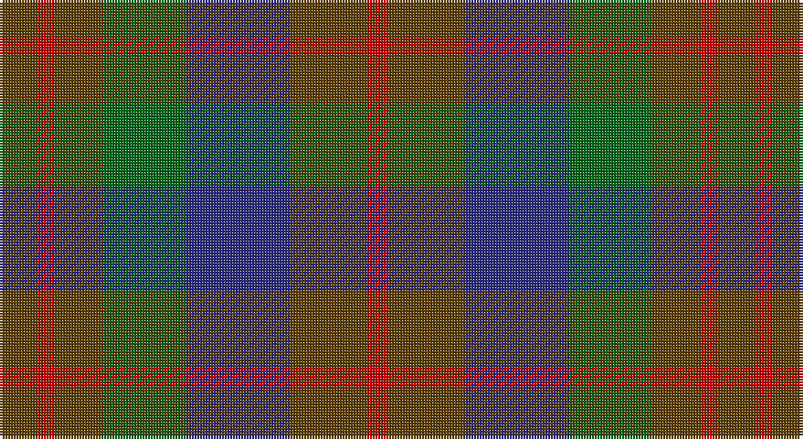

This page is one **sett** — a single exact thread-count. It belongs to the [tartan](/setts/dy7r3dy9g15db19dy14r4/)
(the same proportion at any scale), whose colour order is pattern [GRGGBGR](/stripes/grggbgr/).

Sourced from register-of-tartans.  It is a [7 stripe tartan](/stripes/stripes7/).

Original link https://www.tartanregister.gov.uk/tartanDetails.aspx?ref=955

## Also known as

This cloth is also recorded under:

- Dorward/Dogwood

2 attestations — the source records this cloth was collapsed from (oldest owns this page)

<ul>
<li>01/01/1930 — Dorward/Dogwood (register-of-tartans, <a href="https://www.tartanregister.gov.uk/tartanDetails.aspx?ref=955">record</a>)</li>
<li>pre 2002 — Dorward/Dogwood (Name) (tartans-authority, <a href="http://www.tartansauthority.com/tartan-ferret/display/2533/">record</a>)</li>
</ul>

## Register references

External register numbers recorded for this tartan.

- Scottish Register of Tartans: [955](https://www.tartanregister.gov.uk/tartanDetails.aspx?ref=955)
- Scottish Tartans Authority (ITI): 2533
- Scottish Tartans World Register: 2533

## Thread count
T/14 R6 T18 G30 DB38 T28 R/8

One full sett is **262 threads**.

## Palette

Palette: <strong>Tartan Register</strong>
<table><thead><tr><th>Colour</th><th>Threads</th><th>Shade</th><th>Base</th><th>OKLCh</th></tr></thead><tbody><tr><td>T/</td><td style="text-align:right;font-variant-numeric:tabular-nums">14</td><td><code style="background-color:#604000;">#604000</code> <small style="color:#888">#604000</small></td><td>G <code style="background-color:#006100;">#006100</code></td><td><small style="color:#888">oklch(39.8% 0.083 76.8)</small></td></tr><tr><td>R</td><td style="text-align:right;font-variant-numeric:tabular-nums">6</td><td><code style="background-color:#C80000;">#C80000</code> <small style="color:#888">#C80000</small></td><td>R <code style="background-color:#CC0000;">#CC0000</code></td><td><small style="color:#888">oklch(52.3% 0.215 29.2)</small></td></tr><tr><td>T</td><td style="text-align:right;font-variant-numeric:tabular-nums">18</td><td><code style="background-color:#604000;">#604000</code> <small style="color:#888">#604000</small></td><td>G <code style="background-color:#006100;">#006100</code></td><td><small style="color:#888">oklch(39.8% 0.083 76.8)</small></td></tr><tr><td>G</td><td style="text-align:right;font-variant-numeric:tabular-nums">30</td><td><code style="background-color:#006818;">#006818</code> <small style="color:#888">#006818</small></td><td>G <code style="background-color:#006100;">#006100</code></td><td><small style="color:#888">oklch(45.0% 0.142 145.0)</small></td></tr><tr><td>DB</td><td style="text-align:right;font-variant-numeric:tabular-nums">38</td><td><code style="background-color:#2C2C80;">#2C2C80</code> <small style="color:#888">#2C2C80</small></td><td>B <code style="background-color:#2A418A;">#2A418A</code></td><td><small style="color:#888">oklch(35.0% 0.138 276.6)</small></td></tr><tr><td>T</td><td style="text-align:right;font-variant-numeric:tabular-nums">28</td><td><code style="background-color:#604000;">#604000</code> <small style="color:#888">#604000</small></td><td>G <code style="background-color:#006100;">#006100</code></td><td><small style="color:#888">oklch(39.8% 0.083 76.8)</small></td></tr><tr><td>R/</td><td style="text-align:right;font-variant-numeric:tabular-nums">8</td><td><code style="background-color:#C80000;">#C80000</code> <small style="color:#888">#C80000</small></td><td>R <code style="background-color:#CC0000;">#CC0000</code></td><td><small style="color:#888">oklch(52.3% 0.215 29.2)</small></td></tr></tbody></table>

# Sample pattern

## Nearest tartans

The nearest existing variants by ΔTartan distance, with this tartan at the top so the swatches line up against it.

ΔTartan

Tartan

Sett

—

<a href="/ttd/edit/#slug=dy7r3dy9g15db19dy14r4~x2">Dorward/Dogwood</a> <a class="nn-out" href="/variants/s7/dy7r3dy9g15db19dy14r4~x2/" title="open its dictionary page">↗</a>

0.68

<a href="/ttd/edit/#slug=o7r3o9g15db19o14r4~x2&amp;base=dy7r3dy9g15db19dy14r4~x2">Dorward</a> <a class="nn-out" href="/variants/s7/o7r3o9g15db19o14r4~x2/" title="open its dictionary page">↗</a>

0.79

<a href="/ttd/edit/#slug=dr5g6dy1g6dr5db6dr1~x2&amp;base=dy7r3dy9g15db19dy14r4~x2">Gleneagles Group Corporate Tartan</a> <a class="nn-out" href="/variants/s7/dr5g6dy1g6dr5db6dr1~x2/" title="open its dictionary page">↗</a>

1.04

<a href="/ttd/edit/#slug=r1dy7g7db7g7db7r1~x8&amp;base=dy7r3dy9g15db19dy14r4~x2">Tennant (Yules)</a> <a class="nn-out" href="/variants/s7/r1dy7g7db7g7db7r1~x8/" title="open its dictionary page">↗</a>

1.15

<a href="/ttd/edit/#slug=r1o4g3o1db3o1~x2&amp;base=dy7r3dy9g15db19dy14r4~x2">Fraser Hunting</a> <a class="nn-out" href="/variants/s6/r1o4g3o1db3o1~x2/" title="open its dictionary page">↗</a>

1.18

<a href="/ttd/edit/#slug=dp4n18k17n3g18n4~x2&amp;base=dy7r3dy9g15db19dy14r4~x2">Scottish Airports (Corporate)</a> <a class="nn-out" href="/variants/s6/dp4n18k17n3g18n4~x2/" title="open its dictionary page">↗</a>

1.21

<a href="/ttd/edit/#slug=r1dy7db7k7g7dy7r1~x4&amp;base=dy7r3dy9g15db19dy14r4~x2">Tennant Family Tartan</a> <a class="nn-out" href="/variants/s7/r1dy7db7k7g7dy7r1~x4/" title="open its dictionary page">↗</a>

1.23

<a href="/ttd/edit/#slug=dy8r1dy8g8k8db8dy8r2~x2&amp;base=dy7r3dy9g15db19dy14r4~x2">MacDuff Hunting Clan Tartan</a> <a class="nn-out" href="/variants/s8/dy8r1dy8g8k8db8dy8r2~x2/" title="open its dictionary page">↗</a>

1.28

<a href="/ttd/edit/#slug=o16dg29n19g8n19dg29o16r4~x2&amp;base=dy7r3dy9g15db19dy14r4~x2">Styrian</a> <a class="nn-out" href="/variants/s8/o16dg29n19g8n19dg29o16r4~x2/" title="open its dictionary page">↗</a>

1.30

<a href="/ttd/edit/#slug=dg24k4dg24k24t7r24t7~x2&amp;base=dy7r3dy9g15db19dy14r4~x2">Unidentified Pinafore</a> <a class="nn-out" href="/variants/s7/dg24k4dg24k24t7r24t7~x2/" title="open its dictionary page">↗</a>

1.32

<a href="/ttd/edit/#slug=o9do4o4do4o24dy19do19dy4~x2&amp;base=dy7r3dy9g15db19dy14r4~x2">Chindecella Gorse (Kemete Heil)</a> <a class="nn-out" href="/variants/s8/o9do4o4do4o24dy19do19dy4~x2/" title="open its dictionary page">↗</a>

## Neighbour map

Every grey dot is one of 14360 variants placed by the first two principal components of the ΔTartan feature space (44% of its variance). Red is this tartan; blue dots are its nearest — click one to open its page.

<svg viewBox="0 0 640 380" role="img" style="max-width:100%;height:auto;border:1px solid #e0e0e0;border-radius:4px;display:block" xmlns="http://www.w3.org/2000/svg"><image href="/nn/cloud.v1.png" width="640" height="380"/><a href="/variants/s7/o7r3o9g15db19o14r4~x2/"><circle cx="230.3" cy="279.1" r="4" fill="#3465a4"><title>Dorward</title></circle></a><a href="/variants/s7/dr5g6dy1g6dr5db6dr1~x2/"><circle cx="212.9" cy="284.6" r="4" fill="#3465a4"><title>Gleneagles Group Corporate Tartan</title></circle></a><a href="/variants/s7/r1dy7g7db7g7db7r1~x8/"><circle cx="208.4" cy="281.6" r="4" fill="#3465a4"><title>Tennant (Yules)</title></circle></a><a href="/variants/s6/r1o4g3o1db3o1~x2/"><circle cx="242.5" cy="303.9" r="4" fill="#3465a4"><title>Fraser Hunting</title></circle></a><a href="/variants/s6/dp4n18k17n3g18n4~x2/"><circle cx="223.0" cy="281.8" r="4" fill="#3465a4"><title>Scottish Airports (Corporate)</title></circle></a><a href="/variants/s7/r1dy7db7k7g7dy7r1~x4/"><circle cx="167.7" cy="262.2" r="4" fill="#3465a4"><title>Tennant Family Tartan</title></circle></a><a href="/variants/s8/dy8r1dy8g8k8db8dy8r2~x2/"><circle cx="215.7" cy="264.8" r="4" fill="#3465a4"><title>MacDuff Hunting Clan Tartan</title></circle></a><a href="/variants/s8/o16dg29n19g8n19dg29o16r4~x2/"><circle cx="195.1" cy="267.6" r="4" fill="#3465a4"><title>Styrian</title></circle></a><a href="/variants/s7/dg24k4dg24k24t7r24t7~x2/"><circle cx="192.4" cy="269.9" r="4" fill="#3465a4"><title>Unidentified Pinafore</title></circle></a><a href="/variants/s8/o9do4o4do4o24dy19do19dy4~x2/"><circle cx="281.2" cy="274.7" r="4" fill="#3465a4"><title>Chindecella Gorse (Kemete Heil)</title></circle></a><circle cx="229.6" cy="280.8" r="5" fill="#c00000"/></svg>

ID: /variants/s7/dy7r3dy9g15db19dy14r4~x2/
