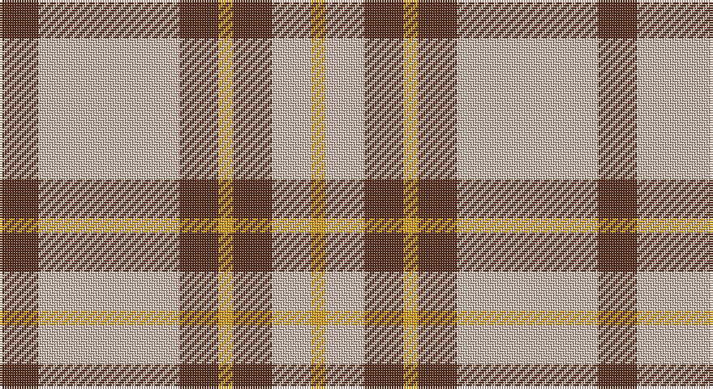

This page is one **sett** — a single exact thread-count. It belongs to the [tartan](/setts/dy8lr29dy8lo3dy8lr8lo3/)
(the same proportion at any scale), whose colour order is pattern [GYGYGYY](/stripes/gygygyy/).

Part of the [Lister](/tartans/lister/) tartan — the named design grouping this sett with its other cloths.

Sourced from register-of-tartans.  It is a [7 stripe tartan](/stripes/stripes7/).

Original link https://www.tartanregister.gov.uk/tartanDetails.aspx?ref=10650

## Provenance

Earliest known date: 07/07/2012 Inspired by a sponsored challenge to wear kilts for a year, David Lister designed this tartan for his family. Colours: grey represents mountain mists; brown represents the matriarchal line and mountains; gold represents the first rays of the morning sun. There are no restrictions as to who can wear this tartan.

2 attestations — the source records this cloth was collapsed from (oldest owns this page)

<ul>
<li>07/07/2012 — Lister (Misty Mountain) (register-of-tartans, <a href="https://www.tartanregister.gov.uk/tartanDetails.aspx?ref=10650">record</a>)</li>
<li>undated — Lister (Misty Mountain) Name Tartan (house-of-tartan, <a href="http://www.house-of-tartan.scotland.net/house/TartanViewjs.asp?colr=Def&tnam=10650">record</a>)</li>
</ul>

## Register references

External register numbers recorded for this tartan.

- Scottish Register of Tartans: [10650](https://www.tartanregister.gov.uk/tartanDetails.aspx?ref=10650)

## Thread count
T/16 N58 T16 Y6 T16 N16 Y/6

One full sett is **246 threads**.

## Palette

Palette: <strong>Tartan Register</strong> <small style="color:#888">(1 of 3 colours)</small>
<table><thead><tr><th>Colour</th><th>Threads</th><th>Shade</th><th>Base</th><th>OKLCh</th></tr></thead><tbody><tr><td>T/</td><td style="text-align:right;font-variant-numeric:tabular-nums">16</td><td><code style="background-color:#5D321F;">#5D321F</code> <small style="color:#888">#5D321F</small></td><td>G <code style="background-color:#006100;">#006100</code></td><td><small style="color:#888">oklch(36.8% 0.069 44.0)</small></td></tr><tr><td>N</td><td style="text-align:right;font-variant-numeric:tabular-nums">58</td><td><code style="background-color:#CCBAAF;">#CCBAAF</code> <small style="color:#888">#CCBAAF</small></td><td>Y <code style="background-color:#F2BF00;">#F2BF00</code></td><td><small style="color:#888">oklch(80.1% 0.026 53.6)</small></td></tr><tr><td>T</td><td style="text-align:right;font-variant-numeric:tabular-nums">16</td><td><code style="background-color:#5D321F;">#5D321F</code> <small style="color:#888">#5D321F</small></td><td>G <code style="background-color:#006100;">#006100</code></td><td><small style="color:#888">oklch(36.8% 0.069 44.0)</small></td></tr><tr><td>Y</td><td style="text-align:right;font-variant-numeric:tabular-nums">6</td><td><code style="background-color:#E0A126;">#E0A126</code> <small style="color:#888">#E0A126</small></td><td>Y <code style="background-color:#F2BF00;">#F2BF00</code></td><td><small style="color:#888">oklch(75.1% 0.146 78.3)</small></td></tr><tr><td>T</td><td style="text-align:right;font-variant-numeric:tabular-nums">16</td><td><code style="background-color:#5D321F;">#5D321F</code> <small style="color:#888">#5D321F</small></td><td>G <code style="background-color:#006100;">#006100</code></td><td><small style="color:#888">oklch(36.8% 0.069 44.0)</small></td></tr><tr><td>N</td><td style="text-align:right;font-variant-numeric:tabular-nums">16</td><td><code style="background-color:#CCBAAF;">#CCBAAF</code> <small style="color:#888">#CCBAAF</small></td><td>Y <code style="background-color:#F2BF00;">#F2BF00</code></td><td><small style="color:#888">oklch(80.1% 0.026 53.6)</small></td></tr><tr><td>Y/</td><td style="text-align:right;font-variant-numeric:tabular-nums">6</td><td><code style="background-color:#E0A126;">#E0A126</code> <small style="color:#888">#E0A126</small></td><td>Y <code style="background-color:#F2BF00;">#F2BF00</code></td><td><small style="color:#888">oklch(75.1% 0.146 78.3)</small></td></tr></tbody></table>

# Sample pattern

## Nearest tartans

The nearest existing variants by ΔTartan distance, with this tartan at the top so the swatches line up against it.

ΔTartan

Tartan

Sett

—

<a href="/ttd/edit/#slug=dy8lr29dy8lo3dy8lr8lo3~x2">Lister (Misty Mountain)</a> <a class="nn-out" href="/variants/s7/dy8lr29dy8lo3dy8lr8lo3~x2/" title="open its dictionary page">↗</a>

0.89

<a href="/ttd/edit/#slug=g1lb4dy12lb3dy6lb12g1lb1~x4&amp;base=dy8lr29dy8lo3dy8lr8lo3~x2">O'Neill Pipe Band 1970 (Corporate)</a> <a class="nn-out" href="/variants/s8/g1lb4dy12lb3dy6lb12g1lb1~x4/" title="open its dictionary page">↗</a>

1.17

<a href="/ttd/edit/#slug=r8ly6k11ly6k11ly30r3~x2&amp;base=dy8lr29dy8lo3dy8lr8lo3~x2">Blackberry (Fashion)</a> <a class="nn-out" href="/variants/s7/r8ly6k11ly6k11ly30r3~x2/" title="open its dictionary page">↗</a>

1.23

<a href="/ttd/edit/#slug=w2r1w2g6w10r6w2g1w2~x4&amp;base=dy8lr29dy8lo3dy8lr8lo3~x2">O'Neill Pipe Band 1999/ Oliver dress</a> <a class="nn-out" href="/variants/s9/w2r1w2g6w10r6w2g1w2~x4/" title="open its dictionary page">↗</a>

1.31

<a href="/ttd/edit/#slug=r4lyi1r3ly1lyi8ly2~x4&amp;base=dy8lr29dy8lo3dy8lr8lo3~x2">Buchele Check (Fashion?)</a> <a class="nn-out" href="/variants/s6/r4lyi1r3ly1lyi8ly2~x4/" title="open its dictionary page">↗</a>

1.33

<a href="/ttd/edit/#slug=lr2dr4lr2dr4lr9k1~x2&amp;base=dy8lr29dy8lo3dy8lr8lo3~x2">Buchanan VS</a> <a class="nn-out" href="/variants/s6/lr2dr4lr2dr4lr9k1~x2/" title="open its dictionary page">↗</a>

1.35

<a href="/ttd/edit/#slug=o56w30o8r10o3r20&amp;base=dy8lr29dy8lo3dy8lr8lo3~x2">Walsh, Michael Edward (Personal)</a> <a class="nn-out" href="/variants/s6/o56w30o8r10o3r20/" title="open its dictionary page">↗</a>

1.47

<a href="/ttd/edit/#slug=g4lb31g7r14g11r3~x2&amp;base=dy8lr29dy8lo3dy8lr8lo3~x2">Gleneagles USA (Dalgleish)</a> <a class="nn-out" href="/variants/s6/g4lb31g7r14g11r3~x2/" title="open its dictionary page">↗</a>

1.47

<a href="/ttd/edit/#slug=dy5r5lb11r1dy1~x4&amp;base=dy8lr29dy8lo3dy8lr8lo3~x2">O'Connor Dress</a> <a class="nn-out" href="/variants/s5/dy5r5lb11r1dy1~x4/" title="open its dictionary page">↗</a>

1.49

<a href="/ttd/edit/#slug=k2w28r13w2r13w2~x2&amp;base=dy8lr29dy8lo3dy8lr8lo3~x2">Buchanan #5</a> <a class="nn-out" href="/variants/s6/k2w28r13w2r13w2~x2/" title="open its dictionary page">↗</a>

1.50

<a href="/ttd/edit/#slug=w5k20w2r5w20r2~x2&amp;base=dy8lr29dy8lo3dy8lr8lo3~x2">Gangs of New York Fashion Check Tartan</a> <a class="nn-out" href="/variants/s6/w5k20w2r5w20r2~x2/" title="open its dictionary page">↗</a>

## Neighbour map

Every grey dot is one of 14360 variants placed by the first two principal components of the ΔTartan feature space (44% of its variance). Red is this tartan; blue dots are its nearest — click one to open its page.

<svg viewBox="0 0 640 380" role="img" style="max-width:100%;height:auto;border:1px solid #e0e0e0;border-radius:4px;display:block" xmlns="http://www.w3.org/2000/svg"><image href="/nn/cloud.v1.png" width="640" height="380"/><a href="/variants/s8/g1lb4dy12lb3dy6lb12g1lb1~x4/"><circle cx="303.3" cy="192.0" r="4" fill="#3465a4"><title>O'Neill Pipe Band 1970 (Corporate)</title></circle></a><a href="/variants/s7/r8ly6k11ly6k11ly30r3~x2/"><circle cx="276.4" cy="198.9" r="4" fill="#3465a4"><title>Blackberry (Fashion)</title></circle></a><a href="/variants/s9/w2r1w2g6w10r6w2g1w2~x4/"><circle cx="286.0" cy="184.7" r="4" fill="#3465a4"><title>O'Neill Pipe Band 1999/ Oliver dress</title></circle></a><a href="/variants/s6/r4lyi1r3ly1lyi8ly2~x4/"><circle cx="259.3" cy="217.0" r="4" fill="#3465a4"><title>Buchele Check (Fashion?)</title></circle></a><a href="/variants/s6/lr2dr4lr2dr4lr9k1~x2/"><circle cx="316.3" cy="222.8" r="4" fill="#3465a4"><title>Buchanan VS</title></circle></a><a href="/variants/s6/o56w30o8r10o3r20/"><circle cx="317.6" cy="183.5" r="4" fill="#3465a4"><title>Walsh, Michael Edward (Personal)</title></circle></a><a href="/variants/s6/g4lb31g7r14g11r3~x2/"><circle cx="239.4" cy="211.1" r="4" fill="#3465a4"><title>Gleneagles USA (Dalgleish)</title></circle></a><a href="/variants/s5/dy5r5lb11r1dy1~x4/"><circle cx="272.2" cy="218.6" r="4" fill="#3465a4"><title>O'Connor Dress</title></circle></a><a href="/variants/s6/k2w28r13w2r13w2~x2/"><circle cx="321.5" cy="171.3" r="4" fill="#3465a4"><title>Buchanan #5</title></circle></a><a href="/variants/s6/w5k20w2r5w20r2~x2/"><circle cx="249.8" cy="188.6" r="4" fill="#3465a4"><title>Gangs of New York Fashion Check Tartan</title></circle></a><circle cx="311.1" cy="200.8" r="5" fill="#c00000"/></svg>

ID: /variants/s7/dy8lr29dy8lo3dy8lr8lo3~x2/
