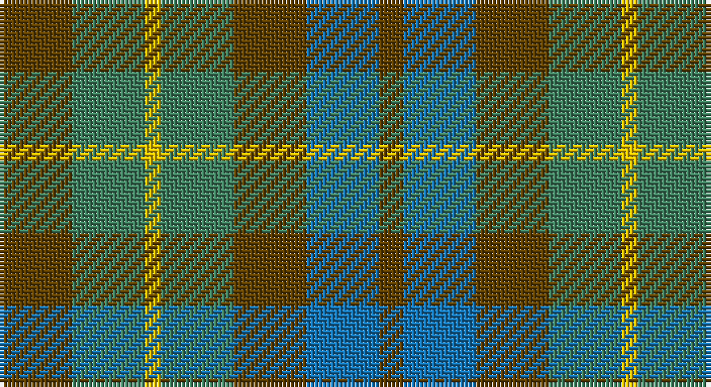

This page is one **sett** — a single exact thread-count. It belongs to the [tartan](/setts/dy9g9ly2g9dy9b9dy3/)
(the same proportion at any scale), whose colour order is pattern [GBGGYGG](/stripes/gbggygg/).

Part of the [MacKay](/tartans/mackay/) tartan — the named design grouping this sett with its other cloths.

Sourced from tartans-authority.  It is a [7 stripe tartan](/stripes/stripes7/).

Original link http://www.tartansauthority.com/tartan-ferret/display/1047/

## Also known as

This cloth is also recorded under:

- MacKay #2
- MacKay Plaid
- MacKay V
- MacKay VS
- MacKay, Blue
- MacKay, Plaid

## Register references

External register numbers recorded for this tartan.

- Scottish Tartans Authority (ITI): 1047

## Thread count
T/18 G18 Y4 G18 T18 B18 T/6

One full sett is **176 threads**.

## Palette

Palette: <strong>Tartan Register</strong>
<table><thead><tr><th>Colour</th><th>Threads</th><th>Shade</th><th>Base</th><th>OKLCh</th></tr></thead><tbody><tr><td>T/</td><td style="text-align:right;font-variant-numeric:tabular-nums">18</td><td><code style="background-color:#604000;">#604000</code> <small style="color:#888">#604000</small></td><td>G <code style="background-color:#006100;">#006100</code></td><td><small style="color:#888">oklch(39.8% 0.083 76.8)</small></td></tr><tr><td>G</td><td style="text-align:right;font-variant-numeric:tabular-nums">18</td><td><code style="background-color:#408060;">#408060</code> <small style="color:#888">#408060</small></td><td>G <code style="background-color:#006100;">#006100</code></td><td><small style="color:#888">oklch(54.8% 0.084 160.1)</small></td></tr><tr><td>Y</td><td style="text-align:right;font-variant-numeric:tabular-nums">4</td><td><code style="background-color:#E8C000;">#E8C000</code> <small style="color:#888">#E8C000</small></td><td>Y <code style="background-color:#F2BF00;">#F2BF00</code></td><td><small style="color:#888">oklch(81.9% 0.168 93.7)</small></td></tr><tr><td>G</td><td style="text-align:right;font-variant-numeric:tabular-nums">18</td><td><code style="background-color:#408060;">#408060</code> <small style="color:#888">#408060</small></td><td>G <code style="background-color:#006100;">#006100</code></td><td><small style="color:#888">oklch(54.8% 0.084 160.1)</small></td></tr><tr><td>T</td><td style="text-align:right;font-variant-numeric:tabular-nums">18</td><td><code style="background-color:#604000;">#604000</code> <small style="color:#888">#604000</small></td><td>G <code style="background-color:#006100;">#006100</code></td><td><small style="color:#888">oklch(39.8% 0.083 76.8)</small></td></tr><tr><td>B</td><td style="text-align:right;font-variant-numeric:tabular-nums">18</td><td><code style="background-color:#1474B4;">#1474B4</code> <small style="color:#888">#1474B4</small></td><td>B <code style="background-color:#2A418A;">#2A418A</code></td><td><small style="color:#888">oklch(54.0% 0.129 245.1)</small></td></tr><tr><td>T/</td><td style="text-align:right;font-variant-numeric:tabular-nums">6</td><td><code style="background-color:#604000;">#604000</code> <small style="color:#888">#604000</small></td><td>G <code style="background-color:#006100;">#006100</code></td><td><small style="color:#888">oklch(39.8% 0.083 76.8)</small></td></tr></tbody></table>

# Sample pattern

## Compared to the master

This cloth is one sett of its design; the master sett (the exemplar the design is anchored on) is below for comparison.

<figure style="margin:0"><figcaption style="color:#888;font-size:smaller">this sett</figcaption></figure>
<figure style="margin:0"><figcaption style="color:#888;font-size:smaller"><a href="/setts/db8dg8db1dg8k8db8ly2/">master sett →</a></figcaption></figure>

## Nearest tartans

The nearest existing variants by ΔTartan distance, with this tartan at the top so the swatches line up against it.

ΔTartan

Tartan

Sett

—

<a href="/ttd/edit/#slug=dy9g9ly2g9dy9b9dy3~x2">MacKay - 1800 (Reay Coat) (Artefact)</a> <a class="nn-out" href="/variants/s7/dy9g9ly2g9dy9b9dy3~x2/" title="open its dictionary page">↗</a>

1.10

<a href="/ttd/edit/#slug=r1o4g3o1db3o1~x2&amp;base=dy9g9ly2g9dy9b9dy3~x2">Fraser Hunting</a> <a class="nn-out" href="/variants/s6/r1o4g3o1db3o1~x2/" title="open its dictionary page">↗</a>

1.20

<a href="/ttd/edit/#slug=o7r3o9g15db19o14r4~x2&amp;base=dy9g9ly2g9dy9b9dy3~x2">Dorward</a> <a class="nn-out" href="/variants/s7/o7r3o9g15db19o14r4~x2/" title="open its dictionary page">↗</a>

1.39

<a href="/ttd/edit/#slug=o16dg29n19g8n19dg29o16r4~x2&amp;base=dy9g9ly2g9dy9b9dy3~x2">Styrian</a> <a class="nn-out" href="/variants/s8/o16dg29n19g8n19dg29o16r4~x2/" title="open its dictionary page">↗</a>

1.45

<a href="/ttd/edit/#slug=dy7r3dy9g15db19dy14r4~x2&amp;base=dy9g9ly2g9dy9b9dy3~x2">Dorward/Dogwood</a> <a class="nn-out" href="/variants/s7/dy7r3dy9g15db19dy14r4~x2/" title="open its dictionary page">↗</a>

1.49

<a href="/ttd/edit/#slug=r1dy7g7db7g7db7r1~x8&amp;base=dy9g9ly2g9dy9b9dy3~x2">Tennant (Yules)</a> <a class="nn-out" href="/variants/s7/r1dy7g7db7g7db7r1~x8/" title="open its dictionary page">↗</a>

1.63

<a href="/ttd/edit/#slug=dr5g6dy1g6dr5db6dr1~x2&amp;base=dy9g9ly2g9dy9b9dy3~x2">Gleneagles Group Corporate Tartan</a> <a class="nn-out" href="/variants/s7/dr5g6dy1g6dr5db6dr1~x2/" title="open its dictionary page">↗</a>

1.76

<a href="/ttd/edit/#slug=g7oi3o3t3o3oi3g12y4g4y4t3~x2&amp;base=dy9g9ly2g9dy9b9dy3~x2">Ralston (USA)</a> <a class="nn-out" href="/variants/s11/g7oi3o3t3o3oi3g12y4g4y4t3~x2/" title="open its dictionary page">↗</a>

1.80

<a href="/ttd/edit/#slug=dy1db3dy1dg3dy4r1~x2&amp;base=dy9g9ly2g9dy9b9dy3~x2">Fraser Hunting #2</a> <a class="nn-out" href="/variants/s6/dy1db3dy1dg3dy4r1~x2/" title="open its dictionary page">↗</a>

1.81

<a href="/ttd/edit/#slug=db3o14g14o2db14o2db14o2g14o14r3~x2&amp;base=dy9g9ly2g9dy9b9dy3~x2">Buchanan, hunting</a> <a class="nn-out" href="/variants/s11/db3o14g14o2db14o2db14o2g14o14r3~x2/" title="open its dictionary page">↗</a>

1.82

<a href="/ttd/edit/#slug=g8n19dg29o16r4~x2&amp;base=dy9g9ly2g9dy9b9dy3~x2">Styrian (Fashion)</a> <a class="nn-out" href="/variants/s5/g8n19dg29o16r4~x2/" title="open its dictionary page">↗</a>

## Neighbour map

Every grey dot is one of 14360 variants placed by the first two principal components of the ΔTartan feature space (44% of its variance). Red is this tartan; blue dots are its nearest — click one to open its page.

<svg viewBox="0 0 640 380" role="img" style="max-width:100%;height:auto;border:1px solid #e0e0e0;border-radius:4px;display:block" xmlns="http://www.w3.org/2000/svg"><image href="/nn/cloud.v1.png" width="640" height="380"/><a href="/variants/s6/r1o4g3o1db3o1~x2/"><circle cx="242.5" cy="303.9" r="4" fill="#3465a4"><title>Fraser Hunting</title></circle></a><a href="/variants/s7/o7r3o9g15db19o14r4~x2/"><circle cx="230.3" cy="279.1" r="4" fill="#3465a4"><title>Dorward</title></circle></a><a href="/variants/s8/o16dg29n19g8n19dg29o16r4~x2/"><circle cx="195.1" cy="267.6" r="4" fill="#3465a4"><title>Styrian</title></circle></a><a href="/variants/s7/dy7r3dy9g15db19dy14r4~x2/"><circle cx="229.6" cy="280.8" r="4" fill="#3465a4"><title>Dorward/Dogwood</title></circle></a><a href="/variants/s7/r1dy7g7db7g7db7r1~x8/"><circle cx="208.4" cy="281.6" r="4" fill="#3465a4"><title>Tennant (Yules)</title></circle></a><a href="/variants/s7/dr5g6dy1g6dr5db6dr1~x2/"><circle cx="212.9" cy="284.6" r="4" fill="#3465a4"><title>Gleneagles Group Corporate Tartan</title></circle></a><a href="/variants/s11/g7oi3o3t3o3oi3g12y4g4y4t3~x2/"><circle cx="195.9" cy="260.1" r="4" fill="#3465a4"><title>Ralston (USA)</title></circle></a><a href="/variants/s6/dy1db3dy1dg3dy4r1~x2/"><circle cx="271.2" cy="324.6" r="4" fill="#3465a4"><title>Fraser Hunting #2</title></circle></a><a href="/variants/s11/db3o14g14o2db14o2db14o2g14o14r3~x2/"><circle cx="214.8" cy="247.5" r="4" fill="#3465a4"><title>Buchanan, hunting</title></circle></a><a href="/variants/s5/g8n19dg29o16r4~x2/"><circle cx="194.9" cy="274.2" r="4" fill="#3465a4"><title>Styrian (Fashion)</title></circle></a><circle cx="211.2" cy="314.3" r="5" fill="#c00000"/></svg>

ID: /variants/s7/dy9g9ly2g9dy9b9dy3~x2/
