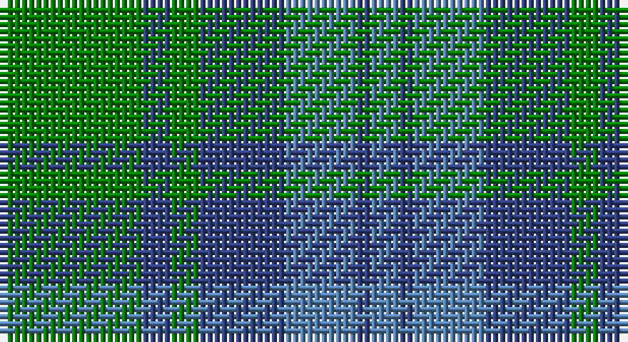

This page is one **sett** — a single exact thread-count. It belongs to the [tartan](/setts/g10db2g2db6t5db1t2/)
(the same proportion at any scale), whose colour order is pattern [BBBBGBG](/stripes/bbbbgbg/).

Sourced from weddslist.  It is a [7 stripe tartan](/stripes/stripes7/).

Original link http://www.weddslist.com/cgi-bin/tartans/pg.pl?source=sts

## Also known as

This cloth is also recorded under:

- Norwich No.017
- Unnamed, No 17

## Thread count
G/20 B4 G4 B12 Ba10 B2 Ba/4

One full sett is **88 threads**.

## Palette

Palette: <strong>custom</strong>
<table><thead><tr><th>Colour</th><th>Threads</th><th>Shade</th><th>Base</th><th>OKLCh</th></tr></thead><tbody><tr><td>G/</td><td style="text-align:right;font-variant-numeric:tabular-nums">20</td><td><code style="background-color:#008000;">#008000</code> <small style="color:#888">#008000</small></td><td>G <code style="background-color:#006100;">#006100</code></td><td><small style="color:#888">oklch(52.0% 0.177 142.5)</small></td></tr><tr><td>B</td><td style="text-align:right;font-variant-numeric:tabular-nums">4</td><td><code style="background-color:#304080;">#304080</code> <small style="color:#888">#304080</small></td><td>B <code style="background-color:#2A418A;">#2A418A</code></td><td><small style="color:#888">oklch(39.4% 0.109 270.2)</small></td></tr><tr><td>G</td><td style="text-align:right;font-variant-numeric:tabular-nums">4</td><td><code style="background-color:#008000;">#008000</code> <small style="color:#888">#008000</small></td><td>G <code style="background-color:#006100;">#006100</code></td><td><small style="color:#888">oklch(52.0% 0.177 142.5)</small></td></tr><tr><td>B</td><td style="text-align:right;font-variant-numeric:tabular-nums">12</td><td><code style="background-color:#304080;">#304080</code> <small style="color:#888">#304080</small></td><td>B <code style="background-color:#2A418A;">#2A418A</code></td><td><small style="color:#888">oklch(39.4% 0.109 270.2)</small></td></tr><tr><td>Ba</td><td style="text-align:right;font-variant-numeric:tabular-nums">10</td><td><code style="background-color:#5480B0;">#5480B0</code> <small style="color:#888">#5480B0</small></td><td>B <code style="background-color:#2A418A;">#2A418A</code></td><td><small style="color:#888">oklch(58.8% 0.089 251.5)</small></td></tr><tr><td>B</td><td style="text-align:right;font-variant-numeric:tabular-nums">2</td><td><code style="background-color:#304080;">#304080</code> <small style="color:#888">#304080</small></td><td>B <code style="background-color:#2A418A;">#2A418A</code></td><td><small style="color:#888">oklch(39.4% 0.109 270.2)</small></td></tr><tr><td>Ba/</td><td style="text-align:right;font-variant-numeric:tabular-nums">4</td><td><code style="background-color:#5480B0;">#5480B0</code> <small style="color:#888">#5480B0</small></td><td>B <code style="background-color:#2A418A;">#2A418A</code></td><td><small style="color:#888">oklch(58.8% 0.089 251.5)</small></td></tr></tbody></table>

# Sample pattern

## Nearest tartans

The nearest existing variants by ΔTartan distance, with this tartan at the top so the swatches line up against it.

ΔTartan

Tartan

Sett

—

<a href="/ttd/edit/#slug=g10db2g2db6t5db1t2~x2">Unnamed, No 17</a> <a class="nn-out" href="/variants/s7/g10db2g2db6t5db1t2~x2/" title="open its dictionary page">↗</a>

1.07

<a href="/ttd/edit/#slug=t7k7t7g20t2g2~x4&amp;base=g10db2g2db6t5db1t2~x2">Falconer of Labhdal (Personal)</a> <a class="nn-out" href="/variants/s6/t7k7t7g20t2g2~x4/" title="open its dictionary page">↗</a>

1.16

<a href="/ttd/edit/#slug=t12dg2t2dg2t2dy8g8dy1~x2&amp;base=g10db2g2db6t5db1t2~x2">Universal Ancient</a> <a class="nn-out" href="/variants/s8/t12dg2t2dg2t2dy8g8dy1~x2/" title="open its dictionary page">↗</a>

1.32

<a href="/ttd/edit/#slug=db22g3db3g3db3g9y28g3y6~x2&amp;base=g10db2g2db6t5db1t2~x2">Manx Centenary</a> <a class="nn-out" href="/variants/s9/db22g3db3g3db3g9y28g3y6~x2/" title="open its dictionary page">↗</a>

1.33

<a href="/ttd/edit/#slug=g32o7g7o16db32ly3o8~x2&amp;base=g10db2g2db6t5db1t2~x2">Strange Of Balcaskie</a> <a class="nn-out" href="/variants/s7/g32o7g7o16db32ly3o8~x2/" title="open its dictionary page">↗</a>

1.34

<a href="/ttd/edit/#slug=dg10db2dg2db6t5db1t2~x2&amp;base=g10db2g2db6t5db1t2~x2">Unidentified No 17</a> <a class="nn-out" href="/variants/s7/dg10db2dg2db6t5db1t2~x2/" title="open its dictionary page">↗</a>

1.36

<a href="/ttd/edit/#slug=db3o10g9r1g3~x4&amp;base=g10db2g2db6t5db1t2~x2">Bethlehem, City of (District)</a> <a class="nn-out" href="/variants/s5/db3o10g9r1g3~x4/" title="open its dictionary page">↗</a>

1.39

<a href="/ttd/edit/#slug=db1g10db9b10db1b1~x4&amp;base=g10db2g2db6t5db1t2~x2">Black Watch (Aljean)</a> <a class="nn-out" href="/variants/s6/db1g10db9b10db1b1~x4/" title="open its dictionary page">↗</a>

1.41

<a href="/ttd/edit/#slug=g25m4db24m21g25m4db2~x2&amp;base=g10db2g2db6t5db1t2~x2">Glasgow, Rock and Wheel</a> <a class="nn-out" href="/variants/s7/g25m4db24m21g25m4db2~x2/" title="open its dictionary page">↗</a>

1.46

<a href="/ttd/edit/#slug=t4dg26gi8t8gi8g3t2~x2&amp;base=g10db2g2db6t5db1t2~x2">Valley of the Green (The ) Canadian Tartan</a> <a class="nn-out" href="/variants/s7/t4dg26gi8t8gi8g3t2~x2/" title="open its dictionary page">↗</a>

1.48

<a href="/ttd/edit/#slug=k7t7g20t2g2t2g20t7k7t7~x4&amp;base=g10db2g2db6t5db1t2~x2">Falconer of Labhdal Personal Tartan</a> <a class="nn-out" href="/variants/s10/k7t7g20t2g2t2g20t7k7t7~x4/" title="open its dictionary page">↗</a>

## Neighbour map

Every grey dot is one of 14360 variants placed by the first two principal components of the ΔTartan feature space (44% of its variance). Red is this tartan; blue dots are its nearest — click one to open its page.

<svg viewBox="0 0 640 380" role="img" style="max-width:100%;height:auto;border:1px solid #e0e0e0;border-radius:4px;display:block" xmlns="http://www.w3.org/2000/svg"><image href="/nn/cloud.v1.png" width="640" height="380"/><a href="/variants/s6/t7k7t7g20t2g2~x4/"><circle cx="296.2" cy="249.8" r="4" fill="#3465a4"><title>Falconer of Labhdal (Personal)</title></circle></a><a href="/variants/s8/t12dg2t2dg2t2dy8g8dy1~x2/"><circle cx="254.5" cy="219.5" r="4" fill="#3465a4"><title>Universal Ancient</title></circle></a><a href="/variants/s9/db22g3db3g3db3g9y28g3y6~x2/"><circle cx="303.5" cy="229.9" r="4" fill="#3465a4"><title>Manx Centenary</title></circle></a><a href="/variants/s7/g32o7g7o16db32ly3o8~x2/"><circle cx="237.9" cy="236.3" r="4" fill="#3465a4"><title>Strange Of Balcaskie</title></circle></a><a href="/variants/s7/dg10db2dg2db6t5db1t2~x2/"><circle cx="309.5" cy="278.0" r="4" fill="#3465a4"><title>Unidentified No 17</title></circle></a><a href="/variants/s5/db3o10g9r1g3~x4/"><circle cx="279.3" cy="256.1" r="4" fill="#3465a4"><title>Bethlehem, City of (District)</title></circle></a><a href="/variants/s6/db1g10db9b10db1b1~x4/"><circle cx="251.0" cy="259.4" r="4" fill="#3465a4"><title>Black Watch (Aljean)</title></circle></a><a href="/variants/s7/g25m4db24m21g25m4db2~x2/"><circle cx="291.1" cy="245.9" r="4" fill="#3465a4"><title>Glasgow, Rock and Wheel</title></circle></a><a href="/variants/s7/t4dg26gi8t8gi8g3t2~x2/"><circle cx="278.7" cy="224.7" r="4" fill="#3465a4"><title>Valley of the Green (The ) Canadian Tartan</title></circle></a><a href="/variants/s10/k7t7g20t2g2t2g20t7k7t7~x4/"><circle cx="289.3" cy="227.7" r="4" fill="#3465a4"><title>Falconer of Labhdal Personal Tartan</title></circle></a><circle cx="276.6" cy="259.0" r="5" fill="#c00000"/></svg>

ID: /variants/s7/g10db2g2db6t5db1t2~x2/
