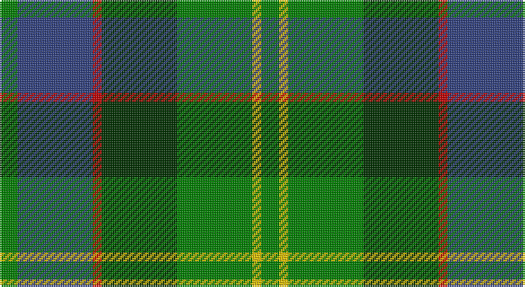

This page is one **sett** — a single exact thread-count. It belongs to the [tartan](/setts/g10db42r5dg42g42ly5g10/)
(the same proportion at any scale), whose colour order is pattern [GBRGGYG](/stripes/gbrggyg/).

Part of the [New Mexico](/tartans/new-mexico/) tartan — the named design grouping this sett with its other cloths.

Sourced from weddslist.  It is a [7 stripe tartan](/stripes/stripes7/).

Original link http://www.weddslist.com/cgi-bin/tartans/pg.pl?source=sts

## Also known as

This cloth is also recorded under:

- New Mexico: Land of Enchantment

## Thread count
G/10 B42 R5 DG42 G42 Y5 G/10

One full sett is **292 threads**.

## Palette

Palette: <strong>custom</strong>
<table><thead><tr><th>Colour</th><th>Threads</th><th>Shade</th><th>Base</th><th>OKLCh</th></tr></thead><tbody><tr><td>G/</td><td style="text-align:right;font-variant-numeric:tabular-nums">10</td><td><code style="background-color:#008000;">#008000</code> <small style="color:#888">#008000</small></td><td>G <code style="background-color:#006100;">#006100</code></td><td><small style="color:#888">oklch(52.0% 0.177 142.5)</small></td></tr><tr><td>B</td><td style="text-align:right;font-variant-numeric:tabular-nums">42</td><td><code style="background-color:#304080;">#304080</code> <small style="color:#888">#304080</small></td><td>B <code style="background-color:#2A418A;">#2A418A</code></td><td><small style="color:#888">oklch(39.4% 0.109 270.2)</small></td></tr><tr><td>R</td><td style="text-align:right;font-variant-numeric:tabular-nums">5</td><td><code style="background-color:#C00000;">#C00000</code> <small style="color:#888">#C00000</small></td><td>R <code style="background-color:#CC0000;">#CC0000</code></td><td><small style="color:#888">oklch(50.7% 0.208 29.2)</small></td></tr><tr><td>DG</td><td style="text-align:right;font-variant-numeric:tabular-nums">42</td><td><code style="background-color:#003000;">#003000</code> <small style="color:#888">#003000</small></td><td>G <code style="background-color:#006100;">#006100</code></td><td><small style="color:#888">oklch(26.8% 0.091 142.5)</small></td></tr><tr><td>G</td><td style="text-align:right;font-variant-numeric:tabular-nums">42</td><td><code style="background-color:#008000;">#008000</code> <small style="color:#888">#008000</small></td><td>G <code style="background-color:#006100;">#006100</code></td><td><small style="color:#888">oklch(52.0% 0.177 142.5)</small></td></tr><tr><td>Y</td><td style="text-align:right;font-variant-numeric:tabular-nums">5</td><td><code style="background-color:#F0C000;">#F0C000</code> <small style="color:#888">#F0C000</small></td><td>Y <code style="background-color:#F2BF00;">#F2BF00</code></td><td><small style="color:#888">oklch(82.7% 0.169 90.5)</small></td></tr><tr><td>G/</td><td style="text-align:right;font-variant-numeric:tabular-nums">10</td><td><code style="background-color:#008000;">#008000</code> <small style="color:#888">#008000</small></td><td>G <code style="background-color:#006100;">#006100</code></td><td><small style="color:#888">oklch(52.0% 0.177 142.5)</small></td></tr></tbody></table>

# Sample pattern

## Compared to the master

This cloth is one sett of its design; the master sett (the exemplar the design is anchored on) is below for comparison.

<figure style="margin:0"><figcaption style="color:#888;font-size:smaller">this sett</figcaption></figure>
<figure style="margin:0"><figcaption style="color:#888;font-size:smaller"><a href="/setts/g10dp42r5gi42g42ly5g6/">master sett →</a></figcaption></figure>

## Nearest tartans

The nearest existing variants by ΔTartan distance, with this tartan at the top so the swatches line up against it.

ΔTartan

Tartan

Sett

—

<a href="/ttd/edit/#slug=g10db42r5dg42g42ly5g10">New Mexico</a> <a class="nn-out" href="/variants/s7/g10db42r5dg42g42ly5g10/" title="open its dictionary page">↗</a>

0.75

<a href="/ttd/edit/#slug=g6ly3g26dg10dt30lb3~x2&amp;base=g10db42r5dg42g42ly5g10">Wcwm 1716</a> <a class="nn-out" href="/variants/s6/g6ly3g26dg10dt30lb3~x2/" title="open its dictionary page">↗</a>

0.90

<a href="/ttd/edit/#slug=ly4dg30g15db5b10ly4~x2&amp;base=g10db42r5dg42g42ly5g10">MPS Emerald Society</a> <a class="nn-out" href="/variants/s6/ly4dg30g15db5b10ly4~x2/" title="open its dictionary page">↗</a>

0.96

<a href="/ttd/edit/#slug=ly4dg30g15db5t10ly4~x2&amp;base=g10db42r5dg42g42ly5g10">MPS Emerald Society NCLEES 2012</a> <a class="nn-out" href="/variants/s6/ly4dg30g15db5t10ly4~x2/" title="open its dictionary page">↗</a>

0.96

<a href="/ttd/edit/#slug=r3g28db9dg18w3~x2&amp;base=g10db42r5dg42g42ly5g10">Simple Technology (Corporate)</a> <a class="nn-out" href="/variants/s5/r3g28db9dg18w3~x2/" title="open its dictionary page">↗</a>

1.01

<a href="/ttd/edit/#slug=g3r3g31dg18g4k22ly3&amp;base=g10db42r5dg42g42ly5g10">MacSween Hunting (Lochs, Isle of Lew</a> <a class="nn-out" href="/variants/s7/g3r3g31dg18g4k22ly3/" title="open its dictionary page">↗</a>

1.01

<a href="/ttd/edit/#slug=g14dt11y3k5y3dt11g14ly2~x2&amp;base=g10db42r5dg42g42ly5g10">Wilson's No.122</a> <a class="nn-out" href="/variants/s8/g14dt11y3k5y3dt11g14ly2~x2/" title="open its dictionary page">↗</a>

1.10

<a href="/ttd/edit/#slug=g10dp42r5gi42g42ly5g6&amp;base=g10db42r5dg42g42ly5g10">New Mexico (Fashion)</a> <a class="nn-out" href="/variants/s7/g10dp42r5gi42g42ly5g6/" title="open its dictionary page">↗</a>

1.12

<a href="/ttd/edit/#slug=g31ly4g6k19db18t9~x2&amp;base=g10db42r5dg42g42ly5g10">Lanarkshire</a> <a class="nn-out" href="/variants/s6/g31ly4g6k19db18t9~x2/" title="open its dictionary page">↗</a>

1.19

<a href="/ttd/edit/#slug=db2k6g2k6gi12ly1~x4&amp;base=g10db42r5dg42g42ly5g10">Leahy (Australia) (Personal)</a> <a class="nn-out" href="/variants/s6/db2k6g2k6gi12ly1~x4/" title="open its dictionary page">↗</a>

1.20

<a href="/ttd/edit/#slug=b30ly3dy11ly3g33r6~x2&amp;base=g10db42r5dg42g42ly5g10">Balfour Hunting</a> <a class="nn-out" href="/variants/s6/b30ly3dy11ly3g33r6~x2/" title="open its dictionary page">↗</a>

## Neighbour map

Every grey dot is one of 14360 variants placed by the first two principal components of the ΔTartan feature space (44% of its variance). Red is this tartan; blue dots are its nearest — click one to open its page.

<svg viewBox="0 0 640 380" role="img" style="max-width:100%;height:auto;border:1px solid #e0e0e0;border-radius:4px;display:block" xmlns="http://www.w3.org/2000/svg"><image href="/nn/cloud.v1.png" width="640" height="380"/><a href="/variants/s6/g6ly3g26dg10dt30lb3~x2/"><circle cx="216.2" cy="212.7" r="4" fill="#3465a4"><title>Wcwm 1716</title></circle></a><a href="/variants/s6/ly4dg30g15db5b10ly4~x2/"><circle cx="178.3" cy="214.8" r="4" fill="#3465a4"><title>MPS Emerald Society</title></circle></a><a href="/variants/s6/ly4dg30g15db5t10ly4~x2/"><circle cx="174.5" cy="213.8" r="4" fill="#3465a4"><title>MPS Emerald Society NCLEES 2012</title></circle></a><a href="/variants/s5/r3g28db9dg18w3~x2/"><circle cx="234.7" cy="232.4" r="4" fill="#3465a4"><title>Simple Technology (Corporate)</title></circle></a><a href="/variants/s7/g3r3g31dg18g4k22ly3/"><circle cx="240.0" cy="208.5" r="4" fill="#3465a4"><title>MacSween Hunting (Lochs, Isle of Lew</title></circle></a><a href="/variants/s8/g14dt11y3k5y3dt11g14ly2~x2/"><circle cx="200.1" cy="242.9" r="4" fill="#3465a4"><title>Wilson's No.122</title></circle></a><a href="/variants/s7/g10dp42r5gi42g42ly5g6/"><circle cx="171.4" cy="198.7" r="4" fill="#3465a4"><title>New Mexico (Fashion)</title></circle></a><a href="/variants/s6/g31ly4g6k19db18t9~x2/"><circle cx="165.1" cy="233.2" r="4" fill="#3465a4"><title>Lanarkshire</title></circle></a><a href="/variants/s6/db2k6g2k6gi12ly1~x4/"><circle cx="217.0" cy="209.0" r="4" fill="#3465a4"><title>Leahy (Australia) (Personal)</title></circle></a><a href="/variants/s6/b30ly3dy11ly3g33r6~x2/"><circle cx="216.7" cy="209.7" r="4" fill="#3465a4"><title>Balfour Hunting</title></circle></a><circle cx="187.8" cy="219.0" r="5" fill="#c00000"/></svg>

ID: /variants/s7/g10db42r5dg42g42ly5g10/
