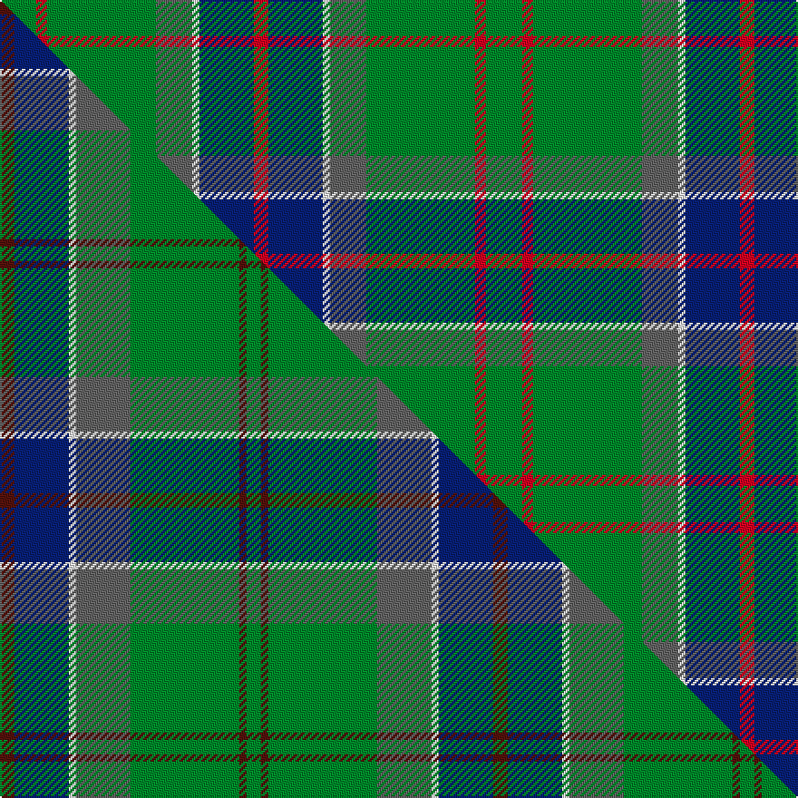

This page is one **sett** — a single exact thread-count. It belongs to the [tartan](/setts/g10r3g30n10w2db15r4/)
(the same proportion at any scale), whose colour order is pattern [GRGBWBR](/stripes/grgbwbr/).

Part of the [Sinclair](/tartans/sinclair-2/) tartan — the named design grouping this sett with its other cloths.

Sourced from weddslist.  It is a [7 stripe tartan](/stripes/stripes7/).

Original link http://www.weddslist.com/cgi-bin/tartans/pg.pl?source=sts

## Thread count
G/20 R6 G60 N20 W4 DB30 R/8

One full sett is **268 threads**.

## Palette
<table><thead><tr><th>Colour</th><th>Shade</th><th>OKLCh</th></tr></thead><tbody><tr><td>DB</td><td><code style="background-color:#082077;">#082077</code> <small style="color:#888">#082077</small></td><td><small style="color:#888">oklch(30.0% 0.149 265.1)</small></td></tr><tr><td>G</td><td><code style="background-color:#008B2A;">#008B2A</code> <small style="color:#888">#008B2A</small></td><td><small style="color:#888">oklch(55.4% 0.170 145.9)</small></td></tr><tr><td>W</td><td><code style="background-color:#F7F7F7;">#F7F7F7</code> <small style="color:#888">#F7F7F7</small></td><td><small style="color:#888">oklch(97.6% 0.000 89.9)</small></td></tr><tr><td>N</td><td><code style="background-color:#636363;">#636363</code> <small style="color:#888">#636363</small></td><td><small style="color:#888">oklch(50.0% 0.000 89.9)</small></td></tr><tr><td>R</td><td><code style="background-color:#D60020;">#D60020</code> <small style="color:#888">#D60020</small></td><td><small style="color:#888">oklch(55.2% 0.224 25.5)</small></td></tr></tbody></table>

# Sample pattern

## Compared to the master

This cloth is one sett of its design; the master sett (the exemplar the design is anchored on) is below for comparison.

Its **ΔTartan distance** from the master is **1.65** — the same measure the nearest-tartans table ranks by (0 is identical; a re-scale of the same cloth is near 0, a recolour or a different proportion further).

<figure class="master-compare" style="margin:0">

this sett
master sett ★

<figcaption style="color:#888;font-size:smaller">One weave of this sett against the <a href="/setts/dr4db15w2n15g30dr2g4/">master sett ★</a>, split on the diagonal: a shared proportion runs seamlessly across it with only the shades shifting; a different proportion breaks on it.</figcaption>
</figure>

## Nearest variants

The nearest existing variants by ΔTartan distance, with this cloth at the top so the swatches line up against it.

ΔTartan

Threads

Variant

Sett

—

268

<a href="/variants/s7/g10r3g30n10w2db15r4~x2/">Sinclair</a>

<a href="/ttd/edit/#slug=o4g9w2g24db37r3~x2&amp;base=g10r3g30n10w2db15r4~x2" title="compare in the TTD">1.97</a>

302

<a href="/variants/s6/o4g9w2g24db37r3~x2/">Hardie Clan Tartan</a>

<a href="/ttd/edit/#slug=g55dp7r24g12db4y3db4~x2&amp;base=g10r3g30n10w2db15r4~x2" title="compare in the TTD">2.18</a>

318

<a href="/variants/s7/g55dp7r24g12db4y3db4~x2/">Crieff, and Strathearn</a>

<a href="/ttd/edit/#slug=g2k1g12dr4g3db9lb2~x4&amp;base=g10r3g30n10w2db15r4~x2" title="compare in the TTD">2.20</a>

248

<a href="/variants/s7/g2k1g12dr4g3db9lb2~x4/">Lee (Personal)</a>

<a href="/ttd/edit/#slug=y2g12db6r3g12r4db1~x2&amp;base=g10r3g30n10w2db15r4~x2" title="compare in the TTD">2.25</a>

154

<a href="/variants/s7/y2g12db6r3g12r4db1~x2/">MacKintosh Hunting</a>

<a href="/ttd/edit/#slug=y2g12db6r3g12r4db1&amp;base=g10r3g30n10w2db15r4~x2" title="compare in the TTD">2.25</a>

77

<a href="/variants/s7/y2g12db6r3g12r4db1/">MacKintosh Hunting</a>

<a href="/ttd/edit/#slug=g40r3g4r3g12db32lo4r3~x2&amp;base=g10r3g30n10w2db15r4~x2" title="compare in the TTD">2.40</a>

318

<a href="/variants/s8/g40r3g4r3g12db32lo4r3~x2/">US Marine Corps</a>

<a href="/ttd/edit/#slug=g28r2g2r2g8db24y3r2~x2&amp;base=g10r3g30n10w2db15r4~x2" title="compare in the TTD">2.45</a>

224

<a href="/variants/s8/g28r2g2r2g8db24y3r2~x2/">Leatherneck, U.S.Marine Corps</a>

<a href="/ttd/edit/#slug=g28r2g2r2g8db24dy3r2~x2&amp;base=g10r3g30n10w2db15r4~x2" title="compare in the TTD">2.45</a>

224

<a href="/variants/s8/g28r2g2r2g8db24dy3r2~x2/">Leatherneck U.S.Marine Corps Corporate Tartan</a>

<a href="/ttd/edit/#slug=g25r4db25r13g25y2lb6~x2&amp;base=g10r3g30n10w2db15r4~x2" title="compare in the TTD">2.45</a>

338

<a href="/variants/s7/g25r4db25r13g25y2lb6~x2/">Rotary</a>

<a href="/ttd/edit/#slug=dg9g1b2g1db4r1~x12~dg1806142-g2408144&amp;base=g10r3g30n10w2db15r4~x2" title="compare in the TTD">2.46</a>

312

<a href="/variants/s6/dg9g1b2g1db4r1~x12~dg1806142-g2408144/">Gorman, George (Personal)</a>

## Neighbour map

Every grey dot is one of 13620 variants placed by the first two principal components of the ΔTartan feature space (42% of its variance). Red is this tartan; blue dots are its nearest — click one to open its page.

<svg viewBox="0 0 640 380" role="img" style="max-width:100%;height:auto;border:1px solid #e0e0e0;border-radius:4px;display:block" xmlns="http://www.w3.org/2000/svg"><image href="/nn/cloud.v1.png" width="640" height="380"/><a href="/variants/s6/o4g9w2g24db37r3~x2/"><circle cx="278.7" cy="169.6" r="4" fill="#3465a4"><title>Hardie Clan Tartan</title></circle></a><a href="/variants/s7/g55dp7r24g12db4y3db4~x2/"><circle cx="364.6" cy="159.1" r="4" fill="#3465a4"><title>Crieff, and Strathearn</title></circle></a><a href="/variants/s7/g2k1g12dr4g3db9lb2~x4/"><circle cx="232.3" cy="181.8" r="4" fill="#3465a4"><title>Lee (Personal)</title></circle></a><a href="/variants/s7/y2g12db6r3g12r4db1~x2/"><circle cx="331.8" cy="218.6" r="4" fill="#3465a4"><title>MacKintosh Hunting</title></circle></a><a href="/variants/s7/y2g12db6r3g12r4db1/"><circle cx="331.8" cy="218.6" r="4" fill="#3465a4"><title>MacKintosh Hunting</title></circle></a><a href="/variants/s8/g40r3g4r3g12db32lo4r3~x2/"><circle cx="321.8" cy="177.2" r="4" fill="#3465a4"><title>US Marine Corps</title></circle></a><a href="/variants/s8/g28r2g2r2g8db24y3r2~x2/"><circle cx="324.9" cy="176.4" r="4" fill="#3465a4"><title>Leatherneck, U.S.Marine Corps</title></circle></a><a href="/variants/s8/g28r2g2r2g8db24dy3r2~x2/"><circle cx="323.5" cy="175.7" r="4" fill="#3465a4"><title>Leatherneck U.S.Marine Corps Corporate Tartan</title></circle></a><a href="/variants/s7/g25r4db25r13g25y2lb6~x2/"><circle cx="239.6" cy="205.2" r="4" fill="#3465a4"><title>Rotary</title></circle></a><a href="/variants/s6/dg9g1b2g1db4r1~x12~dg1806142-g2408144/"><circle cx="283.3" cy="214.8" r="4" fill="#3465a4"><title>Gorman, George (Personal)</title></circle></a><circle cx="289.7" cy="189.2" r="5" fill="#c00000"/><text x="320" y="376" text-anchor="middle" font-size="11" fill="#999">ground</text><text x="11" y="190" text-anchor="middle" font-size="11" fill="#999" transform="rotate(-90 11 190)">complexity</text></svg>

ID: /variants/s7/g10r3g30n10w2db15r4~x2/
