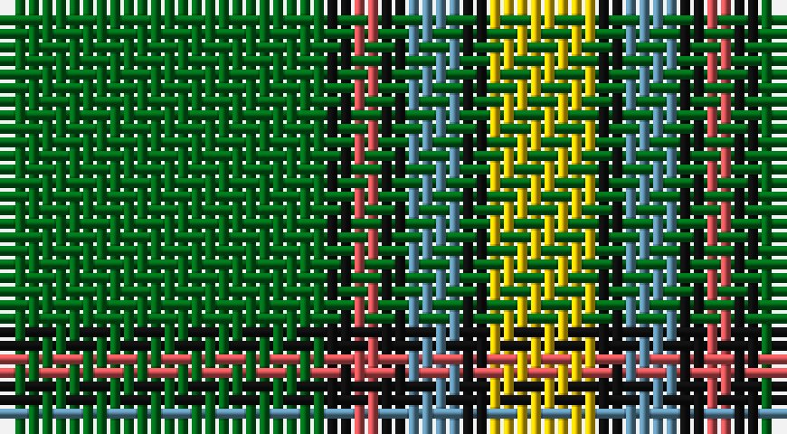

This page is one **sett** — a single exact thread-count. It belongs to the [tartan](/setts/g12k1r1k1t2k1ly4/)
(the same proportion at any scale), whose colour order is pattern [GKRKBKY](/stripes/gkrkbky/).

Sourced from house-of-tartan.  It is a [7 stripe tartan](/stripes/stripes7/).

Original link http://www.house-of-tartan.scotland.net/house/TartanViewjs.asp?colr=Def&tnam=2055

## Provenance

Earliest known date: 1961 Designed for the Edmonton Rehabilitation Society as a project for handloom weaving by disabled students. The Provincial Legislative of Alberta gave formal approval for the Alberta tartan in 1961.

## Thread count
G/24 K2 DO2 K2 B4 K2 Y/8

One full sett is **56 threads**.

## Palette

Palette: <strong>Tartan Register</strong> <small style="color:#888">(4 of 5 colours)</small>
<table><thead><tr><th>Colour</th><th>Threads</th><th>Shade</th><th>Base</th><th>OKLCh</th></tr></thead><tbody><tr><td>G/</td><td style="text-align:right;font-variant-numeric:tabular-nums">24</td><td><code style="background-color:#006818;">#006818</code> <small style="color:#888">#006818</small></td><td>G <code style="background-color:#006100;">#006100</code></td><td><small style="color:#888">oklch(45.0% 0.142 145.0)</small></td></tr><tr><td>K</td><td style="text-align:right;font-variant-numeric:tabular-nums">2</td><td><code style="background-color:#101010;">#101010</code> <small style="color:#888">#101010</small></td><td>K <code style="background-color:#000000;">#000000</code></td><td><small style="color:#888">oklch(17.3% 0.000 89.9)</small></td></tr><tr><td>DO</td><td style="text-align:right;font-variant-numeric:tabular-nums">2</td><td><code style="background-color:#D05054;">#D05054</code> <small style="color:#888">#D05054</small></td><td>R <code style="background-color:#CC0000;">#CC0000</code></td><td><small style="color:#888">oklch(60.2% 0.162 21.5)</small></td></tr><tr><td>K</td><td style="text-align:right;font-variant-numeric:tabular-nums">2</td><td><code style="background-color:#101010;">#101010</code> <small style="color:#888">#101010</small></td><td>K <code style="background-color:#000000;">#000000</code></td><td><small style="color:#888">oklch(17.3% 0.000 89.9)</small></td></tr><tr><td>B</td><td style="text-align:right;font-variant-numeric:tabular-nums">4</td><td><code style="background-color:#5C8CA8;">#5C8CA8</code> <small style="color:#888">#5C8CA8</small></td><td>B <code style="background-color:#2A418A;">#2A418A</code></td><td><small style="color:#888">oklch(61.7% 0.067 235.0)</small></td></tr><tr><td>K</td><td style="text-align:right;font-variant-numeric:tabular-nums">2</td><td><code style="background-color:#101010;">#101010</code> <small style="color:#888">#101010</small></td><td>K <code style="background-color:#000000;">#000000</code></td><td><small style="color:#888">oklch(17.3% 0.000 89.9)</small></td></tr><tr><td>Y/</td><td style="text-align:right;font-variant-numeric:tabular-nums">8</td><td><code style="background-color:#E8C000;">#E8C000</code> <small style="color:#888">#E8C000</small></td><td>Y <code style="background-color:#F2BF00;">#F2BF00</code></td><td><small style="color:#888">oklch(81.9% 0.168 93.7)</small></td></tr></tbody></table>

# Sample pattern

## Nearest tartans

The nearest existing variants by ΔTartan distance, with this tartan at the top so the swatches line up against it.

ΔTartan

Tartan

Sett

—

<a href="/ttd/edit/#slug=g12k1r1k1t2k1ly4~x2">Alberta District Tartan</a> <a class="nn-out" href="/variants/s7/g12k1r1k1t2k1ly4~x2/" title="open its dictionary page">↗</a>

0.30

<a href="/ttd/edit/#slug=g12k1r1k1b2k1ly4~x8&amp;base=g12k1r1k1t2k1ly4~x2">Alberta (District)</a> <a class="nn-out" href="/variants/s7/g12k1r1k1b2k1ly4~x8/" title="open its dictionary page">↗</a>

0.41

<a href="/ttd/edit/#slug=g13k1r1k1b2k1ly4~x8&amp;base=g12k1r1k1t2k1ly4~x2">Alberta (Province)</a> <a class="nn-out" href="/variants/s7/g13k1r1k1b2k1ly4~x8/" title="open its dictionary page">↗</a>

0.55

<a href="/ttd/edit/#slug=w6g5r5g45k4o24k4g5~x2&amp;base=g12k1r1k1t2k1ly4~x2">O'Neill</a> <a class="nn-out" href="/variants/s8/w6g5r5g45k4o24k4g5~x2/" title="open its dictionary page">↗</a>

0.75

<a href="/ttd/edit/#slug=g18r1lb2k1lb2r1o6k2~x4&amp;base=g12k1r1k1t2k1ly4~x2">Humphries (Name)</a> <a class="nn-out" href="/variants/s8/g18r1lb2k1lb2r1o6k2~x4/" title="open its dictionary page">↗</a>

0.88

<a href="/ttd/edit/#slug=w6g5r5g45k4lo24k4g5~x2&amp;base=g12k1r1k1t2k1ly4~x2">O'Neill (Name)</a> <a class="nn-out" href="/variants/s8/w6g5r5g45k4lo24k4g5~x2/" title="open its dictionary page">↗</a>

0.95

<a href="/ttd/edit/#slug=t2g1t1g12dg2g1m6ly2~x4&amp;base=g12k1r1k1t2k1ly4~x2">Manitoba</a> <a class="nn-out" href="/variants/s8/t2g1t1g12dg2g1m6ly2~x4/" title="open its dictionary page">↗</a>

1.03

<a href="/ttd/edit/#slug=g18k2lr2k2t3k2ly6~x4&amp;base=g12k1r1k1t2k1ly4~x2">Alberta</a> <a class="nn-out" href="/variants/s7/g18k2lr2k2t3k2ly6~x4/" title="open its dictionary page">↗</a>

1.05

<a href="/ttd/edit/#slug=g13p1g1p1g3db5k4ly2~x2&amp;base=g12k1r1k1t2k1ly4~x2">Carrick, hunting</a> <a class="nn-out" href="/variants/s8/g13p1g1p1g3db5k4ly2~x2/" title="open its dictionary page">↗</a>

1.15

<a href="/ttd/edit/#slug=w9dg2g2w3g18k2dg33lo2~x2&amp;base=g12k1r1k1t2k1ly4~x2">New World Irish (Fashion)</a> <a class="nn-out" href="/variants/s8/w9dg2g2w3g18k2dg33lo2~x2/" title="open its dictionary page">↗</a>

1.18

<a href="/ttd/edit/#slug=g20ly2o5w4g2o2g2o2db6~x2&amp;base=g12k1r1k1t2k1ly4~x2">Boucherville (Tartan de..) District Tartan</a> <a class="nn-out" href="/variants/s9/g20ly2o5w4g2o2g2o2db6~x2/" title="open its dictionary page">↗</a>

## Neighbour map

Every grey dot is one of 14360 variants placed by the first two principal components of the ΔTartan feature space (44% of its variance). Red is this tartan; blue dots are its nearest — click one to open its page.

<svg viewBox="0 0 640 380" role="img" style="max-width:100%;height:auto;border:1px solid #e0e0e0;border-radius:4px;display:block" xmlns="http://www.w3.org/2000/svg"><image href="/nn/cloud.v1.png" width="640" height="380"/><a href="/variants/s7/g12k1r1k1b2k1ly4~x8/"><circle cx="270.2" cy="157.0" r="4" fill="#3465a4"><title>Alberta (District)</title></circle></a><a href="/variants/s7/g13k1r1k1b2k1ly4~x8/"><circle cx="290.2" cy="153.1" r="4" fill="#3465a4"><title>Alberta (Province)</title></circle></a><a href="/variants/s8/w6g5r5g45k4o24k4g5~x2/"><circle cx="282.8" cy="159.7" r="4" fill="#3465a4"><title>O'Neill</title></circle></a><a href="/variants/s8/g18r1lb2k1lb2r1o6k2~x4/"><circle cx="289.1" cy="129.5" r="4" fill="#3465a4"><title>Humphries (Name)</title></circle></a><a href="/variants/s8/w6g5r5g45k4lo24k4g5~x2/"><circle cx="299.0" cy="167.7" r="4" fill="#3465a4"><title>O'Neill (Name)</title></circle></a><a href="/variants/s8/t2g1t1g12dg2g1m6ly2~x4/"><circle cx="266.8" cy="167.6" r="4" fill="#3465a4"><title>Manitoba</title></circle></a><a href="/variants/s7/g18k2lr2k2t3k2ly6~x4/"><circle cx="208.9" cy="160.3" r="4" fill="#3465a4"><title>Alberta</title></circle></a><a href="/variants/s8/g13p1g1p1g3db5k4ly2~x2/"><circle cx="259.6" cy="159.7" r="4" fill="#3465a4"><title>Carrick, hunting</title></circle></a><a href="/variants/s8/w9dg2g2w3g18k2dg33lo2~x2/"><circle cx="269.8" cy="150.2" r="4" fill="#3465a4"><title>New World Irish (Fashion)</title></circle></a><a href="/variants/s9/g20ly2o5w4g2o2g2o2db6~x2/"><circle cx="257.8" cy="164.4" r="4" fill="#3465a4"><title>Boucherville (Tartan de..) District Tartan</title></circle></a><circle cx="269.8" cy="155.8" r="5" fill="#c00000"/></svg>

ID: /variants/s7/g12k1r1k1t2k1ly4~x2/
