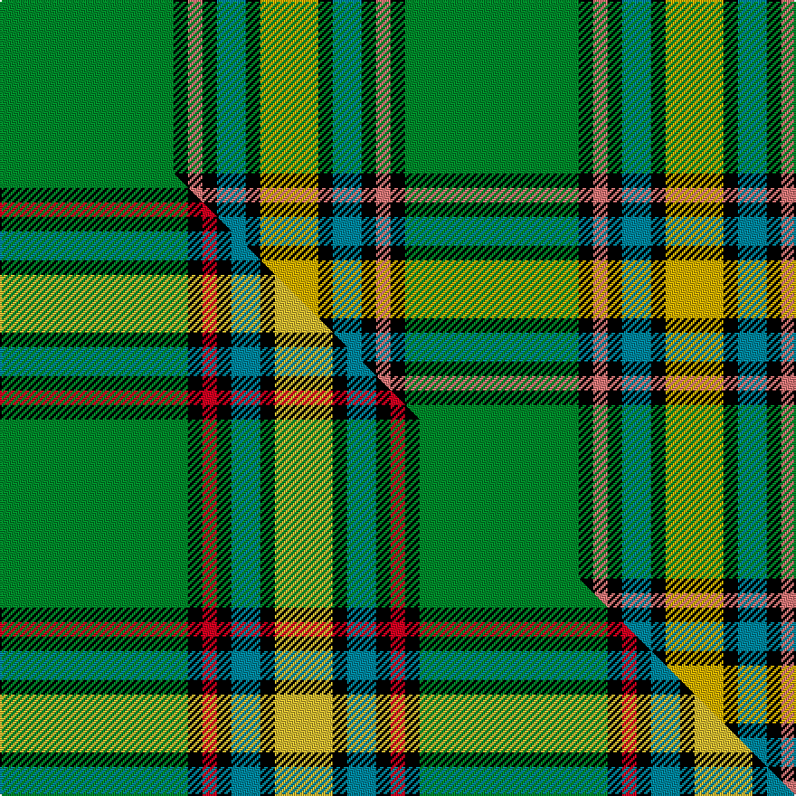

This page is one **sett** — a single exact thread-count. It belongs to the [tartan](/setts/g12k1r1k1t2k1ly4/)
(the same proportion at any scale), whose colour order is pattern [GKRKBKY](/stripes/gkrkbky/).

Part of the [Alberta](/tartans/alberta/) tartan — the named design grouping this sett with its other cloths.

Sourced from tartans-authority.  It is a [7 stripe tartan](/stripes/stripes7/).

Original link http://www.tartansauthority.com/tartan-ferret/display/2055/

## Register references

External register numbers recorded for this tartan.

- Scottish Tartans Authority (ITI): 2055

## Thread count
G/96 K8 R8 K8 T16 K8 LY/32

One full sett is **224 threads**.

## Palette
<table><thead><tr><th>Colour</th><th>Shade</th><th>OKLCh</th></tr></thead><tbody><tr><td>T</td><td><code style="background-color:#00879F;">#00879F</code> <small style="color:#888">#00879F</small></td><td><small style="color:#888">oklch(57.4% 0.102 216.1)</small></td></tr><tr><td>G</td><td><code style="background-color:#008B2A;">#008B2A</code> <small style="color:#888">#008B2A</small></td><td><small style="color:#888">oklch(55.4% 0.170 145.9)</small></td></tr><tr><td>K</td><td><code style="background-color:#000000;">#000000</code> <small style="color:#888">#000000</small></td><td><small style="color:#888">oklch(0.0% 0.000 0.0)</small></td></tr><tr><td>R</td><td><code style="background-color:#E87878;">#E87878</code> <small style="color:#888">#E87878</small></td><td><small style="color:#888">oklch(70.0% 0.139 21.2)</small></td></tr><tr><td>LY</td><td><code style="background-color:#D8B000;">#D8B000</code> <small style="color:#888">#D8B000</small></td><td><small style="color:#888">oklch(77.1% 0.158 92.3)</small></td></tr></tbody></table>

# Sample pattern

## Compared to the master

This cloth is one sett of its design; the master sett (the exemplar the design is anchored on) is below for comparison.

Its **ΔTartan distance** from the master is **0.28** — the same measure the nearest-tartans table ranks by (0 is identical; a re-scale of the same cloth is near 0, a recolour or a different proportion further).

<figure class="master-compare" style="margin:0">

this sett
master sett ★

<figcaption style="color:#888;font-size:smaller">One weave of this sett against the <a href="/setts/g13k1r1k1t2k1ly4/">master sett ★</a>, split on the diagonal: a shared proportion runs seamlessly across it with only the shades shifting; a different proportion breaks on it.</figcaption>
</figure>

## Nearest variants

The nearest existing variants by ΔTartan distance, with this cloth at the top so the swatches line up against it.

ΔTartan

Threads

Variant

Sett

—

224

<a href="/variants/s7/g12k1r1k1t2k1ly4~x8~r2806019-ly3106095/">Alberta (District)</a>

<a href="/ttd/edit/#slug=g12k1r1k1lb2k1y4~x2&amp;base=g12k1r1k1t2k1ly4~x8~r2806019-ly3106095" title="compare in the TTD">0.00</a>

56

<a href="/variants/s7/g12k1r1k1lb2k1y4~x2/">Alberta District Tartan</a>

<a href="/ttd/edit/#slug=g13k1r1k1t2k1ly4~x8&amp;base=g12k1r1k1t2k1ly4~x8~r2806019-ly3106095" title="compare in the TTD">0.10</a>

232

<a href="/variants/s7/g13k1r1k1t2k1ly4~x8/">Alberta (Province)</a>

<a href="/ttd/edit/#slug=g18k2b2k2lb3k2y6~x4&amp;base=g12k1r1k1t2k1ly4~x8~r2806019-ly3106095" title="compare in the TTD">0.87</a>

184

<a href="/variants/s7/g18k2b2k2lb3k2y6~x4/">Alberta</a>

<a href="/ttd/edit/#slug=r17db7ly8g58k6~x2&amp;base=g12k1r1k1t2k1ly4~x8~r2806019-ly3106095" title="compare in the TTD">1.41</a>

338

<a href="/variants/s5/r17db7ly8g58k6~x2/">St Johns County Sheriff Office (Cor)</a>

<a href="/ttd/edit/#slug=k16w4y2g31n4dp4~x4~n2203265-dp1502305&amp;base=g12k1r1k1t2k1ly4~x8~r2806019-ly3106095" title="compare in the TTD">2.08</a>

408

<a href="/variants/s6/k16w4y2g31n4dp4~x4~n2203265-dp1502305/">Lethcoe (Thousand Oaks) (Personal)</a>

<a href="/ttd/edit/#slug=g12k4g12w1t6w1y4~x4&amp;base=g12k1r1k1t2k1ly4~x8~r2806019-ly3106095" title="compare in the TTD">2.17</a>

256

<a href="/variants/s7/g12k4g12w1t6w1y4~x4/">Pinder, Nigel (Personal)</a>

<a href="/ttd/edit/#slug=y17w7y6g43k5n6k13~x2&amp;base=g12k1r1k1t2k1ly4~x8~r2806019-ly3106095" title="compare in the TTD">2.28</a>

328

<a href="/variants/s7/y17w7y6g43k5n6k13~x2/">Keeling Dress</a>

<a href="/ttd/edit/#slug=k17g48y4r10db12g4&amp;base=g12k1r1k1t2k1ly4~x8~r2806019-ly3106095" title="compare in the TTD">2.39</a>

169

<a href="/variants/s6/k17g48y4r10db12g4/">Asheville Firefighters, The</a>

<a href="/ttd/edit/#slug=k2t8k6g35k8ly2w2k2ly2~x2&amp;base=g12k1r1k1t2k1ly4~x8~r2806019-ly3106095" title="compare in the TTD">2.76</a>

260

<a href="/variants/s9/k2t8k6g35k8ly2w2k2ly2~x2/">160th SOAR(A) Night Stalkers (Mil.)</a>

## Neighbour map

Every grey dot is one of 13620 variants placed by the first two principal components of the ΔTartan feature space (42% of its variance). Red is this tartan; blue dots are its nearest — click one to open its page.

<svg viewBox="0 0 640 380" role="img" style="max-width:100%;height:auto;border:1px solid #e0e0e0;border-radius:4px;display:block" xmlns="http://www.w3.org/2000/svg"><image href="/nn/cloud.v1.png" width="640" height="380"/><a href="/variants/s7/g12k1r1k1lb2k1y4~x2/"><circle cx="248.7" cy="147.8" r="4" fill="#3465a4"><title>Alberta District Tartan</title></circle></a><a href="/variants/s7/g13k1r1k1t2k1ly4~x8/"><circle cx="256.3" cy="140.1" r="4" fill="#3465a4"><title>Alberta (Province)</title></circle></a><a href="/variants/s7/g18k2b2k2lb3k2y6~x4/"><circle cx="213.2" cy="166.1" r="4" fill="#3465a4"><title>Alberta</title></circle></a><a href="/variants/s5/r17db7ly8g58k6~x2/"><circle cx="283.1" cy="178.3" r="4" fill="#3465a4"><title>St Johns County Sheriff Office (Cor)</title></circle></a><a href="/variants/s6/k16w4y2g31n4dp4~x4~n2203265-dp1502305/"><circle cx="200.1" cy="139.7" r="4" fill="#3465a4"><title>Lethcoe (Thousand Oaks) (Personal)</title></circle></a><a href="/variants/s7/g12k4g12w1t6w1y4~x4/"><circle cx="270.4" cy="191.1" r="4" fill="#3465a4"><title>Pinder, Nigel (Personal)</title></circle></a><a href="/variants/s7/y17w7y6g43k5n6k13~x2/"><circle cx="162.2" cy="180.5" r="4" fill="#3465a4"><title>Keeling Dress</title></circle></a><a href="/variants/s6/k17g48y4r10db12g4/"><circle cx="233.1" cy="166.9" r="4" fill="#3465a4"><title>Asheville Firefighters, The</title></circle></a><a href="/variants/s9/k2t8k6g35k8ly2w2k2ly2~x2/"><circle cx="232.6" cy="110.8" r="4" fill="#3465a4"><title>160th SOAR(A) Night Stalkers (Mil.)</title></circle></a><circle cx="241.0" cy="146.9" r="5" fill="#c00000"/><text x="320" y="376" text-anchor="middle" font-size="11" fill="#999">ground</text><text x="11" y="190" text-anchor="middle" font-size="11" fill="#999" transform="rotate(-90 11 190)">complexity</text></svg>

ID: /variants/s7/g12k1r1k1t2k1ly4~x8~r2806019-ly3106095/
